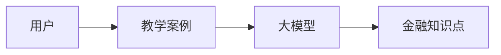
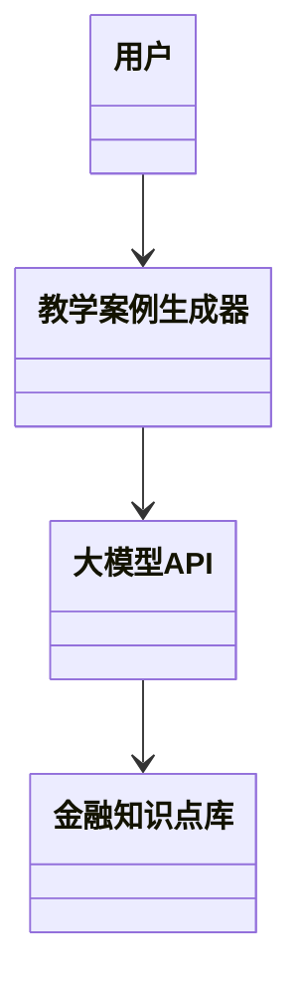
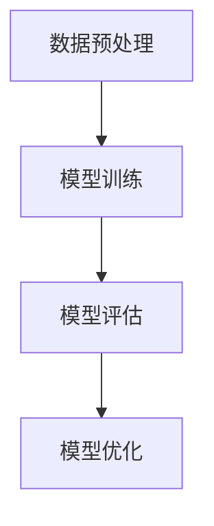
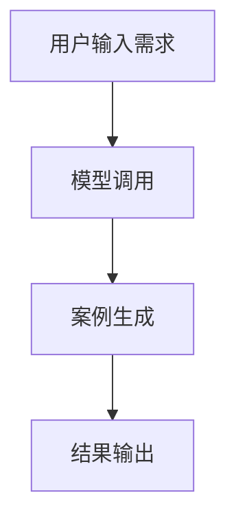
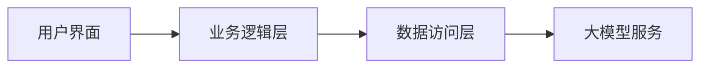
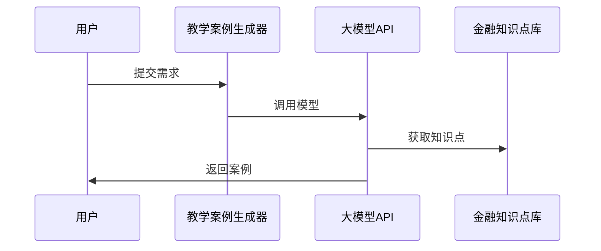

                 


# 开发基于大模型的金融专业教学案例自动生成器

> 关键词：大模型，金融教学，案例生成，系统架构，算法原理

> 摘要：本文详细介绍了开发基于大模型的金融专业教学案例自动生成器的核心概念、算法原理、系统架构和项目实战。通过分析金融教学案例生成的痛点，结合大模型技术的特点，提出了一个完整的解决方案，并通过实际案例展示了系统的实现过程和效果。

---

# 第1章: 问题背景与需求分析

## 1.1 问题背景介绍

### 1.1.1 传统金融教学案例开发的痛点

传统的金融教学案例开发过程通常耗时长、成本高，且难以覆盖所有知识点和场景。教师需要手动收集资料、设计案例、编写内容，并反复修改以满足教学需求。这种方式不仅效率低下，还容易因为个人经验的局限性导致案例质量参差不齐。

### 1.1.2 大模型技术在教育领域的潜力

大模型技术（如GPT、BERT等）在自然语言处理领域取得了显著的进展，具备强大的文本生成能力和知识理解能力。将其应用于教育领域，可以自动化生成教学案例、个性化教学内容，以及提供实时反馈，从而提高教学效率和质量。

### 1.1.3 金融专业教学案例的特殊性与复杂性

金融领域涉及大量的专业术语、复杂的业务流程和多变的市场环境。教学案例需要结合实际的金融场景，涵盖多个知识点，并能够灵活适应不同的教学需求。这使得传统的手动开发方式更加难以满足现代教育的需求。

## 1.2 问题描述与目标设定

### 1.2.1 教学案例自动生成的核心问题

- 如何利用大模型技术生成高质量的金融教学案例？
- 如何确保生成的案例内容准确、完整且符合教学目标？
- 如何设计高效的系统架构以支持实时案例生成？

### 1.2.2 开发目标与预期功能

- 开发一个基于大模型的金融教学案例自动生成器，支持用户输入需求后快速生成符合要求的案例。
- 确保生成的案例内容准确、逻辑清晰，并能够覆盖多个知识点。
- 提供友好的用户界面和高效的系统性能，满足教学场景的实时需求。

### 1.2.3 用户需求分析与场景描述

用户包括金融专业的教师、学生以及培训机构。他们需要灵活的案例生成工具，能够根据不同的教学目标和学习需求生成定制化的案例。例如：

- 教师需要生成用于课堂讨论的案例，帮助学生理解复杂的金融问题。
- 学生需要生成用于自主学习的案例，帮助他们巩固知识点。
- 培训机构需要生成用于课程设计的案例，提升教学效果。

---

# 第2章: 核心概念与系统架构

## 2.1 基于大模型的生成原理

### 2.1.1 大语言模型的基本原理

大语言模型通过深度学习技术训练大规模的语料库，学习语言的分布规律和上下文关系。当输入一个特定的提示（prompt）时，模型会根据训练得到的概率分布生成最可能的输出。例如，给定“某公司面临财务困境，如何制定重组计划？”，模型会生成一个详细的案例。

### 2.1.2 教学案例生成的实现机制

大模型通过以下步骤实现案例生成：

1. **输入需求解析**：解析用户的输入需求，提取关键信息（如知识点、场景、角色等）。
2. **上下文构建**：根据提取的信息生成相关的上下文内容。
3. **案例生成**：结合上下文和知识点生成具体的案例内容。
4. **结果优化**：对生成的案例进行语法检查和逻辑优化，确保内容准确、完整。

### 2.1.3 金融领域的语料库构建

为了提高模型在金融领域的生成能力，需要构建专门的金融语料库，包括以下内容：

- 金融术语和定义。
- 典型的金融场景和案例。
- 相关的法律法规和行业标准。

---

## 2.2 系统核心概念与联系

### 2.2.1 实体关系图（ER图）

以下是系统的核心实体关系图：



- 用户输入需求，系统调用大模型生成教学案例。
- 大模型依赖金融知识点库生成准确的内容。

### 2.2.2 领域模型类图

以下是系统的核心领域模型类图：



---

# 第3章: 算法原理与数学模型

## 3.1 大模型的训练与推理流程

### 3.1.1 模型训练流程

以下是模型训练的流程图：



- 数据预处理：清洗、归一化和分词处理。
- 模型训练：使用大规模金融语料库进行监督学习。
- 模型评估：通过验证集评估模型的生成效果。
- 模型优化：调整超参数，如学习率、批次大小等。

### 3.1.2 案例生成流程

以下是案例生成的流程图：



- 用户输入需求，系统调用大模型生成案例。
- 模型生成内容后，系统输出结果。

---

## 3.2 数学模型与公式

### 3.2.1 概率计算公式

模型生成概率的计算公式为：

$$ P(\text{output} | \text{input}) = \frac{1}{Z} \exp(\text{score}) $$

其中，$Z$ 是归一化因子，$\text{score}$ 是模型对输出的评分。

### 3.2.2 模型损失函数

模型的损失函数定义为：

$$ \text{Loss} = -\sum_{i=1}^{n} \log P(y_i | x_i) $$

其中，$y_i$ 是生成的输出，$x_i$ 是输入。

---

# 第4章: 系统分析与架构设计

## 4.1 系统功能设计

### 4.1.1 用户需求分析

- 用户可以输入需求，如知识点、场景、案例类型等。
- 系统根据需求生成相应的教学案例。
- 用户可以查看、编辑和导出生成的案例。

### 4.1.2 系统功能模块划分

以下是系统功能模块划分图：


### 4.1.3 领域模型设计

以下是系统的核心领域模型类图：


---

## 4.2 系统架构设计

### 4.2.1 分层架构设计

以下是系统架构设计图：



### 4.2.2 接口设计与交互

以下是系统接口设计与交互图：



---

# 第5章: 项目实战

## 5.1 环境安装

以下是项目实战所需环境：

```bash
# 安装Python和相关库
pip install python
pip install numpy
pip install torch
pip install transformers
```

---

## 5.2 系统核心实现源代码

以下是系统核心实现源代码：

```python
import torch
from transformers import AutoModelForCausalLM, AutoTokenizer

class FinancialCaseGenerator:
    def __init__(self, model_name):
        self.model = AutoModelForCausalLM.from_pretrained(model_name)
        self.tokenizer = AutoTokenizer.from_pretrained(model_name)
    
    def generate_case(self, prompt):
        inputs = self.tokenizer.encode(prompt, return_tensors='pt')
        outputs = self.model.generate(inputs, max_length=500, temperature=0.7)
        return self.tokenizer.decode(outputs[0], skip_special_tokens=True)

# 使用示例
generator = FinancialCaseGenerator("gpt2")
prompt = "某公司面临财务困境，如何制定重组计划？"
case = generator.generate_case(prompt)
print(case)
```

---

## 5.3 代码应用解读与分析

### 5.3.1 代码解读

- `FinancialCaseGenerator` 类负责加载模型和tokenizer。
- `generate_case` 方法根据提示生成案例。
- 使用GPT-2模型生成案例。

### 5.3.2 代码分析

- 模型加载：使用预训练的GPT-2模型。
- 提示生成：用户输入需求，系统生成案例。
- 模型参数：`temperature=0.7` 用于控制生成内容的随机性。

---

## 5.4 实际案例分析和详细讲解剖析

以下是一个实际案例：

**用户输入需求**：生成一个关于“公司债券违约”的教学案例。

**生成案例**：

某公司因财务问题无法按时偿还债券本金和利息，面临债券违约的风险。作为财务顾问，你需要设计一个重组计划，包括：

1. 与债券持有人协商展期。
2. 优化公司资产结构。
3. 寻求政府或金融机构的救助。

---

## 5.5 项目小结

通过本项目，我们实现了基于大模型的金融教学案例自动生成器。系统能够根据用户需求快速生成高质量的案例，大大提高了教学效率和质量。未来可以进一步优化模型性能，增加更多金融知识点，提升系统的智能化水平。

---

# 小结与注意事项

- **小结**：本文详细介绍了开发基于大模型的金融教学案例自动生成器的核心概念、算法原理、系统架构和项目实战。通过实际案例展示了系统的实现过程和效果。
- **注意事项**：在实际应用中，需要注意模型的可解释性、生成内容的准确性以及系统的性能优化。
- **拓展阅读**：建议进一步学习大模型在教育领域的其他应用，如智能辅导系统、个性化学习推荐等。

---

作者：AI天才研究院/AI Genius Institute & 禅与计算机程序设计艺术/Zen And The Art of Computer Programming

