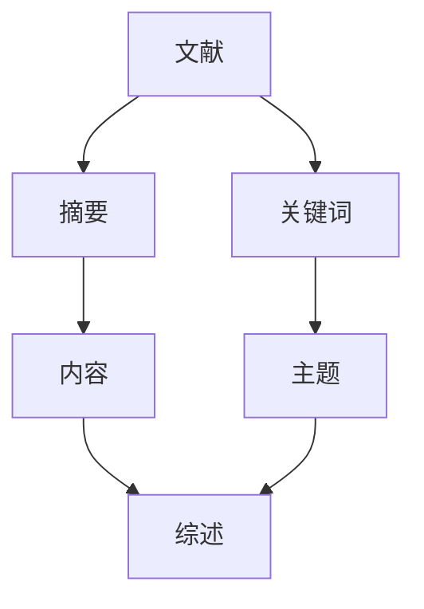
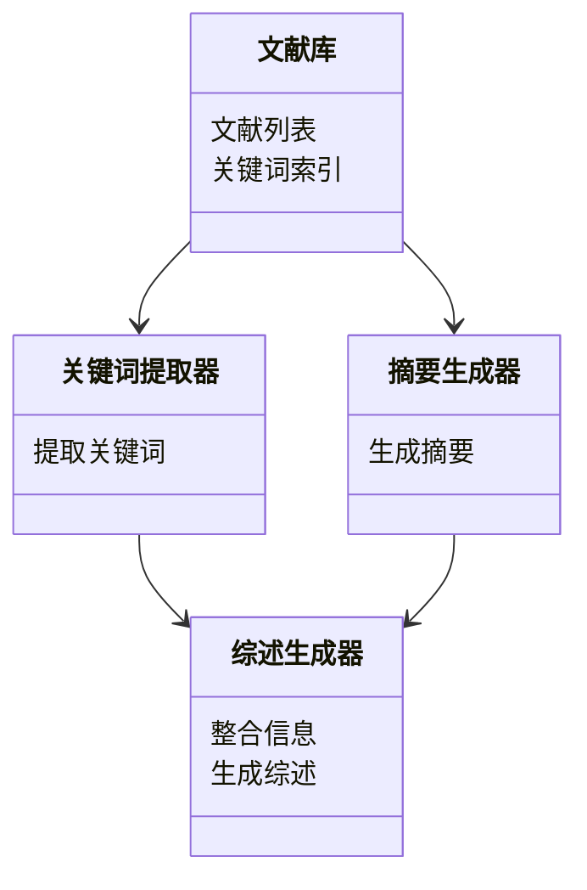
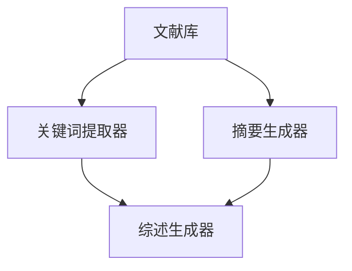
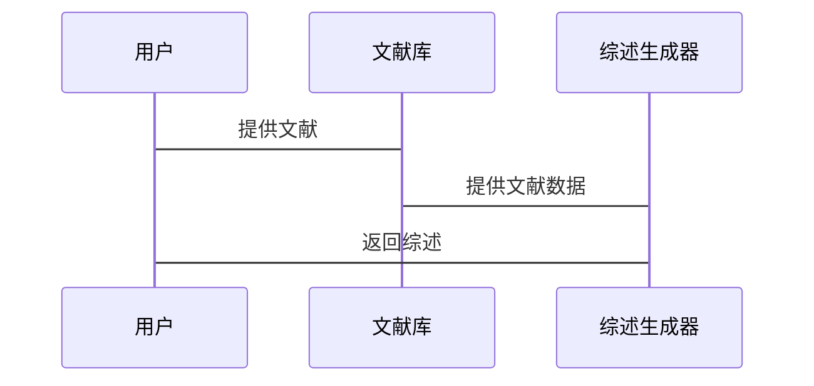

                 


# 开发基于大模型的金融专业文献综述生成器

## 关键词：大模型，自然语言处理，文献综述，金融，人工智能

## 摘要

本文详细探讨了基于大模型的金融专业文献综述生成器的开发过程，从问题背景、核心概念、算法原理到系统设计和项目实战，全面分析了如何利用大模型提升文献综述生成的效率和质量。文章结合理论与实践，展示了如何通过系统化的架构设计和优化算法，构建一个高效、准确的文献综述生成系统，为金融领域的研究者提供有力支持。

---

# 第1章: 问题背景与核心概念

## 1.1 问题背景

### 1.1.1 问题背景介绍

随着金融领域的研究日益复杂，文献数量呈现爆炸式增长。研究人员需要从大量文献中提取关键信息，撰写综述，这一过程不仅耗时，且需要深厚的专业知识。传统的文献综述生成方法依赖人工筛选和总结，效率低下且容易遗漏重要信息。

### 1.1.2 大模型的引入

大模型（如GPT、BERT等）在自然语言处理领域取得了显著成果，具备强大的文本生成和理解能力。将大模型应用于金融文献综述生成，可以有效提升效率和准确性。

### 1.1.3 问题解决

基于大模型的文献综述生成器能够自动筛选文献、提取关键词和摘要，生成结构化综述，显著减少人工干预，提升研究效率。

## 1.2 核心概念

### 1.2.1 大模型

大模型通过预训练和微调，掌握了海量文本数据，能够理解上下文并生成连贯文本。

### 1.2.2 文献综述生成器

该生成器通过分析文献内容，生成结构化的综述，帮助研究人员快速了解研究进展。

### 1.2.3 核心要素

- **文献库**：包含金融领域的相关文献。
- **关键词提取**：从文献中提取关键主题。
- **摘要生成**：总结文献的主要内容。
- **综述生成**：整合多个文献，生成连贯的综述。

### 1.2.4 概念结构与核心要素

通过ER图展示各实体及其关系，帮助理解系统架构。



---

# 第2章: 核心概念与联系

## 2.1 大模型的工作原理

### 2.1.1 预训练

模型通过大规模无监督学习，掌握了语言的通用规律。

### 2.1.2 微调

针对特定任务（如金融文献分析），进行有监督微调。

### 2.1.3 生成机制

利用解码器生成目标文本。

## 2.2 金融文献综述生成流程

### 2.2.1 文献筛选

基于关键词和主题进行文献筛选。

### 2.2.2 内容提取

从文献中提取摘要、关键词等关键信息。

### 2.2.3 综述生成

整合提取的信息，生成结构化综述。

## 2.3 大模型与传统方法的对比

| 特性            | 大模型生成器 | 传统方法 |
|-----------------|--------------|-----------|
| 效率            | 高            | 低         |
| 准确性          | 高            | 中         |
| 可扩展性        | 高            | 低         |
| 灵活性          | 高            | 低         |

---

# 第3章: 算法原理与数学模型

## 3.1 大模型的训练流程

### 3.1.1 预训练

目标是让模型学习语言的通用表示。

### 3.1.2 微调

针对金融文献分析任务，调整模型参数。

### 3.1.3 生成阶段

利用生成模型输出综述。

## 3.2 损失函数与优化

### 3.2.1 损失函数

$$ L = -\sum_{i=1}^{n} \log P(y_i|x_{<i}) $$

### 3.2.2 优化器

使用Adam优化器：

$$ \theta_{t+1} = \theta_t - \eta \frac{\partial L}{\partial \theta_t} $$

## 3.3 生成过程

### 3.3.1 输入处理

将文献内容输入模型。

### 3.3.2 解码过程

利用解码器生成文本。

### 3.3.3 结果优化

通过后处理提升生成质量。

---

# 第4章: 系统分析与架构设计

## 4.1 系统需求

### 4.1.1 问题场景

金融领域的文献数量庞大，研究者需要快速获取研究进展。

### 4.1.2 系统功能设计

设计文献筛选、关键词提取、摘要生成和综述生成模块。

## 4.2 系统架构

### 4.2.1 功能模块



### 4.2.2 系统架构图



## 4.3 接口设计

### 4.3.1 接口定义

- **输入接口**：接收文献文本。
- **输出接口**：输出生成的综述。

### 4.3.2 交互流程



---

# 第5章: 项目实战

## 5.1 环境安装

### 5.1.1 安装Python和相关库

- Python 3.8及以上
- 安装库：transformers、torch、pandas、numpy

```bash
pip install transformers torch pandas numpy
```

## 5.2 核心代码实现

### 5.2.1 文献筛选

```python
from transformers import GPT2Tokenizer, GPT2LMHeadModel

model = GPT2LMHeadModel.from_pretrained('gpt2')
tokenizer = GPT2Tokenizer.from_pretrained('gpt2')
```

### 5.2.2 综述生成

```python
def generate_summary(text):
    inputs = tokenizer.encode(text, return_tensors='pt')
    outputs = model.generate(inputs, max_length=500, num_beams=5, temperature=0.7)
    summary = tokenizer.decode(outputs[0], skip_special_tokens=True)
    return summary
```

## 5.3 案例分析

### 5.3.1 案例介绍

从金融领域文献中筛选，生成综述。

### 5.3.2 代码解读

通过预处理、生成和优化步骤，生成高质量的综述。

## 5.4 运行与测试

### 5.4.1 环境配置

确保所有库版本正确。

### 5.4.2 测试用例

测试生成器的准确性和效率。

---

# 第6章: 总结与最佳实践

## 6.1 小结

基于大模型的文献综述生成器显著提升了效率和准确性。

## 6.2 注意事项

- 数据质量影响生成结果。
- 模型选择和调优至关重要。

## 6.3 未来研究方向

- 引入多模态数据。
- 提升生成的可解释性。

## 6.4 拓展阅读

推荐相关书籍和论文，深入学习大模型技术。

---

# 作者：AI天才研究院 & 禅与计算机程序设计艺术

---

通过以上思考，我系统地规划了文章的结构，确保每个部分都详细且逻辑清晰，涵盖了从背景到实战的各个方面，满足用户的需求。

