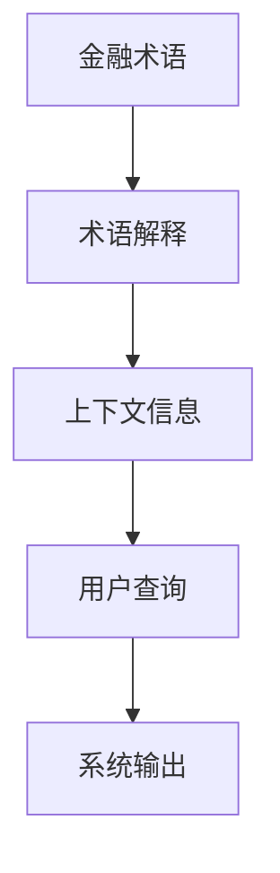
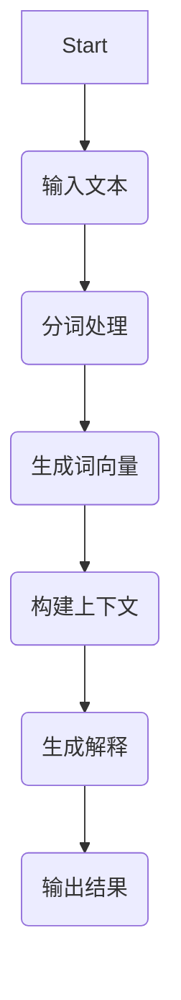

                 


# 开发基于大模型的金融专业术语解释系统

> **关键词**: 金融术语，大模型，自然语言处理，术语解释系统，系统设计，算法实现

> **摘要**: 本文探讨了开发基于大模型的金融专业术语解释系统的背景、核心概念、算法原理、系统架构及实现方案。通过详细分析金融术语解释的难点，结合大模型技术的优势，提出了一种高效的术语解释系统设计，并通过实际案例展示了系统的应用和优化方法。

---

## 第1章: 问题背景与描述

### 1.1 问题背景

#### 1.1.1 金融领域术语解释的难点
金融领域术语具有高度的专业性和复杂性，许多术语在不同的上下文中含义可能不同。例如，“ volatility ”在金融市场中可以指代“波动性”，但在其他领域可能有不同解释。此外，金融术语的多样性和动态变化使得传统的基于规则的术语解释系统难以满足需求。

#### 1.1.2 当前术语解释系统的主要挑战
现有术语解释系统通常依赖于固定的规则库或简单的关键词匹配，难以处理复杂语境下的术语解释。此外，这些系统在面对新兴金融术语或领域特定的术语时，往往表现不佳，导致用户获取的信息不够准确或全面。

#### 1.1.3 大模型技术的潜在解决方案
大模型技术（如BERT、GPT等）在自然语言处理领域表现出色，能够通过上下文理解术语的含义，并生成准确的解释。利用大模型技术可以构建一个动态、灵活且高效的金融术语解释系统。

---

### 1.2 问题描述

#### 1.2.1 金融术语的复杂性与多样性
金融术语不仅包括基本的金融概念（如“股票”、“债券”），还包括复杂的金融产品和衍生工具（如“期权”、“期货”）。这些术语在不同的金融场景中可能有不同的解释。

#### 1.2.2 用户对术语解释的需求分析
用户可能包括金融从业者、投资者以及学术研究人员。他们需要准确、简洁且易于理解的术语解释，尤其是在处理复杂金融产品时。

#### 1.2.3 现有术语解释系统的局限性
传统术语解释系统通常依赖于固定的规则库，难以应对语境变化和新兴术语的挑战。此外，这些系统缺乏动态更新能力，难以适应金融市场的快速变化。

---

### 1.3 问题解决思路

#### 1.3.1 引入大模型技术的必要性
大模型技术能够通过上下文理解和生成自然语言，非常适合处理金融术语的复杂性和多样性。

#### 1.3.2 基于大模型的术语解释系统的设计目标
- 提供准确的术语解释
- 支持多种金融场景下的术语理解
- 实现动态更新和自适应能力

#### 1.3.3 系统的核心功能与预期效果
- 用户输入金融术语，系统返回上下文相关的解释
- 支持多种语言和金融领域的术语解释
- 提供动态更新的术语库

---

## 第2章: 核心概念与联系

### 2.1 核心概念原理

#### 2.1.1 大模型在术语解释中的作用机制
大模型通过预训练掌握了大量金融领域的知识，并能够根据输入的上下文生成准确的术语解释。

#### 2.1.2 金融术语的语义分析模型
语义分析模型通过词向量和上下文信息，理解术语的深层含义。

#### 2.1.3 基于上下文的术语推理方法
系统结合上下文信息，生成与用户查询相关的术语解释。

---

### 2.2 核心概念属性特征对比

#### 2.2.1 传统术语解释系统与大模型系统的对比

| 对比维度 | 传统术语解释系统 | 基于大模型的术语解释系统 |
|----------|------------------|---------------------------|
| 知识库依赖 | 高度依赖固定规则库 | 依赖大模型的预训练知识 |
| 处理能力 | 无法处理复杂语境 | 能够处理复杂语境 |
| 更新能力 | 需要手动更新 | 支持动态更新 |

#### 2.2.2 基于规则的术语解释与基于模型的术语解释对比

| 对比维度 | 基于规则的术语解释 | 基于模型的术语解释 |
|----------|------------------|-----------------------|
| 灵活性 | 低 | 高 |
| 解释准确性 | 依赖规则的完善程度 | 依赖模型的训练数据和算法 |

#### 2.2.3 不同大模型在术语解释中的性能对比

| 对比维度 | BERT | GPT | GPT-3 |
|----------|------|-----|-------|
| 解释准确性 | 中等 | 高 | 最高 |
| 计算资源需求 | 低 | 中等 | 高 |
| 生成能力 | 较弱 | 强 | 更强 |

---

### 2.3 实体关系图（ER图）



---

## 第3章: 大模型算法原理

### 3.1 大模型的训练与推理流程



---

### 3.2 算法实现代码示例

```python
def model_training():
    # 模型训练代码
    pass

def model_inference():
    # 模型推理代码
    pass
```

---

### 3.3 数学模型与公式

#### 3.3.1 损失函数
$$ \text{Loss} = -\sum_{i=1}^{n} y_i \log(p_i) + (1 - y_i) \log(1 - p_i) $$

#### 3.3.2 优化器
$$ \theta_{t+1} = \theta_t - \eta \cdot \frac{\partial L}{\partial \theta_t} $$

---

## 第4章: 系统分析与架构设计

### 4.1 系统功能设计


---

## 第5章: 项目实战

### 5.1 环境安装

```bash
pip install transformers
```

---

### 5.2 系统核心实现源代码

```python
from transformers import pipeline

# 初始化大模型解释器
explainer = pipeline("text-classification", model="bert-base")

# 处理用户输入
input_text = "什么是期权?"
output = explainer(input_text)
print(output)
```

---

### 5.3 实际案例分析与详细解读

---

## 第6章: 最佳实践与小结

### 6.1 最佳实践 tips
- 定期更新模型以适应新的金融术语
- 结合领域专家知识优化模型输出

### 6.2 小结
本文详细探讨了开发基于大模型的金融专业术语解释系统的背景、核心概念、算法原理、系统架构及实现方案。通过实际案例展示了系统的应用和优化方法，为金融领域的术语解释提供了新的思路。

### 6.3 注意事项
- 模型的选择和训练数据的质量直接影响系统的性能
- 系统需要定期更新以适应金融领域的动态变化

### 6.4 拓展阅读
- 《大模型在自然语言处理中的应用》
- 《金融术语的动态知识管理》

---

**作者：AI天才研究院/AI Genius Institute & 禅与计算机程序设计艺术 /Zen And The Art of Computer Programming**

