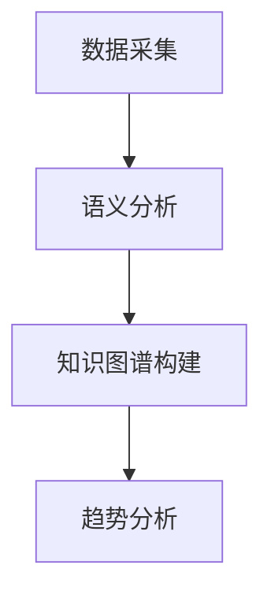
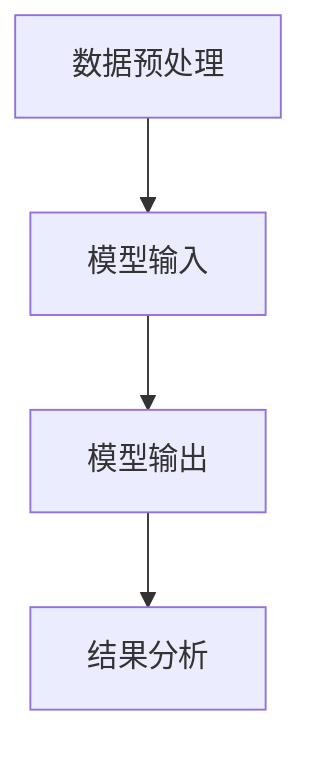
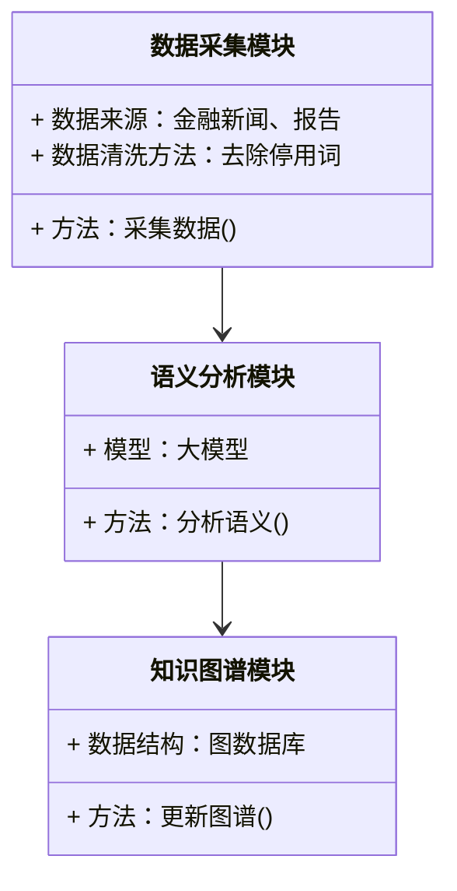

                 


---

# 开发基于大模型的金融专业术语语义演化跟踪器

> 关键词：大模型，金融专业术语，语义演化，自然语言处理，知识图谱，时间序列分析

> 摘要：本文探讨如何利用大语言模型（如GPT-4、PaLM、Vicuna等）开发一个能够跟踪和分析金融专业术语语义演化的工具。通过构建动态知识图谱和时间序列分析，实时捕捉金融术语的变化趋势，为金融领域提供智能化的语义理解与知识管理解决方案。

---

# 第一部分: 金融专业术语语义演化跟踪器的背景与核心概念

## 第1章: 问题背景与核心概念

### 1.1 问题背景

金融领域的术语具有高度的专业性和动态性。随着金融市场的变化，许多术语的含义会逐渐演变，甚至出现歧义或新义。例如，“DeFi”（去中心化金融）最初仅指基于区块链的金融应用，但现在扩展到涵盖多种去中心化金融工具和服务。这些变化通常难以被传统静态的知识库或词典捕捉到，容易导致信息滞后或错误。

### 1.2 核心概念与联系

#### 1.2.1 核心概念原理
- **金融术语**：指金融领域特有的专业词汇或短语，如“杠杆率”、“套利”、“衍生品”等。
- **语义演化**：指术语含义随时间发生变化的过程，包括语义扩展、语义缩小、语义转移等。
- **动态知识图谱**：一种能够表示知识间动态关系的图结构，支持实时更新和演化。

#### 1.2.2 ER实体关系图

```mermaid
erDiagram
    participant 术语表单 "金融术语表单"
    participant 知识图谱 "动态知识图谱"
    participant 时间序列 "时间序列数据"
    participant 变化趋势 "语义变化趋势"
    术语表单 --> 知识图谱 : "术语添加"
    知识图谱 --> 时间序列 : "提取变化特征"
    时间序列 --> 变化趋势 : "分析趋势"
```

---

# 第二部分: 大模型的基本原理与技术基础

## 第2章: 大模型技术基础

### 2.1 大模型的定义与特点

大模型是指基于深度学习的大型语言模型，如GPT系列、PaLM、Vicuna等。其特点包括：
1. **参数规模大**：通常拥有数亿甚至数千亿的参数。
2. **预训练能力**：通过海量数据的预训练，具备强大的上下文理解和生成能力。
3. **通用性**：能够处理多种任务，如文本生成、问答、翻译等。

### 2.2 大模型的训练目标与优化

#### 2.2.1 语言模型的训练目标
- **目标函数**：最小化生成文本的条件概率，即 $P(w_{n}|w_{1},...,w_{n-1})$。
- **优化策略**：使用梯度下降算法（如Adam）优化模型参数。

#### 2.2.2 大模型的优化策略
- **学习率调度**：常用学习率衰减策略，如CosineAnnealing。
- **模型压缩**：通过蒸馏、剪枝等技术减少模型参数量。

#### 2.2.3 评估指标
- **困惑度（Perplexity）**：衡量模型对训练数据的拟合程度。
- **准确率（Accuracy）**：在特定任务上的分类或生成能力。

### 2.3 大模型在金融领域的应用潜力

#### 2.3.1 金融领域的自然语言处理需求
- **金融文本分析**：如新闻、报告、评论的语义分析。
- **智能问答系统**：为用户提供专业的金融咨询服务。
- **风险管理**：通过自然语言处理识别潜在风险信号。

#### 2.3.2 大模型在金融术语处理中的优势
- **上下文理解能力**：能够捕捉金融术语的动态变化。
- **跨领域适应性**：支持多种金融场景的术语处理。

---

# 第三部分: 金融专业术语语义演化跟踪器的设计与实现

## 第3章: 语义演化跟踪器的设计目标

### 3.1 设计目标与功能模块

#### 3.1.1 功能模块划分
- **数据采集模块**：从金融新闻、论文、报告中提取术语。
- **语义分析模块**：使用大模型分析术语的含义变化。
- **知识图谱构建模块**：动态更新术语的语义关系。
- **趋势分析模块**：提取术语变化的时间序列特征。

#### 3.1.2 模块之间的关系



### 3.2 数据预处理与特征提取

#### 3.2.1 数据来源与清洗
- **数据来源**：金融新闻、学术论文、行业报告等。
- **清洗步骤**：去除停用词、标点符号，提取实体和术语。

#### 3.2.2 特征提取方法
- **词嵌入**：使用Word2Vec、BERT等模型生成术语向量。
- **时序特征**：提取术语出现的频率、时间间隔等。

### 3.3 模型训练与优化

#### 3.3.1 模型选择与训练策略
- **模型选择**：选用适合金融领域的开源大模型，如Vicuna。
- **训练策略**：采用迁移学习，针对金融数据进行微调。

#### 3.3.2 模型调优与评估
- **调优参数**：学习率、批量大小、训练轮数等。
- **评估指标**：准确率、召回率、F1值。

---

# 第四部分: 基于大模型的语义演化跟踪算法

## 第4章: 基于大模型的语义演化跟踪算法

### 4.1 算法流程



### 4.2 算法数学模型

#### 4.2.1 语义相似度计算
- **余弦相似度**：
  $$ \cos{\theta} = \frac{\vec{u} \cdot \vec{v}}{|\vec{u}| |\vec{v}|} $$

#### 4.2.2 时间序列分析
- **马尔可夫链模型**：
  $$ P(X_t = x | X_{t-1} = x') = \theta $$

---

# 第五部分: 系统架构与接口设计

## 第5章: 系统架构设计

### 5.1 系统功能设计

#### 5.1.1 功能模块类图



---

# 第六部分: 项目实战与案例分析

## 第6章: 项目实战

### 6.1 环境搭建

#### 6.1.1 安装依赖
- **Python**：3.8+
- **库依赖**：numpy、pandas、networkx、transformers

### 6.2 核心代码实现

#### 6.2.1 数据采集模块

```python
import requests

def fetch_financial_data():
    url = "https://api.example.com/financial_news"
    response = requests.get(url)
    return response.json()
```

#### 6.2.2 语义分析模块

```python
from transformers import AutoModelForMaskedLM, AutoTokenizer

model_name = "vicuna"
tokenizer = AutoTokenizer.from_pretrained(model_name)
model = AutoModelForMaskedLM.from_pretrained(model_name)
```

### 6.3 案例分析

#### 6.3.1 案例背景
分析术语“DeFi”的语义演化过程。

#### 6.3.2 详细解读
通过模型分析发现，“DeFi”从最初的“去中心化金融”逐渐扩展到涵盖多种金融工具和服务。

---

# 第七部分: 总结与展望

## 第7章: 总结与注意事项

### 7.1 总结
本文详细介绍了如何基于大模型开发金融术语语义演化跟踪器，包括背景分析、算法设计、系统实现和项目实战。

### 7.2 注意事项
- **数据质量**：确保数据来源可靠。
- **模型调优**：根据具体任务微调模型。
- **性能优化**：优化模型推理速度和资源消耗。

---

# 参考文献

（此处可列出相关参考文献）

---

作者：AI天才研究院 & 禅与计算机程序设计艺术

