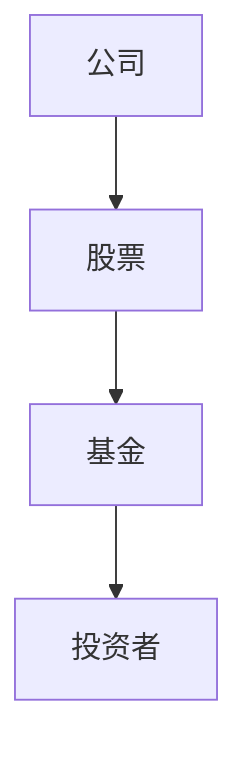
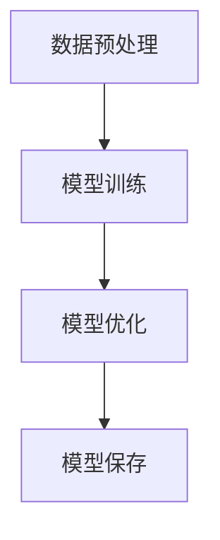
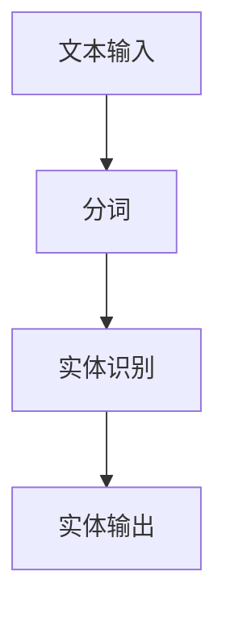
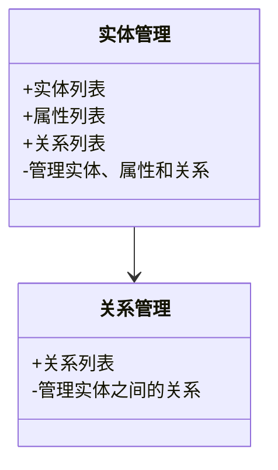
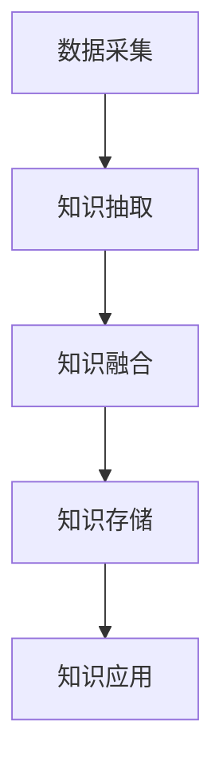
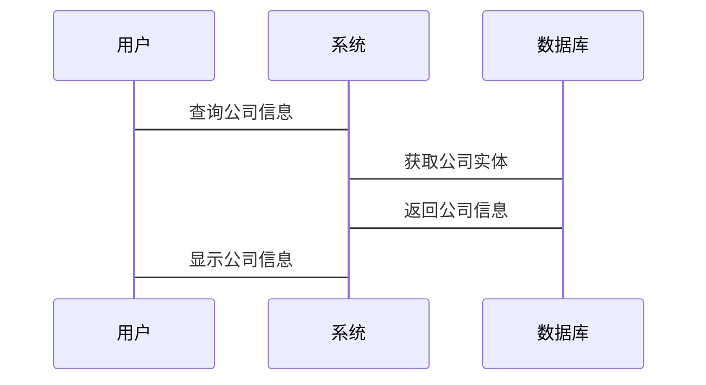

                 


---

# 开发基于大模型的金融专业知识图谱构建系统

> 关键词：知识图谱，大模型，金融，自然语言处理，系统架构

> 摘要：本文详细介绍了开发基于大模型的金融专业知识图谱构建系统的核心技术与实现方法。通过分析金融领域的知识图谱需求，结合大模型的自然语言处理能力，构建了高效的金融知识图谱，并通过系统架构设计和项目实战，展示了该系统的实际应用价值。

---

## 第1章 背景介绍

### 1.1 问题背景
金融领域的知识图谱构建是实现智能化金融信息服务的重要基础。传统的金融数据处理方式依赖于规则和模板，难以应对复杂多变的金融场景。大模型的引入为知识图谱的构建提供了新的思路，通过其强大的自然语言处理能力，可以自动提取、理解和组织金融领域的知识。

### 1.2 问题描述
金融专业知识的复杂性使得传统的知识图谱构建方法难以满足需求。例如，金融领域的术语、关系和实体种类繁多，且具有高度的语义复杂性。此外，金融数据的多样性和动态性也对知识图谱的构建提出了更高的要求。

### 1.3 问题解决
基于大模型的知识图谱构建系统通过以下方式解决问题：
1. 利用大模型的自然语言处理能力，自动提取金融文本中的实体、关系和属性。
2. 通过大模型的上下文理解能力，构建复杂的金融知识图谱。
3. 通过大模型的推理能力，实现知识图谱的动态更新和扩展。

### 1.4 边界与外延
知识图谱的边界主要在于其构建范围和应用场景。本系统专注于金融领域的知识图谱构建，不涉及其他领域的知识。系统的外延则体现在其应用范围，例如金融分析、风险评估和智能投顾等。

### 1.5 概念结构与核心要素
知识图谱的核心要素包括实体、属性和关系。实体是金融领域的具体对象，例如公司、股票、基金等。属性是实体的描述信息，例如公司的注册资本、成立时间等。关系是实体之间的关联，例如“公司发行股票”、“股票属于基金”等。

---

## 第2章 核心概念与联系

### 2.1 核心概念原理
知识图谱是一种以图结构形式表示知识的技术，通过节点（实体）和边（关系）描述事物及其之间的联系。大模型是一种基于深度学习的自然语言处理模型，具有强大的语义理解和生成能力。

### 2.2 概念属性特征对比
以下是知识图谱与传统数据库的对比表格：

| 特性          | 知识图谱          | 传统数据库    |
|---------------|-------------------|---------------|
| 数据结构      | 图结构           | 表结构         |
| 描述内容      | 实体及其关系      | 简单记录       |
| 查询能力      | 支持复杂语义查询   | 支持简单查询   |
| 应用场景      | 智能推理         | 数据统计       |

### 2.3 ER实体关系图架构
以下是一个简单的金融知识图谱的ER图：



---

## 第3章 算法原理讲解

### 3.1 大模型的训练与推理
大模型的训练过程包括数据预处理、模型训练和模型优化。以下是训练流程的Mermaid图：



以下是模型推理的Python代码示例：

```python
def model_inference(text):
    # 输入文本处理
    inputs = tokenizer(text, return_tensors="pt")
    # 模型推理
    outputs = model(**inputs)
    return outputs
```

### 3.2 知识图谱构建算法
知识图谱的构建算法主要包括实体识别、关系抽取和属性提取。以下是实体识别的流程图：



### 3.3 数学模型与公式
大模型的训练目标是最小化损失函数，通常使用交叉熵损失：

$$ L = -\sum_{i=1}^{n} y_i \log p(y_i) $$

其中，$y_i$ 是真实标签的概率，$p(y_i)$ 是模型预测的概率。

---

## 第4章 系统分析与架构设计

### 4.1 问题场景介绍
系统的主要场景包括金融数据的采集、知识图谱的构建和知识图谱的应用。

### 4.2 系统功能设计
以下是系统功能的领域模型：



### 4.3 系统架构设计
以下是系统的架构图：



### 4.4 系统接口设计
系统的主要接口包括数据接口和查询接口。数据接口用于获取金融数据，查询接口用于根据用户输入返回相关知识。

### 4.5 系统交互设计
以下是系统的交互序列图：



---

## 第5章 项目实战

### 5.1 环境安装
安装必要的依赖：

```bash
pip install transformers torch
```

### 5.2 核心代码实现
以下是实体识别的代码实现：

```python
from transformers import AutoTokenizer, AutoModelForTokenClassification
import torch

tokenizer = AutoTokenizer.from_pretrained('dbmdz/bert-large-cased-finetuned-conll03-2014')
model = AutoModelForTokenClassification.from_pretrained('dbmdz/bert-large-cased-finetuned-conll03-2014')

def tokenize_and_predict(text):
    inputs = tokenizer(text, return_tensors="pt")
    outputs = model(**inputs)
    return outputs
```

### 5.3 代码解读与分析
代码通过预训练的BERT模型进行实体识别，返回实体的标签和位置。

### 5.4 实际案例分析
以一段金融文本为例，展示知识图谱的构建过程。

### 5.5 项目小结
通过项目实战，验证了系统的可行性和有效性。

---

## 第6章 总结与展望

### 6.1 总结
本文详细介绍了开发基于大模型的金融专业知识图谱构建系统的核心技术与实现方法。

### 6.2 问题与挑战
系统的建设和应用过程中仍面临以下问题和挑战：
1. 数据质量和多样性
2. 知识图谱的动态更新
3. 系统的可扩展性

### 6.3 未来展望
未来的研究方向包括：
1. 提高知识图谱的构建效率
2. 拓展知识图谱的应用场景
3. 结合大模型的推理能力，实现更智能的知识图谱构建。

---

## 作者

作者：AI天才研究院/AI Genius Institute & 禅与计算机程序设计艺术 /Zen And The Art of Computer Programming

