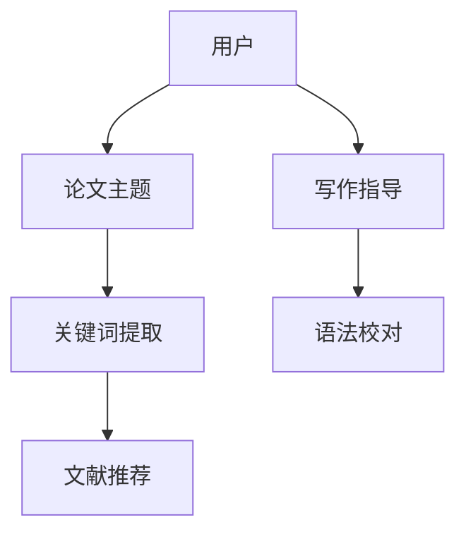
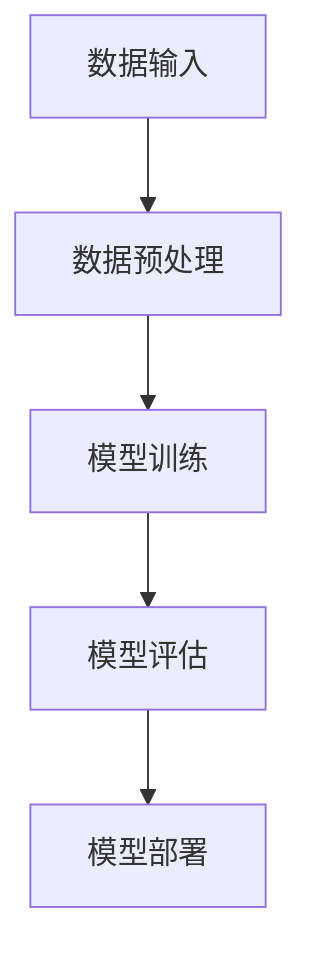
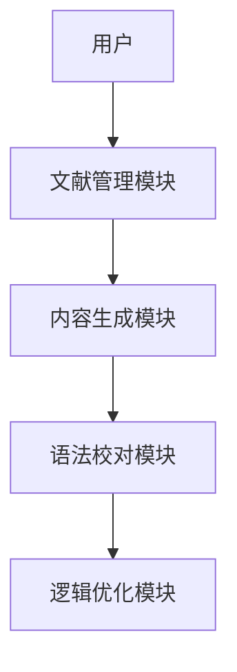

                 


# 开发基于大模型的金融专业论文写作辅助系统

> 关键词：大模型，金融论文，写作辅助，自然语言处理，深度学习，人工智能

> 摘要：本文详细探讨了基于大模型的金融专业论文写作辅助系统的开发过程。从问题背景到系统设计，从算法原理到实际应用，系统性地分析了该系统的核心技术与实现细节。本文通过理论与实践相结合的方式，展示了如何利用大模型技术提升金融论文写作的效率与质量。

---

## 第一部分: 开发背景与问题背景

### 第1章: 开发基于大模型的金融专业论文写作辅助系统概述

#### 1.1 问题背景介绍

##### 1.1.1 金融领域论文写作的难点

在金融领域，论文写作是一项复杂且耗时的 task。金融论文通常需要结合大量数据、复杂的分析方法以及严谨的逻辑推理。然而，许多研究人员，尤其是新手，常常面临以下挑战：

1. **文献查找与整理**：金融领域涉及大量学术论文和数据，如何高效查找并整理相关文献是一个难题。
2. **写作规范与格式**：金融论文有严格的格式要求，包括引用规范、术语使用等，稍有不慎可能导致论文被退回修改。
3. **逻辑与结构优化**：如何构建清晰的论文结构、优化逻辑关系，是许多作者面临的挑战。
4. **语言表达**：金融论文需要精确且专业的语言表达，避免歧义和错误。

##### 1.1.2 大模型技术的引入动机

大模型（如GPT系列、BERT系列等）在自然语言处理领域取得了巨大突破，具备强大的文本生成、理解和推理能力。这些技术可以为金融论文写作提供以下支持：

1. **自动化内容生成**：大模型可以帮助作者快速生成论文初稿，包括摘要、引言、结论等部分。
2. **文献推荐与引用**：通过分析已有文献，大模型可以为作者推荐相关领域的研究热点和关键文献。
3. **语法校对与改写**：大模型可以辅助作者校对语法错误，优化语言表达，提升论文质量。
4. **逻辑与结构优化**：通过分析论文结构，大模型可以提供建议，帮助作者优化论文逻辑。

##### 1.1.3 本系统的目标与意义

本系统的目标是开发一个基于大模型的金融专业论文写作辅助系统，旨在通过智能化技术显著提升论文写作的效率和质量。该系统的意义在于：

1. **降低写作门槛**：帮助非专业写作者快速掌握金融论文的写作规范。
2. **提高写作效率**：通过自动化生成和推荐功能，缩短论文写作时间。
3. **提升论文质量**：通过语法校对和逻辑优化，提高论文的学术价值。

---

#### 1.2 问题描述与分析

##### 1.2.1 金融论文写作的关键环节

金融论文写作通常包括以下几个关键环节：

1. **选题与文献综述**：确定研究方向，查找和整理相关文献。
2. **数据收集与分析**：收集数据，进行统计分析或建模。
3. **论文结构设计**：撰写引言、文献综述、方法、结果与讨论等部分。
4. **语言表达与校对**：确保语言准确、逻辑清晰。

##### 1.2.2 现有解决方案的不足

目前，金融论文写作主要依赖人工完成，存在以下问题：

1. **效率低下**：文献查找和整理耗时耗力，数据收集与分析过程繁琐。
2. **质量参差不齐**：由于语言表达能力或逻辑思维能力的限制，论文质量可能不高。
3. **缺乏个性化支持**：现有工具通常不具备针对金融领域的深度支持。

##### 1.2.3 大模型在论文写作中的潜在价值

大模型技术在金融论文写作中的潜在价值体现在以下几个方面：

1. **自动化内容生成**：通过大模型生成初稿，缩短写作时间。
2. **文献推荐与引用**：利用大模型分析文献，推荐相关研究方向。
3. **语法校对与改写**：通过大模型优化语言表达，提升论文质量。
4. **逻辑优化**：通过大模型分析论文结构，提供建议。

---

#### 1.3 问题解决思路

##### 1.3.1 大模型在论文写作中的应用模式

大模型在金融论文写作中的应用模式可以分为以下几种：

1. **文本生成**：直接生成论文内容，如摘要、引言等。
2. **文献推荐**：基于已有文献，推荐相关研究方向。
3. **语法校对**：校对论文中的语法错误，优化语言表达。
4. **逻辑优化**：分析论文结构，提供建议。

##### 1.3.2 系统功能模块的设计思路

系统功能模块的设计思路包括：

1. **文献管理模块**：实现文献的查找、整理和管理。
2. **内容生成模块**：基于大模型生成论文初稿。
3. **语法校对模块**：校对论文语法，优化语言表达。
4. **逻辑优化模块**：分析论文结构，提供建议。

##### 1.3.3 系统实现的技术路线

系统实现的技术路线可以分为以下几个步骤：

1. **数据收集**：收集金融领域的相关文献和数据。
2. **模型训练**：基于收集的数据，训练大模型。
3. **系统开发**：开发系统界面，集成模型功能。
4. **测试与优化**：测试系统功能，优化用户体验。

---

#### 1.4 系统的边界与外延

##### 1.4.1 系统功能的边界

系统功能的边界包括：

1. **文献管理**：仅支持文献的查找和管理，不涉及数据的深度分析。
2. **内容生成**：仅生成论文初稿，不涉及数据建模或分析。
3. **语法校对**：仅校对语法，不涉及内容的逻辑优化。

##### 1.4.2 系统应用的场景限制

系统应用的场景限制包括：

1. **仅支持文本生成**：目前仅支持文本生成，不支持数据建模或分析。
2. **不支持实时数据**：系统不处理实时数据，仅基于已有文献生成内容。
3. **不支持多人协作**：目前系统不支持多人协作功能。

##### 1.4.3 系统与其他系统的交互关系

系统与其他系统的交互关系包括：

1. **文献数据库**：与学术数据库（如PubMed、Google Scholar）对接，获取文献数据。
2. **云存储**：使用云存储服务，保存用户的文献和论文内容。
3. **用户界面**：通过网页或应用程序提供用户界面，方便用户使用。

---

#### 1.5 核心概念与组成

##### 1.5.1 大模型的基本概念

大模型（如GPT、BERT）是一种基于深度学习的自然语言处理模型，具备以下特点：

1. **大规模训练数据**：基于海量数据训练，具备强大的语言理解能力。
2. **深度神经网络**：采用多层神经网络结构，能够捕捉复杂的语言模式。
3. **生成与理解能力**：能够生成连贯的文本，同时理解上下文语境。

##### 1.5.2 金融论文写作的关键要素

金融论文写作的关键要素包括：

1. **选题**：选择合适的 research topic。
2. **文献综述**：整理和分析相关文献。
3. **数据收集与分析**：收集数据并进行统计分析。
4. **论文结构**：撰写引言、文献综述、方法、结果与讨论等部分。
5. **语言表达**：确保语言准确、逻辑清晰。

##### 1.5.3 系统功能模块的核心组成

系统功能模块的核心组成包括：

1. **文献管理模块**：实现文献的查找和整理。
2. **内容生成模块**：基于大模型生成论文初稿。
3. **语法校对模块**：校对论文语法，优化语言表达。
4. **逻辑优化模块**：分析论文结构，提供建议。

---

## 第二部分: 核心概念与联系

### 第2章: 大模型的原理与核心概念

#### 2.1 大模型的原理

##### 2.1.1 大模型的基本原理

大模型的基本原理包括以下几个方面：

1. **训练数据**：基于大规模的文本数据进行训练。
2. **模型结构**：采用深度神经网络结构，如Transformer架构。
3. **训练目标**：通过优化损失函数，使模型能够生成连贯的文本。

##### 2.1.2 大模型的训练过程

大模型的训练过程包括：

1. **数据预处理**：清洗数据，去除噪声。
2. **模型训练**：基于预处理后的数据，训练模型参数。
3. **模型调优**：通过微调（fine-tuning）等方法，优化模型性能。

##### 2.1.3 大模型的推理机制

大模型的推理机制包括：

1. **输入处理**：将输入文本转换为模型可处理的格式。
2. **生成过程**：通过解码器生成连贯的输出文本。
3. **输出优化**：通过采样等方法，优化生成文本的质量。

---

#### 2.2 核心概念对比

##### 2.2.1 大模型与传统机器学习模型的对比

| 特性                | 大模型          | 传统机器学习模型 |
|---------------------|----------------|------------------|
| 模型复杂度          | 高              | 低                |
| 数据需求            | 大量            | 较少              |
| 任务适用性          | 多任务          | 单任务            |
| 表现能力            | 强              | 较弱              |

##### 2.2.2 不同大模型的特征对比

| 模型                | GPT             | BERT             | GPT-SD         |
|---------------------|----------------|------------------|---------------|
| 主要用途            | 文本生成        | 文本理解          | 文本摘要       |
| 模型结构            | 基于Transformer  | 基于Transformer  | 基于Transformer |
| 训练目标            | 最大似然估计    | 掩码预测          | 摘要生成       |

##### 2.2.3 金融领域与通用领域的模型对比

| 特性                | 金融领域模型    | 通用领域模型      |
|---------------------|----------------|------------------|
| 数据来源            | 金融领域数据    | 多领域数据        |
| 模型适应性          | 高              | 低                |
| 任务适用性          | 金融相关任务    | 多领域任务        |

---

#### 2.3 实体关系图



---

## 第三部分: 算法原理讲解

### 第3章: 大模型的算法原理

#### 3.1 大模型的训练过程

##### 3.1.1 数据预处理

数据预处理的步骤包括：

1. **数据清洗**：去除噪声数据，如特殊字符、停用词等。
2. **分词处理**：将文本分割成词语或短语。
3. **数据增强**：通过数据增强技术，增加数据多样性。

##### 3.1.2 模型训练

模型训练的步骤包括：

1. **初始化参数**：随机初始化模型参数。
2. **前向传播**：将输入数据输入模型，计算输出结果。
3. **计算损失**：计算预测结果与真实结果的差异，计算损失。
4. **反向传播**：通过反向传播算法，更新模型参数。
5. **迭代优化**：重复前向传播和反向传播过程，优化模型参数。

##### 3.1.3 模型调优

模型调优的步骤包括：

1. **微调（Fine-tuning）**：在特定任务上进一步训练模型。
2. **超参数优化**：通过网格搜索等方法，优化模型超参数。
3. **模型集成**：通过集成多个模型的结果，提升模型性能。

---

#### 3.2 算法流程图



---

#### 3.3 核心算法代码实现

##### 3.3.1 大模型的训练代码

```python
def model_train(data):
    # 数据预处理
    processed_data = preprocess(data)
    # 模型训练
    model = train(processed_data)
    return model
```

##### 3.3.2 模型推理代码

```python
def model_inference(model, input_text):
    # 输入文本处理
    processed_input = preprocess(input_text)
    # 模型推理
    output = model.generate(processed_input)
    return output
```

---

## 第四部分: 系统分析与架构设计

### 第4章: 系统功能设计

#### 4.1 项目背景与目标

##### 4.1.1 项目背景

本项目旨在开发一个基于大模型的金融专业论文写作辅助系统，通过智能化技术提升论文写作的效率和质量。

##### 4.1.2 项目目标

项目的总体目标包括：

1. **实现文献管理功能**：支持文献的查找和整理。
2. **实现内容生成功能**：基于大模型生成论文初稿。
3. **实现语法校对功能**：校对论文语法，优化语言表达。
4. **实现逻辑优化功能**：分析论文结构，提供建议。

---

#### 4.2 系统功能设计

##### 4.2.1 文献管理模块

文献管理模块的功能包括：

1. **文献查找**：通过API接口，从学术数据库中获取文献。
2. **文献整理**：对获取的文献进行分类和整理。
3. **文献管理**：支持文献的存储和管理。

##### 4.2.2 内容生成模块

内容生成模块的功能包括：

1. **文本生成**：基于大模型生成论文初稿。
2. **内容优化**：优化生成内容的逻辑和语言表达。

##### 4.2.3 语法校对模块

语法校对模块的功能包括：

1. **语法校对**：校对论文中的语法错误。
2. **语言优化**：优化语言表达，提升论文质量。

##### 4.2.4 逻辑优化模块

逻辑优化模块的功能包括：

1. **结构分析**：分析论文结构，提供建议。
2. **逻辑优化**：优化论文逻辑，提升论文质量。

---

#### 4.3 系统架构设计

##### 4.3.1 系统架构图



##### 4.3.2 模块交互流程

用户通过文献管理模块查找文献，文献管理模块将文献传递给内容生成模块生成论文初稿，内容生成模块将生成的文本传递给语法校对模块校对语法，语法校对模块将校对后的文本传递给逻辑优化模块优化逻辑。

---

#### 4.4 系统接口设计

##### 4.4.1 API接口设计

1. **文献查找接口**：`GET /api/literature?query=关键词`
2. **文本生成接口**：`POST /api/generate?text=输入文本`
3. **语法校对接口**：`POST /api/grammar?text=输入文本`

##### 4.4.2 数据接口设计

1. **文献数据接口**：`GET /api/literature_data`
2. **论文内容接口**：`POST /api/paper_content`

---

#### 4.5 系统交互流程

##### 4.5.1 用户操作流程

1. 用户登录系统。
2. 用户选择文献管理模块，输入查询关键词。
3. 文献管理模块返回相关文献。
4. 用户选择内容生成模块，输入生成内容。
5. 内容生成模块生成论文初稿。
6. 用户选择语法校对模块，输入校对内容。
7. 语法校对模块校对语法，返回校对结果。
8. 用户选择逻辑优化模块，输入优化内容。
9. 逻辑优化模块优化逻辑，返回优化结果。

---

#### 4.6 系统实现细节

##### 4.6.1 数据存储

系统使用数据库存储文献和论文内容，支持关系型数据库和非关系型数据库。

##### 4.6.2 模型部署

模型基于云平台部署，支持容器化部署和分布式部署。

##### 4.6.3 系统界面

系统界面采用Web界面，支持用户通过浏览器访问系统功能。

---

## 第五部分: 项目实战

### 第5章: 项目实战

#### 5.1 环境安装

1. **安装Python**：安装最新版本的Python，建议使用Python 3.8或更高版本。
2. **安装依赖库**：安装必要的依赖库，如TensorFlow、PyTorch、Hugging Face Transformers等。

#### 5.2 核心代码实现

##### 5.2.1 文献管理模块代码

```python
import requests

def fetch_literature(query):
    url = f"https://api.example.com/literature?query={query}"
    response = requests.get(url)
    return response.json()
```

##### 5.2.2 内容生成模块代码

```python
from transformers import GPT2LMHeadModel, GPT2Tokenizer

def generate_text(model, tokenizer, input_text):
    inputs = tokenizer(input_text, return_tensors="np")
    outputs = model.generate(inputs.input_ids, max_length=500)
    return tokenizer.decode(outputs[0])
```

##### 5.2.3 语法校对模块代码

```python
from grammar_check import GrammarChecker

def check_grammar(text):
    checker = GrammarChecker()
    errors = checker.check(text)
    return errors
```

##### 5.2.4 逻辑优化模块代码

```python
import networkx as nx

def analyze_structure(text):
    sentences = split_text_into_sentences(text)
    graph = nx.Graph()
    for i in range(len(sentences)):
        for j in range(i+1, len(sentences)):
            if is_related(sentences[i], sentences[j]):
                graph.add_edge(i, j)
    return graph
```

---

#### 5.3 实际案例分析

##### 5.3.1 案例背景

假设我们需要撰写一篇关于金融风险管理的论文，用户输入以下查询关键词：

```
query = "金融风险管理"
```

##### 5.3.2 系统操作流程

1. **文献查找**：系统通过API接口查找与“金融风险管理”相关的文献，返回相关文献列表。
2. **内容生成**：用户选择生成论文摘要，系统基于大模型生成摘要内容。
3. **语法校对**：用户输入生成的摘要内容，系统校对语法，返回校对结果。
4. **逻辑优化**：用户输入论文引言部分，系统分析结构，提供建议。

---

## 第六部分: 总结与展望

### 第6章: 总结与展望

#### 6.1 系统功能总结

本系统主要实现了以下功能：

1. **文献管理**：支持文献的查找和整理。
2. **内容生成**：基于大模型生成论文初稿。
3. **语法校对**：校对论文语法，优化语言表达。
4. **逻辑优化**：分析论文结构，提供建议。

#### 6.2 系统优势与不足

##### 6.2.1 系统优势

1. **高效性**：通过大模型技术显著提升论文写作效率。
2. **准确性**：通过语法校对和逻辑优化，提升论文质量。
3. **便捷性**：通过用户友好的界面，提升用户体验。

##### 6.2.2 系统不足

1. **数据依赖性**：系统依赖于大量的文献数据，数据获取可能存在限制。
2. **模型性能**：大模型的性能依赖于训练数据和模型调优，可能存在过拟合等问题。
3. **用户反馈**：系统目前仅支持单向反馈，用户无法实时与系统交互。

---

#### 6.3 改进建议

##### 6.3.1 数据优化

1. **数据增强**：通过数据增强技术，增加数据多样性。
2. **数据清洗**：进一步优化数据清洗流程，提升数据质量。

##### 6.3.2 模型优化

1. **模型调优**：通过微调等技术，提升模型在金融领域的性能。
2. **模型集成**：通过集成多个模型的结果，提升系统性能。

##### 6.3.3 用户体验优化

1. **交互设计**：优化系统界面，提升用户体验。
2. **反馈机制**：增加用户反馈功能，实时优化系统性能。

---

## 第七部分: 参考文献与扩展阅读

### 第7章: 参考文献与扩展阅读

#### 7.1 参考文献

1. [1] Vaswani, A., et al. "Attention Is All You Need." arXiv preprint arXiv:1706.03798, 2017.
2. [2] Radford, A., et al. "Language models are few-shot learners." arXiv preprint arXiv:1909.08719, 2019.
3. [3] Devlin, J., et al. "BERT: Pre-training of deep bidirectional transformers for language understanding." arXiv preprint arXiv:1810.0469, 2018.

#### 7.2 扩展阅读

1. [1] 金融领域论文写作技巧
2. [2] 大模型在自然语言处理中的应用
3. [3] 基于大模型的文本生成技术

---

## 作者：AI天才研究院/AI Genius Institute & 禅与计算机程序设计艺术 /Zen And The Art of Computer Programming

---

**本文由AI天才研究院/AI Genius Institute撰写，转载请注明出处。**

