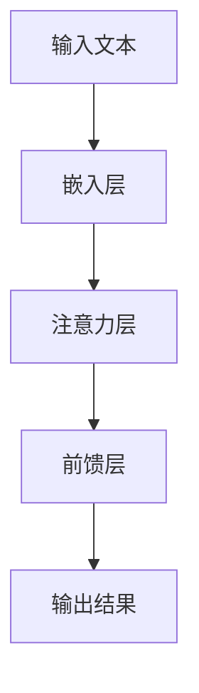
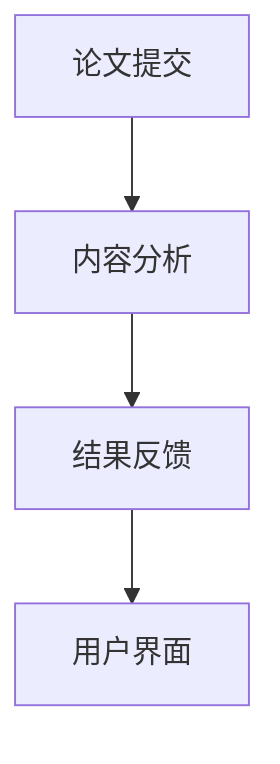
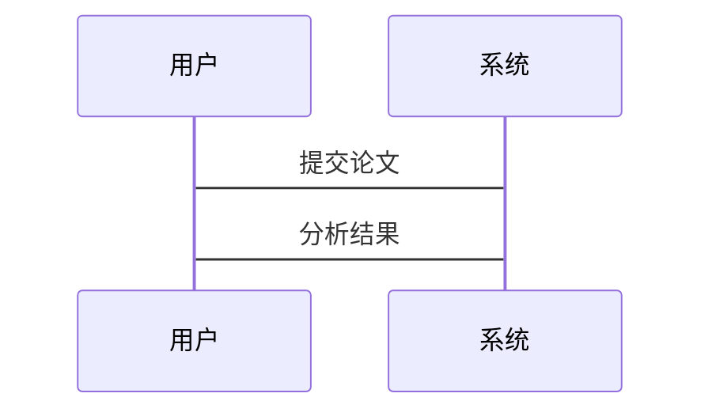
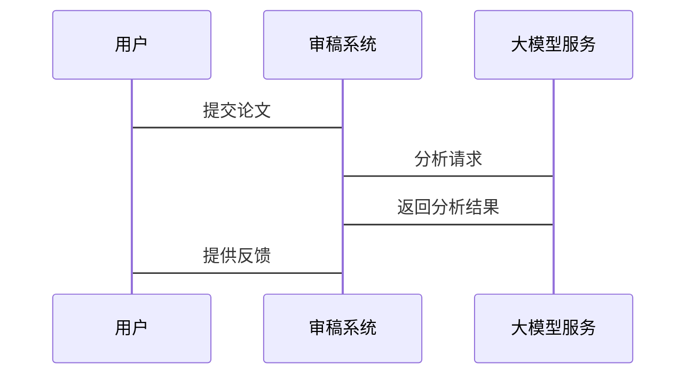

                 


# 开发基于大模型的金融专业论文审稿辅助系统

## 关键词：大模型，金融，论文审稿，系统开发，自然语言处理

## 摘要：本文探讨了开发基于大模型的金融专业论文审稿辅助系统的必要性、技术实现和应用价值。通过分析大模型在金融领域的潜力，详细阐述了系统的核心算法、架构设计和实际应用场景，为提升学术研究和审稿效率提供了新的思路。

---

# 第1章: 问题背景与需求分析

## 1.1 问题背景介绍

### 1.1.1 传统论文审稿流程的痛点
传统金融论文审稿流程存在效率低、主观性强、成本高等问题。审稿人需要花费大量时间阅读和评估论文，且可能存在主观偏差。

### 1.1.2 金融领域论文审稿的特殊性
金融论文通常涉及复杂的理论和数据，审稿人需具备深厚专业知识，审稿过程耗时且繁琐。

### 1.1.3 大模型技术的引入动机
利用大模型的自然语言处理能力，提高审稿效率和准确性，减少主观偏差。

## 1.2 核心概念与系统目标

### 1.2.1 系统的核心目标
提升审稿效率，降低主观偏差，提供客观分析结果。

### 1.2.2 系统的关键特性
- 高效性：快速处理大量论文
- 准确性：准确识别潜在问题
- 可扩展性：适应不同金融领域

### 1.2.3 系统的边界与外延
系统专注于论文内容分析，不涉及外部数据源或实验验证。

## 1.3 问题解决思路与技术选型

### 1.3.1 大模型技术的适用性分析
大模型在文本分析、信息提取方面表现优异，适合用于金融论文审稿。

### 1.3.2 选择大模型的策略
选择开源模型或API服务，根据需求调整模型参数。

### 1.3.3 系统架构的技术选型
采用微服务架构，模块化设计，便于扩展和维护。

---

# 第2章: 大模型在金融领域的核心原理与应用

## 2.1 大模型的基本原理

### 2.1.1 概念属性特征对比表格
| 概念 | 特性 | 描述 |
|------|------|------|
| 输入 | 文本 | 待审论文内容 |
| 输出 | 分析结果 | 包括关键词提取、情感分析等 |

### 2.1.2 ER实体关系图架构（Mermaid）
```mermaid
erDiagram
    actor 用户
    actor 审稿系统
    actor 大模型服务
    用户-->审稿系统: 提交论文
    审稿系统-->大模型服务: 分析请求
    大模型服务-->审稿系统: 返回分析结果
    审稿系统-->用户: 提供反馈
```

## 2.2 大模型的算法原理

### 2.2.1 算法原理流程图（Mermaid）


### 2.2.2 算法的数学模型与公式

#### 2.2.2.1 概率计算公式
$$P(x|y) = \frac{P(x \cap y)}{P(y)}$$

#### 2.2.2.2 损失函数
$$L = -\sum_{i=1}^{n} [y_i \cdot \log(p_i) + (1 - y_i) \cdot \log(1 - p_i)]$$

#### 2.2.2.3 优化算法
Adam优化器用于模型训练。

## 2.3 大模型在金融领域的应用案例

### 2.3.1 金融文本分类
用于识别论文的研究领域和主题。

### 2.3.2 金融风险预测
分析论文中的风险因素，评估论证严谨性。

### 2.3.3 金融信息抽取
提取关键实体和事件，帮助审稿人快速掌握论文核心内容。

---

# 第3章: 系统分析与架构设计

## 3.1 系统功能模块划分

### 3.1.1 论文提交模块
用户上传论文，系统接收并解析内容。

### 3.1.2 内容分析模块
调用大模型API，生成分析报告。

### 3.1.3 结果反馈模块
将分析结果以可视化形式反馈给用户。

## 3.2 系统架构设计

### 3.2.1 系统架构图（Mermaid）


### 3.2.2 系统接口设计

#### 3.2.2.1 API接口定义
```python
def submit_paper(paper_content):
    # 提交论文内容到系统
    pass

def get_analysis(paper_id):
    # 根据论文ID获取分析结果
    pass
```

#### 3.2.2.2 接口交互流程图（Mermaid）


## 3.3 系统交互设计

### 3.3.1 用户角色与权限管理
用户分为普通用户和审稿人，权限控制确保数据安全。

### 3.3.2 系统交互流程图（Mermaid）


---

# 第4章: 项目实战与系统实现

## 4.1 环境搭建与工具安装

### 4.1.1 开发环境配置
安装Python 3.8及以上版本，安装必要的库如TensorFlow、PyTorch。

### 4.1.2 必要工具安装
安装Flask用于Web服务，安装大模型API如Hugging Face Transformers。

## 4.2 系统核心实现

### 4.2.1 论文提交模块实现
```python
from flask import Flask, request, jsonify

app = Flask(__name__)

@app.route('/submit_paper', methods=['POST'])
def submit_paper():
    paper_content = request.json['content']
    # 处理论文内容
    return jsonify({'status': 'success', 'message': '论文提交成功'})
```

### 4.2.2 内容分析模块实现
```python
from transformers import pipeline

classifier = pipeline('text-classification', model='bert-base-cased')
def analyze_content(content):
    result = classifier(content)
    return result
```

### 4.2.3 结果反馈模块实现
```python
@app.route('/get_analysis', methods=['GET'])
def get_analysis():
    paper_id = request.args.get('id')
    analysis = analyze_content(paper_id)
    return jsonify({'analysis': analysis})
```

## 4.3 实际案例分析

### 4.3.1 案例一：抄袭检测
系统识别论文中的重复内容，生成相似度报告。

### 4.3.2 案例二：术语规范性检查
系统检查论文中的专业术语使用是否正确，确保术语一致性。

---

# 第5章: 总结与展望

## 5.1 本章小结
总结系统开发的核心内容和实现步骤，强调大模型在金融审稿中的价值。

## 5.2 注意事项
提醒用户在使用系统时注意数据隐私和模型准确性。

## 5.3 拓展阅读
建议读者深入研究大模型的优化方法和在其他领域的应用。

---

# 作者：AI天才研究院 & 禅与计算机程序设计艺术

---

本文通过详细分析和系统设计，展示了如何利用大模型技术开发高效的金融专业论文审稿辅助系统，为提升学术研究和审稿效率提供了创新思路。

