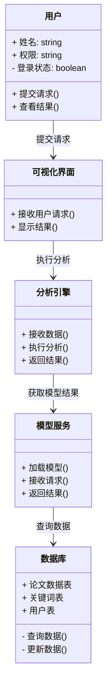

                 


# 开发基于大模型的金融专业论文趋势分析系统

> 关键词：大模型，金融，论文趋势分析，自然语言处理，深度学习

> 摘要：本文详细探讨了如何利用大模型技术来开发金融专业论文趋势分析系统。通过分析系统需求、设计核心算法、构建系统架构，并结合实际案例，展示了如何利用大模型进行高效的论文趋势预测和热点分析。文章内容涵盖系统背景、核心概念、算法原理、系统设计、项目实战等部分，为读者提供全面的技术指导。

---

# 第一部分：背景介绍与核心概念

## 第1章：问题背景与描述

### 1.1 问题背景

#### 1.1.1 金融领域的论文趋势分析需求
随着金融领域的快速发展，学术界对金融相关研究的需求日益增长。然而，面对海量的论文数据，研究者难以快速找到趋势和热点。如何利用技术手段高效分析这些论文，成为一个重要挑战。

#### 1.1.2 大模型在学术论文分析中的潜力
大模型（如GPT、BERT）在自然语言处理领域表现出色，能够理解和生成复杂的文本内容。将其应用于论文分析，可以实现自动摘要、关键词提取、主题识别等功能，显著提升分析效率。

#### 1.1.3 当前痛点与挑战
- 数据量大，处理复杂
- 领域知识的深度需求
- 模型的可解释性和准确性

### 1.2 问题描述

#### 1.2.1 金融专业论文的特点与难点
- 专业性强，领域术语多
- 数据格式多样，预处理复杂
- 需要结合金融知识进行分析

#### 1.2.2 趋势分析的核心目标
- 发现研究热点
- 预测未来趋势
- 识别研究空白

#### 1.2.3 系统需要解决的关键问题
- 数据清洗与预处理
- 模型训练与优化
- 系统架构设计与实现

## 第2章：核心概念与联系

### 2.1 大模型与金融论文分析系统的关系

#### 2.1.1 大模型的核心能力
- 自然语言理解
- 文本生成
- 领域知识的迁移学习

#### 2.1.2 系统的核心功能
- 数据采集与处理
- 模型训练与部署
- 结果分析与可视化

#### 2.1.3 二者的结合点与协同作用
- 大模型作为核心引擎，提供文本分析能力
- 系统作为载体，整合数据、模型和用户需求

### 2.2 系统核心要素分析

#### 2.2.1 数据来源与处理
- 数据来源：学术数据库、期刊、会议论文
- 数据预处理：清洗、分词、去停用词、特征提取

#### 2.2.2 模型训练与优化
- 模型选择：BERT、GPT等
- 参数微调：针对金融领域进行优化

#### 2.2.3 系统架构与交互
- 用户界面：可视化界面，便于操作
- API接口：支持程序调用

### 2.3 核心概念对比表

| 对比维度 | 大模型能力 | 系统功能 |
|----------|------------|----------|
| 数据处理 | 自然语言理解 | 数据清洗与预处理 |
| 模型训练 | 参数微调 | 系统架构设计 |
| 应用场景 | 多领域通用 | 金融领域专业分析 |

### 2.4 ER实体关系图

```mermaid
er
actor: 用户
model: 大模型
system: 金融论文分析系统
paper: 论文数据
keyword: 关键词提取
```

---

# 第三部分：算法原理与数学模型

## 第3章：大模型算法原理

### 3.1 大模型训练流程

#### 3.1.1 数据预处理
- 清洗数据：去除噪音
- 分词：将文本分割为词或短语
- 去停用词：去除无意义词汇
- 特征提取：提取关键词和主题

#### 3.1.2 模型训练
- 使用预训练的大模型（如BERT）
- 根据金融领域数据进行微调

#### 3.1.3 模型微调
- 在特定任务上优化模型参数
- 使用金融领域的标注数据进行训练

### 3.2 大模型训练目标函数

$$ \text{Loss} = -\sum_{i=1}^{n} \log P(y_i|x_i) $$

其中，$y_i$ 是真实标签，$x_i$ 是输入序列。

### 3.3 大模型训练流程图

```mermaid
graph TD
A[数据预处理] --> B[模型初始化]
B --> C[正向传播]
C --> D[计算损失]
D --> E[反向传播]
E --> F[更新参数]
F --> G[检查收敛条件]
G --> H[结束] 或者 G --> B[继续训练]
```

## 第4章：数学模型与公式

### 4.1 词嵌入表示

$$ \text{Word Embedding} = \text{one-hot向量} \times \text{嵌入矩阵} $$

### 4.2 注意力机制

$$ \text{Attention}(Q, K, V) = \text{softmax}\left(\frac{QK^T}{\sqrt{d_k}}\right)V $$

---

# 第四部分：系统分析与架构设计

## 第4章：系统架构设计

### 4.1 问题场景介绍

- 用户需求：金融研究者需要快速了解研究趋势
- 系统目标：提供高效、准确的分析工具

### 4.2 系统功能设计

- 数据采集模块：从数据库中获取论文数据
- 数据预处理模块：清洗和特征提取
- 模型训练模块：训练和优化大模型
- 分析引擎模块：执行趋势分析和预测
- 可视化界面：展示分析结果

### 4.3 系统架构设计图



### 4.4 系统接口设计

- 数据接口：REST API
- 模型接口：基于HTTP的调用
- 可视化接口：基于Web的交互

---

# 第五部分：项目实战

## 第5章：项目实战

### 5.1 环境安装

```bash
pip install tensorflow transformers numpy
```

### 5.2 核心代码实现

#### 5.2.1 数据预处理

```python
def preprocess_papers(papers):
    # 分词
    tokenizer = ...
    tokenized = [tokenizer(paper) for paper in papers]
    return tokenized
```

#### 5.2.2 模型训练

```python
def train_model(model, optimizer, loss_fn, train_loader):
    for epoch in range(num_epochs):
        for batch in train_loader:
            outputs = model(batch)
            loss = loss_fn(outputs, labels)
            optimizer.zero_grad()
            loss.backward()
            optimizer.step()
```

#### 5.2.3 结果分析

```python
def analyze_trend(results):
    # 统计关键词频率
    keyword_counts = {}
    for result in results:
        keywords = extract_keywords(result)
        for kw in keywords:
            keyword_counts[kw] = keyword_counts.get(kw, 0) + 1
    return keyword_counts
```

### 5.3 案例分析

- 数据来源：某金融期刊的论文数据
- 预处理：清洗、分词、提取关键词
- 训练：基于BERT的模型微调
- 分析：识别研究热点和趋势

### 5.4 代码解读与分析

- 数据预处理模块：清洗和分词
- 模型训练模块：参数微调和优化
- 分析引擎模块：关键词提取和趋势预测

---

# 第六部分：最佳实践与小结

## 第6章：最佳实践

### 6.1 开发建议

- 数据质量至关重要
- 模型选择和优化需要结合实际场景
- 系统设计要注重可扩展性和可维护性

### 6.2 注意事项

- 数据隐私和合规性
- 模型的可解释性
- 系统的性能优化

## 第7章：小结

### 7.1 系统开发总结

- 系统实现了高效、准确的金融论文趋势分析
- 结合了大模型的优势和金融领域的特点

### 7.2 未来展望

- 模型优化：更大规模的数据训练
- 功能扩展：加入情感分析、引用网络分析
- 应用场景：金融风险评估、投资决策支持

---

# 作者信息

作者：AI天才研究院/AI Genius Institute  
联系邮箱：contact@aigeniusinstitute.com  
GitHub链接：https://github.com/AI-Genius-Institute  

---

以上是《开发基于大模型的金融专业论文趋势分析系统》的技术博客文章的完整目录大纲和内容框架。

