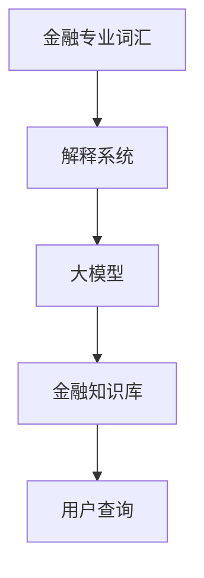
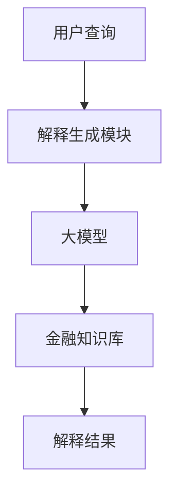
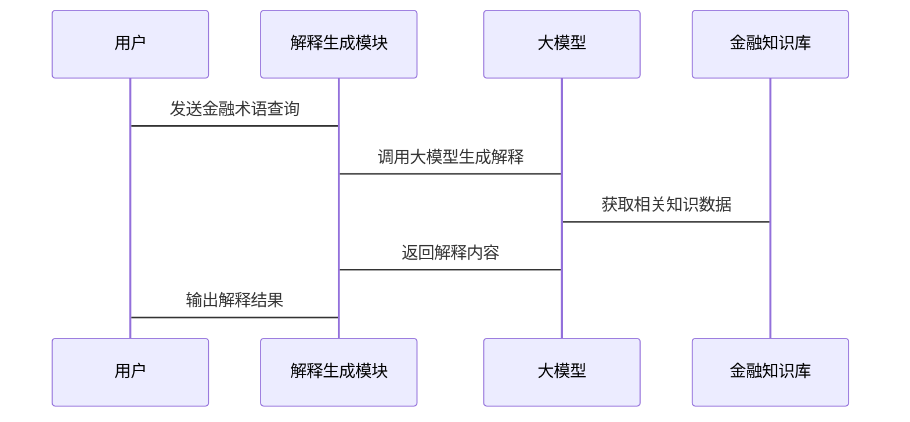

                 


# 开发基于大模型的金融专业词汇解释系统

> 关键词：大模型，金融专业词汇，解释系统，自然语言处理，金融知识库

> 摘要：本文详细介绍了开发基于大模型的金融专业词汇解释系统的全过程，包括背景介绍、核心概念、算法原理、系统架构设计、项目实战及最佳实践。通过本文，读者可以全面了解如何利用大模型技术构建高效的金融专业词汇解释系统。

---

# 第一部分: 背景介绍与核心概念

## 第1章: 问题背景与描述

### 1.1 问题背景

#### 1.1.1 金融领域的知识解释需求
金融领域的知识高度专业化，涉及大量术语和复杂概念。普通用户或非专业人士在使用金融产品或服务时，常常面临术语难以理解的问题。例如，“beta系数”、“黑天鹅事件”等术语对普通用户来说可能非常陌生。

#### 1.1.2 传统金融解释系统的局限性
传统的金融解释系统通常依赖于固定的规则和模板，难以覆盖金融领域的全部术语和概念。此外，这些系统缺乏灵活性，难以适应金融市场的快速变化。

#### 1.1.3 大模型在金融解释中的优势
大模型（如GPT-3、BERT等）具有强大的自然语言处理能力，能够理解上下文并生成准确的解释。通过结合金融知识库，大模型可以提供更全面、更个性化的金融术语解释。

### 1.2 问题描述

#### 1.2.1 金融专业词汇的复杂性
金融术语往往具有高度的专业性和技术性，不同领域术语的解释可能截然不同。例如，“杠杆”在金融衍生品中和在公司财务中的含义就有所不同。

#### 1.2.2 用户对金融解释的需求多样性
用户对金融解释的需求可能因场景而异。例如，投资者可能需要了解“beta系数”的具体含义，而普通用户可能只需要了解其基本概念。

#### 1.2.3 当前解释系统的不足
现有解释系统通常缺乏灵活性和深度，难以满足用户多样化的解释需求。此外，系统更新和维护成本较高。

### 1.3 问题解决思路

#### 1.3.1 引入大模型的必要性
大模型的自然语言处理能力使其能够理解复杂的金融术语，并生成准确的解释。通过结合金融知识库，大模型可以提供更精准、更个性化的解释。

#### 1.3.2 基于大模型的解释系统设计
系统设计需要结合大模型和金融知识库，通过自然语言处理技术生成解释内容。同时，系统需要支持用户反馈机制，以不断优化解释质量。

#### 1.3.3 系统目标与实现路径
系统目标是为用户提供准确、全面的金融术语解释。实现路径包括数据收集与处理、模型训练与优化、系统开发与测试。

---

## 第2章: 核心概念与联系

### 2.1 大模型在金融领域的应用原理

#### 2.1.1 大模型的基本原理
大模型通过预训练和微调，掌握了大量的金融知识和语言模式。在解释生成阶段，系统会根据用户输入的术语，调用大模型生成解释内容。

#### 2.1.2 大模型在金融解释中的优势
- **语义理解能力**：大模型能够理解金融术语的上下文和语义。
- **自适应能力**：大模型可以根据用户需求生成不同深度的解释。
- **知识库整合**：大模型可以与金融知识库结合，提供更准确的解释。

#### 2.1.3 大模型与金融领域的结合点
- **自然语言处理**：大模型通过NLP技术理解用户输入。
- **知识库整合**：大模型结合金融知识库生成解释。
- **动态更新**：大模型可以根据最新金融动态更新解释内容。

### 2.2 核心概念对比分析

#### 2.2.1 金融术语与普通词汇的对比
| 特性          | 金融术语          | 普通词汇          |
|---------------|-------------------|-------------------|
| 专业性        | 高               | 低               |
| 解释复杂性    | 高               | 低               |
| 知识依赖性    | 高               | 低               |

#### 2.2.2 不同金融领域的术语特点
- **股票市场**：涉及术语如“市盈率”、“成交量”等。
- **债券市场**：涉及术语如“久期”、“收益率曲线”等。
- **风险管理**：涉及术语如“VaR”、“信用评级”等。

#### 2.2.3 术语解释的准确性与全面性对比
| 解释方式      | 准确性 | 全面性 |
|---------------|--------|--------|
| 基于规则      | 中等   | 低     |
| 基于大模型    | 高     | 高     |

### 2.3 实体关系图



---

# 第二部分: 算法原理与数学模型

## 第3章: 大模型的算法原理

### 3.1 大模型的基本架构

#### 3.1.1 Transformer模型
Transformer模型由编码器和解码器组成，通过自注意力机制捕捉输入中的长距离依赖关系。

#### 3.1.2 多头注意力机制
多头注意力机制通过并行处理多个子空间的注意力，提高模型的表达能力。

#### 3.1.3 前馈网络
前馈网络用于生成最终的输出结果，通常包含多个全连接层和激活函数。

### 3.2 大模型的训练过程

#### 3.2.1 预训练阶段
预训练阶段使用大规模的金融文本数据，训练模型理解金融语言的模式。

#### 3.2.2 微调阶段
微调阶段使用特定领域的金融知识库数据，对模型进行优化，使其更适合金融术语解释任务。

#### 3.2.3 解释生成阶段
解释生成阶段，模型根据用户输入的术语，生成相应的解释内容。

### 3.3 解释生成算法

#### 3.3.1 解释生成的流程
1. 用户输入金融术语。
2. 系统调用大模型生成解释内容。
3. 系统输出解释结果。

#### 3.3.2 解释生成的数学模型
解释生成的数学模型基于Transformer架构，具体公式如下：

$$P(y|x) = \frac{P(y)P(x|y)}{P(x)}$$

其中，$x$是用户输入的术语，$y$是生成的解释内容。

---

## 第4章: 数学模型与公式

### 4.1 大模型的基本数学框架

#### 4.1.1 Transformer的数学公式
$$\text{多头注意力机制} = \sum_{i=1}^{n} \text{head}(Q, K, V)$$

其中，$Q$、$K$、$V$分别是查询、键和值向量，$n$是头数。

### 4.2 解释生成的数学模型
解释生成的条件概率公式为：

$$P(y|x) = \frac{P(y)P(x|y)}{P(x)}$$

---

# 第三部分: 系统分析与架构设计

## 第5章: 系统分析与设计

### 5.1 系统功能设计

#### 5.1.1 用户查询模块
用户可以通过输入金融术语查询解释内容。

#### 5.1.2 解释生成模块
系统调用大模型生成解释内容，并输出结果。

### 5.2 系统架构设计



### 5.3 系统接口设计

#### 5.3.1 用户接口
- 输入接口：接收用户输入的金融术语。
- 输出接口：输出解释内容。

#### 5.3.2 系统接口
- 大模型接口：调用大模型生成解释内容。
- 知识库接口：获取金融知识库中的相关数据。

### 5.4 系统交互流程



---

## 第6章: 项目实战

### 6.1 环境安装

```bash
pip install transformers
pip install torch
pip install mermaid
```

### 6.2 系统核心实现

```python
from transformers import AutoTokenizer, AutoModelForCausalLM
import torch

# 加载大模型
tokenizer = AutoTokenizer.from_pretrained('gpt2')
model = AutoModelForCausalLM.from_pretrained('gpt2')

# 解释生成函数
def generate_explanation(term):
    inputs = tokenizer(term, return_tensors='np')
    outputs = model.generate(inputs.input_ids, max_length=100)
    explanation = tokenizer.decode(outputs[0], skip_special_tokens=True)
    return explanation
```

### 6.3 代码应用解读与分析

#### 6.3.1 加载大模型
使用`AutoTokenizer`和`AutoModelForCausalLM`加载预训练的大模型。

#### 6.3.2 解释生成函数
函数`generate_explanation`接收一个金融术语，生成对应的解释内容。

### 6.4 实际案例分析

#### 6.4.1 案例1：解释“beta系数”
用户输入“beta系数”，系统生成以下解释：
- Beta系数衡量的是一个资产相对于市场波动的敏感性。
- Beta系数大于1表示资产波动性高于市场，小于1表示低于市场。

#### 6.4.2 案例2：解释“VaR”
用户输入“VaR”，系统生成以下解释：
- VaR是风险价值的缩写，表示在特定置信水平下，投资组合的最大可能损失。

### 6.5 项目小结
通过上述代码实现，我们可以看到基于大模型的金融术语解释系统具有强大的自然语言处理能力和灵活性。系统可以根据用户需求生成不同深度的解释内容，并通过反馈机制不断优化解释质量。

---

# 第四部分: 最佳实践与总结

## 第7章: 最佳实践

### 7.1 开发建议
- 在系统设计阶段，充分考虑金融领域的专业性和术语的多样性。
- 在模型训练阶段，使用高质量的金融知识库数据进行微调。
- 在系统部署阶段，确保系统的高效性和稳定性。

### 7.2 注意事项
- 注意保护用户隐私，确保用户数据的安全性。
- 定期更新模型和知识库，以适应金融市场的变化。

### 7.3 拓展阅读
- [大模型在金融领域的应用](https://example.com/financial-applications)
- [自然语言处理技术在金融领域的研究](https://example.com/nlp-in-finance)

---

# 结语

通过本文的详细介绍，读者可以全面了解基于大模型的金融专业词汇解释系统的开发过程。从背景介绍到系统设计，从算法原理到项目实战，本文为读者提供了完整的开发指南。未来，随着大模型技术的不断发展，金融专业词汇解释系统将更加智能化和个性化，为用户提供更优质的服务。

---

作者：AI天才研究院/AI Genius Institute & 禅与计算机程序设计艺术 /Zen And The Art of Computer Programming

