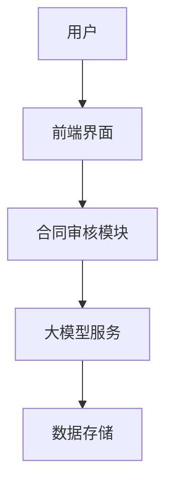

                 


# 开发基于大模型的金融合同审核系统

> 关键词：大模型、金融合同审核、自然语言处理、文本挖掘、机器学习

> 摘要：本文详细介绍了开发基于大模型的金融合同审核系统的过程，从背景需求分析到系统设计，再到算法实现和项目实战，最后总结与展望。文章内容涵盖大模型的文本处理算法、系统架构设计、接口设计以及实际案例分析，旨在为读者提供一个全面的开发指南。

---

## 第一部分: 金融合同审核系统的背景与需求

### 第1章: 金融合同审核的背景与挑战

#### 1.1 金融合同审核的背景

金融行业作为现代经济的核心，其运行离不开各类合同的签订与审核。合同是金融交易的法律依据，其内容的准确性和合规性直接关系到金融市场的稳定性和参与方的权益。然而，传统的合同审核方式存在效率低、成本高、易出错等问题。随着人工智能技术的快速发展，特别是大模型技术的成熟，为金融合同审核的自动化和智能化提供了新的解决方案。

#### 1.2 问题背景与挑战

传统的合同审核主要依赖人工完成，这种方式不仅效率低下，而且容易受到主观因素的影响，存在审核不一致、漏审或误审的风险。具体挑战包括：

1. **合同内容复杂**：金融合同涉及的条款繁多，且内容高度专业，人工审核难以快速准确地识别关键信息。
2. **合规性要求高**：金融行业对合同的合规性要求严格，任何微小的疏忽都可能导致法律风险。
3. **数据量大**：金融机构每天需要处理大量的合同文档，人工审核难以在有限时间内完成。
4. **成本高昂**：人工审核需要投入大量的人力资源和时间成本，且容易出现疲劳导致的错误。

#### 1.3 大模型技术的引入与应用

大模型（Large Language Model，LLM）是一种基于深度学习的自然语言处理模型，具有强大的文本理解和生成能力。通过引入大模型技术，可以实现金融合同的自动化审核，显著提高审核效率和准确性。大模型的核心优势在于其强大的上下文理解和多任务处理能力，能够帮助系统快速识别合同中的关键条款、风险点和潜在问题。

---

### 第2章: 基于大模型的金融合同审核系统需求分析

#### 2.1 系统需求概述

开发基于大模型的金融合同审核系统需要满足以下功能需求：

1. **合同内容理解**：能够准确识别合同中的关键信息，如合同类型、金额、期限、条款等。
2. **条款合规性检查**：对合同条款进行合法性审查，识别潜在的法律风险。
3. **风险评估**：根据合同内容生成风险评估报告，帮助决策者做出明智的选择。
4. **自动化审核**：实现合同的自动审核流程，减少人工干预。
5. **可扩展性**：支持多种类型的金融合同，能够快速适应业务需求的变化。

#### 2.2 金融合同审核的核心场景

1. **合同条款识别**：通过自然语言处理技术，自动提取合同中的关键条款，如违约责任、担保条款等。
2. **风险评估与合规性检查**：对合同内容进行风险评估，确保其符合相关法律法规和行业标准。
3. **自动化审核流程优化**：通过自动化技术，优化合同审核流程，减少人工操作的时间和成本。

#### 2.3 系统架构设计

为了实现上述功能，系统需要具备以下核心模块：

1. **数据采集模块**：负责采集和预处理合同文本数据。
2. **模型训练模块**：对大模型进行训练和优化，使其适应金融合同审核的任务。
3. **合同审核模块**：基于训练好的大模型，对合同文本进行理解和分析，生成审核结果。
4. **结果展示模块**：将审核结果以可视化的方式呈现给用户，方便后续处理。

---

## 第二部分: 系统设计与算法实现

### 第3章: 系统架构设计

#### 3.1 系统功能模块划分

系统功能模块的划分如下：

1. **数据采集模块**：负责从数据库或文件系统中获取合同文本数据。
2. **模型训练模块**：对大模型进行微调和优化，使其能够准确理解金融合同的内容。
3. **合同审核模块**：将合同文本输入大模型，生成审核结果。
4. **结果展示模块**：将审核结果以友好的方式展示给用户。

#### 3.2 系统架构设计

系统采用微服务架构，各个模块之间通过API进行通信。以下是系统的总体架构图：



---

### 第4章: 系统核心算法与数学模型

#### 4.1 大模型的文本处理算法

大模型的文本处理算法基于Transformer架构，包括编码器和解码器两个部分。编码器负责将输入的文本转换为向量表示，解码器则根据编码器的输出生成目标文本。以下是Transformer的结构图：

```mermaid
graph TD
    Encoder -> Attention
    Attention -> Output
    Output -> Decoder
    Decoder -> Output
```

数学公式表示为：

$$
\text{Encoder} = \text{MultiHead}(Q, K, V)
$$

$$
\text{Decoder} = \text{MultiHead}(Q', K', V')
$$

---

### 第5章: 系统实现与实战

#### 5.1 环境搭建与工具安装

开发环境的搭建是实现系统的第一步。以下是主要工具的安装指南：

1. **Python环境配置**：
   - 安装Python 3.8及以上版本。
   - 使用`virtualenv`创建虚拟环境。

2. **深度学习框架安装**：
   - 安装PyTorch和Hugging Face的Transformers库：
     ```bash
     pip install torch transformers
     ```

3. **数据集准备**：
   - 下载金融合同文本数据集，格式为JSON或CSV。

#### 5.2 核心代码实现

以下是系统的核心代码实现：

```python
from transformers import AutoTokenizer, AutoModelForMaskedLM
import torch

# 加载大模型
model_name = "facebook/roberta-base"
tokenizer = AutoTokenizer.from_pretrained(model_name)
model = AutoModelForMaskedLM.from_pretrained(model_name)

# 定义合同审核函数
def contract_review(text):
    inputs = tokenizer(text, return_tensors="pt", truncation=True, padding=True)
    outputs = model(**inputs)
    return outputs.last_hidden_state

# 示例使用
text = "This is a sample financial contract."
result = contract_review(text)
print(result)
```

---

### 第6章: 系统优化与扩展

#### 6.1 系统性能优化

为了提高系统的性能，可以采取以下优化措施：

1. **模型压缩与轻量化**：
   - 使用模型剪枝技术减少模型的参数量。
   - 采用知识蒸馏技术将大模型的知识迁移到小模型中。

2. **并行计算优化**：
   - 使用GPU加速模型的推理过程。
   - 采用分布式训练技术提高模型的训练效率。

---

## 第三部分: 总结与展望

### 第7章: 总结与展望

#### 7.1 项目总结

通过本文的介绍，我们详细讲解了开发基于大模型的金融合同审核系统的全过程，包括背景分析、需求设计、系统架构、算法实现和项目实战。大模型技术的强大能力为金融合同审核的自动化和智能化提供了有力支持。

#### 7.2 未来展望

未来，随着大模型技术的不断发展，金融合同审核系统将更加智能化和高效化。可能的发展方向包括：

1. **多模态审核**：结合图像识别技术，实现对合同图像的自动识别和审核。
2. **实时审核**：通过流处理技术，实现合同的实时审核和反馈。
3. **自适应学习**：通过在线学习技术，使系统能够自适应地更新模型，适应新的合同类型和法律条款。

---

## 附录

### 附录A: 工具安装指南

1. **Python安装**：
   ```bash
   https://www.python.org/downloads/
   ```

2. **PyTorch安装**：
   ```bash
   pip install torch
   ```

3. **Hugging Face Transformers安装**：
   ```bash
   pip install transformers
   ```

### 附录B: API文档

1. **大模型API**：
   ```python
   https://huggingface.co/facebook/roberta-base
   ```

---

## 作者信息

作者：AI天才研究院/AI Genius Institute  
联系邮箱：contact@aiguru.com  

---

通过本文的详细讲解，读者可以系统地了解开发基于大模型的金融合同审核系统的全过程，并能够根据实际需求进行二次开发和优化。希望本文能够为金融行业的人工智能技术应用提供有价值的参考和指导。

