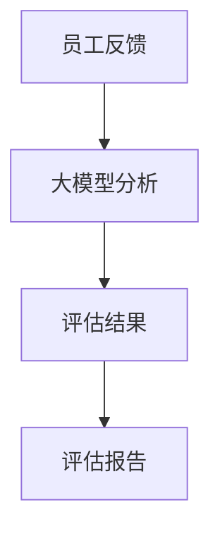
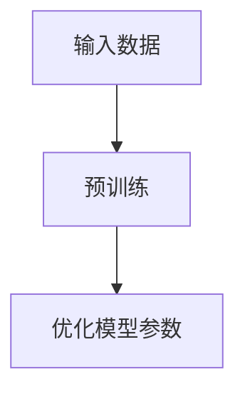
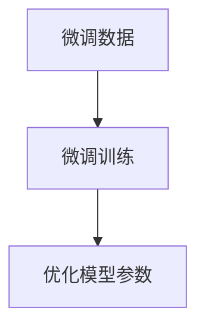
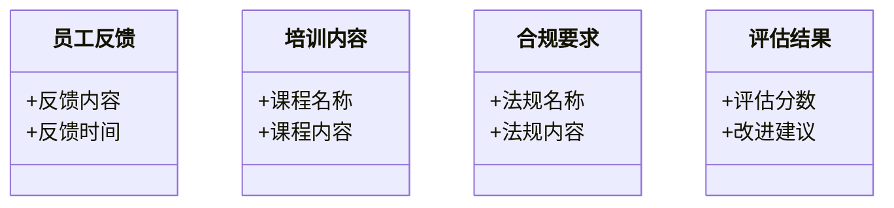
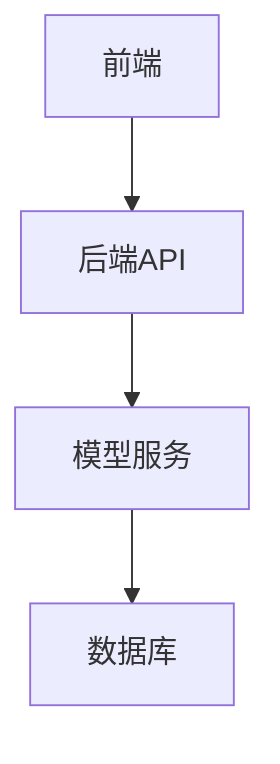
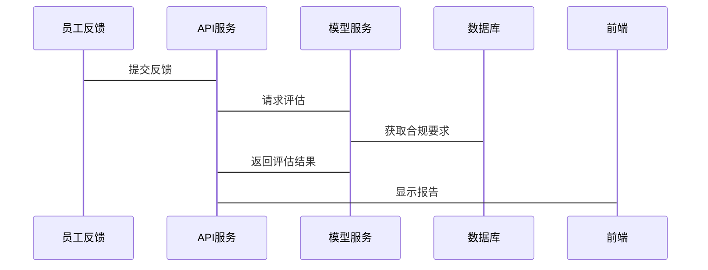

                 


# 开发基于大模型的金融合规培训效果评估系统

## 关键词：
- 大模型
- 金融合规
- 培训效果评估
- AI算法
- 系统架构

## 摘要：
本文系统地介绍如何开发基于大模型的金融合规培训效果评估系统。从问题背景到解决方案，从算法原理到系统架构，从项目实战到总结展望，全面阐述系统的开发过程和应用价值。通过本文，读者可以深入了解大模型在金融合规领域的应用，掌握系统开发的关键技术，并能够实际操作开发类似系统。

---

## 第1章：背景介绍

### 1.1 问题背景
1.1.1 金融合规的重要性  
金融合规是金融机构运营的核心要求，直接关系到企业的风险管理、法律合规和业务连续性。然而，传统合规培训评估方法存在效率低、覆盖面有限、难以量化等问题。

1.1.2 现有合规培训的局限性  
传统合规培训依赖人工评估，存在主观性强、效率低、成本高等问题。金融机构需要一种更高效、更精准的评估方法。

1.1.3 大模型在金融领域的应用潜力  
大模型具有强大的自然语言处理能力，能够对大量非结构化数据进行分析，为金融合规评估提供新的技术手段。

### 1.2 问题描述
1.2.1 合规培训效果评估的挑战  
合规培训效果难以量化，员工理解和执行情况差异大，传统评估方法难以覆盖所有场景。

1.2.2 当前评估方法的不足  
传统评估方法依赖主观评分，难以捕捉员工的真实理解和行为变化。

1.2.3 引入大模型的必要性  
通过大模型对员工的培训反馈进行分析，能够更精准地评估培训效果。

### 1.3 解决方案与目标
1.3.1 大模型在合规评估中的应用  
利用大模型对员工的反馈进行分析，生成个性化的评估报告，帮助机构优化培训方案。

1.3.2 系统的目标与预期效果  
开发一个基于大模型的金融合规培训效果评估系统，实现自动化、精准化、个性化的评估。

1.3.3 解决方案的可行性分析  
大模型技术已经成熟，金融数据的可获得性较高，具备开发的可行性。

### 1.4 边界与外延
1.4.1 系统的适用范围  
适用于金融机构的合规培训评估，支持多种语言和场景。

1.4.2 系统的局限性  
目前主要针对文本数据，对其他类型数据的支持有限。

1.4.3 与其他系统的区别  
与其他评估系统相比，本系统基于大模型，具有更强的自然语言处理能力和自动化能力。

### 1.5 核心要素与概念结构
1.5.1 核心要素分析  
- 数据输入：员工反馈、培训内容、合规要求  
- 模型处理：大模型分析、生成评估结果  
- 输出结果：评估报告、改进建议  

1.5.2 概念结构图  


---

## 第2章：核心概念与联系

### 2.1 大模型的基本原理
2.1.1 模型架构  
大模型通常采用Transformer架构，包括编码器和解码器部分，能够处理序列数据。

2.1.2 优势分析  
- 大规模预训练：能够处理多种语言和领域数据  
- 强大的上下文理解能力：能够捕捉文本中的深层含义  
- 实时推理能力：支持快速生成评估结果  

2.1.3 劣势分析  
- 计算资源需求高  
- 对小样本数据的适应性较差  

### 2.2 大模型与传统AI的区别
2.2.1 模型规模  
大模型参数量大，传统模型参数量小。

2.2.2 训练方法  
大模型采用预训练+微调的策略，传统模型通常只进行微调。

2.2.3 应用场景  
大模型适用于复杂的自然语言处理任务，传统模型适用于简单的任务。

---

## 第3章：算法原理讲解

### 3.1 大模型的训练与微调
3.1.1 预训练过程  
1. 输入：大规模金融文本数据  
2. 输出：模型参数经过优化  
3. 流程图：  


3.1.2 微调过程  
1. 输入：特定领域的金融合规数据  
2. 输出：优化后的模型参数  
3. 流程图：  


### 3.2 算法数学模型
3.2.1 损失函数  
$$L = -\sum_{i=1}^{n} y_i \log(p_i) + (1-y_i)\log(1-p_i)$$  
其中，$p_i$ 是模型预测的概率，$y_i$ 是真实标签。

3.2.2 优化器  
常用Adam优化器：  
$$\theta_{t+1} = \theta_t - \eta \frac{\partial L}{\partial \theta_t}$$  
其中，$\eta$ 是学习率。

---

## 第4章：系统分析与架构设计方案

### 4.1 系统功能设计
4.1.1 领域模型类图  


4.1.2 系统架构设计  


### 4.2 系统接口设计
4.2.1 输入接口  
- 员工反馈接口：支持文本输入  
- 培训内容接口：支持结构化数据输入  

4.2.2 输出接口  
- 评估结果接口：返回评估分数和改进建议  
- 报告生成接口：生成HTML或PDF报告  

### 4.3 系统交互流程  


---

## 第5章：项目实战

### 5.1 环境安装
1. 安装Python 3.8+  
2. 安装相关库：  
   - `transformers`  
   - `mermaid`  
   - `matplotlib`  

### 5.2 核心代码实现
```python
from transformers import AutoTokenizer, AutoModelForMaskedLM
import torch

# 初始化模型和tokenizer
model_name = "bert-base-uncased"
tokenizer = AutoTokenizer.from_pretrained(model_name)
model = AutoModelForMaskedLM.from_pretrained(model_name)

# 微调训练
def train_model():
    model.train()
    for epoch in range(num_epochs):
        for batch in dataloader:
            inputs, labels = batch
            outputs = model(**inputs)
            loss = outputs.loss
            loss.backward()
            optimizer.step()
```

### 5.3 代码解读与分析
1. 初始化模型和tokenizer：加载预训练模型  
2. 微调训练：对特定领域数据进行训练，优化模型参数  
3. 模型评估：使用测试数据评估模型性能  

### 5.4 实际案例分析
案例：评估员工对《反洗钱法》的理解  
1. 输入：员工反馈文本  
2. 模型处理：生成评估结果  
3. 输出：评估分数和改进建议  

---

## 第6章：总结与展望

### 6.1 最佳实践 tips
1. 数据清洗与预处理是关键  
2. 模型调优需要多次实验  
3. 系统部署要考虑计算资源  

### 6.2 小结
本文系统地介绍了开发基于大模型的金融合规培训效果评估系统的过程，从背景分析到系统设计，再到项目实战，全面覆盖了开发的各个环节。

### 6.3 注意事项
- 数据隐私保护  
- 模型的可解释性  
- 系统的可扩展性  

### 6.4 拓展阅读
1. 《Large Language Models in Practice》  
2. 《金融合规技术与应用》  

---

## 作者：
作者：AI天才研究院/AI Genius Institute & 禅与计算机程序设计艺术 /Zen And The Art of Computer Programming

