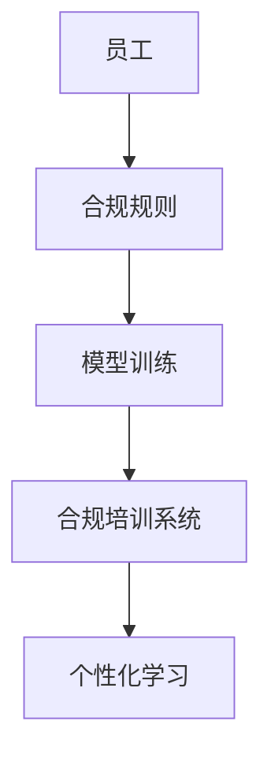
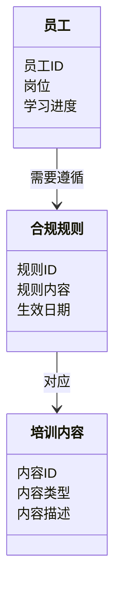
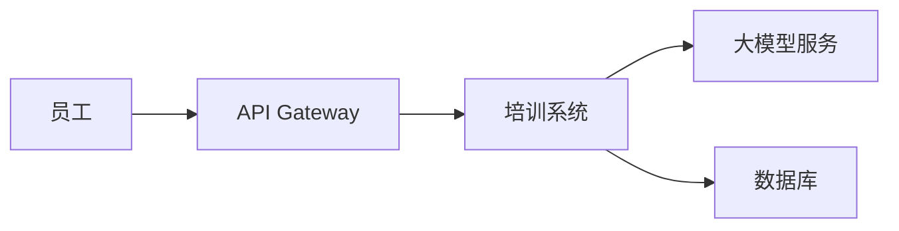
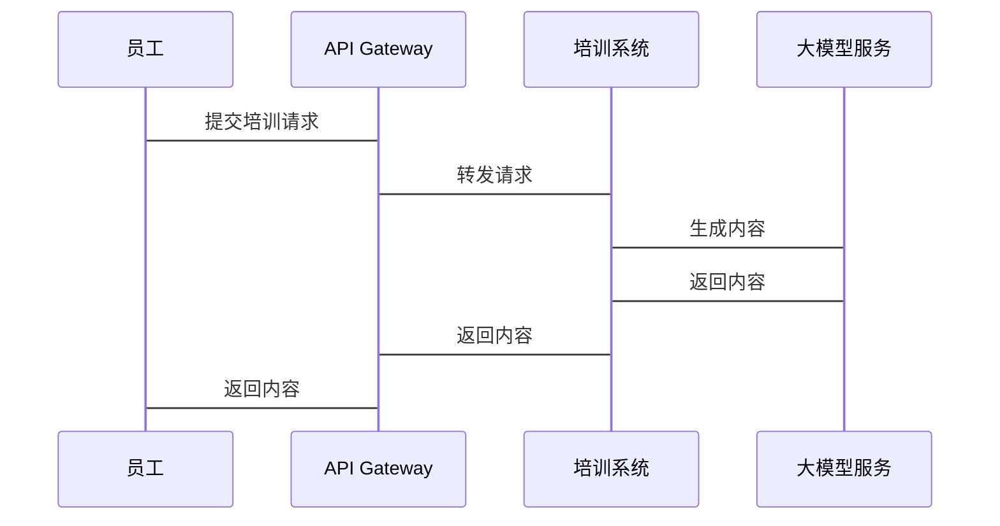

                 


# 开发基于大模型的金融合规培训系统

> 关键词：大模型，金融合规，培训系统，人工智能，系统架构

> 摘要：本文详细探讨了开发基于大模型的金融合规培训系统的核心概念、算法原理、系统架构以及项目实战。通过分析金融合规培训的痛点，结合大模型的优势，提出了一套高效的解决方案，并通过实际案例展示了系统的实现过程。

---

## 第1章: 金融合规培训系统概述

### 1.1 问题背景

#### 1.1.1 金融合规的重要性
金融合规是确保金融机构及其业务行为符合相关法律法规的重要环节。随着金融市场的快速发展，合规要求日益严格，合规培训成为金融机构的重要任务。

#### 1.1.2 传统合规培训的局限性
传统合规培训存在以下问题：
1. **内容单一**：培训内容通常固定，难以根据员工的具体情况个性化定制。
2. **效率低下**：培训过程缺乏互动性和实时反馈，员工参与度低。
3. **更新滞后**：法律法规不断变化，传统培训难以及时更新。

#### 1.1.3 大模型在合规培训中的潜力
大模型（如GPT-3、PaLM等）具有强大的自然语言处理能力和生成能力，能够为合规培训提供个性化的学习体验和实时反馈。

### 1.2 问题描述

#### 1.2.1 合规培训的痛点
1. 员工对合规知识的理解不深入，导致执行不到位。
2. 培训内容难以覆盖所有员工，尤其是不同岗位的差异化需求。
3. 缺乏互动性和实践性，员工参与度低。

#### 1.2.2 传统合规培训的效率瓶颈
1. 非个性化的培训内容难以满足不同员工的需求。
2. 培训效果难以量化，缺乏数据支持。
3. 培训资源分散，难以高效管理。

#### 1.2.3 个性化学习的需求
员工的学习需求因人而异，传统培训难以提供个性化的学习路径和内容。

### 1.3 问题解决

#### 1.3.1 大模型如何解决合规培训问题
1. **个性化学习**：大模型可以根据员工的具体需求生成个性化的培训内容。
2. **实时反馈**：通过自然语言处理技术，大模型可以实时分析员工的回答，提供针对性的反馈。
3. **高效管理**：大模型可以整合分散的培训资源，实现高效管理。

### 1.4 边界与外延

#### 1.4.1 系统的边界
- 系统仅负责合规培训，不涉及其他业务领域。
- 系统依赖外部数据源，如法律法规文本和案例库。

#### 1.4.2 相关领域的外延
- 数据安全：系统需要确保员工数据的安全性。
- 技术支持：系统需要依赖云计算和大模型技术支持。

#### 1.4.3 系统与外部环境的交互
- 系统通过API与企业系统（如HR系统）交互，获取员工信息。
- 系统通过用户界面与员工交互，提供培训内容和反馈。

### 1.5 核心要素组成

#### 1.5.1 数据来源
- **员工信息**：包括岗位、职责、学习进度等。
- **法律法规**：包括最新的金融法规和合规要求。
- **培训案例**：包括历史培训案例和员工反馈数据。

#### 1.5.2 模型训练
- **训练数据**：包括法律法规文本、合规案例和员工反馈。
- **训练目标**：生成符合员工需求的合规培训内容。

#### 1.5.3 系统架构
- **前端**：员工与系统的交互界面。
- **后端**：处理培训请求和生成内容的逻辑。
- **模型服务**：提供大模型服务的接口。

---

## 第2章: 大模型在金融合规中的应用

### 2.1 大模型的核心概念

#### 2.1.1 大模型的基本原理
大模型通过大量数据训练，具备强大的自然语言理解和生成能力。其核心包括词嵌入、注意力机制和解码器等。

#### 2.1.2 大模型的训练过程
1. **数据预处理**：清洗和标注数据。
2. **模型初始化**：设置初始参数。
3. **训练迭代**：通过反向传播优化参数。

#### 2.1.3 大模型的推理机制
大模型通过编码器-解码器结构生成文本，生成过程基于概率分布。

### 2.2 金融合规的核心概念

#### 2.2.1 合规规则的定义
合规规则是金融机构必须遵守的法律法规和内部政策。

#### 2.2.2 合规风险的评估
通过分析业务流程中的风险点，评估合规风险。

#### 2.2.3 合规培训的流程
1. **需求分析**：识别员工的培训需求。
2. **内容设计**：设计个性化的培训内容。
3. **实施与反馈**：执行培训并收集反馈。

### 2.3 大模型与金融合规的联系

#### 2.3.1 大模型如何辅助合规规则的理解
通过生成简洁的解释，帮助员工理解复杂的法规。

#### 2.3.2 大模型如何优化合规培训的流程
通过自动化生成培训内容，减少人工干预。

#### 2.3.3 大模型如何提升合规风险的预测能力
通过分析历史数据，预测潜在的合规风险。

### 2.4 核心概念的ER实体关系图


---

## 第3章: 大模型的算法原理

### 3.1 大模型的训练过程

#### 3.1.1 数据预处理
```python
import pandas as pd

data = pd.read_csv('train.csv')
data = data.dropna()
```

#### 3.1.2 模型初始化
```python
import torch

class Model(torch.nn.Module):
    def __init__(self):
        super().__init__()
        self.embedding = torch.nn.Embedding( vocab_size, embedding_dim)
        self.decoder = torch.nn.LSTM(embedding_dim, hidden_size)
```

#### 3.1.3 训练迭代
```python
optimizer = torch.optim.Adam(model.parameters(), lr=learning_rate)
criterion = torch.nn.CrossEntropyLoss()

for epoch in range(num_epochs):
    for inputs, labels in dataloader:
        outputs = model(inputs)
        loss = criterion(outputs, labels)
        optimizer.zero_grad()
        loss.backward()
        optimizer.step()
```

### 3.2 生成过程

#### 3.2.1 解码器的实现
```python
def generate_text(model, tokenizer, max_length=50):
    input_ids = tokenizer.encode("Legal compliance training", return_tensors="pt")
    input_ids = input_ids.to(device)
    
    with torch.no_grad():
        outputs = model.generate(input_ids, max_length=max_length)
        print(tokenizer.decode(outputs[0], skip_special_tokens=True))
```

### 3.3 数学模型

#### 3.3.1 损失函数
$$\text{Loss} = -\sum_{i=1}^{n} \log p(x_i)$$

#### 3.3.2 优化算法
$$\theta_{\text{new}} = \theta_{\text{old}} - \eta \cdot \frac{\partial \text{Loss}}{\partial \theta}$$

#### 3.3.3 注意力机制
$$\text{Attention}(Q,K,V) = \text{softmax}\left(\frac{QK^T}{\sqrt{d_k}}\right)V$$

---

## 第4章: 系统分析与架构设计

### 4.1 问题场景介绍

#### 4.1.1 项目介绍
开发一个基于大模型的金融合规培训系统，帮助金融机构提升培训效率和效果。

### 4.2 系统功能设计

#### 4.2.1 领域模型


### 4.3 系统架构设计

#### 4.3.1 架构图


### 4.4 系统接口设计

#### 4.4.1 接口描述
1. `/api/v1/train`: 提交培训请求。
2. `/api/v1/content`: 获取个性化内容。

### 4.5 系统交互

#### 4.5.1 交互序列图


---

## 第5章: 项目实战

### 5.1 环境安装

#### 5.1.1 安装Python和依赖
```bash
pip install torch transformers
```

### 5.2 核心代码实现

#### 5.2.1 模型加载
```python
from transformers import AutoModelForCausalLM, AutoTokenizer

model = AutoModelForCausalLM.from_pretrained('gpt2')
tokenizer = AutoTokenizer.from_pretrained('gpt2')
```

#### 5.2.2 模型推理
```python
def generate_response(prompt):
    inputs = tokenizer.encode(prompt, return_tensors='pt', max_length=512)
    outputs = model.generate(inputs, max_length=256)
    return tokenizer.decode(outputs[0], skip_special_tokens=True)
```

### 5.3 代码解读

#### 5.3.1 模型加载
加载预训练的GPT-2模型和tokenizer。

#### 5.3.2 模型推理
根据输入生成响应。

### 5.4 案例分析

#### 5.4.1 案例介绍
某银行员工需要学习反洗钱合规知识。

#### 5.4.2 案例实现
```python
response = generate_response("Explain anti-money laundering regulations in simple terms.")
print(response)
```

### 5.5 项目小结
通过实战项目，验证了基于大模型的合规培训系统的可行性和有效性。

---

## 第6章: 最佳实践

### 6.1 Tips

#### 6.1.1 数据安全
确保员工数据的安全存储和传输。

#### 6.1.2 模型优化
定期更新模型，保持内容的准确性和时效性。

### 6.2 小结
开发基于大模型的金融合规培训系统是一个复杂的工程，需要结合技术与业务需求。

### 6.3 注意事项
1. **数据隐私**：确保数据合规，避免隐私泄露。
2. **模型更新**：定期更新模型，保持内容的准确性。

### 6.4 拓展阅读
1. 大模型的前沿研究。
2. 金融合规的最新法规。

---

## 作者：AI天才研究院/AI Genius Institute & 禅与计算机程序设计艺术 /Zen And The Art of Computer Programming

