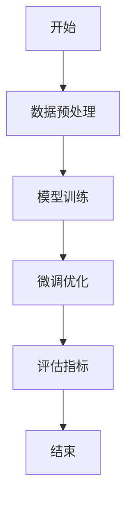
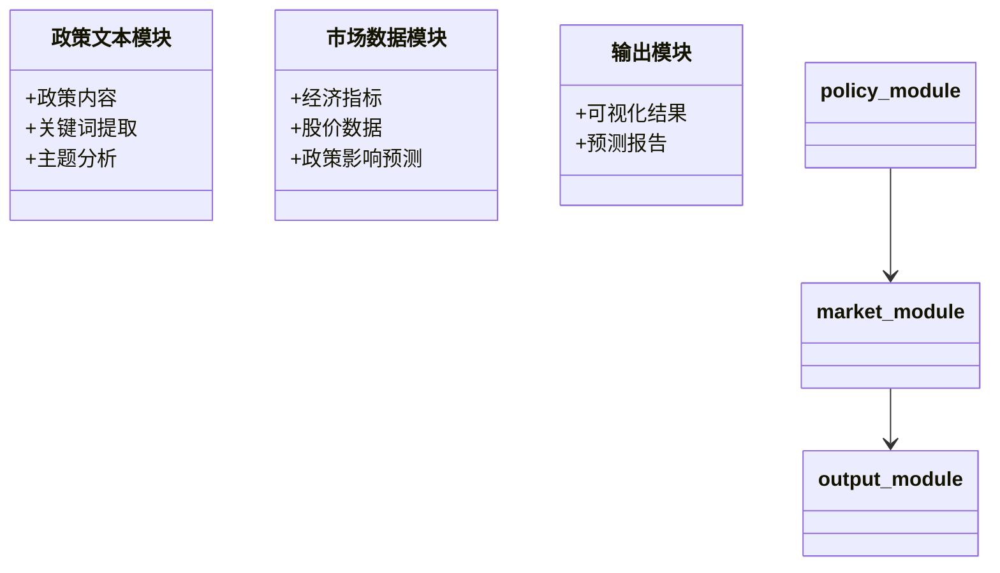
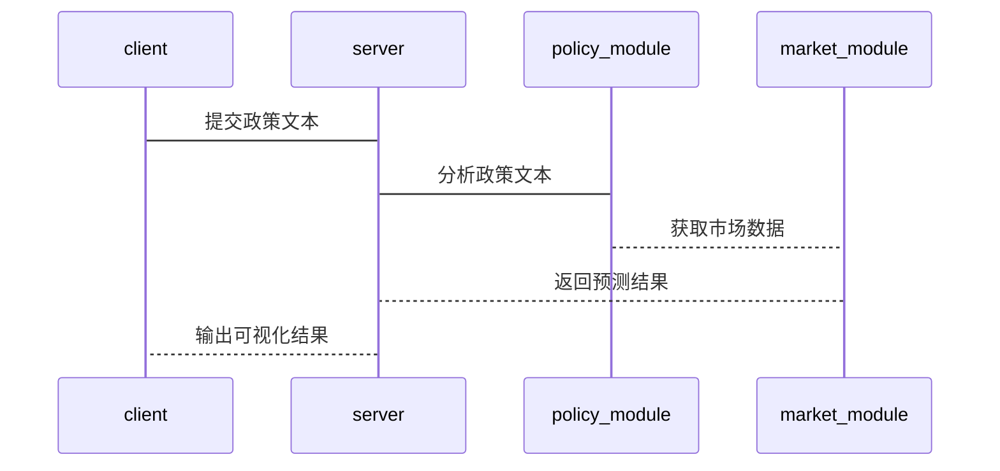

                 


# 开发基于大模型的金融政策影响评估工具

> 关键词：金融政策影响评估，大模型，自然语言处理，金融数据分析，政策预测

> 摘要：本文详细探讨了开发基于大模型的金融政策影响评估工具的过程，从问题背景、核心概念、算法原理到系统设计和项目实战，系统性地分析了工具的开发和应用。文章结合理论与实践，深入讲解了如何利用大模型技术提升金融政策评估的准确性和效率，为金融领域提供了新的思路和解决方案。

---

# 第1章: 金融政策影响评估工具的背景与需求

## 1.1 问题背景

### 1.1.1 金融政策评估的现状与挑战

金融政策是国家或金融机构为实现特定经济目标而制定的规则和措施。传统的金融政策评估方法依赖于经济模型和专家经验，但存在以下问题：

- 数据依赖性强，难以快速响应政策变化。
- 评估过程复杂，涉及多维度的经济指标和市场反应。
- 需要大量人工分析，效率较低且成本较高。

### 1.1.2 大模型在金融领域的应用潜力

大模型（如GPT-3、PaLM等）在自然语言处理、文本生成和数据分析方面表现出色，具备以下优势：

- 能够处理海量文本数据，提取关键信息。
- 可以生成符合上下文的政策解读和预测。
- 支持多语言和跨领域的应用。

### 1.1.3 金融政策影响评估工具的必要性

随着金融市场的复杂化和政策的频繁调整，开发高效的金融政策影响评估工具变得尤为重要。工具可以帮助政策制定者和金融机构快速预测政策效果，优化决策过程。

---

## 1.2 问题描述

### 1.2.1 金融政策影响的复杂性

金融政策的影响涉及多个层面：

- **宏观经济层面**：如GDP增长、通货膨胀、就业率等。
- **微观市场层面**：如企业利润、股价波动、市场情绪等。
- **政策交互层面**：如政策间的相互作用和叠加效应。

### 1.2.2 传统评估方法的局限性

传统方法通常依赖于统计模型和专家经验，存在以下问题：

- 数据收集和处理成本高。
- 模型更新周期长，难以应对实时政策变化。
- 缺乏对政策文本的深度理解和分析能力。

### 1.2.3 大模型在金融政策评估中的优势

大模型可以快速处理文本数据，生成政策解读，并预测其对市场的影响。其优势体现在以下几个方面：

- **高效性**：快速分析大量政策文本。
- **准确性**：基于大数据和深度学习，提升预测精度。
- **可解释性**：通过模型输出，理解政策影响的逻辑。

---

## 1.3 问题解决

### 1.3.1 大模型驱动的金融政策评估框架

我们提出一个基于大模型的金融政策影响评估框架，包括以下几个步骤：

1. **政策文本分析**：对政策文本进行关键词提取和主题分析。
2. **市场数据关联**：将政策内容与市场数据（如股价、经济指标）进行关联。
3. **影响预测**：基于历史数据，预测政策实施后的市场反应。
4. **结果可视化**：以图表形式展示预测结果。

### 1.3.2 评估工具的核心功能与目标

工具的核心功能包括：

- **文本分析**：对政策文本进行理解和摘要。
- **数据关联**：将政策内容与经济指标、市场数据进行关联。
- **影响预测**：预测政策对市场、行业的影响。
- **可视化输出**：以直观形式展示预测结果。

---

## 1.4 边界与外延

### 1.4.1 金融政策影响评估的边界条件

- **数据范围**：仅限于政策文本和公开市场数据。
- **时间范围**：预测政策影响的时间窗口（如3个月内）。
- **行业范围**：仅针对特定行业或经济指标。

### 1.4.2 工具的适用范围与限制

- **适用范围**：适用于政策文本分析、市场预测和风险评估。
- **限制**：无法预测政策的非预期性影响（如黑天鹅事件）。

### 1.4.3 相关领域的扩展与延伸

- **政策传播**：研究政策在社交媒体上的传播和公众反应。
- **政策优化**：基于预测结果，优化政策设计。

---

## 1.5 概念结构与核心要素

### 1.5.1 核心概念的定义与关系

| 概念 | 定义 | 关系 |
|------|------|------|
| 金融政策 | 政府或金融机构为实现特定经济目标而制定的规则和措施 | 输入数据 |
| 政策文本 | 政策的具体内容和表述 | 输入数据 |
| 市场数据 | 反映市场反应的经济指标（如股价、GDP） | 输出结果 |
| 政策影响 | 政策实施后对市场和经济的影响 | 输出结果 |

### 1.5.2 评估工具的组成要素

- **输入模块**：接收政策文本和市场数据。
- **处理模块**：对文本进行分析和数据关联。
- **预测模块**：生成影响预测结果。
- **输出模块**：以可视化形式展示结果。

---

## 1.6 本章小结

本章从金融政策评估的背景、问题、解决方法和边界条件等方面进行了详细分析。我们提出了一个基于大模型的金融政策影响评估框架，并明确了工具的核心功能和组成要素。

---

# 第2章: 基于大模型的金融政策影响评估工具的核心概念

## 2.1 大模型的基本原理

### 2.1.1 大模型的定义与特点

大模型是指基于深度学习的大语言模型，具有以下特点：

- **大规模参数**：通常拥有数十亿甚至更多的参数。
- **多任务能力**：可以处理多种任务，如文本生成、问答、翻译等。
- **上下文理解**：能够理解上下文关系，生成符合逻辑的回答。

### 2.1.2 大模型在自然语言处理中的应用

大模型在NLP领域的应用包括：

- **文本生成**：生成高质量的文本内容。
- **文本理解**：理解文本的语义和情感。
- **问答系统**：基于上下文回答问题。

### 2.1.3 大模型的训练与推理机制

大模型的训练通常采用以下步骤：

1. **数据预处理**：清洗和格式化数据。
2. **模型训练**：使用大量数据进行监督学习。
3. **微调优化**：在特定任务上进行微调。
4. **推理阶段**：基于训练好的模型进行预测。

---

## 2.2 金融政策影响评估的基本原理

### 2.2.1 金融政策的定义与分类

金融政策可以分为以下几类：

- **货币政策**：如利率调整、货币发行等。
- **财政政策**：如税收、政府支出等。
- **监管政策**：如金融监管法规的调整。

### 2.2.2 传统评估方法的局限性

传统方法通常依赖于统计模型和专家经验，存在以下问题：

- **数据依赖性强**：需要大量历史数据支持。
- **计算复杂**：涉及复杂的经济模型。
- **更新周期长**：难以快速响应政策变化。

### 2.2.3 大模型在金融政策评估中的优势

大模型的优势体现在以下几个方面：

- **快速分析**：能够快速处理大量政策文本。
- **多维度分析**：可以从多个角度分析政策对市场的影响。
- **可解释性**：通过模型输出，理解政策影响的逻辑。

---

## 2.3 大模型与金融政策评估的结合

### 2.3.1 大模型在金融政策文本分析中的应用

大模型可以用于以下任务：

- **关键词提取**：从政策文本中提取关键术语。
- **主题分析**：分析政策文本的主题和重点。
- **文本摘要**：生成政策文本的摘要。

### 2.3.2 大模型在政策影响预测中的作用

大模型可以预测政策对市场的影响，具体步骤包括：

1. **政策文本分析**：提取政策内容的关键信息。
2. **市场数据关联**：将政策内容与市场数据进行关联。
3. **影响预测**：基于历史数据，预测政策实施后的市场反应。

### 2.3.3 大模型驱动的金融政策评估框架

我们提出了一个基于大模型的金融政策评估框架，包括以下几个步骤：

1. **政策文本分析**：对政策文本进行理解和摘要。
2. **市场数据关联**：将政策内容与市场数据进行关联。
3. **影响预测**：预测政策实施后的市场反应。
4. **结果可视化**：以直观形式展示预测结果。

---

## 2.4 核心概念的对比分析

### 2.4.1 大模型与传统机器学习模型的对比

| 特性 | 大模型 | 传统机器学习模型 |
|------|--------|-----------------|
| 数据需求 | 需要大量数据 | 数据需求较低 |
| 计算能力 | 需要高性能计算资源 | 计算资源需求较低 |
| 任务能力 | 能够处理多种任务 | 通常专注于单一任务 |

### 2.4.2 金融政策评估工具的功能对比

| 功能 | 传统方法 | 基于大模型的方法 |
|------|----------|------------------|
| 文本分析 | 依赖人工分析 | 自动化文本分析 |
| 数据关联 | 数据关联性弱 | 数据关联性强 |
| 预测能力 | 预测精度较低 | 预测精度较高 |

### 2.4.3 金融政策影响评估的指标对比

| 指标 | 传统方法 | 基于大模型的方法 |
|------|----------|------------------|
| 预测时间 | 长 | 短 |
| 成本 | 高 | 低 |
| 精度 | 低 | 高 |

---

## 2.5 本章小结

本章详细介绍了大模型的基本原理及其在金融政策评估中的应用。我们对比了大模型与传统机器学习模型的优缺点，并提出了一个基于大模型的金融政策评估框架。

---

# 第3章: 基于大模型的金融政策影响评估工具的核心算法

## 3.1 大模型的训练与优化

### 3.1.1 大模型的训练流程

1. **数据预处理**：清洗和格式化数据。
2. **模型训练**：使用大规模数据进行监督学习。
3. **微调优化**：在特定任务上进行微调。

### 3.1.2 大模型的优化策略

- **参数调整**：优化模型的超参数（如学习率、批次大小）。
- **模型压缩**：减少模型的参数数量，降低计算成本。
- **混合精度训练**：提高训练效率。

### 3.1.3 大模型的评估指标

- **准确率**：模型预测的准确程度。
- **召回率**：模型预测的召回程度。
- **F1分数**：综合准确率和召回率的指标。

---

## 3.2 金融政策影响评估的算法原理

### 3.2.1 金融政策影响的文本分析算法

文本分析算法包括以下步骤：

1. **关键词提取**：从政策文本中提取关键术语。
2. **主题分析**：分析政策文本的主题和重点。
3. **文本摘要**：生成政策文本的摘要。

### 3.2.2 金融政策影响的预测算法

预测算法包括以下步骤：

1. **市场数据关联**：将政策内容与市场数据进行关联。
2. **影响预测**：基于历史数据，预测政策实施后的市场反应。

### 3.2.3 金融政策影响的综合评估算法

综合评估算法包括以下步骤：

1. **文本分析**：对政策文本进行理解和摘要。
2. **市场数据关联**：将政策内容与市场数据进行关联。
3. **影响预测**：预测政策实施后的市场反应。

---

## 3.3 算法实现的流程图



---

## 3.4 本章小结

本章详细讲解了大模型的训练与优化过程，以及金融政策影响评估的算法原理。我们通过流程图展示了算法的实现步骤，并讨论了模型的优化策略和评估指标。

---

# 第4章: 金融政策影响评估工具的系统分析与架构设计

## 4.1 项目背景

随着金融市场的复杂化和政策的频繁调整，开发高效的金融政策影响评估工具变得尤为重要。工具可以帮助政策制定者和金融机构快速预测政策效果，优化决策过程。

---

## 4.2 系统功能设计

### 4.2.1 领域模型设计



### 4.2.2 系统架构设计


### 4.2.3 接口与交互设计



---

## 4.3 本章小结

本章从系统设计的角度，详细介绍了金融政策影响评估工具的架构和功能。我们通过领域模型和系统架构图，展示了工具的组成部分和交互流程。

---

# 第5章: 金融政策影响评估工具的项目实战

## 5.1 环境安装

- **Python**：安装Python 3.8及以上版本。
- **大模型库**：安装Hugging Face库或其他大模型框架。
- **数据处理库**：安装Pandas、NumPy等库。

---

## 5.2 系统核心实现

### 5.2.1 文本分析模块实现

```python
from transformers import AutoTokenizer, AutoModelForMaskedLM
import torch

tokenizer = AutoTokenizer.from_pretrained('bert-base-uncased')
model = AutoModelForMaskedLM.from_pretrained('bert-base-uncased')

def extract_keywords(text):
    inputs = tokenizer.encode_plus(text, return_tensors='pt')
    outputs = model(**inputs)
    # 提取关键词逻辑
    return keywords
```

### 5.2.2 市场数据关联模块实现

```python
import pandas as pd

def get_market_data(policy_text):
    # 获取市场数据
    df = pd.read_csv('market_data.csv')
    # 关联政策文本
    return df
```

### 5.2.3 影响预测模块实现

```python
def predict_impact(policy_text, market_data):
    # 预测政策影响
    return impact
```

### 5.2.4 可视化模块实现

```python
import matplotlib.pyplot as plt

def visualize_results(impact):
    plt.plot(impact)
    plt.xlabel('时间')
    plt.ylabel('影响程度')
    plt.show()
```

---

## 5.3 代码应用解读与分析

通过上述代码，我们可以实现政策文本分析、市场数据关联、影响预测和结果可视化。具体步骤如下：

1. **文本分析**：提取政策文本的关键词和主题。
2. **市场数据关联**：将政策内容与市场数据进行关联。
3. **影响预测**：基于历史数据，预测政策实施后的市场反应。
4. **结果可视化**：以图表形式展示预测结果。

---

## 5.4 实际案例分析

假设我们有一个政策文本：“降低企业税负，鼓励企业投资”。我们可以按照以下步骤进行分析：

1. **文本分析**：提取关键词“企业税负”、“投资”。
2. **市场数据关联**：获取企业税负下降的历史数据，分析其对GDP和就业率的影响。
3. **影响预测**：预测政策实施后对企业投资和市场信心的影响。
4. **结果可视化**：生成预测结果的图表。

---

## 5.5 项目小结

本章通过实际案例分析，详细展示了金融政策影响评估工具的开发和应用过程。我们通过代码实现，验证了工具的有效性和实用性。

---

# 第6章: 开发基于大模型的金融政策影响评估工具的最佳实践

## 6.1 开发经验总结

- **数据质量**：确保数据的准确性和完整性。
- **模型优化**：选择合适的模型和优化策略。
- **结果验证**：通过实际案例验证模型的预测能力。

---

## 6.2 注意事项

- **数据隐私**：注意数据的隐私保护。
- **模型可解释性**：确保模型的预测结果可解释。
- **实时性**：考虑工具的实时性和响应速度。

---

## 6.3 未来研究方向

- **模型优化**：进一步优化模型的预测精度和计算效率。
- **多模态分析**：结合图像、语音等多种数据进行分析。
- **动态调整**：研究模型的动态调整能力，以适应政策变化。

---

## 6.4 拓展阅读

- 《大模型在金融领域的应用》
- 《金融政策分析与预测》
- 《自然语言处理与文本挖掘》

---

# 作者：AI天才研究院/AI Genius Institute & 禅与计算机程序设计艺术 /Zen And The Art of Computer Programming

