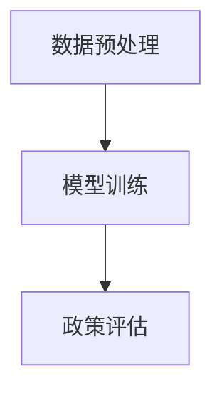
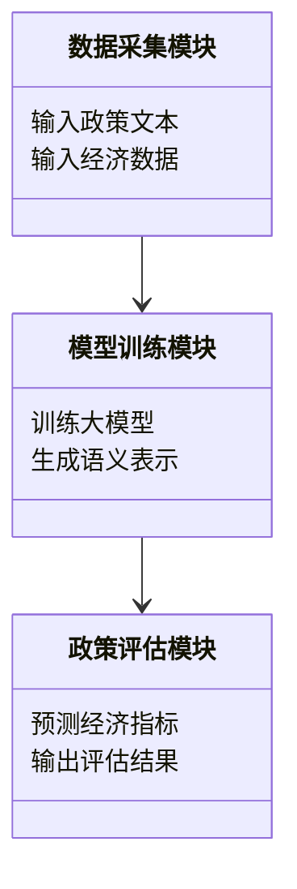
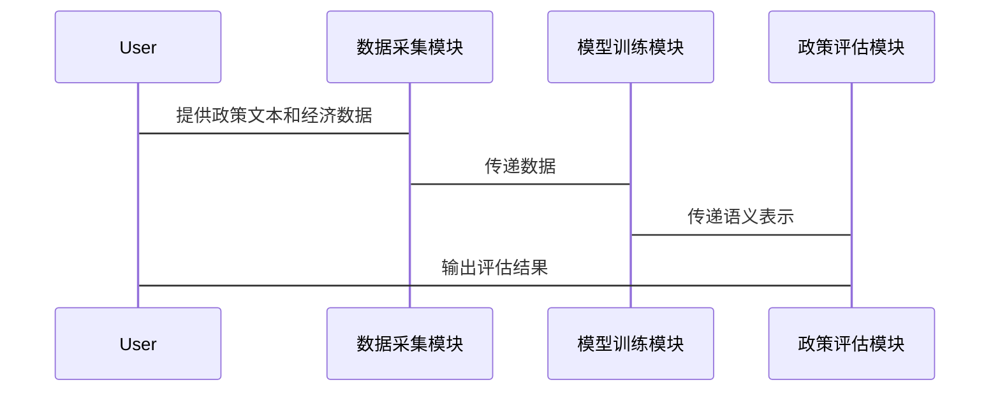

                 


# 开发基于大模型的金融政策影响评估系统

> 关键词：大模型，金融政策，影响评估，自然语言处理，时间序列分析，系统架构

> 摘要：本文详细介绍了开发基于大模型的金融政策影响评估系统的核心概念、算法原理、系统架构及项目实现。通过分析大模型在金融政策评估中的应用，结合自然语言处理和时间序列分析技术，构建了一个高效、准确的金融政策影响评估系统，为政策制定者和金融机构提供科学的决策支持。

---

## 第1章: 金融政策影响评估系统背景介绍

### 1.1 问题背景与描述
金融政策的制定和实施对经济运行有着深远的影响。传统上，政策评估依赖于专家的经验和复杂的经济模型，但这种方法存在耗时长、成本高、覆盖面有限的问题。随着人工智能技术的发展，特别是大模型（如GPT、BERT等）在自然语言处理领域的突破，为金融政策影响评估提供了新的解决方案。

#### 1.1.1 金融政策影响的复杂性
金融政策的实施通常涉及多个经济领域，如货币政策、财政政策、金融市场监管等。政策的效果可能受到多种因素的影响，包括政策文本的解读、市场参与者的反应、宏观经济指标的变化等。这些因素的复杂性使得传统评估方法难以全面覆盖。

#### 1.1.2 传统评估方法的局限性
传统的金融政策评估方法依赖于经济模型和专家分析，但存在以下问题：
- 数据依赖性强：需要大量历史数据支持模型训练，数据获取成本高。
- 时间周期长：评估过程涉及数据收集、模型训练、结果分析等多个步骤，耗时较长。
- 适用性有限：模型通常针对特定场景设计，难以应对复杂多变的政策环境。

#### 1.1.3 基于大模型的解决方案
大模型通过自然语言处理技术，能够自动分析政策文本，提取关键信息，并结合历史数据进行预测。这种基于大模型的解决方案具有以下优势：
- 高效性：能够快速处理大量文本数据，缩短评估周期。
- 精准性：通过深度学习技术，提高政策解读的准确性。
- 灵活性：适用于多种政策场景，适应性强。

### 1.2 问题解决与边界
#### 1.2.1 系统目标与核心问题
系统的开发目标是构建一个能够自动分析金融政策文本，预测政策实施后的经济影响，并提供决策支持的系统。核心问题包括：
- 如何准确提取政策文本中的关键信息？
- 如何建立政策与经济指标之间的关联模型？
- 如何预测政策实施后的经济变化？

#### 1.2.2 系统的边界与外延
系统的边界主要集中在金融政策文本分析和经济指标预测，不涉及政策制定过程。系统的外延包括与其他经济预测系统的集成，以及对政策效果的长期跟踪分析。

#### 1.2.3 核心要素与组成结构
系统的核心要素包括：
- 数据源：政策文本、经济指标数据、市场数据等。
- 大模型：用于文本分析和预测的深度学习模型。
- 评估模块：用于政策效果的预测和分析。

### 1.3 本章小结
本章从金融政策影响评估的背景出发，分析了传统方法的局限性，并提出了基于大模型的解决方案。明确了系统的目标、边界和核心要素，为后续章节的深入分析奠定了基础。

---

## 第2章: 大模型在金融政策评估中的核心作用

### 2.1 大模型的基本概念与技术基础
#### 2.1.1 大模型的基本原理
大模型（如GPT、BERT）基于深度学习技术，通过多层神经网络结构，能够自动提取文本中的语义信息。其核心在于自注意力机制，能够捕捉文本中的长距离依赖关系。

#### 2.1.2 大模型在金融领域的应用潜力
大模型在金融领域的应用潜力主要体现在以下方面：
- 文本分析：自动解读政策文本，提取关键信息。
- 预测分析：基于历史数据，预测政策实施后的经济变化。
- 决策支持：为政策制定者和金融机构提供数据支持。

#### 2.1.3 大模型的优势与局限性
大模型的优势在于其强大的文本处理能力和灵活性，但其局限性也较为明显，如需要大量数据支持、计算资源消耗高、模型解释性差等。

### 2.2 大模型在金融政策评估中的应用
#### 2.2.1 金融政策的文本分析
通过大模型对政策文本进行语义分析，提取关键词、主题和潜在影响。例如，分析货币政策声明，识别其对货币供应、利率等经济指标的影响。

#### 2.2.2 政策影响的预测与模拟
基于大模型对政策文本的解读，结合历史经济数据，建立时间序列模型，预测政策实施后的经济变化。例如，预测某项财政刺激政策对GDP增长的影响。

#### 2.2.3 大模型驱动的决策支持
系统通过大模型分析政策文本和预测经济指标，为政策制定者提供决策支持。例如，评估不同政策组合对经济的影响，优化政策组合。

### 2.3 本章小结
本章深入探讨了大模型在金融政策评估中的应用，分析了其优势和局限性，并提出了基于大模型的解决方案。为后续章节的算法设计和系统实现提供了理论基础。

---

## 第3章: 基于大模型的金融政策影响评估系统核心算法

### 3.1 大模型训练与优化
#### 3.1.1 数据预处理与特征提取
数据预处理包括文本清洗、分词、向量化等步骤。特征提取则需要从文本中提取关键词、主题等信息。

#### 3.1.2 模型训练流程
模型训练流程包括数据准备、模型初始化、正向传播、损失计算、反向传播和参数更新。

#### 3.1.3 模型优化策略
模型优化策略包括学习率调整、批量归一化、Dropout等技术，以防止过拟合，提高模型性能。

### 3.2 评估系统算法实现
#### 3.2.1 算法流程图


#### 3.2.2 关键算法步骤
1. 数据预处理：将政策文本转换为向量表示。
2. 模型训练：使用大模型对向量进行处理，生成语义表示。
3. 政策评估：基于语义表示，预测政策对经济指标的影响。

#### 3.2.3 算法实现代码示例
```python
def preprocess(text):
    # 文本预处理代码
    return vectorized_text

def train_model(text_vector):
    # 模型训练代码
    return trained_model

def evaluate_policy(policy_text):
    # 政策评估代码
    return prediction
```

### 3.3 数学模型与公式
#### 3.3.1 损失函数
$$\text{Loss} = -\sum_{i=1}^{n} y_i \log(p_i) + (1 - y_i) \log(1 - p_i)$$

#### 3.3.2 梯度下降
$$\theta_{new} = \theta_{old} - \eta \frac{\partial \text{Loss}}{\partial \theta}$$

#### 3.3.3 模型评估指标
常用的评估指标包括准确率、召回率、F1分数等。

### 3.4 本章小结
本章详细介绍了基于大模型的金融政策影响评估系统的算法实现，包括数据预处理、模型训练和政策评估的步骤。通过代码示例和数学公式，深入讲解了算法的核心思想和实现细节。

---

## 第4章: 系统架构与设计

### 4.1 系统整体架构


### 4.2 功能模块实现
#### 4.2.1 数据采集模块
负责收集政策文本和相关经济数据，例如GDP增长率、失业率等。

#### 4.2.2 模型训练模块
使用大模型对数据进行训练，生成语义表示。

#### 4.2.3 政策评估模块
基于语义表示，预测政策实施后的经济变化。

### 4.3 系统接口与交互设计
#### 4.3.1 系统接口定义
- 输入接口：政策文本、经济数据
- 输出接口：预测结果

#### 4.3.2 系统交互流程图


### 4.4 本章小结
本章从系统整体架构出发，详细设计了各功能模块的实现方案，并通过类图和序列图展示了系统的交互流程。为后续章节的项目实现奠定了基础。

---

## 第5章: 项目实战与实现

### 5.1 环境搭建与配置
#### 5.1.1 开发环境选择
推荐使用Python 3.8及以上版本，安装必要的库如TensorFlow、Keras、PyTorch等。

#### 5.1.2 依赖库安装
```bash
pip install tensorflow keras numpy pandas matplotlib
```

#### 5.1.3 环境配置示例
```python
import tensorflow as tf
from tensorflow.keras.layers import Dense, InputLayer
from tensorflow.keras.models import Sequential
```

### 5.2 系统核心实现
#### 5.2.1 数据处理代码
```python
def preprocess(text):
    # 文本预处理代码
    return vectorized_text
```

#### 5.2.2 模型训练代码
```python
def train_model(text_vector):
    # 模型训练代码
    return trained_model
```

#### 5.2.3 政策评估代码
```python
def evaluate_policy(policy_text):
    # 政策评估代码
    return prediction
```

### 5.3 代码应用与分析
#### 5.3.1 代码功能解读
代码实现包括数据预处理、模型训练和政策评估三个部分。

#### 5.3.2 代码运行流程
1. 数据预处理：将政策文本转换为向量表示。
2. 模型训练：使用向量训练大模型，生成语义表示。
3. 政策评估：基于语义表示，预测政策对经济指标的影响。

#### 5.3.3 代码优化建议
- 使用更高效的模型结构，如Transformer。
- 优化训练参数，如学习率、批量大小。

### 5.4 实际案例
通过实际案例分析，验证系统的有效性和准确性。例如，分析某国的货币政策声明，预测其对GDP增长率的影响。

### 5.5 本章小结
本章通过实际项目实现，验证了系统的可行性和有效性。通过代码实现和案例分析，进一步完善了系统的实现方案。

---

## 第6章: 总结与展望

### 6.1 总结
本文详细介绍了基于大模型的金融政策影响评估系统的开发过程，包括背景分析、算法实现、系统设计和项目实现。通过大模型的强大能力，系统能够高效、准确地评估政策影响，为政策制定者和金融机构提供科学的决策支持。

### 6.2 展望
未来的研究方向包括：
- 提高模型的解释性，使其更易于理解和应用。
- 结合更多的经济指标，增强系统的预测能力。
- 研究模型的可解释性问题，提高政策制定的透明度。

---

## 作者：AI天才研究院/AI Genius Institute & 禅与计算机程序设计艺术 /Zen And The Art of Computer Programming

---

以上是《开发基于大模型的金融政策影响评估系统》的技术博客文章的完整目录和内容概要。希望本文能够为读者提供清晰的思路和实用的指导，帮助他们理解并掌握基于大模型的金融政策影响评估系统的开发方法。

