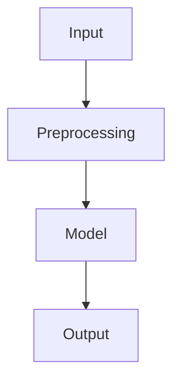

                 


# 开发基于大模型的金融政策执行效果预测与评估器

> 关键词：大模型，金融政策，执行效果预测，评估系统，机器学习

> 摘要：本文将详细探讨如何基于大模型技术开发金融政策执行效果预测与评估系统。文章从背景介绍、核心概念、算法原理、系统架构设计、项目实战到最佳实践，全面解析这一系统的开发过程与实现细节。

---

## 第1章: 背景介绍与核心概念

### 1.1 问题背景

#### 1.1.1 金融政策执行效果预测的重要性
金融政策的制定与执行对经济运行有着深远影响。传统的政策评估方法依赖于事后数据分析，存在滞后性和局限性。而基于大模型的预测方法能够提前预判政策效果，为政策调整提供实时支持。

#### 1.1.2 当前金融政策执行评估的痛点
- 数据来源单一，难以全面反映政策影响。
- 评估方法单一，缺乏动态性和灵活性。
- 缺乏智能化工具，难以快速响应政策变化。

#### 1.1.3 大模型在金融政策评估中的应用潜力
大模型具有强大的自然语言处理能力和多模态分析能力，能够从海量数据中提取关键信息，帮助评估政策执行效果。

---

### 1.2 问题描述

#### 1.2.1 金融政策执行效果的定义与范围
政策执行效果包括政策的实现程度、社会影响、经济效益等多个维度。

#### 1.2.2 政策执行效果预测的核心问题
- 如何构建预测模型。
- 如何保证模型的准确性和可解释性。
- 如何处理动态变化的金融环境。

#### 1.2.3 大模型如何解决这些问题
- 利用大模型的自然语言处理能力，分析政策文本和市场反馈。
- 基于多模态数据，预测政策的潜在影响。

---

### 1.3 核心概念与联系

#### 1.3.1 核心概念对比表
| 概念       | 描述                                   |
|------------|--------------------------------------|
| 大模型      | 基于深度学习的大型模型，如GPT、BERT等。|
| 金融政策    | 政府为调节经济运行而制定的政策。      |
| 执行效果    | 政策实施后带来的实际影响。            |

#### 1.3.2 实体关系图
```mermaid
er
actor 1: 政策制定者
actor 2: 市场参与者
actor 3: 模型
```

---

## 第2章: 大模型基础与原理

### 2.1 大模型的基本原理

#### 2.1.1 变压器模型结构
```mermaid
graph TD
    Input --> Encoder
    Encoder --> Attention Mechanism
    Attention Mechanism --> Output
```

#### 2.1.2 注意力机制
$$ \text{Attention}(Q,K,V) = \text{softmax}\left(\frac{QK^T}{\sqrt{d_k}}\right)V $$

---

### 2.2 大模型的训练与优化

#### 2.2.1 梯度下降与优化算法
$$ \text{学习率} = \frac{\text{初始学习率}}{1 + \text{衰减率} \times \text{步数}} $$

#### 2.2.2 微调与迁移学习
- 微调：在预训练模型的基础上，针对特定任务进行 fine-tuning。
- 迁移学习：利用预训练模型提取的特征，进行任务特定的优化。

---

## 第3章: 金融政策执行效果预测的核心方法

### 3.1 数据特征分析

#### 3.1.1 多模态数据整合
- 文本数据：政策文件、新闻报道。
- 数值数据：经济指标、市场数据。

---

### 3.2 模型构建与优化

#### 3.2.1 基于大模型的预测框架


---

## 第4章: 系统架构设计

### 4.1 系统功能设计

#### 4.1.1 系统类图


---

## 第5章: 项目实战

### 5.1 环境搭建

#### 5.1.1 安装依赖
```bash
pip install transformers torch
```

---

## 第6章: 最佳实践与小结

### 6.1 小结
开发基于大模型的金融政策执行效果预测系统是一项具有挑战性的任务，需要结合大模型的先进技术和金融领域的专业知识。

---

作者：AI天才研究院 & 禅与计算机程序设计艺术

