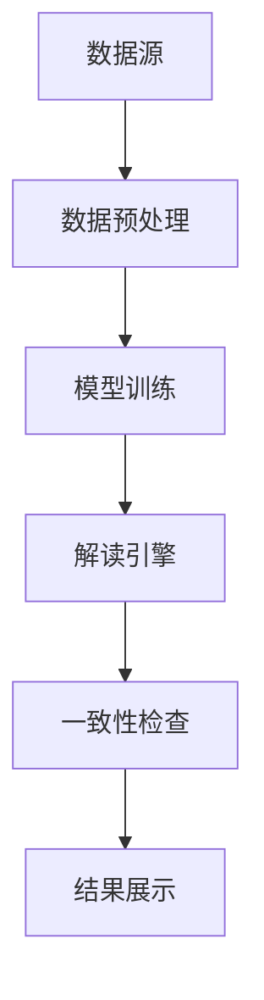

                 


# 开发基于大模型的金融政策解读一致性检查器

> 关键词：大模型、NLP、金融政策、一致性检查、算法实现

> 摘要：本文详细探讨了开发基于大模型的金融政策解读一致性检查器的全过程。从问题背景与需求分析，到核心算法与实现，再到系统架构设计与项目实战，全面阐述了如何利用大模型技术解决金融政策解读中的一致性问题。通过本文，读者可以掌握从理论到实践的完整技术路径，深入了解该领域的前沿技术与应用方法。

---

# 第一部分: 金融政策解读一致性检查器的背景与需求

## 第1章: 问题背景与需求分析

### 1.1 问题背景介绍

#### 1.1.1 金融政策解读的重要性

金融政策是国家或组织在金融领域制定的法规、指引和策略，其解读的准确性和一致性直接影响金融市场的稳定性和经济主体的决策。金融政策解读需要考虑政策的多层含义、上下文以及相关法规的关联性，因此其解读过程复杂且容易出现偏差。

#### 1.1.2 现有金融政策解读的挑战

传统的金融政策解读主要依赖人工分析，存在以下问题：

- **主观性**：不同解读者对同一政策的理解可能不同，导致结果不一致。
- **效率低**：人工解读耗时长，难以应对海量政策文本。
- **准确性受限**：解读者可能缺乏专业知识或经验，导致错误率较高。

#### 1.1.3 基于大模型的解决方案优势

大模型（如GPT-3、GPT-4等）在自然语言处理（NLP）领域表现出色，具有以下优势：

- **自动化与高效性**：大模型可以快速处理大量文本，显著提高解读效率。
- **一致性保证**：通过模型的训练和优化，可以确保解读结果的前后一致性和规范性。
- **深度理解**：大模型能够捕捉文本中的上下文信息，提供更准确的解读。

### 1.2 问题描述与目标

#### 1.2.1 金融政策解读一致性问题的具体表现

- **同一政策在不同解读中的差异**：不同解读者对同一政策的理解可能不同。
- **政策更新与解读滞后**：政策更新频繁，人工解读难以及时更新。
- **跨领域政策的复杂性**：金融政策往往涉及多个领域，解读难度大。

#### 1.2.2 项目目标与核心需求

- **目标**：开发一个基于大模型的金融政策解读一致性检查器，确保政策解读的准确性和一致性。
- **核心需求**：
  - 实时解读与检查能力。
  - 高精度的解读结果。
  - 跨领域政策的适应性。

#### 1.2.3 边界与外延界定

- **边界**：仅关注金融政策的解读一致性检查，不涉及政策制定或修改。
- **外延**：可以扩展到其他领域的政策解读一致性检查。

---

## 第2章: 核心概念与理论基础

### 2.1 大模型在金融领域的应用

#### 2.1.1 大模型的定义与特点

大模型是一种基于深度学习的自然语言处理模型，具有以下特点：

- **大规模参数**：通常包含数十亿甚至更多的参数。
- **预训练与微调**：通过大规模数据预训练，再针对特定任务进行微调。
- **上下文理解能力强**：能够捕捉文本中的上下文信息，生成连贯的文本。

#### 2.1.2 大模型在金融分析中的优势

- **自然语言理解**：能够准确理解金融领域的专业术语和复杂句式。
- **生成能力**：可以生成符合要求的政策解读文本。
- **一致性保证**：通过模型训练，可以确保解读结果的一致性。

#### 2.1.3 大模型的训练与优化

- **预训练**：使用通用大规模数据进行训练，如维基百科、书籍等。
- **微调**：在特定金融政策数据上进行微调，提升模型在金融领域的表现。
- **优化方法**：使用Adam优化器，学习率衰减等技术优化模型性能。

### 2.2 自然语言处理与金融政策解读

#### 2.2.1 NLP技术的基本原理

NLP技术包括文本处理、特征提取、模型训练等步骤，旨在让计算机理解人类语言。

#### 2.2.2 金融政策文本的特征分析

- **专业术语**：金融政策文本中包含大量专业术语，如“货币政策”、“财政政策”等。
- **复杂句式**：政策文本通常包含长句和复杂句式。
- **多领域关联**：金融政策往往涉及经济、法律等多个领域。

#### 2.2.3 基于NLP的政策解读方法

- **文本分割**：将政策文本分割成句子或段落。
- **特征提取**：提取文本中的关键词和主题。
- **模型训练**：使用NLP模型进行解读和分类。

### 2.3 一致性检查的理论基础

#### 2.3.1 一致性检查的定义与分类

一致性检查是指对同一文本在不同解读中的结果进行比较，确保其一致性和准确性。常见的分类包括：

- **内容一致性**：解读内容是否一致。
- **格式一致性**：解读结果是否符合规定的格式。
- **逻辑一致性**：解读结果是否符合逻辑。

#### 2.3.2 金融政策解读一致性的影响因素

- **政策文本的复杂性**：政策文本越复杂，解读一致性越难保证。
- **解读者的知识水平**：解读者的能力影响解读结果。
- **解读工具的性能**：解读工具的准确性和效率直接影响一致性。

#### 2.3.3 一致性检查的数学模型概述

一致性检查可以通过数学模型来量化解读结果的一致性。常见的数学模型包括：

- **余弦相似度**：用于衡量两个向量之间的相似性。
- **Jaccard相似度**：用于衡量两个集合之间的相似性。
- **概率模型**：基于概率论进行一致性评估。

---

# 第二部分: 一致性检查器的核心算法与实现

## 第3章: 大模型驱动的金融政策解读算法

### 3.1 大模型在政策解读中的应用流程

#### 3.1.1 文本预处理与特征提取

文本预处理包括分词、去除停用词等步骤，特征提取则通过词袋模型或词嵌入技术完成。

#### 3.1.2 大模型的编码与解码机制

大模型通过编码器-解码器结构进行文本处理，编码器将输入文本转换为向量表示，解码器根据向量生成输出文本。

#### 3.1.3 政策解读结果的生成与优化

通过大模型生成政策解读结果，并通过微调优化模型性能。

### 3.2 一致性检查的算法原理

#### 3.2.1 一致性检查的数学模型

一致性检查可以通过计算两个解读结果之间的相似度来实现。常用的相似度计算方法包括余弦相似度和Jaccard相似度。

#### 3.2.2 基于向量空间的一致性度量

将政策解读结果表示为向量，计算向量之间的距离或相似度，判断一致性。

#### 3.2.3 基于概率论的一致性评估

通过概率模型计算解读结果的条件概率，评估其一致性。

### 3.3 算法实现的详细步骤

#### 3.3.1 数据预处理与向量化

使用NLP工具对政策文本进行预处理，并将其转换为向量表示。

#### 3.3.2 模型训练与优化

在金融政策数据上训练大模型，并通过微调优化其性能。

#### 3.3.3 结果评估与反馈机制

通过相似度计算评估解读结果的一致性，并根据反馈优化模型。

---

## 第4章: 一致性检查器的系统架构设计

### 4.1 系统功能模块划分

- **数据采集模块**：采集金融政策文本。
- **解读引擎模块**：利用大模型进行政策解读。
- **一致性检查模块**：对解读结果进行一致性检查。
- **结果展示模块**：展示解读结果和一致性评估报告。

### 4.2 系统架构图



### 4.3 系统接口设计

- **数据接口规范**：定义数据输入格式和标准。
- **模型调用接口**：定义模型调用的API。
- **结果输出接口**：定义输出结果的格式和标准。

---

## 第5章: 项目实战与代码实现

### 5.1 环境搭建与依赖安装

- **开发环境选择**：建议使用Python 3.8及以上版本。
- **依赖库安装**：安装必要的NLP库，如TensorFlow、PyTorch、transformers等。

### 5.2 核心代码实现

#### 5.2.1 数据预处理代码

```python
import pandas as pd
from transformers import AutoTokenizer, AutoModelForMaskedLM

def preprocess_data(data):
    # 分词处理
    tokenizer = AutoTokenizer.from_pretrained('bert-base-uncased')
    inputs = tokenizer(data['text'], return_tensors='np', padding=True, truncation=True)
    return inputs
```

#### 5.2.2 模型训练代码

```python
from transformers import TrainingArguments, Trainer

def train_model(train_data):
    model = AutoModelForMaskedLM.from_pretrained('bert-base-uncased')
    args = TrainingArguments(...)
    trainer = Trainer(model=model, args=args, train_dataset=train_data)
    trainer.train()
    return model
```

#### 5.2.3 解读与检查代码

```python
def interpret_policy(policy_text, model):
    inputs = tokenizer(policy_text, return_tensors='pt', padding=True, truncation=True)
    outputs = model.generate(inputs.input_ids)
    return outputs
```

### 5.3 实际案例分析

通过实际案例分析，展示一致性检查器在金融政策解读中的应用效果，并讨论可能的优化方向。

---

## 第6章: 总结与展望

### 6.1 总结

本文详细介绍了开发基于大模型的金融政策解读一致性检查器的全过程，从问题背景到系统实现，为读者提供了全面的技术指导。

### 6.2 最佳实践 tips

- 在实际应用中，建议结合具体业务需求，进一步优化模型和系统架构。
- 定期更新模型和数据，保持系统的准确性和高效性。

### 6.3 注意事项

- 在模型训练和应用过程中，需注意数据隐私和合规性问题。
- 系统上线前，建议进行充分的测试和验证。

### 6.4 拓展阅读

建议读者进一步阅读相关领域的最新研究论文和技术报告，深入了解大模型在金融领域的其他应用。

---

# 作者：AI天才研究院/AI Genius Institute & 禅与计算机程序设计艺术 /Zen And The Art of Computer Programming

