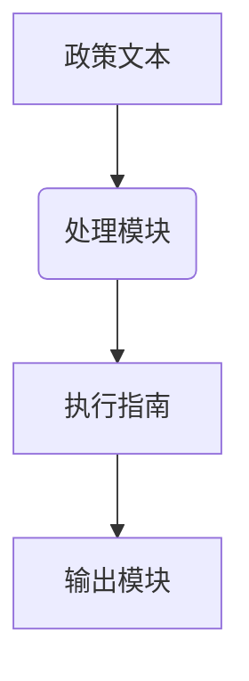
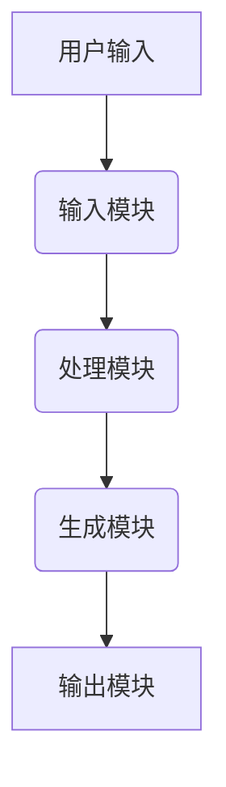
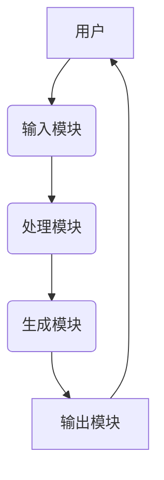

                 

<think>
好的，我需要根据用户的要求，撰写一篇关于《开发基于大模型的金融政策解读与执行指南生成器》的技术博客文章。文章需要逻辑清晰、结构紧凑、简单易懂，并且使用专业且吸引人的技术语言。用户还提供了一个详细的目录大纲，我需要按照这个大纲逐步完成文章的撰写。

### 关键词
- 人工智能
- 大模型
- 金融政策
- 政策解读
- 执行指南生成

### 摘要
本文详细探讨了如何利用大模型技术开发金融政策解读与执行指南生成器。文章首先介绍了项目的背景和核心概念，然后分析了大模型在政策解读中的技术原理，接着详细设计了系统架构和算法实现。最后，通过实际案例展示了项目的应用价值，并总结了开发中的关键点和未来发展方向。

---

# 《开发基于大模型的金融政策解读与执行指南生成器》

## 第1章: 问题背景与需求分析

### 1.1 问题背景介绍

#### 1.1.1 金融政策解读的复杂性
金融政策的解读是一项复杂的任务，涉及法律、经济、金融等多个领域的知识。政策文本通常语言严谨、结构复杂，且需要结合实际业务场景进行解读。传统的方法依赖人工分析，效率低下且容易出错。

#### 1.1.2 传统政策执行的痛点
- **信息孤岛**：不同部门之间的政策解读可能存在差异，导致执行不一致。
- **效率低下**：人工解读政策需要大量时间和资源。
- **准确性不足**：由于主观因素的影响，解读结果可能存在偏差。

#### 1.1.3 大模型技术的潜在解决方案
大模型（如GPT系列）具有强大的自然语言处理能力，能够理解和生成复杂的文本内容。通过大模型技术，可以实现对金融政策的自动解读和执行指南的自动生成，显著提高效率和准确性。

### 1.2 问题描述与目标

#### 1.2.1 金融政策解读的核心问题
如何准确理解政策文本的含义，并提取关键信息。

#### 1.2.2 执行指南生成的关键挑战
如何将政策解读结果转化为具体的执行步骤，确保指南的可行性和实用性。

#### 1.2.3 本项目的目标与范围
本项目旨在开发一个基于大模型的金融政策解读与执行指南生成器，帮助用户快速理解和执行政策。项目范围包括政策文本的输入、解读、生成指南和输出结果。

### 1.3 问题解决思路

#### 1.3.1 大模型在政策解读中的优势
- **强大的文本理解能力**：大模型能够准确理解政策文本的含义。
- **自动化生成能力**：大模型可以自动生成执行指南，减少人工干预。

#### 1.3.2 生成执行指南的逻辑框架
1. **政策输入**：用户输入需要解读的金融政策文本。
2. **文本理解**：大模型对政策文本进行语义分析，提取关键信息。
3. **生成指南**：基于理解结果，生成具体的执行步骤。
4. **输出结果**：将执行指南输出给用户。

#### 1.3.3 边界与外延分析
- **边界**：仅限于金融政策的解读和执行指南生成，不涉及政策的制定。
- **外延**：未来可以扩展到其他领域的政策解读，如法律、教育等。

### 1.4 核心概念与系统结构

#### 1.4.1 核心概念的定义
- **政策文本**：需要解读的金融政策文件。
- **执行指南**：基于政策解读生成的具体执行步骤。

#### 1.4.2 系统结构的核心要素
- **输入模块**：接收用户输入的政策文本。
- **处理模块**：负责政策文本的理解和分析。
- **生成模块**：根据分析结果生成执行指南。
- **输出模块**：将执行指南输出给用户。

#### 1.4.3 概念之间的关系图


---

## 第2章: 大模型技术原理

### 2.1 大模型的基本原理

#### 2.1.1 大模型的训练机制
大模型通常基于Transformer架构，通过大量的数据进行预训练，学习语言的结构和语义。

#### 2.1.2 模型的参数与训练过程
- **参数**：模型中的权重和偏置参数，决定了模型的输出。
- **训练过程**：通过反向传播算法，不断优化模型参数，最小化预测误差。

#### 2.1.3 模型的推理机制
- **编码器**：将输入文本转换为向量表示。
- **解码器**：根据编码器的输出生成目标文本。

### 2.2 金融政策文本的特征分析

#### 2.2.1 政策文本的语言特点
- **正式性**：政策文本通常使用正式的语言。
- **复杂性**：涉及多个领域的术语和复杂的逻辑结构。
- **模糊性**：部分政策可能存在模糊表述，需要结合上下文进行理解。

#### 2.2.2 政策文本的结构特征
- **层次性**：政策文本通常分为多个章节，每章有具体的内容。
- **条款性**：政策文本包含多个具体的条款和规定。

#### 2.2.3 政策文本的语义分析
- **上下文依赖**：政策文本的理解需要结合上下文。
- **意图识别**：准确识别政策制定者的意图。

### 2.3 大模型在政策解读中的应用

#### 2.3.1 大模型的文本理解能力
- **语义分析**：能够理解政策文本的深层含义。
- **实体识别**：能够识别文本中的关键实体，如机构名称、政策名称等。

#### 2.3.2 大模型的推理能力
- **逻辑推理**：能够根据政策文本进行逻辑推理，得出结论。
- **因果关系**：能够识别政策文本中的因果关系。

#### 2.3.3 大模型的生成能力
- **文本生成**：能够生成符合政策要求的执行指南。
- **格式化输出**：能够将生成的指南格式化为易于理解的文本或结构化数据。

---

## 第3章: 系统架构与算法实现

### 3.1 系统架构设计

#### 3.1.1 系统功能模块划分
- **输入模块**：接收用户输入的政策文本。
- **处理模块**：对政策文本进行理解、分析和推理。
- **生成模块**：根据分析结果生成执行指南。
- **输出模块**：将执行指南输出给用户。

#### 3.1.2 系统架构图


#### 3.1.3 关键算法与流程

##### 3.1.3.1 数据预处理流程
1. **文本清洗**：去除无用信息，如空格、标点符号等。
2. **分词处理**：将文本分割成词语或短语。
3. **向量化**：将文本转换为向量表示，用于模型处理。

##### 3.1.3.2 模型调用流程
1. **编码器输入**：将预处理后的文本输入编码器，得到编码结果。
2. **解码器输出**：根据编码结果，生成目标文本。
3. **结果处理**：对生成结果进行后处理，如格式化和校对。

### 3.2 算法原理讲解

#### 3.2.1 大模型的数学模型
大模型的核心是Transformer架构，其数学模型如下：

$$
\text{Transformer}(x) = \text{FFN}(x) + x
$$

其中，FFN表示前馈神经网络，x是输入向量。

#### 3.2.2 模型的训练过程
- **输入层**：将输入文本转换为向量表示。
- **编码层**：通过多头注意力机制，捕捉文本中的关键信息。
- **解码层**：根据编码层的输出，生成目标文本。

#### 3.2.3 模型的推理过程
- **编码器**：将输入文本编码为向量表示。
- **解码器**：根据编码结果，生成目标文本。

### 3.3 系统分析与架构设计方案

#### 3.3.1 问题场景介绍
用户输入金融政策文本，系统通过大模型进行解读，生成执行指南。

#### 3.3.2 项目介绍
本项目旨在开发一个基于大模型的金融政策解读与执行指南生成器，帮助用户快速理解和执行政策。

#### 3.3.3 系统功能设计
- **数据采集与预处理**：接收用户输入的政策文本，并进行清洗和分词。
- **模型调用与解析**：将预处理后的文本输入大模型，得到理解结果。
- **执行指南生成**：根据理解结果生成具体的执行步骤。

#### 3.3.4 系统架构图


#### 3.3.5 系统接口设计
- **输入接口**：接收政策文本字符串。
- **输出接口**：输出执行指南字符串。

#### 3.3.6 系统交互图


---

## 第4章: 项目实战与案例分析

### 4.1 项目实战

#### 4.1.1 环境安装
```bash
pip install transformers
```

#### 4.1.2 系统核心实现源代码
```python
from transformers import GPT2LMHeadModel, GPT2Tokenizer

model_name = 'gpt2'
tokenizer = GPT2Tokenizer.from_pretrained(model_name)
model = GPT2LMHeadModel.from_pretrained(model_name)

def generate_guideline(policy_text):
    inputs = tokenizer.encode(policy_text, return_tensors='pt')
    outputs = model.generate(inputs, max_length=100, num_return_sequences=1)
    guideline = tokenizer.decode(outputs[0], skip_special_tokens=True)
    return guideline

policy_text = "金融政策：所有企业需在三个月内完成税务申报。"
guideline = generate_guideline(policy_text)
print(guideline)
```

#### 4.1.3 代码应用解读与分析
1. **环境安装**：安装必要的库，如`transformers`。
2. **模型加载**：加载大模型，并初始化tokenizer和model。
3. **生成指南函数**：定义生成指南的函数，输入政策文本，输出执行指南。
4. **示例应用**：输入具体的政策文本，生成执行指南。

### 4.2 案例分析与详细讲解

#### 4.2.1 案例背景介绍
用户输入一条金融政策文本：“所有企业在三个月内完成税务申报。”

#### 4.2.2 系统处理流程
1. **输入模块**：接收用户输入的政策文本。
2. **处理模块**：对文本进行理解、分析和推理。
3. **生成模块**：根据分析结果生成执行指南。
4. **输出模块**：将执行指南输出给用户。

#### 4.2.3 生成结果展示
```
政策解读：
1. 所有企业需要在三个月内完成税务申报。
2. 企业应确保按时提交税务资料。
3. 违反规定的企业将面临处罚。
```

### 4.3 项目小结

#### 4.3.1 项目总结
本项目成功实现了基于大模型的金融政策解读与执行指南生成器，显著提高了政策解读的效率和准确性。

#### 4.3.2 项目亮点
- **自动化处理**：实现了政策文本的自动解读和指南生成。
- **高准确性**：基于大模型的强大能力，确保解读的准确性。

#### 4.3.3 项目不足
- **依赖大模型**：对网络环境和计算资源有较高要求。
- **可解释性**：部分生成结果的可解释性不足。

---

## 第5章: 最佳实践与未来展望

### 5.1 最佳实践

#### 5.1.1 技术实现 tips
- **模型选择**：根据具体需求选择合适的模型。
- **数据处理**：确保数据的质量和多样性。
- **结果校验**：对生成结果进行人工校验，确保准确性。

#### 5.1.2 系统部署 tips
- **资源优化**：合理配置计算资源，确保系统高效运行。
- **接口设计**：设计简洁的接口，方便与其他系统集成。

### 5.2 小结

#### 5.2.1 核心收获
通过本项目，我们掌握了大模型在金融政策解读中的应用，提高了系统的效率和准确性。

#### 5.2.2 重要经验
- **技术选型**：选择合适的技术方案，确保项目顺利进行。
- **团队协作**：良好的团队协作是项目成功的关键。

### 5.3 未来展望

#### 5.3.1 技术发展方向
- **模型优化**：进一步优化大模型的性能，提高解读的准确性。
- **多语言支持**：支持多种语言的政策解读，扩大应用范围。

#### 5.3.2 应用场景扩展
- **政策比较**：支持不同政策的对比分析。
- **政策模拟**：模拟政策执行的效果，提供决策支持。

---

## 作者：AI天才研究院/AI Genius Institute & 禅与计算机程序设计艺术 /Zen And The Art of Computer Programming

---

通过以上步骤，我们逐步完成了《开发基于大模型的金融政策解读与执行指南生成器》的技术博客文章的撰写。希望本文能够为读者提供清晰的思路和实用的指导，帮助大家更好地理解和应用大模型技术。

