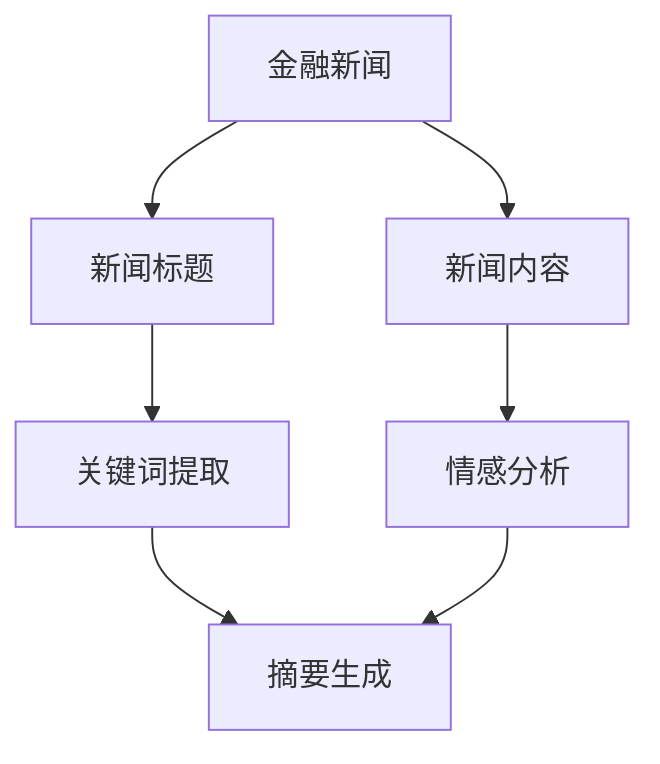
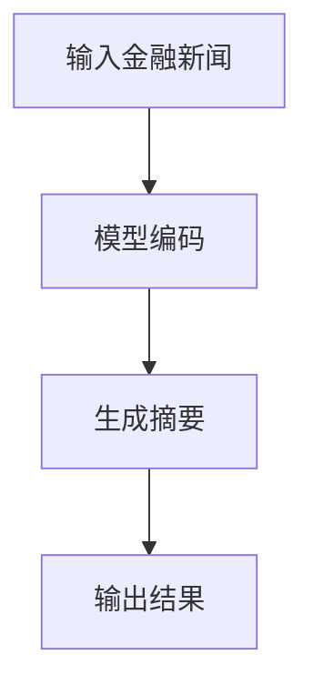
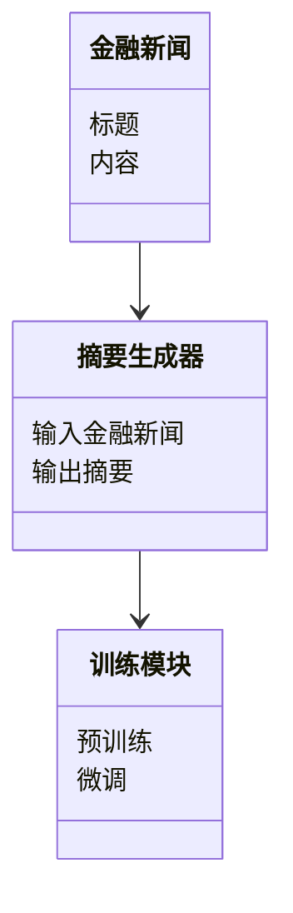
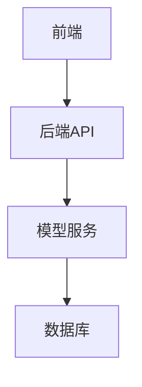
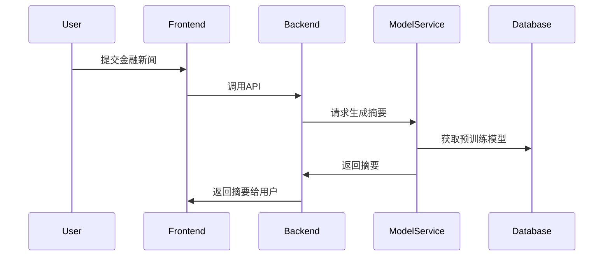

                 


# 开发基于大模型的金融新闻摘要生成器

## 关键词：金融新闻、大模型、文本摘要、自然语言处理、机器学习

## 摘要：本文详细探讨了开发基于大模型的金融新闻摘要生成器的全过程，涵盖背景、技术原理、系统设计、项目实现及优化建议。通过分析金融新闻的特点和挑战，结合大模型的优势，提出了一套高效可靠的解决方案，并通过实际案例验证了其可行性和效果。

---

# 第1章: 背景介绍

## 1.1 问题背景

### 1.1.1 金融新闻的特点与挑战
金融新闻通常涉及复杂的金融术语、市场动态和多变的经济指标。其特点是信息量大、专业性强且时效性高。然而，金融机构和投资者每天需要处理海量的新闻信息，如何快速获取关键信息成为一大挑战。

### 1.1.2 自动化新闻摘要的必要性
传统的新闻摘要方法依赖于人工编辑，效率低下且成本高昂。自动化摘要可以显著提高信息处理效率，帮助用户快速抓住重点。

### 1.1.3 大模型在新闻摘要中的优势
大模型（如GPT-3、BERT）具备强大的语言理解和生成能力，能够捕捉新闻中的关键信息，生成准确且流畅的摘要。

## 1.2 问题描述

### 1.2.1 金融新闻摘要生成的目标
目标是通过技术手段，自动提取金融新闻的核心内容，生成简洁明了的摘要。

### 1.2.2 现有方法的局限性
传统基于规则的摘要方法难以应对复杂语义和多变的金融信息。传统机器学习模型在处理大规模数据时表现不佳。

### 1.2.3 基于大模型的解决方案
利用大模型的自然语言处理能力，实现金融新闻的高效摘要。

## 1.3 问题解决

### 1.3.1 大模型在文本生成中的应用
大模型可以生成高质量的文本，适用于新闻摘要、翻译等多种任务。

### 1.3.2 金融领域文本处理的特殊性
金融领域文本具有专业性和技术性，需要模型具备特定领域的知识和理解能力。

### 1.3.3 基于大模型的金融新闻摘要生成方案
结合大模型的文本生成能力和领域知识，构建高效的金融新闻摘要系统。

## 1.4 边界与外延

### 1.4.1 金融新闻摘要生成的边界
限定于新闻文本的处理，不包括图片、视频等其他媒体形式。

### 1.4.2 相关领域的外延
与自然语言处理、机器学习、金融数据分析等领域密切相关。

### 1.4.3 与其他任务的区分
与新闻分类、情感分析等任务的区别在于，摘要生成需要提取关键信息，而不是分类或判断情感。

## 1.5 概念结构与核心要素

### 1.5.1 核心概念的组成
- 金融新闻：输入数据
- 大模型：处理工具
- 摘要：输出结果

### 1.5.2 概念之间的关系
金融新闻通过大模型生成摘要，摘要反映了新闻的核心内容。

### 1.5.3 案例分析
以一篇关于股市波动的新闻为例，生成相应的摘要。

---

# 第2章: 核心概念与联系

## 2.1 AI大模型的原理

### 2.1.1 大模型的基本原理
大模型通过大量数据预训练，学习语言的结构和语义，具备强大的文本生成能力。

### 2.1.2 大模型的训练过程
包括预训练和微调阶段，预训练使模型掌握通用语言能力，微调使其适应特定任务。

### 2.1.3 大模型的应用场景
广泛应用于文本生成、翻译、问答系统等多个领域。

## 2.2 核心概念的对比

### 2.2.1 大模型与传统机器学习模型的对比
大模型在处理复杂语义和上下文关系方面表现更优。

### 2.2.2 不同大模型的对比
GPT-3擅长文本生成，BERT擅长语义理解，选择合适的模型取决于具体任务需求。

### 2.2.3 金融新闻摘要生成中的模型选择
推荐使用GPT-3类的模型，因其生成能力强，适合摘要任务。

## 2.3 ER实体关系图



---

# 第3章: 算法原理讲解

## 3.1 大模型的训练过程

### 3.1.1 预训练阶段
模型在通用语料库上进行无监督预训练，学习语言的基本规律。

### 3.1.2 微调阶段
在特定任务数据集上进行有监督微调，使模型适应金融新闻摘要任务。

### 3.1.3 生成阶段
模型根据输入的金融新闻，生成相应的摘要。

## 3.2 算法流程



## 3.3 数学模型与公式

### 3.3.1 概率分布公式
$$ P(y|x) = \frac{1}{Z} \exp(-E(x, y)) $$

### 3.3.2 交叉熵损失函数
$$ \text{Loss} = -\sum_{i=1}^{n} \text{log} P(y_i|x) $$

### 3.3.3 生成模型的概率计算
$$ P(y|x) = \prod_{i=1}^{m} P(y_i|x, y_{<i}) $$

---

# 第4章: 系统分析与架构设计

## 4.1 问题场景介绍

### 4.1.1 系统目标
实现金融新闻摘要生成器，提高信息处理效率。

### 4.1.2 项目介绍
构建一个基于大模型的金融新闻摘要系统，涵盖数据处理、模型训练、摘要生成等功能。

## 4.2 系统功能设计

### 4.2.1 领域模型


### 4.2.2 系统架构


### 4.2.3 系统接口设计
- 前端接口：接收用户输入，调用后端API。
- 后端接口：处理请求，调用模型生成摘要。

### 4.2.4 系统交互


---

# 第5章: 项目实战

## 5.1 环境安装

### 5.1.1 安装Python
安装最新版本的Python，推荐使用Anaconda。

### 5.1.2 安装库
安装必要的库，如TensorFlow、PyTorch、Transformers。

## 5.2 系统核心实现

### 5.2.1 数据处理
```python
def preprocess(data):
    # 数据清洗和预处理
    pass
```

### 5.2.2 模型训练
```python
def train_model(model, optimizer, criterion, train_loader):
    # 定义训练循环
    pass
```

### 5.2.3 摘要生成
```python
def generate_summary(model, news_text):
    # 生成摘要
    pass
```

## 5.3 实际案例分析

### 5.3.1 案例1
输入：某公司发布季度财报，净利润增长10%。
输出：摘要：某公司季度财报净利润增长10%。

### 5.3.2 案例2
输入：美联储加息政策对股市影响巨大。
输出：摘要：美联储加息政策或对股市造成重大影响。

## 5.4 总结与分析
详细分析生成结果，比较不同模型的优劣，优化系统性能。

---

# 第6章: 最佳实践与优化

## 6.1 开发注意事项

### 6.1.1 数据质量的重要性
确保输入数据的准确性和完整性。

### 6.1.2 模型调优技巧
调整超参数，优化训练过程。

### 6.1.3 系统可扩展性
设计模块化架构，便于后续扩展和维护。

## 6.2 小结
总结全文，强调大模型在金融新闻摘要中的应用价值。

## 6.3 注意事项
避免模型过拟合，确保生成摘要的准确性和可读性。

## 6.4 拓展阅读
推荐相关书籍和论文，帮助读者深入学习。

---

# 作者：AI天才研究院/AI Genius Institute & 禅与计算机程序设计艺术 /Zen And The Art of Computer Programming

---

通过以上目录结构，您可以逐步展开每一部分的内容，确保文章逻辑清晰、内容详实。

