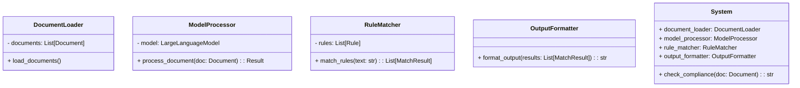
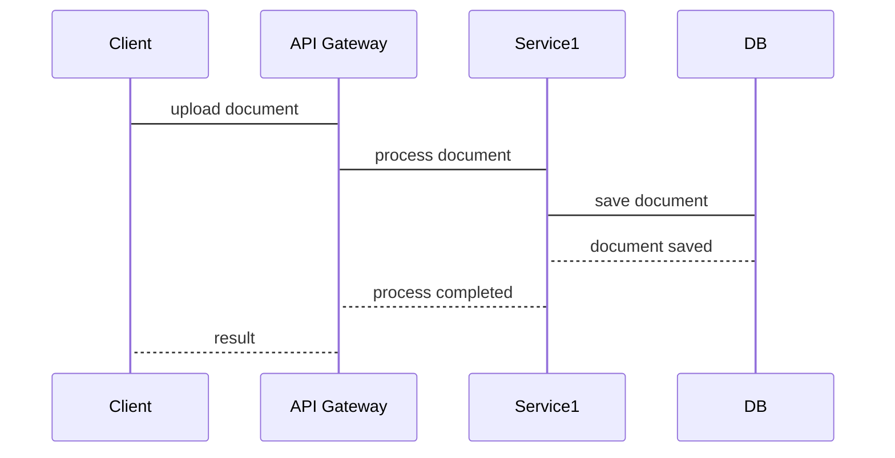

                 


# 开发基于大模型的金融法规遵从性检查系统

> **关键词：** 大模型，金融法规，系统开发，算法原理，系统架构

> **摘要：**  
本文详细探讨了开发基于大模型的金融法规遵从性检查系统的核心概念、算法原理、系统架构设计及其实现。通过分析金融法规的复杂性及传统检查方法的局限性，提出了利用大模型技术进行高效、准确的法规检查解决方案。本文从背景介绍、核心概念、算法原理、系统设计、项目实战等多维度展开，为读者提供一个全面的技术指南。

---

## 第一部分：背景介绍

### 第1章：问题背景

#### 1.1 金融法规遵从性检查的必要性  
金融法规是确保金融市场健康运行的重要保障。然而，金融法规的数量庞大、内容复杂，传统的法规检查方法依赖人工审查，效率低下且容易出错。随着金融业务的不断复杂化，传统方法已无法满足日益严格的监管要求。引入大模型技术，能够显著提升法规检查的效率和准确性。

#### 1.2 问题描述  
金融法规涉及多个领域，包括证券、保险、银行等，法规内容繁杂且更新频繁。传统的检查方法通常依赖于人工解读和判断，容易受到主观因素的影响，且难以快速响应法规的变化。此外，金融机构的数据量庞大，如何高效地处理和分析这些数据成为一个挑战。

#### 1.3 问题解决  
通过引入大模型技术，可以实现对金融文本的自动解析和法规匹配。大模型能够理解复杂的金融语言，快速识别潜在的合规问题，并提供相应的建议。这种自动化的方法不仅提高了检查效率，还能降低人为错误的风险。

### 第2章：核心概念与联系

#### 2.1 大模型的基本原理  
大模型是一种基于深度学习的自然语言处理技术，具有强大的上下文理解和生成能力。其核心在于通过大量数据的预训练，使得模型能够理解复杂的语言结构，并生成符合语境的文本。

#### 2.2 金融法规的核心要素  
金融法规包括证券法、公司法、保险法等多个领域，每个领域都有其独特的规则和要求。法规的核心要素包括交易合规性、信息披露、风险控制等。

#### 2.3 系统设计的核心要素  
系统设计需要考虑数据输入、模型处理、结果输出等环节。核心要素包括数据预处理、模型训练、结果评估等。

---

## 第二部分：大模型算法原理

### 第3章：大模型的训练流程

#### 3.1 数据预处理  
数据预处理是模型训练的关键步骤。首先需要对金融文本进行清洗和标注，确保数据的准确性和一致性。

#### 3.2 模型微调  
在预训练的基础上，对大模型进行微调，使其适应特定的金融法规检查任务。微调过程中需要使用标注好的金融数据，进一步优化模型的性能。

#### 3.3 模型评估  
通过测试集对模型进行评估，计算准确率、召回率和F1值等指标，确保模型的性能达到预期。

### 第4章：大模型的推理机制

#### 4.1 解析式推理  
解析式推理是基于逻辑规则的推理方式，适用于规则明确的场景。例如，检查合同是否符合特定的格式要求。

#### 4.2 统计推理  
统计推理基于概率分布进行推断，适用于规则不明确或数据量较大的场景。例如，识别文本中的潜在风险。

#### 4.3 混合推理  
结合解析式推理和统计推理的优点，适用于复杂的金融场景。例如，同时检查合同的格式和内容合规性。

---

## 第三部分：系统分析与架构设计

### 第5章：系统功能设计

#### 5.1 领域模型类图  
以下是系统的领域模型类图（Mermaid 类图）：



### 第6章：系统架构设计

#### 6.1 系统架构图  
以下是系统的架构图（Mermaid 架构图）：

```mermaid
docker
    client --> API Gateway
    API Gateway --> Load Balancer
    Load Balancer --> Service1
    Load Balancer --> Service2
    Service1 --> DB
    Service2 --> Cache
```

#### 6.2 接口设计  
系统需要提供以下接口：
1. 文档上传接口
2. 检查结果查询接口
3. 系统配置接口

#### 6.3 交互设计  
以下是系统的交互设计（Mermaid 序列图）：



---

## 第四部分：项目实战

### 第7章：环境安装与核心代码实现

#### 7.1 环境安装  
安装所需的依赖：
```bash
pip install large-language-models
pip install numpy
pip install pandas
```

#### 7.2 核心代码实现  
以下是系统的核心代码：

```python
class DocumentLoader:
    def __init__(self):
        self.documents = []

    def load_documents(self, files):
        for file in files:
            self.documents.append(file)

class ModelProcessor:
    def __init__(self, model):
        self.model = model

    def process_document(self, doc):
        return self.model.predict(doc)

class RuleMatcher:
    def __init__(self, rules):
        self.rules = rules

    def match_rules(self, text):
        matches = []
        for rule in self.rules:
            if rule.matches(text):
                matches.append(rule)
        return matches

class System:
    def __init__(self):
        self.document_loader = DocumentLoader()
        self.model_processor = ModelProcessor(pretrained_model)
        self.rule_matcher = RuleMatcher(rules)

    def check_compliance(self, doc):
        results = self.model_processor.process_document(doc)
        matches = self.rule_matcher.match_rules(results)
        return matches
```

---

## 第五部分：总结与展望

### 第8章：总结

#### 8.1 最佳实践  
1. 确保数据质量，避免过拟合。
2. 定期更新模型，适应法规变化。
3. 优化系统性能，提升用户体验。

#### 8.2 小结  
本文详细介绍了开发基于大模型的金融法规遵从性检查系统的背景、核心概念、算法原理、系统架构设计及其实现。通过系统的分析和实践，证明了大模型技术在金融法规检查中的有效性。

### 第9章：注意事项

1. 数据隐私和安全问题需要特别关注。
2. 系统的可解释性需要进一步优化。
3. 模型的实时性需要根据业务需求进行调整。

### 第10章：拓展阅读

1. 大模型在金融领域的其他应用。
2. 法律合规领域的最新技术进展。
3. 金融法规的动态更新与系统优化。

---

**作者：AI天才研究院 & 禅与计算机程序设计艺术**

