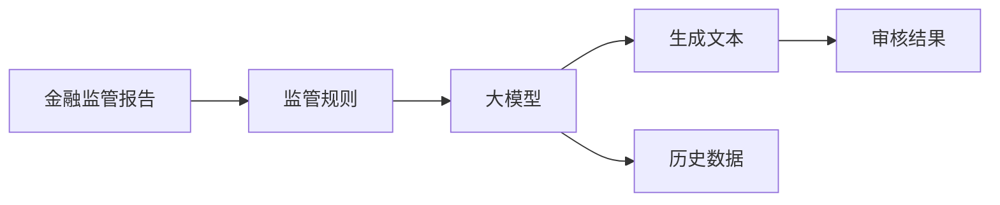
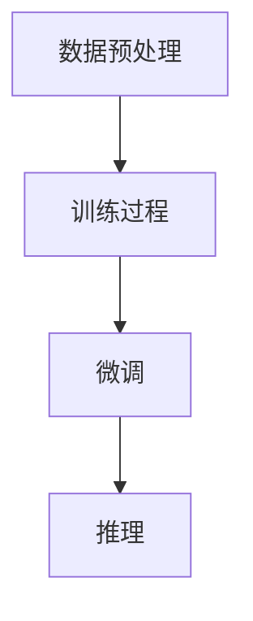
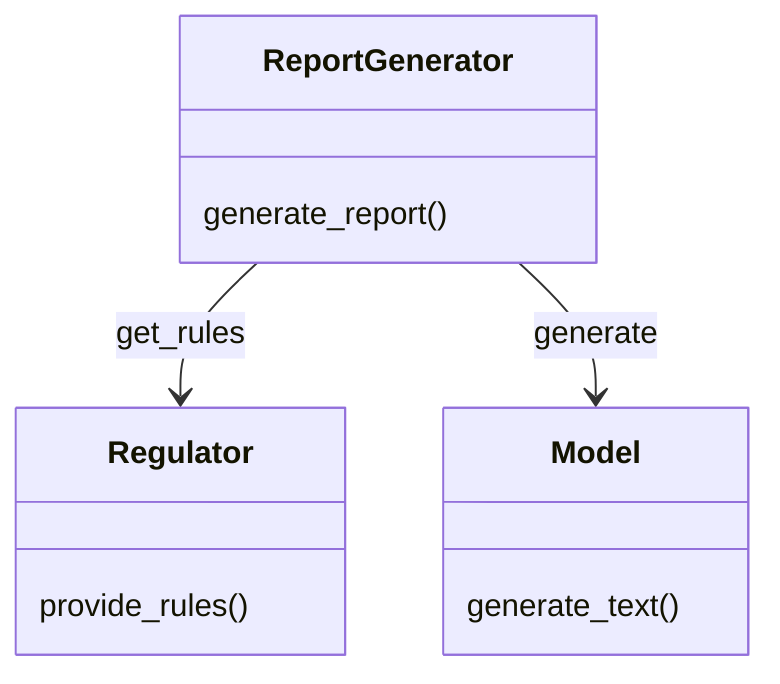
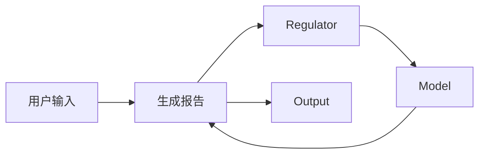
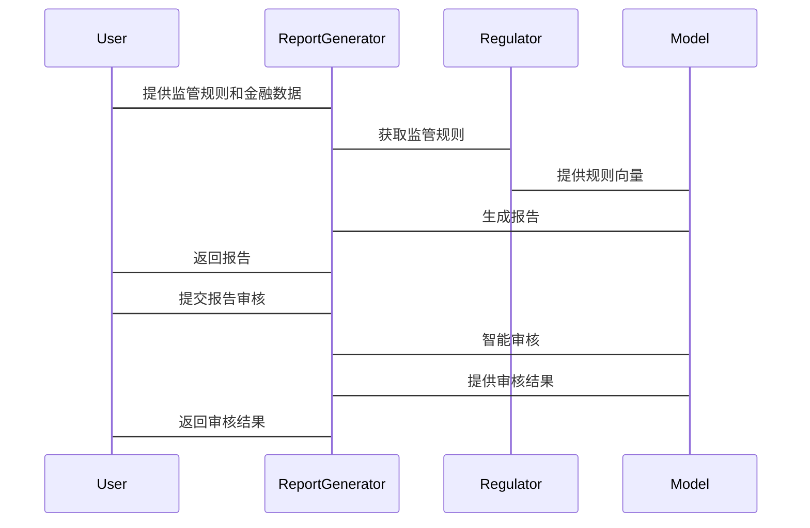

                 


# 开发基于大模型的金融监管报告智能生成与审核助手

> 关键词：大模型、金融监管、智能生成、审核助手、NLP、文本生成

> 摘要：本文将详细探讨如何利用大模型技术开发金融监管报告的智能生成与审核助手。从背景分析到算法原理，从系统架构设计到项目实战，全面解析基于大模型的金融监管解决方案。文章将结合理论与实践，深入分析大模型在金融监管中的应用价值，并通过具体案例展示其实现过程与效果。

---

# 第一部分: 基于大模型的金融监管报告智能生成与审核助手开发背景

## 第1章: 问题背景与需求分析

### 1.1 问题背景

#### 1.1.1 金融监管的现状与挑战
金融监管是保障金融市场健康运行的重要手段。传统的金融监管模式依赖人工审核，存在效率低、成本高、主观性强等问题。随着金融市场数据量的爆炸式增长，监管机构需要处理海量文本数据，包括公司财报、交易记录、监管文件等。如何高效、准确地生成和审核这些监管报告，成为亟待解决的挑战。

#### 1.1.2 传统金融监管报告生成的痛点
- **效率问题**：人工编写和审核报告耗时长，难以应对海量数据。
- **一致性问题**：不同人员的编写风格和审核标准不一致，影响报告质量。
- **精准性问题**：人工难以完全准确地理解和提取复杂的金融数据和规则。

#### 1.1.3 智能化监管的需求与趋势
随着人工智能技术的快速发展，利用大模型技术实现金融监管的智能化成为行业趋势。智能生成与审核助手能够显著提高监管效率，降低成本，并确保报告的一致性和精准性。

### 1.2 问题描述

#### 1.2.1 金融监管报告的核心要素
金融监管报告通常包括以下核心要素：
- 公司财务数据
- 交易记录
- 风险评估
- 合规性分析
- 监管建议

#### 1.2.2 报告生成与审核的关键问题
- **数据理解**：如何准确理解复杂的金融数据和监管规则。
- **文本生成**：如何生成符合监管要求的高质量报告。
- **智能审核**：如何快速、准确地审核报告并提出改进建议。

#### 1.2.3 边界与外延
本项目重点关注基于大模型的金融监管报告生成与审核助手的开发，不包括其他辅助功能，如实时监控或数据分析。

### 1.3 问题解决与目标设定

#### 1.3.1 利用大模型解决的核心问题
- 利用大模型的文本生成能力，实现监管报告的自动化生成。
- 基于大模型的智能审核功能，快速发现报告中的问题并提出优化建议。

#### 1.3.2 开发目标与预期成果
- 开发一个能够生成高质量金融监管报告的智能助手。
- 实现一个能够高效审核报告并提供建议的智能系统。
- 提高金融监管的效率和准确性，降低人工成本。

#### 1.3.3 项目范围与约束条件
- 项目范围：聚焦于监管报告的生成与审核，不涉及其他监管功能。
- 约束条件：确保生成的报告符合监管机构的格式和内容要求。

## 第2章: 核心概念与联系

### 2.1 大模型与金融监管的结合原理

#### 2.1.1 大模型的文本生成原理
大模型通过预训练掌握了海量文本数据的语义理解能力，能够生成符合上下文逻辑的文本内容。在金融监管场景中，大模型可以根据输入的监管规则和数据生成相应的报告。

#### 2.1.2 金融监管规则的嵌入方法
将金融监管规则嵌入到大模型中，可以通过以下步骤：
1. 将监管规则转化为模型可以理解的向量表示。
2. 在模型的生成过程中，结合这些规则向量，生成符合监管要求的文本。

#### 2.1.3 智能审核的实现机制
智能审核通过大模型对生成报告的语义理解和模式匹配，快速识别潜在问题，并提供建议。审核过程包括以下步骤：
1. 输入生成报告。
2. 模型分析报告内容。
3. 识别潜在问题并生成审核建议。

### 2.2 核心概念对比分析

#### 2.2.1 传统文本生成与大模型生成的对比
| 对比维度       | 传统文本生成               | 大模型生成               |
|----------------|---------------------------|---------------------------|
| 精准性         | 较低，依赖模板和规则         | 较高，基于语义理解         |
| 生成效率       | 较低，人工干预较多           | 较高，自动化生成           |
| 适应性         | 较差，难以应对复杂场景       | 较好，能够处理复杂场景     |

#### 2.2.2 人工审核与智能审核的对比
| 对比维度       | 人工审核                   | 智能审核                   |
|----------------|---------------------------|---------------------------|
| 审核效率       | 低，依赖人工逐条检查         | 高，自动化审核             |
| 审核准确率     | 中等，受审核人员经验影响     | 高，基于模型深度学习       |
| 成本           | 高，需要大量人力资源         | 低，自动化流程减少成本     |

#### 2.2.3 金融监管规则的复杂性与模型处理能力
金融监管规则复杂性高，涉及多个维度的判断和推理，而大模型通过预训练掌握了复杂的语义理解和逻辑推理能力，能够较好地应对这些挑战。

### 2.3 实体关系图



---

# 第二部分: 大模型的算法原理与数学基础

## 第3章: 大模型的算法原理

### 3.1 大模型的训练流程



### 3.2 模型结构与数学公式

#### 3.2.1 变压器模型的结构
大模型通常基于变体的变压器模型，其核心结构包括编码器和解码器。编码器负责将输入数据转化为向量表示，解码器负责根据这些向量生成输出文本。

#### 3.2.2 注意力机制的公式
$$\text{Attention}(Q, K, V) = \text{softmax}\left(\frac{QK^T}{\sqrt{d_k}}\right)V$$

#### 3.2.3 损失函数与优化
$$\text{Loss} = -\sum_{i=1}^{n} \text{log}p(x_i|x_{<i})$$`

### 3.3 代码实现示例

```python
def attention(q, k, v, d_k):
    attn_weights = softmax(q @ k.T / np.sqrt(d_k))
    return attn_weights @ v

def generate_report(regulation_rules, financial_data):
    model = load_pretrained_model()
    input = combine(regulation_rules, financial_data)
    output = model.generate(input)
    return output
```

---

## 第4章: 大模型的优化与调优

### 4.1 模型优化策略

#### 4.1.1 参数调整
- 调整学习率、批次大小等超参数。
- 使用Adam优化器。

#### 4.1.2 模型剪裁
- 剪裁不必要的网络层。
- 使用知识蒸馏技术减少模型体积。

#### 4.1.3 模型微调
- 在特定领域数据上进行微调，提升模型在金融监管领域的表现。

### 4.2 模型调优实践

#### 4.2.1 超参数调优
使用网格搜索或随机搜索方法，找到最佳的超参数组合。

#### 4.2.2 模型评估
通过准确率、召回率、F1值等指标评估模型性能。

#### 4.2.3 模型压缩
使用模型压缩技术，如剪枝和量化，降低模型的计算复杂度。

---

# 第三部分: 系统分析与架构设计

## 第5章: 系统分析与架构设计

### 5.1 问题场景介绍

#### 5.1.1 项目背景
本项目旨在开发一个基于大模型的金融监管报告智能生成与审核助手，帮助监管机构高效完成报告生成和审核工作。

#### 5.1.2 项目介绍
项目目标是利用大模型技术，实现监管报告的自动化生成和智能审核，提升监管效率和准确性。

### 5.2 系统功能设计

#### 5.2.1 领域模型


#### 5.2.2 系统架构设计


#### 5.2.3 系统接口设计
- 输入接口：接收监管规则和金融数据。
- 输出接口：生成报告和审核结果。

#### 5.2.4 系统交互流程


---

## 第6章: 项目实战

### 6.1 环境配置

```bash
pip install transformers torch numpy
```

### 6.2 系统核心实现

#### 6.2.1 数据准备
```python
import pandas as pd
financial_data = pd.read_csv('financial.csv')
regulation_rules = pd.read_csv('regulation.csv')
```

#### 6.2.2 模型训练
```python
from transformers import AutoTokenizer, AutoModelForCausalLM
tokenizer = AutoTokenizer.from_pretrained('model_name')
model = AutoModelForCausalLM.from_pretrained('model_name')
```

#### 6.2.3 生成报告
```python
def generate_report(data):
    inputs = tokenizer.encode(data, return_tensors='pt')
    outputs = model.generate(inputs, max_length=500)
    return tokenizer.decode(outputs[0])
```

#### 6.2.4 审核流程
```python
def review_report(report):
    # 审核逻辑
    pass
```

### 6.3 代码应用解读与分析

#### 6.3.1 数据预处理
```python
def preprocess_data(financial_data, regulation_rules):
    combined_data = pd.concat([financial_data, regulation_rules], axis=1)
    return combined_data
```

#### 6.3.2 模型训练
```python
def train_model(model, tokenizer, data):
    optimizer = torch.optim.Adam(model.parameters(), lr=0.001)
    loss_fn = nn.CrossEntropyLoss()
    for epoch in range(num_epochs):
        for batch in data_loader:
            outputs = model(batch)
            loss = loss_fn(outputs, batch_labels)
            optimizer.zero_grad()
            loss.backward()
            optimizer.step()
```

#### 6.3.3 生成与审核
```python
def generate_and_review(data):
    report = generate_report(data)
    review_result = review_report(report)
    return report, review_result
```

### 6.4 实际案例分析

#### 6.4.1 案例描述
假设我们有一个公司财报数据和监管规则，需要生成一份合规的监管报告。

#### 6.4.2 生成过程
```python
financial_data = {'revenue': 1000000, 'profit': 200000}
regulation_rules = {'rule1': '必须包含收入和利润数据'}
report = generate_report(financial_data, regulation_rules)
print(report)
```

#### 6.4.3 审核结果
```python
report, review_result = generate_and_review(financial_data)
print(review_result)
```

### 6.5 项目小结

#### 6.5.1 实战总结
通过实战可以发现，大模型在金融监管报告生成与审核中的应用潜力巨大，但实际应用中仍需注意数据质量和模型调优。

#### 6.5.2 问题与优化
- 数据质量影响生成效果。
- 模型调优需要大量计算资源。

---

# 第四部分: 最佳实践与总结

## 第7章: 最佳实践

### 7.1 开发经验总结

#### 7.1.1 数据准备阶段
- 确保数据的完整性和准确性。
- 处理数据中的噪声和冗余信息。

#### 7.1.2 模型训练阶段
- 合理选择模型参数。
- 定期监控训练过程，及时调整策略。

### 7.2 注意事项

#### 7.2.1 数据隐私与安全
- 确保金融数据的安全性。
- 遵守相关法律法规。

#### 7.2.2 模型鲁棒性
- 验证模型在不同场景下的表现。
- 处理边界条件和异常情况。

### 7.3 拓展阅读

#### 7.3.1 推荐书籍
- 《Deep Learning》
- 《自然语言处理入门》

#### 7.3.2 推荐博客与文章
- [AI Giant Institute Blog](https://example.com)

---

# 作者：AI天才研究院/AI Genius Institute & 禅与计算机程序设计艺术 /Zen And The Art of Computer Programming

---

以上是《开发基于大模型的金融监管报告智能生成与审核助手》的技术博客文章大纲和内容。

