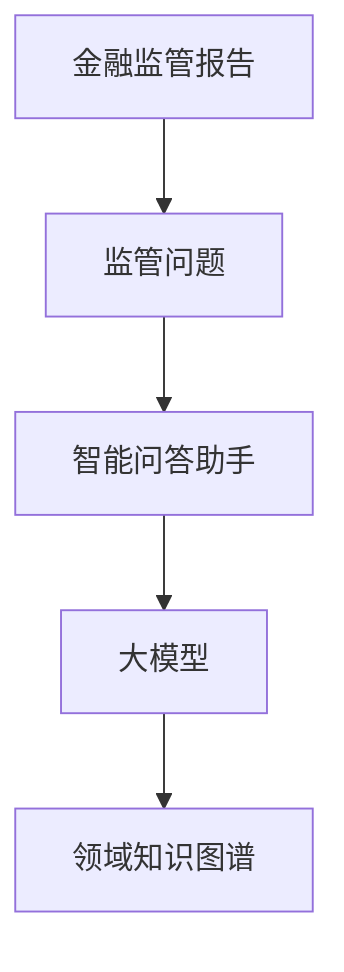
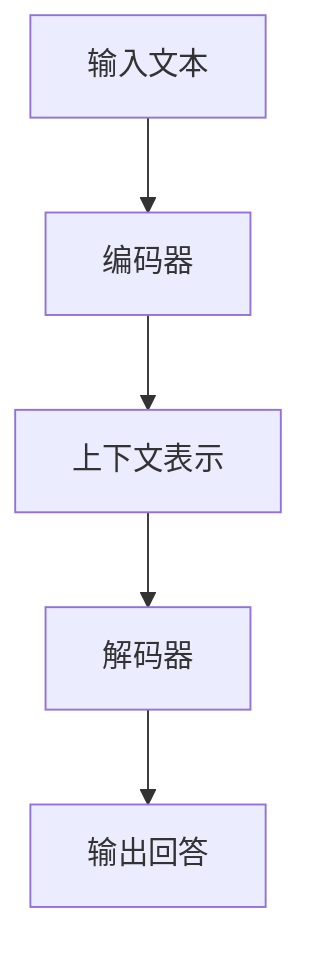
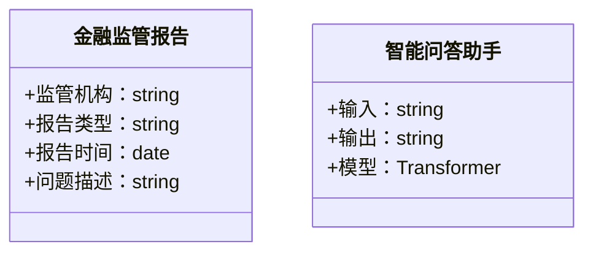

                 


# 开发基于大模型的金融监管报告智能问答助手

> 关键词：大模型，金融监管，智能问答助手，自然语言处理，深度学习

> 摘要：随着金融监管需求的日益复杂化和智能化，基于大模型的智能问答助手在金融领域的应用变得尤为重要。本文详细探讨了如何开发这样一个智能问答助手，涵盖了从背景分析、核心概念、算法原理、系统架构设计到项目实战的各个方面。通过本文的介绍，读者可以系统地了解如何利用大模型技术构建高效的金融监管报告智能问答系统。

---

## 第一部分: 背景介绍

### 第1章: 问题背景与目标

#### 1.1 问题背景
- **金融监管的重要性**：金融市场的稳定运行离不开有效的监管，监管报告是金融机构合规性评估的关键依据。
- **传统问答系统的局限性**：传统问答系统难以处理金融监管报告中的复杂语义和专业领域知识。
- **大模型技术的引入**：大模型技术通过深度学习和自然语言处理技术，能够更好地理解和回答金融监管报告中的问题。

#### 1.2 问题描述
- **金融监管报告的特点**：内容专业、语义复杂、数据量大。
- **智能问答助手的需求**：提供快速、准确的问答服务，帮助监管机构和金融机构提高效率。
- **边界与外延**：明确系统的功能边界，如支持的问答类型、数据范围等。

#### 1.3 核心目标与实现路径
- **核心目标**：构建一个能够处理金融监管报告的智能问答助手，提供高效的问答服务。
- **实现路径**：结合大模型技术和领域知识，设计高效的问答系统架构。
- **技术路线选择**：采用大模型技术，结合领域知识图谱和问答规则，构建智能问答系统。

---

## 第二部分: 核心概念与联系

### 第2章: 大模型的基本原理

#### 2.1 大模型的基本原理
- **模型结构**：大模型通常基于Transformer架构，包括编码器和解码器。
- **训练方法**：采用自监督学习，通过大量数据预训练，再进行微调。
- **优化策略**：使用Adam优化器，结合学习率衰减和早停策略。

#### 2.2 核心概念对比表
| 对比项       | 传统问答系统          | 基于大模型的问答系统 |
|--------------|-----------------------|-----------------------|
| 处理能力     | 有限，难以处理复杂语义 | 强大，能处理复杂语义    |
| 知识库依赖   | 高，依赖规则库        | 较低，依赖预训练模型   |
| 更新维护     | 频繁，需要人工调整规则 | 周期性微调，相对容易    |

#### 2.3 实体关系图


---

## 第三部分: 算法原理与数学模型

### 第3章: 大模型算法原理

#### 3.1 大模型的基本算法
- **基本算法流程**：输入文本经过编码器生成上下文表示，解码器生成回答。
- **算法优化策略**：引入注意力机制，优化解码器输出。
- **算法复杂度分析**：时间复杂度主要取决于模型参数规模和输入长度。

#### 3.2 算法流程图


#### 3.3 代码实现
```python
import torch
import torch.nn as nn

class Transformer(nn.Module):
    def __init__(self, embed_dim, num_heads):
        super(Transformer, self).__init__()
        self.encoder = nn.TransformerEncoder(
            nn.Embedding(embed_dim, embed_dim), 
            nn.TransformerEncoderLayer(embed_dim, num_heads)
        )
        self.decoder = nn.TransformerDecoder(
            nn.Embedding(embed_dim, embed_dim), 
            nn.TransformerDecoderLayer(embed_dim, num_heads)
        )

    def forward(self, src, tgt):
        enc_out = self.encoder(src)
        dec_out = self.decoder(tgt, enc_out)
        return dec_out
```

### 第4章: 数学模型与公式

#### 4.1 模型训练公式
- **损失函数**：交叉熵损失函数。
$$ \mathcal{L} = -\frac{1}{N}\sum_{i=1}^{N} \sum_{j=1}^{M} y_{ij} \log p(y_{ij}) $$
- **优化函数**：Adam优化器。
$$ \theta_{t+1} = \theta_t - \eta \frac{\partial \mathcal{L}}{\partial \theta_t} $$
- **概率分布公式**：Softmax函数。
$$ p(y|x) = \frac{\exp(s_i)}{\sum_j \exp(s_j)} $$

#### 4.2 公式详细解读
- 损失函数用于衡量模型预测与真实值的差距。
- 优化函数用于更新模型参数，降低损失。
- 概率分布公式用于生成回答的概率分布。

### 第5章: 举例说明与代码实现

#### 5.1 举例说明
- **简单案例**：输入“什么是监管报告？”输出“监管报告是金融机构的合规性报告。”
- **中等复杂度案例**：输入“如何处理关联交易？”输出“应按照相关法规进行披露和审查。”
- **高复杂度案例**：输入“如何评估某公司的财务风险？”输出“建议结合财务数据和市场环境进行综合评估。”

#### 5.2 代码实现
```python
import torch
import torch.optim as optim

# 示例训练代码
model = Transformer(embed_dim=512, num_heads=8)
optimizer = optim.Adam(model.parameters(), lr=0.001)
criterion = nn.CrossEntropyLoss()

for epoch in range(num_epochs):
    for batch in data_loader:
        src, tgt = batch
        outputs = model(src, tgt)
        loss = criterion(outputs, tgt)
        loss.backward()
        optimizer.step()
```

---

## 第四部分: 系统分析与架构设计

### 第6章: 系统分析

#### 6.1 问题场景介绍
- **问题场景**：金融监管报告中的问答需求多样，需要高效准确的智能助手支持。
- **场景分析**：系统需要处理大量非结构化文本数据，提供实时问答服务。

#### 6.2 系统功能设计
- **领域模型**：定义金融监管相关的实体和关系。


---

## 第五部分: 项目实战

### 第7章: 项目实战

#### 7.1 环境安装
```bash
pip install torch transformers
```

#### 7.2 系统核心实现
```python
import torch
from transformers import AutoTokenizer, AutoModelForQuestionAnswering

tokenizer = AutoTokenizer.from_pretrained("facebook/bart-large")
model = AutoModelForQuestionAnswering.from_pretrained("facebook/bart-large")

def answer_question(question, context):
    inputs = tokenizer.encode_plus(question + " " + context, return_tensors="pt")
    outputs = model(**inputs)
    start_logits = outputs.start_logits
    end_logits = outputs.end_logits
    start = torch.argmax(start_logits)
    end = torch.argmax(end_logits) + 1
    answer = tokenizer.decode(inputs.input_ids[0][start:end])
    return answer
```

#### 7.3 案例分析
- **输入问题**：什么是关联交易？
- **输出答案**：关联交易是指同一企业控制的法人之间进行的交易。

---

## 第六部分: 最佳实践

### 第8章: 最佳实践

#### 8.1 小结
- 大模型技术在金融监管问答中的应用显著提高了效率和准确性。
- 系统设计需要结合领域知识和大模型技术，实现高效的问答服务。

#### 8.2 注意事项
- 数据质量和多样性对模型性能影响重大。
- 需要定期更新模型，保持其准确性和适用性。

#### 8.3 拓展阅读
- 《Transformers: Pre-training of self-supervised models》
- 《Large Language Models in AI: The AI revolution has just begun》

---

作者：AI天才研究院/AI Genius Institute & 禅与计算机程序设计艺术 /Zen And The Art of Computer Programming

