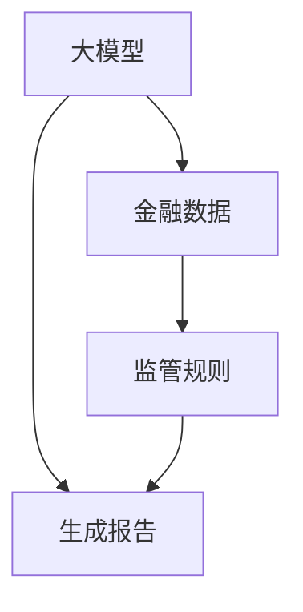
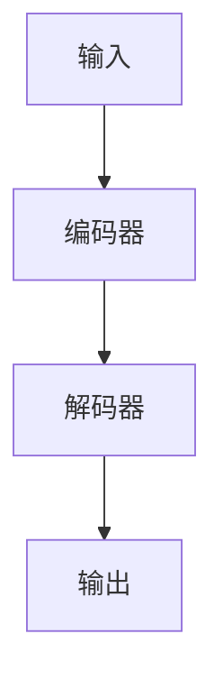
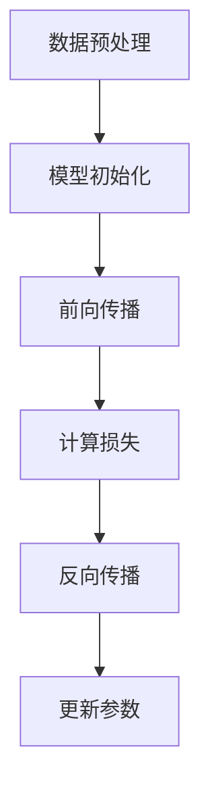
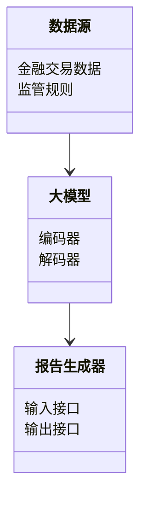
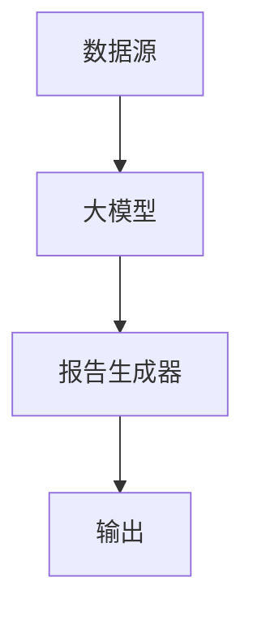
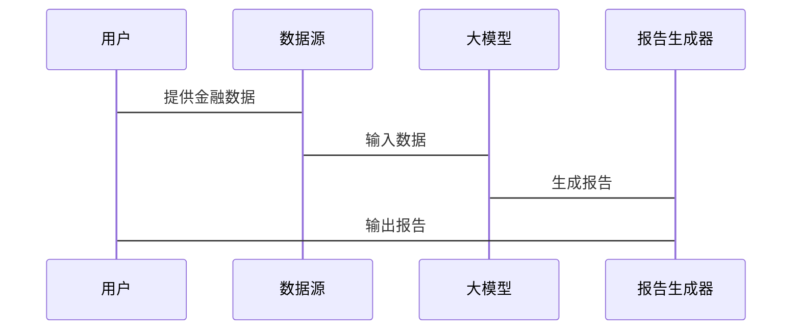

                 


# 开发基于大模型的金融监管报告生成器

## 关键词：大模型、金融监管、报告生成、自然语言处理、深度学习

## 摘要：本文详细探讨了开发基于大模型的金融监管报告生成器的技术细节。从问题背景到核心概念，从算法原理到系统设计，从项目实战到最佳实践，系统性地分析了如何利用大模型技术提升金融监管效率，生成高质量的监管报告。

---

# 第1章 问题背景与核心概念

## 1.1 问题背景介绍

### 1.1.1 金融监管的重要性

金融监管是维护金融市场稳定、保护投资者利益的重要手段。随着金融市场的复杂化和数字化，传统的监管方式已难以应对日益增长的监管需求。

### 1.1.2 传统金融监管报告的痛点

- **数据量大**：金融市场数据复杂且海量，手动分析效率低下。
- **规则繁杂**：金融监管规则繁多且更新频繁，难以及时准确地应用。
- **报告生成耗时**：传统报告生成依赖人工操作，耗时长且容易出错。

### 1.1.3 大模型在金融监管中的应用潜力

大模型具有强大的自然语言处理能力和大规模数据理解能力，能够显著提升金融监管的效率和准确性。

## 1.2 核心概念与问题描述

### 1.2.1 大模型的基本概念

大模型（Large Language Models, LLMs）是指经过大量数据训练的深度神经网络模型，具有强大的文本生成和理解能力。

### 1.2.2 金融监管报告生成器的功能定义

金融监管报告生成器是一种基于大模型的工具，能够自动生成符合监管要求的报告，包括风险评估、合规检查等。

### 1.2.3 问题解决的边界与外延

- **边界**：专注于生成监管报告，不涉及实际的监管执法。
- **外延**：可扩展至金融数据分析、风险预警等领域。

## 1.3 核心概念与联系

### 1.3.1 大模型的原理概述

大模型通过多层神经网络处理输入数据，利用注意力机制捕捉上下文信息，生成相关输出。

### 1.3.2 核心概念属性对比表

| 概念 | 属性 | 描述 |
|------|------|------|
| 大模型 | 参数量 | 高达 billions |
| 大模型 | 训练数据 | 大规模文本 |
| 金融监管 | 数据来源 | 金融交易数据、监管规则 |
| 报告生成 | 输出格式 | 结构化报告、自然语言报告 |

### 1.3.3 实体关系图



## 1.4 本章小结

---

# 第2章 大模型的算法原理

## 2.1 大模型的基本原理

### 2.1.1 Transformer架构

大模型的核心架构是Transformer，包括编码器和解码器两部分。



### 2.1.2 注意力机制

注意力机制使模型能够关注输入中的重要部分，提升生成质量。

$$\text{Attention}(Q, K, V) = \text{softmax}\left(\frac{QK^T}{\sqrt{d_k}}\right)V$$

### 2.1.3 模型训练流程

训练过程包括数据预处理、模型初始化、前向传播、计算损失、反向传播和参数更新。



## 2.2 大模型的数学模型

### 2.2.1 概率分布与损失函数

交叉熵损失函数用于衡量生成结果与真实结果的差异。

$$L = -\sum_{i=1}^{n} \log P(x_i|x_{<i})$$

### 2.2.2 优化算法

使用Adam优化器更新模型参数。

$$\theta = \theta - \eta \frac{\partial L}{\partial \theta}$$

## 2.3 金融监管场景下的微调策略

### 2.3.1 微调目标函数

结合预训练目标和监管任务目标。

$$L_{\text{fin}} = \lambda_1 L_{\text{pre}} + \lambda_2 L_{\text{task}}$$

### 2.3.2 金融领域数据增强方法

通过数据增强技术提升模型在金融领域的适应能力。

---

# 第3章 系统分析与架构设计

## 3.1 项目场景介绍

### 3.1.1 问题场景描述

金融监管需要实时监控交易数据，及时生成风险报告。

### 3.1.2 项目目标与范围

开发一个基于大模型的金融监管报告生成器，实现高效、准确的报告生成。

## 3.2 系统功能设计

### 3.2.1 领域模型



### 3.2.2 系统架构设计



### 3.2.3 系统接口设计

- 输入接口：接收金融数据和监管规则。
- 输出接口：生成结构化或自然语言报告。

### 3.2.4 系统交互流程图



---

# 第4章 项目实战

## 4.1 环境安装

安装必要的开发环境和库，如Python、TensorFlow、PyTorch等。

## 4.2 系统核心实现

### 4.2.1 核心代码实现

```python
def preprocess_data(data):
    # 数据预处理代码
    pass

def train_model(model, optimizer, loss_fn, data_loader):
    # 训练模型代码
    pass

def generate_report(model, input_data):
    # 生成报告代码
    pass
```

### 4.2.2 代码解读与分析

解释代码的功能和实现细节，说明如何实现大模型的训练和报告生成。

## 4.3 实际案例分析

分析一个实际案例，说明如何利用生成器生成监管报告。

## 4.4 项目小结

总结项目开发的经验和教训。

---

# 第5章 最佳实践与小结

## 5.1 最佳实践 tips

- 数据质量：确保输入数据的准确性和完整性。
- 模型调优：根据具体任务调整模型参数。
- 安全性：确保数据安全和模型安全。

## 5.2 小结

本文系统性地介绍了开发基于大模型的金融监管报告生成器的各个方面，从理论到实践，提供了详细的技术指导。

## 5.3 注意事项

- 模型性能：关注生成报告的准确性和及时性。
- 数据隐私：确保数据处理符合相关法规。

## 5.4 拓展阅读

推荐相关领域的书籍和论文，供进一步学习。

---

# 作者

作者：AI天才研究院/AI Genius Institute & 禅与计算机程序设计艺术 /Zen And The Art of Computer Programming

