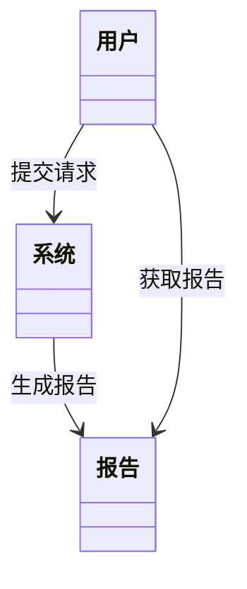
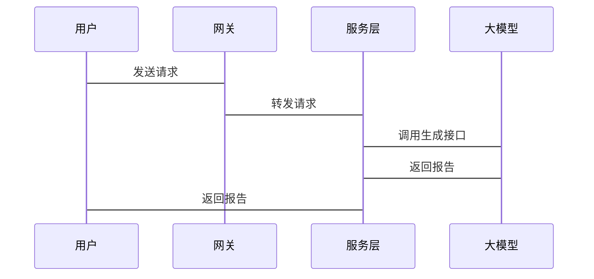

                 


# 开发基于大模型的金融监管报告自动生成助手

> 关键词：大模型，金融监管，报告生成，AI技术，系统架构

> 摘要：随着AI技术的快速发展，基于大模型的金融监管报告自动生成助手正在成为金融领域的热门工具。本文将详细探讨如何开发这样一个系统，从问题背景、核心概念到系统架构、项目实战，逐步分析其实现原理和应用场景。通过本文，读者将能够全面理解大模型在金融监管中的应用价值，并掌握实际开发的关键步骤和技术要点。

---

# 第1章: 背景与核心概念

## 1.1 问题背景

### 1.1.1 金融监管的重要性
金融监管是维护金融市场稳定、保护投资者权益的重要手段。传统的金融监管依赖于人工审核和规则匹配，效率低下且容易出错。随着金融市场的复杂化和数据量的爆炸式增长，传统的监管方式已无法满足需求。

### 1.1.2 传统金融监管报告的痛点
- **数据量大**：金融市场数据复杂且分散，人工处理效率低。
- **规则繁多**：金融监管规则种类繁多，难以统一管理和应用。
- **报告生成耗时**：传统报告生成需要大量人工操作，耗时长且容易出错。

### 1.1.3 大模型技术的引入与优势
大模型（如GPT、BERT等）具备强大的自然语言处理能力和上下文理解能力，能够快速生成符合监管要求的报告。通过引入大模型技术，可以显著提高金融监管的效率和准确性。

## 1.2 问题描述

### 1.2.1 金融监管报告生成的复杂性
金融监管报告需要涵盖多个方面的内容，包括市场分析、风险评估、合规性检查等，每个部分都需要专业的知识和数据支持。

### 1.2.2 传统方法的局限性
传统方法依赖于人工编写规则和模板，难以应对金融市场中不断变化的监管要求和数据格式。

### 1.2.3 大模型在金融监管中的潜在价值
大模型可以快速理解和生成复杂的金融文本，能够帮助监管机构高效生成报告，降低人工成本。

## 1.3 问题解决

### 1.3.1 基于大模型的解决方案
通过训练大模型，使其能够理解金融数据和监管规则，并自动生成符合要求的监管报告。

### 1.3.2 技术实现路径
- 数据预处理：清洗和标注金融数据。
- 模型训练：基于金融数据和监管规则，训练大模型。
- 报告生成：通过用户输入需求，生成对应的监管报告。

### 1.3.3 应用场景与目标
- **应用场景**：银行、证券公司、保险公司等金融机构。
- **目标**：提高监管效率，降低人工成本，确保报告的准确性和合规性。

## 1.4 边界与外延

### 1.4.1 系统边界
系统仅负责监管报告的生成，不涉及数据采集和外部API调用。

### 1.4.2 功能边界
系统支持多种金融监管报告类型，但不包括报告的审批和提交流程。

### 1.4.3 与其他系统的交互
系统需要与数据存储系统、用户界面和监管机构的API进行交互。

## 1.5 概念结构与核心要素

### 1.5.1 核心概念
- **金融数据**：包括市场数据、交易数据、公司财报等。
- **监管规则**：包括法律法规、行业标准等。
- **生成报告**：包括市场分析、风险评估、合规性检查等。

### 1.5.2 关键要素
- **模型训练数据**：清洗后的金融数据和监管报告。
- **模型参数**：大模型的超参数和训练策略。
- **生成策略**：基于用户输入生成报告的逻辑。

### 1.5.3 概念之间的关系
金融数据和监管规则是模型训练的基础，生成报告是模型应用的结果。用户输入和生成报告之间通过模型进行关联。

---

# 第2章: 核心概念与联系

## 2.1 AI大模型的核心原理

### 2.1.1 大模型的基本原理
大模型通过多层神经网络结构，学习大规模数据中的特征和规律，从而实现自然语言理解和生成。

### 2.1.2 大模型的训练过程
- **数据预处理**：清洗、分词、标注。
- **模型训练**：使用分布式训练和优化算法（如Adam）。
- **模型调优**：通过微调任务数据优化模型性能。

### 2.1.3 大模型的推理机制
通过输入特定的提示语（prompt），模型生成符合要求的文本。

## 2.2 金融监管的核心要素

### 2.2.1 监管规则与标准
包括法律法规、行业标准、合规要求等。

### 2.2.2 金融数据的特征
- **多样性**：包括文本、数值、时间序列等多种类型。
- **复杂性**：数据之间的关系复杂，需要深度分析。

### 2.2.3 报告生成的逻辑
基于监管规则和数据分析结果，生成结构化的报告内容。

## 2.3 大模型与金融监管的结合

### 2.3.1 大模型在金融领域的应用
- **自然语言处理**：理解和分析金融文本。
- **生成式AI**：自动生成报告和建议。

### 2.3.2 金融监管与大模型的契合点
- **数据驱动**：金融监管依赖大量数据。
- **规则驱动**：大模型能够理解和应用复杂规则。

### 2.3.3 大模型在金融监管中的优势
- **高效性**：快速生成报告。
- **准确性**：基于大量数据和规则，降低错误率。

## 2.4 核心概念对比

### 2.4.1 大模型与传统算法对比
| 特性         | 大模型               | 传统算法           |
|--------------|----------------------|-------------------|
| 数据需求     | 需要大量标注数据     | 数据需求较低       |
| 模型复杂度   | 模型复杂度高         | 模型复杂度低       |
| 性能表现     | 在复杂任务上表现优异 | 在简单任务上表现稳定 |

### 2.4.2 金融监管与传统监管对比
| 特性         | 基于大模型的监管     | 传统监管           |
|--------------|----------------------|-------------------|
| 效率         | 高                    | 低                |
| 准确性       | 高                    | 中                |
| 适应性       | 强                    | 弱                |

### 2.4.3 生成式AI与规则式AI对比
| 特性         | 生成式AI             | 规则式AI           |
|--------------|----------------------|-------------------|
| 工作方式     | 基于生成模型         | 基于规则匹配       |
| 灵活性       | 高                    | 低                |
| 适用场景     | 复杂场景             | 简单场景           |

---

# 第3章: 系统分析与架构设计

## 3.1 问题场景介绍

### 3.1.1 金融监管报告生成的场景
金融机构需要定期生成监管报告，涵盖市场分析、风险评估等内容。

### 3.1.2 系统目标与功能
- **目标**：自动生成符合监管要求的金融报告。
- **功能**：数据输入、报告生成、结果输出。

### 3.1.3 用户需求分析
- **用户角色**：金融机构的合规部门。
- **需求**：快速生成高质量的监管报告。

## 3.2 项目介绍

### 3.2.1 项目目标
开发一个基于大模型的金融监管报告生成系统。

### 3.2.2 项目范围
涵盖数据处理、模型训练、报告生成三个模块。

### 3.2.3 项目约束
- 数据安全：确保金融数据的安全性。
- 系统性能：保证生成报告的速度和稳定性。

## 3.3 系统功能设计

### 3.3.1 领域模型设计



### 3.3.2 系统架构设计


### 3.3.3 系统接口设计



## 3.4 系统交互设计

### 3.4.1 用户与系统交互
- **输入**：用户输入监管需求。
- **输出**：系统生成报告并返回给用户。

### 3.4.2 系统内部交互
- **数据处理**：服务层接收请求后，调用大模型生成报告。
- **报告存储**：生成的报告存储在数据库中，供后续查询使用。

---

# 第4章: 算法原理与实现

## 4.1 算法原理

### 4.1.1 大模型的训练过程

#### 4.1.1.1 数据预处理
- **清洗数据**：去除噪声数据。
- **分词处理**：将文本数据进行分词。

#### 4.1.1.2 模型训练
- **模型选择**：选择适合的预训练模型（如GPT）。
- **微调训练**：基于金融数据和监管规则，对模型进行微调。

#### 4.1.1.3 模型调优
- **超参数优化**：调整学习率、批次大小等参数。
- **评估与测试**：通过测试集评估模型性能。

### 4.1.2 算法实现

#### 4.1.2.1 生成式AI的数学模型
$$ P(y|x) = \frac{P(x,y)}{P(x)} $$
其中，$x$ 是输入，$y$ 是输出。

#### 4.1.2.2 模型训练流程
1. 数据预处理。
2. 模型初始化。
3. 模型训练。
4. 模型保存。

#### 4.1.2.3 生成过程
1. 用户输入需求。
2. 模型生成报告。
3. 报告输出。

## 4.2 代码实现

### 4.2.1 环境安装
```python
pip install torch transformers
```

### 4.2.2 核心代码实现

```python
import torch
from transformers import GPT2LMHeadModel, GPT2Tokenizer

# 初始化模型和tokenizer
model = GPT2LMHeadModel.from_pretrained('gpt2')
tokenizer = GPT2Tokenizer.from_pretrained('gpt2')

# 定义生成函数
def generate_report(prompt, max_length=500):
    inputs = tokenizer.encode(prompt, return_tensors='pt')
    outputs = model.generate(inputs, max_length=max_length, do_sample=True)
    report = tokenizer.decode(outputs[0], skip_special_tokens=True)
    return report

# 示例使用
prompt = "生成一份关于银行的风险评估报告。"
print(generate_report(prompt))
```

---

# 第5章: 项目实战与案例分析

## 5.1 项目实战

### 5.1.1 环境安装
```bash
pip install torch transformers pandas numpy
```

### 5.1.2 核心代码实现

```python
import pandas as pd
import numpy as np
from transformers import AutoTokenizer, AutoModelForCausalLM

# 加载模型和tokenizer
model_name = 'gpt2'
tokenizer = AutoTokenizer.from_pretrained(model_name)
model = AutoModelForCausalLM.from_pretrained(model_name)

# 数据预处理
def preprocess_data(data):
    # 假设data是一个DataFrame，包含金融数据和监管规则
    processed_data = data.dropna()
    return processed_data

# 训练函数
def train_model(model, tokenizer, processed_data):
    optimizer = torch.optim.Adam(model.parameters(), lr=1e-5)
    loss_fn = torch.nn.CrossEntropyLoss()
    for epoch in range(5):
        for batch in processed_data:
            inputs = tokenizer(batch, return_tensors='pt')
            outputs = model(**inputs)
            loss = loss_fn(outputs.logits, inputs['labels'])
            loss.backward()
            optimizer.step()
    return model

# 生成报告
def generate_report(model, tokenizer, prompt):
    inputs = tokenizer(prompt, return_tensors='pt')
    outputs = model.generate(inputs, max_length=500)
    report = tokenizer.decode(outputs[0], skip_special_tokens=True)
    return report

# 示例使用
data = pd.DataFrame({'text': ["这是一个测试数据。", "另一个测试数据。"]})
processed_data = preprocess_data(data)
trained_model = train_model(model, tokenizer, processed_data)
prompt = "生成一份市场分析报告。"
print(generate_report(trained_model, tokenizer, prompt))
```

### 5.1.3 案例分析

#### 5.1.3.1 数据分析
假设我们有一个包含股票价格和交易量的数据集，我们需要生成一份市场分析报告。

#### 5.1.3.2 数据预处理
```python
import pandas as pd

data = pd.read_csv('market_data.csv')
processed_data = data.dropna()
```

#### 5.1.3.3 模型训练
```python
processed_data = preprocess_data(data)
trained_model = train_model(model, tokenizer, processed_data)
```

#### 5.1.3.4 报告生成
```python
prompt = "根据最近的市场数据，生成一份市场分析报告。"
print(generate_report(trained_model, tokenizer, prompt))
```

---

# 第6章: 最佳实践与总结

## 6.1 小结
本文详细探讨了开发基于大模型的金融监管报告自动生成助手的背景、核心概念、系统架构和实现方法。通过实际案例分析，展示了如何利用大模型技术提升金融监管效率。

## 6.2 注意事项
- **数据安全**：确保金融数据的安全性。
- **模型性能**：定期更新模型，保持其准确性和适用性。
- **用户体验**：优化用户界面，提升用户体验。

## 6.3 拓展阅读
- 《Large Language Models in AI》
- 《金融监管的数字化转型》
- 《深度学习在金融领域的应用》

---

# 作者：AI天才研究院 & 禅与计算机程序设计艺术

