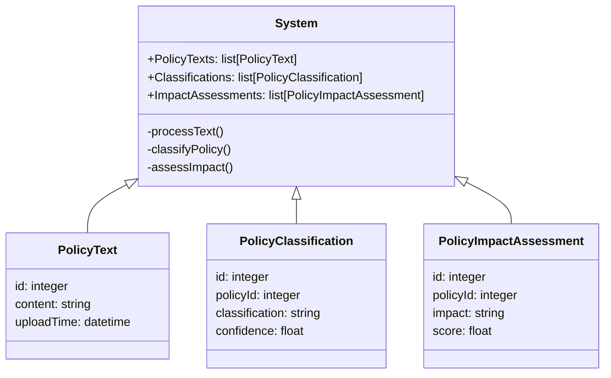
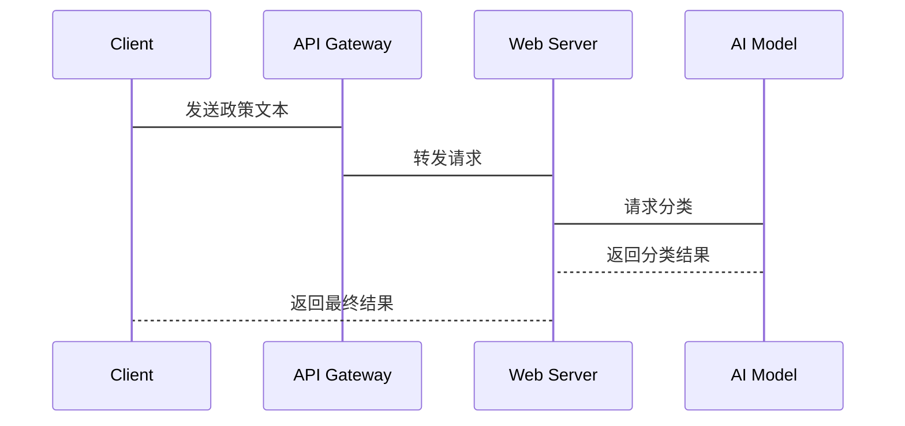

                 


```markdown
# 开发基于大模型的金融监管政策解读助手

## 关键词：大模型、金融监管、政策解读、自然语言处理、系统设计、项目实战

## 摘要：本文将详细介绍如何开发基于大模型的金融监管政策解读助手。首先，我们探讨了金融监管的重要性以及政策解读的复杂性，分析了大模型在金融监管中的应用前景。接着，我们深入讲解了大模型的基本概念与核心原理，包括模型结构、训练方法和优化策略。然后，我们详细分析了大模型在金融监管中的核心应用，包括文本分析、信息抽取和语义理解等方面。之后，我们设计了一个基于大模型的金融监管政策解读系统，涵盖了系统需求分析、功能设计和架构设计等内容。最后，我们通过实际案例展示了项目的实战过程，并提供了优化与扩展的建议。本文旨在为读者提供一个全面的视角，帮助他们理解并掌握开发基于大模型的金融监管政策解读助手所需的知识和技能。

---

# 第一部分: 开发基于大模型的金融监管政策解读助手概述

---

# 第1章: 金融监管与政策解读的背景与挑战

## 1.1 金融监管的重要性

### 1.1.1 金融监管的基本概念

金融监管是指通过法律法规和监管机构对金融市场和金融机构的运作进行监督和管理，以维护金融市场的稳定和健康发展。

### 1.1.2 金融监管的核心目标

- 维护金融市场的稳定
- 保护投资者利益
- 防范金融风险
- 促进金融创新

### 1.1.3 金融监管的现状与发展趋势

- 当前监管面临的挑战：全球化、数字化带来的复杂性
- 未来监管趋势：智能化、数据化、实时化

## 1.2 政策解读的复杂性

### 1.2.1 政策解读的基本要求

- 准确理解政策内容
- 把握政策意图
- 评估政策影响

### 1.2.2 政策解读的难点与挑战

- 政策文本的复杂性
- 政策更新的频繁性
- 政策解读的主观性

### 1.2.3 传统政策解读方式的局限性

- 依赖人工解读，效率低下
- 易受主观因素影响，准确性不足
- 难以应对海量政策文本

## 1.3 大模型在金融监管中的应用前景

### 1.3.1 大模型在金融监管中的潜力

- 自然语言处理能力
- 大规模数据处理能力
- 实时分析能力

### 1.3.2 大模型在政策解读中的优势

- 高效性：快速处理大量政策文本
- 准确性：降低人为错误
- 可扩展性：支持多种语言和领域

### 1.3.3 未来发展趋势与挑战

- 技术挑战：模型优化与计算资源
- 数据挑战：高质量政策文本数据的获取
- 应用挑战：如何与现有监管系统无缝集成

## 1.4 本章小结

本章介绍了金融监管的重要性及其面临的挑战，分析了传统政策解读方式的局限性，并探讨了大模型在金融监管中的应用前景。

---

# 第2章: 大模型的基本概念与核心原理

## 2.1 大模型的定义与特点

### 2.1.1 大模型的基本概念

大模型是指具有大量参数和复杂架构的深度学习模型，通常用于自然语言处理任务。

### 2.1.2 大模型的核心特点

- 大规模参数：通常包含数十亿甚至更多的参数
- 多层神经网络：深度网络结构
- 自监督学习：通过大量未标注数据进行预训练

### 2.1.3 大模型与传统模型的区别

- 模型规模：大模型通常更大，参数更多
- 训练方法：依赖于大量数据和算力
- 应用场景：适用于复杂任务，如自然语言理解、生成

## 2.2 大模型的训练与优化

### 2.2.1 大模型的训练方法

- 预训练：在大规模通用数据上进行无监督学习
- 微调：在特定领域数据上进行有监督微调

### 2.2.2 大模型的优化策略

- 参数优化：使用优化算法如Adam、SGD
- 模型压缩：通过剪枝、量化等技术减少模型大小
- 集成学习：通过集成多个模型提升性能

### 2.2.3 大模型的评估指标

- 准确率
- 召回率
- F1分数
- 混淆矩阵

## 2.3 大模型在自然语言处理中的应用

### 2.3.1 大模型在文本生成中的应用

- 文本续写
- 机器翻译
- 对话生成

### 2.3.2 大模型在文本理解中的应用

- 文本摘要
- 情感分析
- 实体识别

### 2.3.3 大模型在文本摘要中的应用

- 自动摘要
- 文本压缩
- 关键信息提取

## 2.4 本章小结

本章介绍了大模型的基本概念、训练与优化方法及其在自然语言处理中的应用。

---

# 第3章: 大模型在金融监管中的核心应用

## 3.1 金融监管中的自然语言处理需求

### 3.1.1 金融监管中的文本分析需求

- 政策文本分析
- 财务报告解读
- 市场动态分析

### 3.1.2 金融监管中的信息抽取需求

- 从文本中提取关键信息
- 实体识别与关系抽取
- 事件抽取

### 3.1.3 金融监管中的语义理解需求

- 政策意图识别
- 文本相似度计算
- 多语言处理

## 3.2 大模型在金融政策解读中的具体应用

### 3.2.1 政策文本的自动分类

- 基于大模型的文本分类
- 多分类任务实现
- 分类结果评估

### 3.2.2 政策意图的自动识别

- 意图识别模型构建
- 基于上下文的理解
- 模型调优与优化

### 3.2.3 政策影响的自动评估

- 政策影响分析框架
- 基于大模型的风险评估
- 评估结果的可视化

## 3.3 大模型在金融监管中的优势

### 3.3.1 高效性

- 快速处理海量文本
- 实时监控能力
- 自动化工作流程

### 3.3.2 准确性

- 减少人为错误
- 提高解读精度
- 多维度分析能力

### 3.3.3 可扩展性

- 支持多种语言
- 适用于不同领域
- 易于集成与扩展

## 3.4 本章小结

本章探讨了大模型在金融监管中的核心应用，包括文本分析、信息抽取和语义理解等方面，并分析了大模型在金融监管中的优势。

---

# 第4章: 基于大模型的金融监管政策解读系统设计

## 4.1 系统需求分析

### 4.1.1 系统功能需求

- 政策文本上传与存储
- 自动分类与意图识别
- 政策影响评估与报告生成

### 4.1.2 系统性能需求

- 响应时间：秒级处理
- 处理能力：支持海量数据
- 可扩展性：易于功能扩展

## 4.2 系统功能设计

### 4.2.1 领域模型设计



### 4.2.2 系统架构设计


### 4.2.3 系统接口设计

- RESTful API 接口
- 输入格式：JSON
- 输出格式：JSON

### 4.2.4 系统交互设计



## 4.3 本章小结

本章详细设计了基于大模型的金融监管政策解读系统，包括系统需求、功能设计、架构设计和接口设计等内容。

---

# 第5章: 项目实战

## 5.1 环境配置

### 5.1.1 安装依赖

```bash
pip install numpy
pip install pandas
pip install transformers
pip install torch
```

### 5.1.2 启动服务

```bash
python server.py
```

## 5.2 系统核心实现

### 5.2.1 数据处理代码

```python
import pandas as pd
import numpy as np

def preprocess_policy_text(text):
    # 文本清洗
    text = text.lower()
    text = re.sub(r'[^\w\s]', '', text)
    return text

# 示例数据
policy_texts = [
    "金融监管政策加强",
    "支持小微企业融资",
    "防范系统性金融风险"
]

preprocessed_texts = [preprocess_policy_text(text) for text in policy_texts]
print(preprocessed_texts)
```

### 5.2.2 模型训练代码

```python
import torch
from torch import nn
import transformers

class PolicyClassifier(nn.Module):
    def __init__(self, model_name='bert-base-uncased'):
        super(PolicyClassifier, self).__init__()
        self.model = transformers.AutoModel.from_pretrained(model_name)
        self.dropout = nn.Dropout(0.1)
        self.classifier = nn.Linear(self.model.config.hidden_size, num_classes)

    def forward(self, input_ids, attention_mask):
        outputs = self.model(input_ids=input_ids, attention_mask=attention_mask)
        pooled_output = outputs.last_hidden_state[:, 0, :]
        pooled_output = self.dropout(pooled_output)
        return self.classifier(pooled_output)

# 示例训练
model = PolicyClassifier(num_classes=3)
criterion = nn.CrossEntropyLoss()
optimizer = torch.optim.Adam(model.parameters(), lr=1e-5)
```

### 5.2.3 案例分析

```python
import requests

url = "http://localhost:8000/api/classify"
data = {
    "text": "加强金融监管，防范系统性风险"
}
response = requests.post(url, json=data)
print(response.json())
```

## 5.3 项目小结

本章通过实际案例展示了如何开发基于大模型的金融监管政策解读系统，包括环境配置、数据处理、模型训练和系统实现等内容。

---

# 第6章: 优化与扩展

## 6.1 模型调优

### 6.1.1 参数调整

- 学习率：从1e-5调整到2e-5
- 衰退策略：引入学习率衰减
- �正则化：添加L2正则化

### 6.1.2 模型压缩

- 剪枝：移除冗余参数
- 量化：降低模型精度
- 知识蒸馏：将大模型知识迁移到小模型

## 6.2 多模态应用

### 6.2.1 图文结合的政策解读

- 结合文本和图表进行分析
- 多模态数据融合
- 图文联合推理

### 6.2.2 视频解读

- 视频文本提取
- 视频内容理解
- 视频摘要生成

## 6.3 部署与上线

### 6.3.1 系统部署

- Docker化部署
- 微服务架构
- 高可用性设计

### 6.3.2 上线流程

- 测试环境部署
- 生产环境部署
- 监控与日志

## 6.4 本章小结

本章探讨了如何对基于大模型的金融监管政策解读系统进行优化与扩展，包括模型调优、多模态应用和系统部署等内容。

---

# 第7章: 总结与展望

## 7.1 全书总结

本文详细探讨了开发基于大模型的金融监管政策解读助手的各个方面，包括背景、技术原理、系统设计和实战实现。

## 7.2 未来展望

### 7.2.1 技术发展

- 更先进的模型架构
- 更高效的训练方法
- 更强的推理能力

### 7.2.2 应用场景扩展

- 更多金融领域的应用
- 更多语言和文化的适应
- 更多行业的借鉴

## 7.3 致谢

感谢读者的支持与关注，感谢同行的交流与合作。

---

# 作者：AI天才研究院/AI Genius Institute & 禅与计算机程序设计艺术 /Zen And The Art of Computer Programming
```

