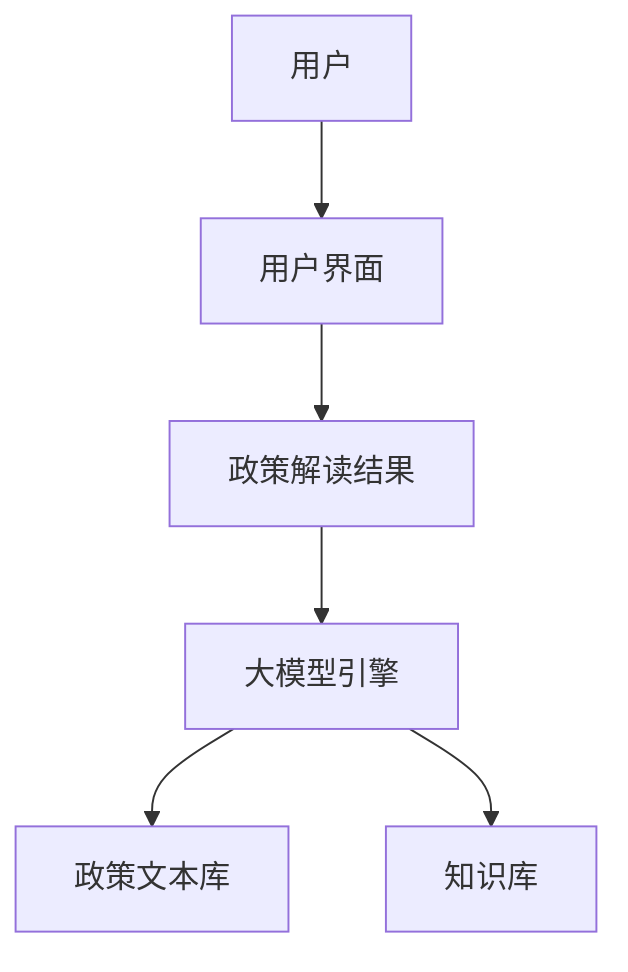
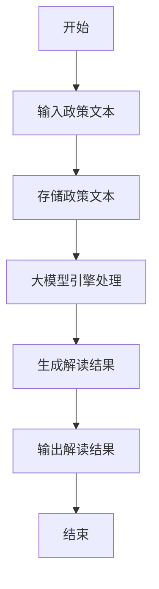
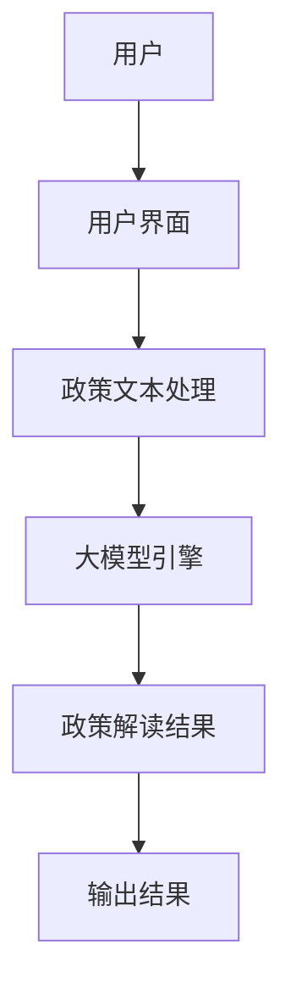
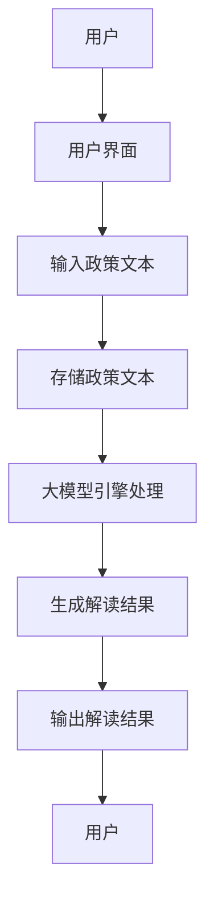

                 


# 开发基于大模型的金融监管政策解读系统

> 关键词：大模型、金融监管、政策解读、自然语言处理、人工智能

> 摘要：随着金融市场的日益复杂化和监管需求的不断提高，传统的政策解读方法已难以满足高效、精准的需求。本文介绍了一种基于大模型的金融监管政策解读系统，详细阐述了该系统的开发背景、核心概念、算法原理、系统架构以及项目实战。通过对大模型在金融监管中的应用进行分析，展示了如何利用大模型实现政策文本的自动解析、政策意图识别以及政策影响预测。本文还提供了系统的数学模型、流程图、类图和序列图，帮助读者更好地理解系统的实现原理和架构设计。

---

# 第一部分: 开发背景与问题分析

# 第1章: 金融监管政策解读的挑战与需求

## 1.1 问题背景

### 1.1.1 传统金融监管的局限性

传统的金融监管主要依赖人工解读政策文本，这种方式存在效率低、准确性差、成本高等问题。政策文本通常包含大量的法律术语和复杂的逻辑关系，人工解读容易出现疏漏。此外，面对海量的政策文件，人工解读的效率难以满足监管需求。

### 1.1.2 金融政策解读的复杂性

金融政策解读涉及复杂的法律、经济和金融知识，政策文本往往具有高度的专业性和复杂性。政策的更新频率高，解读的及时性要求也高。此外，政策的隐含意图和潜在影响需要深入分析，进一步增加了解读的难度。

### 1.1.3 人工智能在金融监管中的潜力

人工智能技术，尤其是大模型，在自然语言处理、知识推理和模式识别等方面具有显著优势。利用大模型的文本理解能力和知识库，可以实现政策文本的自动解析和意图识别，显著提高政策解读的效率和准确性。

---

## 1.2 问题描述

### 1.2.1 金融政策解读的核心任务

金融政策解读的核心任务包括：

1. **政策文本的理解**：准确理解政策文件的文本内容，包括术语、定义和具体条款。
2. **政策意图的识别**：识别政策制定者的意图和目标，分析政策的核心目的。
3. **政策影响的预测**：预测政策实施后可能带来的经济和社会影响。

### 1.2.2 当前政策解读系统的主要痛点

1. **效率低下**：人工解读政策文件耗时长，难以应对海量政策文件。
2. **准确性不足**：人工解读容易出现疏漏，尤其是在复杂政策下。
3. **缺乏实时性**：政策更新频繁，人工解读难以及时响应。

### 1.2.3 基于大模型的政策解读系统的目标

1. **提高解读效率**：利用大模型快速处理大量政策文件。
2. **提升解读准确性**：通过大模型的深度学习能力，提高政策解读的准确性。
3. **实现智能化**：通过大模型的推理能力，自动识别政策意图和影响。

---

## 1.3 问题解决思路

### 1.3.1 利用大模型进行政策文本分析

大模型可以通过自然语言处理技术，对政策文本进行分词、句法分析和语义理解，提取关键信息。

### 1.3.2 基于大模型的政策意图识别

通过大模型的知识库和推理能力，识别政策的隐含意图和潜在影响。

### 1.3.3 大模型在金融监管中的创新应用

1. **自动化政策解读**：实现政策文本的自动解析和分类。
2. **智能问答系统**：基于大模型构建政策解读的智能问答系统。
3. **风险预警**：通过大模型分析政策对市场和企业的潜在影响，提前预警风险。

---

## 1.4 系统边界与外延

### 1.4.1 系统的功能边界

1. **政策文本处理**：包括政策文本的输入、存储和处理。
2. **政策解读**：包括政策意图识别和影响预测。
3. **用户交互**：包括与用户的交互界面和反馈机制。

### 1.4.2 系统的输入与输出

- **输入**：政策文本、用户查询。
- **输出**：政策解读结果、智能问答结果。

### 1.4.3 系统与其他模块的交互关系

1. **与数据源的交互**：获取政策文本数据。
2. **与用户的交互**：接收用户的查询并返回解读结果。
3. **与其他系统的交互**：与其他监管系统共享数据和结果。

---

## 1.5 核心概念与系统架构

### 1.5.1 系统的核心组成要素

1. **政策文本库**：存储所有相关的政策文本。
2. **大模型引擎**：负责政策文本的解析和意图识别。
3. **用户界面**：供用户查询和查看解读结果。
4. **知识库**：存储金融领域的专业知识和术语。

### 1.5.2 系统的实体关系图（ER图）



### 1.5.3 系统的流程图（Mermaid）



---

# 第二部分: 大模型在金融监管中的核心概念与联系

# 第2章: 大模型的核心原理与特性

## 2.1 大模型的基本原理

### 2.1.1 大模型的训练目标

大模型的训练目标是通过大量的政策文本数据，学习政策文本中的术语、句法和语义关系，从而具备理解政策文本的能力。

### 2.1.2 大模型的架构特点

1. **深度神经网络**：大模型通常基于深度神经网络架构，如Transformer。
2. **预训练与微调**：大模型通过预训练掌握通用语言模型，再通过微调适应金融监管领域的特定需求。
3. **知识库集成**：大模型通常集成金融领域的知识库，以提高政策解读的准确性。

### 2.1.3 大模型的训练流程

1. **数据预处理**：清洗和标注政策文本数据。
2. **模型初始化**：初始化模型参数。
3. **模型训练**：利用训练数据优化模型参数。
4. **模型调优**：通过验证数据进一步优化模型。

---

## 2.2 大模型在金融监管中的应用特性

### 2.2.1 大模型的文本理解能力

大模型能够理解政策文本中的复杂句法和语义关系，准确提取关键信息。

### 2.2.2 大模型的推理能力

大模型可以通过推理能力，识别政策的隐含意图和潜在影响。

### 2.2.3 大模型的可解释性

大模型的可解释性使其能够清晰地展示政策解读的过程和结果，便于监管人员理解和验证。

---

## 2.3 大模型与金融监管的结合点

### 2.3.1 政策文本的自动解析

通过大模型的文本理解能力，实现政策文本的自动解析和分类。

### 2.3.2 政策意图的识别

通过大模型的推理能力，识别政策的隐含意图和潜在影响。

### 2.3.3 政策影响的预测

通过大模型的预测能力，评估政策实施后的经济和社会影响。

---

# 第三部分: 大模型的算法原理与数学模型

# 第3章: 大模型的算法原理

## 3.1 大模型的训练流程

### 3.1.1 数据预处理

数据预处理包括文本清洗、分词、句法分析和语义标注。

### 3.1.2 模型初始化

初始化大模型的参数，通常采用随机初始化。

### 3.1.3 模型训练与优化

利用训练数据优化模型参数，采用损失函数和优化算法。

---

## 3.2 大模型的数学模型

### 3.2.1 概率分布模型

概率分布模型描述了模型对输入的分布情况。

### 3.2.2 损失函数与优化目标

损失函数用于衡量模型预测与真实结果的差异，优化算法用于更新模型参数。

### 3.2.3 模型的训练算法

训练算法通常采用梯度下降方法，如Adam优化算法。

---

## 3.3 大模型的数学公式

### 3.3.1 概率分布公式

$$ P(y|x) = \frac{P(x,y)}{P(x)} $$

### 3.3.2 损失函数公式

$$ \text{Loss} = -\sum_{i=1}^{n} \log P(y_i|x_i) $$

### 3.3.3 优化算法公式

$$ \theta_{new} = \theta_{old} - \eta \cdot \frac{\partial \text{Loss}}{\partial \theta} $$

---

# 第四部分: 系统分析与架构设计

# 第4章: 金融监管政策解读系统的架构设计

## 4.1 项目介绍

### 4.1.1 项目目标

开发一个基于大模型的金融监管政策解读系统，实现政策文本的自动解析、政策意图识别和政策影响预测。

### 4.1.2 项目范围

涵盖政策文本处理、大模型训练、系统集成和用户交互。

---

## 4.2 系统功能设计

### 4.2.1 系统功能模块

1. **文本处理模块**：负责政策文本的输入、清洗和存储。
2. **模型处理模块**：负责大模型的训练和微调。
3. **用户交互模块**：提供用户查询和结果展示界面。

---

## 4.3 系统架构设计

### 4.3.1 系统架构图（Mermaid）



---

## 4.4 系统接口设计

### 4.4.1 系统接口描述

1. **输入接口**：接收政策文本和用户查询。
2. **输出接口**：输出政策解读结果和智能问答结果。

---

## 4.5 系统交互流程（Mermaid）



---

# 第五部分: 项目实战

# 第5章: 项目实战

## 5.1 环境安装

### 5.1.1 安装Python环境

安装Python 3.8及以上版本，推荐使用Anaconda。

### 5.1.2 安装大模型框架

安装大模型框架，如TensorFlow或PyTorch。

### 5.1.3 安装NLP工具

安装NLP工具，如spaCy和Gensim。

---

## 5.2 系统核心代码实现

### 5.2.1 政策文本处理代码

```python
import spacy

nlp = spacy.load("en_core_web_sm")

def process_policy_text(text):
    doc = nlp(text)
    return [token.text for token in doc]
```

### 5.2.2 大模型训练代码

```python
import torch
import torch.nn as nn

class PolicyModel(nn.Module):
    def __init__(self, input_size, hidden_size, output_size):
        super(PolicyModel, self).__init__()
        self.hidden_size = hidden_size
        self.embedding = nn.Embedding(input_size, hidden_size)
        self.rnn = nn.GRU(hidden_size, hidden_size)
        self.fc = nn.Linear(hidden_size, output_size)
    
    def forward(self, input, hidden):
        embedded = self.embedding(input)
        output, hidden = self.rnn(embedded, hidden)
        output = self.fc(output)
        return output, hidden

model = PolicyModel(input_size= vocab_size, hidden_size=512, output_size=1)
```

### 5.2.3 模型推理代码

```python
def predict_policy_intent(model, input_text):
    processed_text = process_policy_text(input_text)
    input_tensor = torch.tensor(processed_text, dtype=torch.long)
    output, _ = model(input_tensor, None)
    return output
```

---

## 5.3 案例分析与解读

### 5.3.1 案例分析

以某金融政策为例，展示系统如何解读政策文本。

### 5.3.2 代码实现解读

详细解读上述代码的实现过程，包括文本处理、模型训练和推理过程。

---

## 5.4 项目小结

总结项目开发过程中的关键点和经验教训，为后续开发提供参考。

---

# 第六部分: 最佳实践与总结

# 第6章: 最佳实践

## 6.1 小结

总结全文的核心内容，强调大模型在金融监管中的重要性。

## 6.2 注意事项

提醒读者在实际应用中需要注意的问题，如数据隐私、模型可解释性等。

## 6.3 拓展阅读

推荐相关领域的书籍和论文，供读者进一步学习。

---

# 作者

作者：AI天才研究院/AI Genius Institute  
& 禅与计算机程序设计艺术 /Zen And The Art of Computer Programming

---

**本文详细讲解了基于大模型的金融监管政策解读系统的开发背景、核心概念、算法原理、系统架构和项目实战。通过对大模型的应用分析，展示了如何利用人工智能技术提高金融监管的效率和准确性。**

