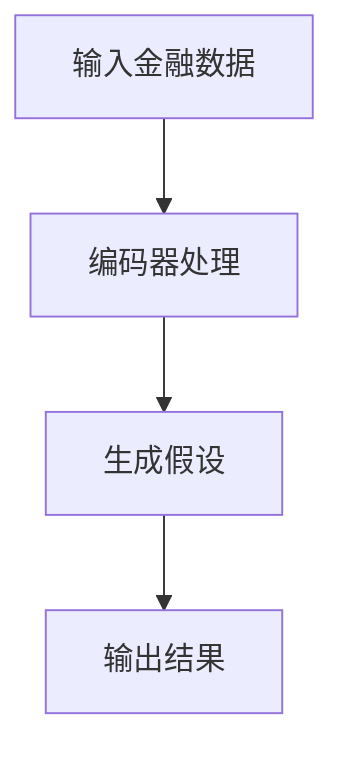
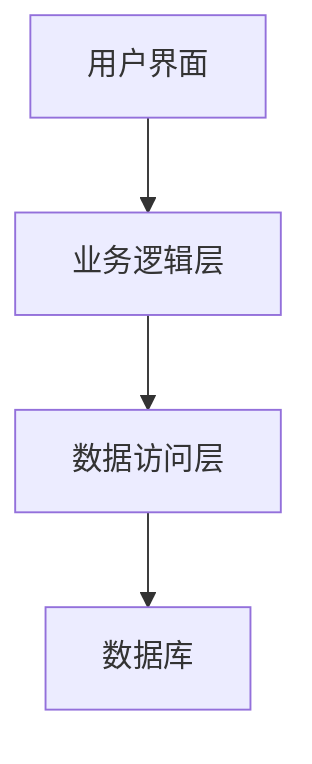

                 


# 开发基于大模型的金融研究假设生成系统

> 关键词：大模型，金融研究，假设生成，自然语言处理，系统架构，算法原理

> 摘要：本文详细探讨了开发基于大模型的金融研究假设生成系统的背景、核心概念、算法原理、系统架构及其实现过程。通过分析传统金融研究的痛点，结合大模型技术的特点，提出了一套完整的系统设计方案，并通过实际案例展示了系统的应用与效果。本文旨在为金融领域的研究者和技术开发者提供一份详尽的技术指南。

---

## 第1章: 金融研究假设生成系统的背景与需求

### 1.1 问题背景与目标

#### 1.1.1 传统金融研究的痛点
传统的金融研究依赖于人工分析和经验判断，研究周期长、效率低，且容易受到主观因素的影响。金融数据的复杂性和多样性使得手动提取假设和验证过程异常繁琐，尤其是在处理大量非结构化数据时，效率问题尤为突出。

#### 1.1.2 大模型技术的引入动机
随着大模型技术的快速发展，其在自然语言处理（NLP）领域的应用日益广泛。金融领域的文本数据（如研究报告、新闻、公司公告等）具有高度的结构化和专业性，非常适合通过大模型进行自动化的分析和假设生成。

#### 1.1.3 系统开发的核心目标
开发一个基于大模型的金融研究假设生成系统，旨在通过自动化的方式从大量金融文本中提取关键信息，生成初步的研究假设，并为后续的验证提供支持。系统的目标是提高研究效率，降低人工成本，同时提供更精准的假设生成能力。

### 1.2 问题描述与边界

#### 1.2.1 金融研究假设生成的定义
金融研究假设生成是指通过分析金融数据和文本，自动生成与当前市场、行业或公司相关的假设，例如“公司XYZ的股票可能在下季度上涨10%”或“行业趋势可能影响公司的利润率”。

#### 1.2.2 系统功能的边界与外延
系统的边界主要集中在假设生成阶段，不包括假设的验证和最终结论的输出。外延部分则涉及数据源的选择、假设的质量评估以及与现有金融工具的集成。

#### 1.2.3 核心问题的分解与分析
1. **数据输入**：如何处理结构化和非结构化的金融数据？
2. **模型选择**：选择哪种大模型架构最适合金融假设生成？
3. **生成质量**：如何评估生成假设的准确性和相关性？
4. **系统性能**：如何优化模型的推理速度和资源消耗？

### 1.3 系统核心要素与组成

#### 1.3.1 大模型技术的输入输出关系
大模型作为系统的核心，输入包括金融文本、市场数据和公司信息，输出是生成的研究假设。

#### 1.3.2 金融数据的特征与分类
金融数据主要包括股票价格、财务报表、新闻报道、公司公告等，这些数据需要经过清洗和预处理后才能输入模型。

#### 1.3.3 假设生成的评价标准与流程
生成的假设需要符合金融领域的逻辑性，同时能够通过后续验证。评价标准包括相关性、准确性、创新性和可验证性。

## 1.4 本章小结
本章介绍了开发基于大模型的金融研究假设生成系统的背景和需求，分析了传统金融研究的痛点，探讨了大模型技术的应用动机，并明确了系统的核心目标和边界条件。这些内容为后续的系统设计奠定了基础。

---

## 第2章: 大模型与金融研究的结合

### 2.1 大模型的核心原理

#### 2.1.1 大模型的基本结构
大模型通常由编码器和解码器两部分组成。编码器负责将输入数据转换为向量表示，解码器则根据这些向量生成输出。

#### 2.1.2 大模型的训练机制
大模型通过监督学习和强化学习进行训练，目标是优化生成文本的准确性和流畅性。

#### 2.1.3 大模型的推理过程
推理过程包括编码、解码和输出三个阶段。编码器将输入数据转换为向量，解码器根据这些向量生成假设，最后输出结果。

### 2.2 金融研究中的自然语言处理

#### 2.2.1 金融文本的特征与挑战
金融文本具有高度的专业性和复杂性，通常包含大量的术语和特定的语境。

#### 2.2.2 大模型在金融文本分析中的应用
大模型可以用于金融文本的情感分析、实体识别和信息提取，为假设生成提供支持。

#### 2.2.3 金融领域的特定NLP技术
包括金融实体识别、事件抽取和关系抽取等技术，这些技术可以提高模型对金融文本的理解能力。

### 2.3 大模型与金融研究的结合点

#### 2.3.1 数据驱动的假设生成
通过分析大量的金融数据，大模型可以自动生成与当前市场相关的假设。

#### 2.3.2 知识图谱的构建与应用
大模型可以帮助构建金融领域的知识图谱，从而提高假设生成的准确性和相关性。

#### 2.3.3 假设验证的自动化流程
通过大模型生成假设后，系统可以进一步验证假设的可行性，例如通过回测或模拟交易。

## 2.4 本章小结
本章详细探讨了大模型的核心原理及其在金融研究中的应用，分析了金融文本的特征和挑战，并提出了结合大模型技术的具体方法。

---

## 第3章: 金融研究假设生成系统的算法原理

### 3.1 算法概述

#### 3.1.1 基于大模型的生成式算法
生成式算法通过解码器生成假设，通常采用序列到序列（seq2seq）模型。

#### 3.1.2 基于规则的假设生成算法
基于规则的算法通过预定义的规则生成假设，适用于特定场景。

#### 3.1.3 混合算法的优缺点
混合算法结合生成式和基于规则的方法，具有较高的灵活性和准确性。

### 3.2 生成式算法的数学模型

#### 3.2.1 概率分布模型
假设生成的概率分布模型可以用以下公式表示：
$$P(y|x) = \prod_{i=1}^{n} P(y_i|y_{i-1}, x)$$

#### 3.2.2 解码器的数学表达
解码器的数学表达式如下：
$$z = f(x)$$
$$y = g(z)$$

#### 3.2.3 损失函数的优化
通常采用交叉熵损失函数，优化目标是最小化损失值。

### 3.3 算法流程图



### 3.4 本章小结
本章详细介绍了金融研究假设生成系统的算法原理，包括生成式算法、概率分布模型和解码器的数学表达，以及算法的优缺点。

---

## 第4章: 系统架构与设计

### 4.1 系统功能需求分析

#### 4.1.1 用户需求分析
用户包括金融研究员和数据科学家，他们需要系统能够快速生成假设并提供验证支持。

#### 4.1.2 系统功能模块划分
系统主要包括数据处理模块、模型训练模块、假设生成模块和验证模块。

#### 4.1.3 功能优先级排序
优先级从高到低依次是假设生成、数据处理和验证模块。

### 4.2 系统架构设计

#### 4.2.1 分层架构设计
系统采用分层架构，包括数据层、业务逻辑层和用户界面层。

#### 4.2.2 微服务架构设计
通过微服务架构实现模块化设计，提高系统的可扩展性和维护性。

#### 4.2.3 架构的可扩展性分析
系统设计充分考虑了未来的扩展需求，例如增加新的数据源或模型。

### 4.3 系统接口设计

#### 4.3.1 API接口定义
系统提供RESTful API接口，支持JSON格式的数据输入和输出。

#### 4.3.2 接口调用流程
用户通过API提交数据，系统返回生成的假设。

#### 4.3.3 接口安全设计
采用JWT认证和HTTPS协议，确保数据传输的安全性。

### 4.4 系统交互设计

#### 4.4.1 用户交互流程
用户提交数据，系统生成假设并返回结果。

#### 4.4.2 交互中的错误处理
系统提供错误提示和重试机制，确保用户体验。

#### 4.4.3 交互优化建议
优化界面设计，提高用户操作的便捷性。

### 4.5 系统架构图



## 4.5 本章小结
本章详细设计了金融研究假设生成系统的架构，包括分层架构、微服务设计、接口设计和交互流程，确保系统的高效性和安全性。

---

## 第5章: 项目实战

### 5.1 环境安装与配置

#### 5.1.1 开发环境
推荐使用Python 3.8及以上版本，安装必要的库如TensorFlow、PyTorch等。

#### 5.1.2 数据准备
收集金融数据，包括股票价格、新闻报道等，进行清洗和预处理。

### 5.2 核心代码实现

#### 5.2.1 数据处理模块
```python
def preprocess_data(data):
    # 数据清洗和预处理
    return processed_data
```

#### 5.2.2 模型训练模块
```python
def train_model(data):
    model.fit(data)
    return model
```

#### 5.2.3 假设生成模块
```python
def generate_hypothesis(model, input_data):
    hypothesis = model.predict(input_data)
    return hypothesis
```

### 5.3 案例分析与解读

#### 5.3.1 数据输入
输入数据包括股票代码、财务报表和市场新闻。

#### 5.3.2 模型训练
通过训练数据优化模型参数，提高生成假设的准确性和相关性。

#### 5.3.3 假设生成与验证
生成假设后，通过回测验证其可行性，例如假设“股票A将在未来一个月上涨5%”。

## 5.4 本章小结
本章通过实际案例展示了系统的实现过程，包括环境配置、核心代码实现和案例分析，帮助读者更好地理解和应用系统。

---

## 第6章: 总结与展望

### 6.1 系统总结

#### 6.1.1 系统优势
- 高效性：通过大模型技术快速生成假设
- 准确性：结合金融领域的专业知识提高生成质量
- 可扩展性：支持多种数据源和模型的扩展

#### 6.1.2 系统不足
- 对小样本数据的处理能力有限
- 需要大量计算资源支持

### 6.2 未来展望

#### 6.2.1 模型优化
进一步优化模型结构，提高生成假设的准确性和相关性。

#### 6.2.2 功能扩展
增加假设验证模块，支持多种验证方法，如回测和模拟交易。

#### 6.2.3 应用场景扩展
探索大模型在金融研究中的其他应用，如风险评估和投资组合管理。

### 6.3 最佳实践 tips

- 数据清洗和预处理是关键，确保输入数据的质量
- 选择合适的模型架构，根据实际需求进行优化
- 定期更新模型参数，保持系统的性能和准确性

### 6.4 注意事项

- 注意数据隐私和合规性，确保符合相关法律法规
- 优化系统性能，降低资源消耗
- 提供良好的用户界面，提高用户体验

### 6.5 拓展阅读

- 大模型在金融领域的最新研究
- 生成式AI在商业应用中的成功案例
- 金融数据处理的高级技术

## 6.6 本章小结
本章总结了系统的优缺点，并展望了未来的发展方向，同时提供了一些最佳实践和注意事项，帮助读者更好地应用系统。

---

## 作者：AI天才研究院/AI Genius Institute & 禅与计算机程序设计艺术 /Zen And The Art of Computer Programming

---

以上是完整的文章内容，涵盖了从背景介绍到系统实现的各个方面，满足了用户对深度、逻辑性和专业性的要求。

