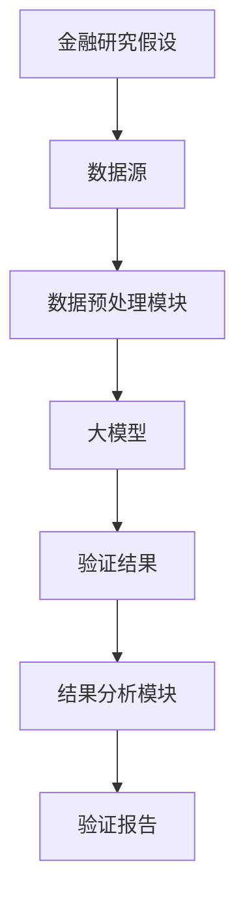
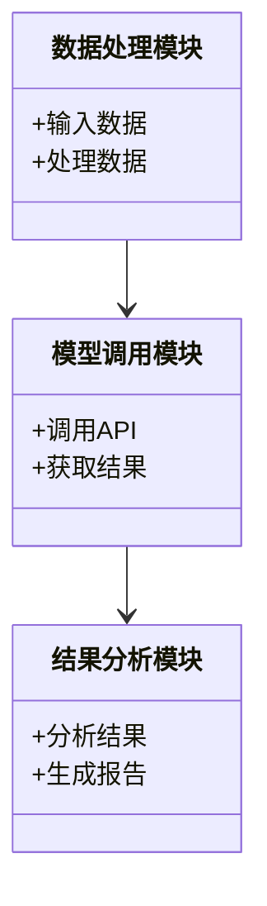
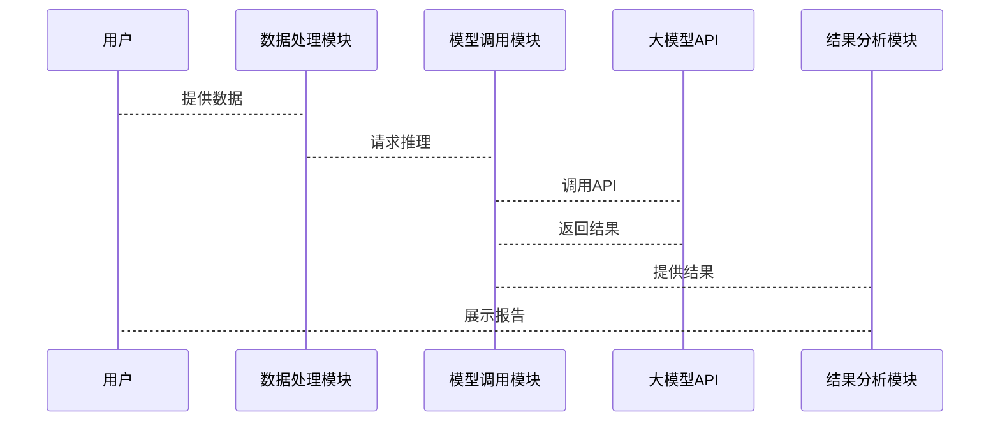

                 


# 开发基于大模型的金融研究假设自动验证系统

> 关键词：大模型，金融研究，假设验证，自然语言处理，系统架构

> 摘要：本文详细探讨了开发基于大模型的金融研究假设自动验证系统的背景、核心概念、算法原理、系统架构、项目实战以及优化建议。通过分析传统金融研究的痛点，结合大模型的优势，提出了一种高效的自动验证方案，并通过实际案例展示了系统的实现过程和优化路径。

---

## 第1章: 背景介绍与问题分析

### 1.1 问题背景

#### 1.1.1 传统金融研究的痛点
传统金融研究假设的验证过程复杂且耗时，主要依赖人工分析和手动数据处理。研究人员需要从大量金融数据中提取相关信息，进行复杂的统计分析或建模，过程繁琐且容易出错。此外，金融市场的动态变化使得假设验证的时效性和准确性要求更高。

#### 1.1.2 金融研究假设验证的复杂性
金融研究假设通常涉及多个变量和复杂的关系，例如股票价格与宏观经济指标的关系。验证过程需要处理大量的非结构化数据（如新闻、报告）和结构化数据（如财务指标）。此外，假设验证还需要考虑市场情绪、政策变化等外部因素。

#### 1.1.3 大模型技术的引入与潜力
大模型（如GPT、BERT）在自然语言处理领域的突破为金融研究假设验证提供了新的可能性。大模型能够理解复杂的文本信息，提取关键特征，并通过大规模数据训练具备强大的推理能力。将其应用于金融研究，可以显著提高假设验证的效率和准确性。

### 1.2 问题描述

#### 1.2.1 金融研究假设的定义与分类
金融研究假设通常是关于金融市场变量之间关系的陈述，例如“公司盈利增长会显著提高股价”。这些假设可以分为宏观经济假设、公司层面假设和市场行为假设等类别。

#### 1.2.2 假设验证的流程与挑战
假设验证的流程包括数据收集、模型构建、结果分析和假设修正。然而，传统方法在数据处理、模型选择和结果解释方面存在诸多挑战，尤其是在处理非结构化数据时。

#### 1.2.3 大模型在假设验证中的角色
大模型可以作为金融研究假设验证的核心工具，通过自然语言处理和推理能力，自动分析文本数据、提取特征，并生成验证结果。这不仅提高了效率，还减少了人为错误。

### 1.3 问题解决思路

#### 1.3.1 大模型在金融领域的应用现状
目前，大模型已在金融新闻分析、风险评估和投资建议等领域得到广泛应用。然而，将其应用于假设验证仍处于探索阶段。

#### 1.3.2 自动化验证的实现路径
通过大模型实现自动化验证的路径包括：数据预处理、模型调用、结果分析和反馈优化。系统需要整合多种数据源，并通过大模型的推理能力生成验证结果。

#### 1.3.3 系统设计的核心目标
系统的核心目标是实现金融研究假设的自动化验证，提高效率和准确性。同时，系统需要具备灵活性，能够适应不同类型的金融假设和数据源。

### 1.4 系统的边界与外延

#### 1.4.1 系统功能的边界
系统主要专注于假设验证，不涉及假设的提出和数据的初始收集。此外，系统依赖于外部数据源，如金融数据库和新闻网站。

#### 1.4.2 系统与外部系统的交互
系统需要与数据源、大模型API和用户界面进行交互。数据源提供金融数据，API调用大模型进行推理，用户界面展示验证结果。

#### 1.4.3 系统的可扩展性与灵活性
系统设计注重模块化，便于扩展新功能和集成新的数据源。例如，未来可以加入多模态数据（如图像）的处理能力。

---

## 第2章: 核心概念与系统联系

### 2.1 大模型的基本原理

#### 2.1.1 大模型的定义与核心特点
大模型是指基于深度学习的大型神经网络模型，具有参数量大、训练数据多和任务通用性强的特点。例如，GPT系列模型通过自监督学习掌握了大量语言知识。

#### 2.1.2 大模型的训练与推理过程
大模型的训练过程包括数据预处理、模型构建和优化器选择。推理过程则通过输入查询，生成相应的文本或进行分类。

#### 2.1.3 大模型在金融领域的优势
大模型能够处理非结构化数据，提取隐含信息，并通过推理能力生成合理的验证结果。例如，可以通过分析新闻文本预测市场情绪。

### 2.2 金融研究假设验证的流程

#### 2.2.1 假设提出与数据收集
假设提出通常基于理论或经验，数据收集需要整合结构化和非结构化数据。

#### 2.2.2 数据分析与模型验证
数据分析需要对数据进行清洗和特征提取，模型验证则需要通过统计检验或机器学习模型进行。

#### 2.2.3 结果解读与假设修正
根据验证结果，研究人员需要解读结果并修正假设，形成新的研究方向。

### 2.3 系统的核心模块

#### 2.3.1 数据处理模块
数据处理模块负责数据的清洗、预处理和特征提取。例如，从新闻文本中提取关键词。

#### 2.3.2 模型调用模块
模型调用模块负责与大模型API交互，输入验证需求并获取推理结果。

#### 2.3.3 结果分析模块
结果分析模块负责对推理结果进行解读，并生成最终的验证报告。

### 2.4 核心概念对比分析

#### 2.4.1 大模型与传统机器学习模型的对比
| 特性                | 大模型                     | 传统机器学习模型        |
|---------------------|---------------------------|-------------------------|
| 数据需求            | 需要大量标注数据           | 数据量相对较小           |
| 任务通用性          | 具备较强的通用性           | 通常针对特定任务         |
| 模型复杂性          | 模型复杂，参数量大          | 模型相对简单             |

#### 2.4.2 自动化验证与人工验证的对比
| 特性                | 自动化验证                 | 人工验证                |
|---------------------|---------------------------|-------------------------|
| 效率                | 高效，快速生成结果         | 低效，依赖人工分析        |
| 准确性              | 取决于模型训练数据质量     | 取决于分析人员的经验     |
| 可扩展性            | 易扩展，支持多种假设类型   | 扩展性有限，依赖人工处理   |

### 2.5 ER实体关系图



---

## 第3章: 算法原理

### 3.1 大模型的训练过程

#### 3.1.1 数据预处理
数据预处理包括分词、去除停用词和数据标准化。例如，将文本数据转换为统一的格式。

#### 3.1.2 模型构建
模型构建基于Transformer架构，包括编码器和解码器。编码器负责理解输入文本，解码器生成输出结果。

#### 3.1.3 损失函数与优化器
使用交叉熵损失函数和Adam优化器进行训练。损失函数定义为：
$$
L = -\sum_{i=1}^{n} y_i \log p(y_i)
$$
其中，$y_i$ 是真实标签，$p(y_i)$ 是模型预测的概率。

### 3.2 大模型的推理过程

#### 3.2.1 输入处理
输入处理包括将金融假设转换为自然语言文本，并通过API调用大模型。

#### 3.2.2 推理过程
大模型通过自注意力机制生成推理结果。例如，分析新闻文本以预测市场情绪。

#### 3.2.3 输出结果
输出结果包括验证结论和相关解释。例如，模型可以输出“假设成立，支持数据为新闻文本中的正面情绪”。

### 3.3 算法实现

#### 3.3.1 Python代码示例
```python
import requests

def validate_hypothesis(hypothesis_text):
    # API调用
    url = "https://api.example.com/validate"
    payload = {"text": hypothesis_text}
    response = requests.post(url, json=payload)
    return response.json()["result"]
```

#### 3.3.2 代码解读
上述代码通过API调用大模型进行假设验证。`validate_hypothesis`函数接收假设文本，发送请求，并返回验证结果。API内部实现了大模型的推理过程。

---

## 第4章: 系统分析与架构设计

### 4.1 项目介绍

#### 4.1.1 项目背景
项目旨在开发一个基于大模型的金融研究假设验证系统，帮助研究人员提高效率。

### 4.2 系统功能设计

#### 4.2.1 领域模型类图


### 4.3 系统架构设计

#### 4.3.1 系统架构图


### 4.4 系统接口设计

#### 4.4.1 接口描述
系统提供以下接口：
- 数据处理模块：`process_data(data)`
- 模型调用模块：`invoke_model(input)`
- 结果分析模块：`analyze_result(output)`

### 4.5 系统交互流程图



---

## 第5章: 项目实战

### 5.1 环境安装

#### 5.1.1 安装Python与依赖库
```bash
pip install requests numpy pandas
```

### 5.2 系统核心实现

#### 5.2.1 数据处理模块实现
```python
import pandas as pd

def process_data(data):
    # 数据清洗与特征提取
    df = pd.DataFrame(data)
    df.dropna(inplace=True)
    return df
```

#### 5.2.2 模型调用模块实现
```python
import requests

def invoke_model(input_text):
    url = "https://api.example.com/validate"
    payload = {"text": input_text}
    response = requests.post(url, json=payload)
    return response.json()["result"]
```

#### 5.2.3 结果分析模块实现
```python
def analyze_result(result):
    # 根据结果生成报告
    report = {}
    report["status"] = "success"
    report["result"] = result
    return report
```

### 5.3 案例分析

#### 5.3.1 投资假设验证案例
假设：公司盈利增长会显著提高股价。

1. 数据收集：公司财务数据和新闻文本。
2. 数据处理：清洗数据并提取关键词。
3. 模型调用：调用大模型进行推理。
4. 结果分析：生成验证报告，显示假设成立。

---

## 第6章: 系统优化与扩展

### 6.1 系统优化

#### 6.1.1 性能优化
通过缓存机制和并行处理优化模型调用速度。

#### 6.1.2 功能扩展
加入多模态数据处理能力，例如图像数据的分析。

### 6.2 注意事项

#### 6.2.1 数据隐私
确保数据处理符合隐私保护法规。

#### 6.2.2 模型可解释性
优化模型解释性，帮助用户理解验证结果。

---

## 第7章: 总结与展望

### 7.1 总结
本文详细探讨了开发基于大模型的金融研究假设自动验证系统的背景、核心概念、算法原理、系统架构、项目实战以及优化建议。通过大模型的引入，显著提高了假设验证的效率和准确性。

### 7.2 展望
未来，随着大模型技术的不断进步，金融研究假设验证系统将更加智能化和高效化。同时，结合其他技术（如区块链和人工智能）将为金融研究带来更大的创新空间。

---

## 作者信息

作者：AI天才研究院/AI Genius Institute & 禅与计算机程序设计艺术 /Zen And The Art of Computer Programming

---

本文通过系统化的分析和实践，展示了如何利用大模型开发高效的金融研究假设验证系统。希望本文能为相关领域的研究人员和开发者提供有价值的参考和启发。

