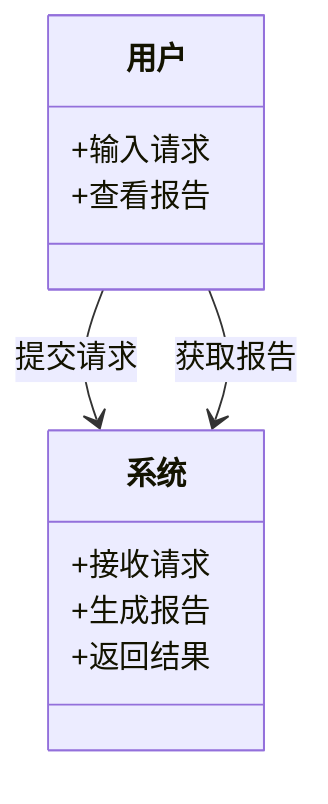

                 


# 开发基于大模型的金融研究报告生成系统

> 关键词：大模型，金融研究报告，生成系统，自然语言处理，深度学习，文本生成

> 摘要：本文详细探讨了基于大模型的金融研究报告生成系统的开发过程，从背景介绍、核心概念、算法原理到系统设计和项目实战，全面解析了如何利用大模型技术实现高效、智能的金融报告生成。本文旨在为金融领域的技术开发人员和研究人员提供理论基础和实践指导。

---

# 第一部分: 大模型与金融研究报告生成的背景

## 第1章: 大模型的定义与特点

### 1.1 大模型的定义与特点

#### 1.1.1 大模型的定义
大模型（Large Language Model, LLM）是指基于深度学习技术构建的自然语言处理模型，通常包含大量的参数（如数十亿甚至更多），能够理解和生成人类语言。大模型的核心是Transformer架构，通过自注意力机制（Self-Attention）和前馈神经网络（Feedforward Neural Networks）实现高效的文本处理。

#### 1.1.2 大模型的核心特点
1. **大规模训练数据**：大模型通常使用海量的文本数据进行训练，包括书籍、网页、论文等，能够捕捉语言的复杂模式。
2. **自注意力机制**：通过自注意力机制，模型可以理解文本中词语之间的关系，捕捉长距离依赖。
3. **生成能力**：大模型能够生成连贯且有意义的文本，适用于多种任务，如文本生成、问答系统、机器翻译等。
4. **可微调性**：大模型可以在特定任务上进行微调（Fine-tuning），以适应不同领域的需求。

#### 1.1.3 大模型与传统AI的区别
传统的AI系统通常依赖于规则和模板，而大模型通过数据驱动的方式，能够自动学习语言的规律和模式。大模型的优势在于其通用性和灵活性，能够处理复杂的金融场景。

### 1.2 金融研究报告生成的背景

#### 1.2.1 金融研究报告的定义与特点
金融研究报告是对金融市场、公司、行业或经济趋势进行分析和预测的文本。这类报告通常需要结合大量的数据、市场动态和专业分析，生成高质量的报告需要专业知识和经验。

#### 1.2.2 传统金融研究报告生成的挑战
1. **数据处理复杂**：金融数据通常涉及多种来源和格式，处理起来较为复杂。
2. **时间敏感性**：金融市场变化迅速，报告需要快速生成。
3. **专业性要求高**：金融报告需要专业的知识和分析能力。
4. **人工成本高**：传统报告生成依赖人工撰写，效率较低。

#### 1.2.3 大模型在金融研究报告生成中的优势
1. **高效生成**：大模型可以快速生成高质量的金融报告，减少人工成本。
2. **数据驱动**：大模型能够利用海量数据，提供更准确的分析和预测。
3. **灵活性**：大模型可以根据需求快速调整生成内容，适应不同的市场变化。

### 1.3 本章小结
本章介绍了大模型的定义、特点及其在金融研究报告生成中的优势。通过对比传统AI和大模型，突出了大模型在金融领域的潜力和应用价值。

---

# 第二部分: 大模型的核心概念与联系

## 第2章: 大模型的核心原理

### 2.1 大模型的训练与推理过程

#### 2.1.1 大模型的训练流程
1. **数据预处理**：对训练数据进行清洗、分词和格式化处理。
2. **模型初始化**：构建基于Transformer架构的模型，并初始化参数。
3. **训练过程**：通过反向传播算法（Backpropagation）优化模型参数，最小化预测误差。
4. **评估与调整**：通过验证集评估模型性能，并进行超参数调整。

#### 2.1.2 大模型的推理机制
1. **输入处理**：将用户输入的文本转换为模型可处理的格式。
2. **生成过程**：模型通过自注意力机制生成文本，通常采用贪心算法或采样方法。
3. **输出处理**：将生成的文本转换为人类可读的格式。

#### 2.1.3 大模型的文本生成原理
大模型通过概率分布生成文本，每个位置的生成概率基于前面的词语。生成过程通常采用解码器（Decoder）结构，逐步生成文本。

### 2.2 大模型在金融领域的应用

#### 2.2.1 金融文本分析
1. **情感分析**：分析市场情绪，帮助投资者判断市场走势。
2. **关键词提取**：提取报告中的关键信息，如公司名称、行业趋势等。

#### 2.2.2 金融数据处理
1. **数据清洗**：对金融数据进行去噪和标准化处理。
2. **数据预测**：基于历史数据预测未来的价格走势。

#### 2.2.3 金融报告生成
1. **报告结构生成**：根据模板生成报告的框架和内容。
2. **内容优化**：优化报告的语言表达，使其更符合专业要求。

### 2.3 大模型与金融报告生成的关系

#### 2.3.1 大模型作为金融报告生成的核心工具
大模型通过文本生成能力，为金融报告的自动化生产提供了技术支持。

#### 2.3.2 大模型在金融报告生成中的具体应用
1. **市场分析**：生成市场趋势分析报告。
2. **公司分析**：生成公司财务分析报告。
3. **行业报告**：生成行业动态分析报告。

#### 2.3.3 大模型对金融报告生成的潜在影响
1. **提升效率**：通过自动化生成，减少人工成本。
2. **提高准确性**：基于海量数据，提供更准确的分析结果。
3. **增强创新性**：生成独特的见解和预测。

### 2.4 本章小结
本章详细介绍了大模型的核心原理及其在金融领域的具体应用，突出了大模型在金融报告生成中的重要性。

---

# 第三部分: 大模型的算法原理

## 第3章: 大模型的自然语言处理算法

### 3.1 自然语言处理的核心算法

#### 3.1.1 Transformer模型


#### 3.1.2 BERT模型


#### 3.1.3 GPT模型


### 3.2 大模型的文本生成算法

#### 3.2.1 解码器


---

# 第四部分: 系统分析与架构设计

## 第4章: 金融研究报告生成系统的架构设计

### 4.1 系统功能设计

#### 4.1.1 领域模型



#### 4.1.2 系统架构设计

```mermaid
graph LR
    A[用户] --> B[前端]
    B --> C[后端]
    C --> D[数据库]
    C --> E[大模型服务]
    D --> E: 数据查询
    E --> C: 返回结果
    C --> B: 返回报告
```

### 4.2 系统接口设计

#### 4.2.1 接口描述
1. **API接口**：用于接收用户的输入请求和返回生成的报告。
2. **数据接口**：用于与数据库交互，获取生成报告所需的数据。

#### 4.2.2 接口示例

```http
POST /generate_report
Content-Type: application/json

{
    "input": "分析过去一年的市场趋势",
    "parameters": {
        "length": 500,
        "temperature": 0.7
    }
}
```

---

# 第五部分: 项目实战

## 第5章: 金融研究报告生成系统的实现

### 5.1 环境安装

```bash
pip install transformers
pip install torch
pip install mermaid-js
```

### 5.2 系统核心实现

#### 5.2.1 模型加载

```python
from transformers import AutoModelForCausalLM, AutoTokenizer

model_name = "gpt2-large"
model = AutoModelForCausalLM.from_pretrained(model_name)
tokenizer = AutoTokenizer.from_pretrained(model_name)
```

#### 5.2.2 文本生成

```python
def generate_report(prompt, max_length=500):
    inputs = tokenizer.encode(prompt, return_tensors="pt")
    outputs = model.generate(inputs, max_length=max_length, temperature=0.7)
    report = tokenizer.decode(outputs[0], skip_special_tokens=True)
    return report
```

### 5.3 实际案例分析

#### 5.3.1 案例描述
假设用户输入“分析过去一年的市场趋势”，系统生成一份详细的市场分析报告。

#### 5.3.2 生成结果

```text
过去一年，市场整体呈现上升趋势，尤其在科技和金融行业表现突出。建议投资者关注未来科技领域的进一步发展。
```

### 5.4 项目小结
本章通过实际案例展示了如何利用大模型生成金融报告，强调了系统实现的关键步骤和注意事项。

---

# 第六部分: 总结与展望

## 第6章: 总结与展望

### 6.1 本章总结
本文详细探讨了基于大模型的金融研究报告生成系统的开发过程，从背景介绍到系统实现，全面解析了大模型在金融领域的应用潜力。

### 6.2 未来展望
随着大模型技术的不断进步，金融研究报告生成系统将更加智能化和高效化。未来的研究方向包括优化模型性能、提升生成质量以及拓展更多的应用场景。

### 6.3 最佳实践 Tips
1. 在实际应用中，建议对生成的报告进行人工校验，确保准确性。
2. 注意数据隐私和安全问题，避免敏感信息泄露。
3. 根据具体需求对模型进行微调，以提升生成效果。

### 6.4 小结
通过本文的介绍，读者可以全面了解基于大模型的金融研究报告生成系统的开发过程和应用价值。

---

作者：AI天才研究院/AI Genius Institute & 禅与计算机程序设计艺术 /Zen And The Art of Computer Programming

