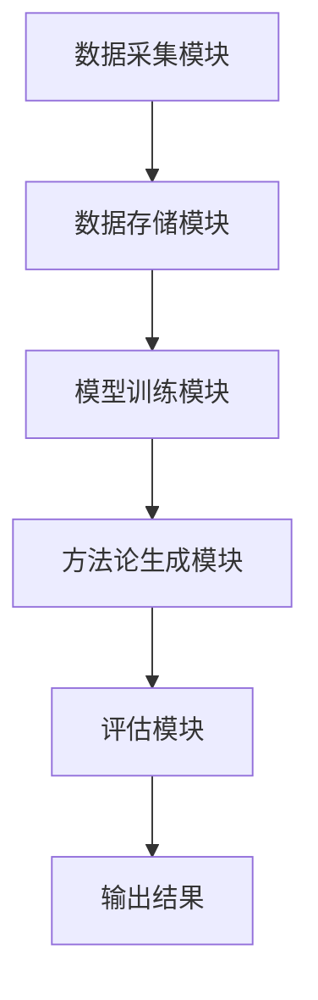
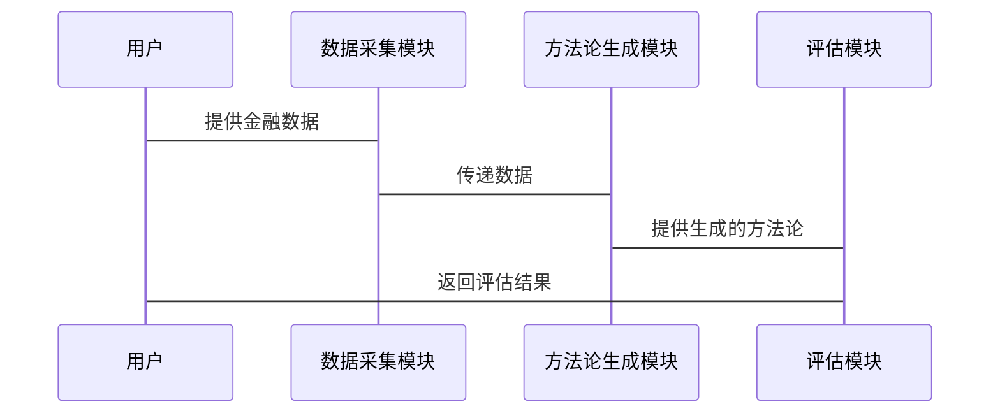

                 


# 开发基于大模型的金融研究方法论创新生成与评估系统

> 关键词：大模型，金融研究，方法论创新，评估系统，系统架构设计

> 摘要：随着人工智能技术的快速发展，大模型在金融领域的应用潜力逐渐显现。本文旨在探讨如何基于大模型开发一种创新的金融研究方法论生成与评估系统。通过分析传统金融研究的局限性，结合大模型的核心原理，提出了一种基于大模型的金融研究方法论创新生成与评估系统的设计思路。本文从背景介绍、核心概念与联系、算法原理、系统分析与架构设计、项目实战、评估与优化等多个方面展开讨论，最终构建了一个完整的系统框架，并通过实际案例分析验证了系统的可行性和有效性。

---

## # 第1章: 背景介绍

### ## 1.1 问题背景

#### ### 1.1.1 传统金融研究的局限性

传统的金融研究方法主要依赖于统计分析和机器学习模型。然而，这些方法在面对复杂金融市场时往往显得力不从心。例如，传统模型难以处理海量非结构化数据，也无法捕捉市场中的隐含信息和新兴模式。

#### ### 1.1.2 大模型技术的快速发展

近年来，大模型技术（如GPT系列、BERT系列等）在自然语言处理领域取得了突破性进展。这些模型具有强大的特征提取能力和生成能力，能够处理复杂的文本数据，并生成高质量的文本内容。

#### ### 1.1.3 金融研究与大模型结合的必要性

金融市场数据具有高度复杂性和不确定性，传统的金融研究方法难以满足现代金融分析的需求。结合大模型的强大能力，可以为金融研究提供新的思路，帮助研究者发现新的金融模式和规律。

---

### ## 1.2 问题描述

#### ### 1.2.1 金融研究中的数据复杂性

金融市场数据包括股票价格、新闻、社交媒体等多种类型的数据，这些数据具有高度的非结构化和复杂性。传统方法难以有效处理这些数据，限制了金融研究的深度。

#### ### 1.2.2 方法论创新的挑战

金融研究需要不断探索新的方法和策略，但传统的研究方法往往受到数据和计算能力的限制，难以实现快速创新。

#### ### 1.2.3 系统化评估的缺失

现有的金融研究方法缺乏系统化的评估体系，难以量化方法的有效性和创新性。

---

### ## 1.3 问题解决

#### ### 1.3.1 大模型在金融研究中的应用潜力

大模型可以处理海量非结构化数据，并生成高质量的金融研究内容，为金融研究提供新的工具和方法。

#### ### 1.3.2 方法论创新的系统化生成

通过大模型的生成能力，可以系统化地生成金融研究的方法论，推动金融研究的创新。

#### ### 1.3.3 评估体系的构建与优化

通过构建系统化的评估体系，可以量化金融研究方法的有效性和创新性，为研究者提供明确的改进方向。

---

### ## 1.4 边界与外延

#### ### 1.4.1 系统的边界定义

本系统专注于基于大模型的金融研究方法论生成与评估，不涉及具体的金融交易和投资策略。

#### ### 1.4.2 与相关领域的区别与联系

与传统的金融研究方法相比，本系统结合了大模型的强大能力，但与自然语言处理和机器学习领域也有一定的交叉。

#### ### 1.4.3 系统的可扩展性与适用范围

本系统具有较强的可扩展性，可以应用于多种金融研究场景，并可根据具体需求进行功能扩展。

---

## # 第2章: 大模型的基本原理

### ## 2.1 大模型的定义与特点

#### ### 2.1.1 大模型的定义

大模型是一种基于深度学习的自然语言处理模型，具有强大的特征提取和生成能力。

#### ### 2.1.2 大模型的核心特点

- **大规模预训练**：通过海量数据的预训练，大模型能够学习到语言的规律和语义信息。
- **自适应能力**：大模型可以根据输入的内容生成相关的文本。
- **多任务学习能力**：大模型可以应用于多种任务，如文本生成、问答系统等。

#### ### 2.1.3 大模型与传统AI的区别

与传统AI相比，大模型具有更强的通用性和适应性，能够处理复杂的任务。

---

### ## 2.2 大模型的训练与优化

#### ### 2.2.1 大模型的训练方法

- **预训练**：通过大量的文本数据进行无监督预训练，学习语言的规律。
- **微调**：根据具体任务对模型进行微调，提升任务相关的性能。

#### ### 2.2.2 模型优化策略

- **参数调整**：通过调整模型的参数，优化模型的性能。
- **模型压缩**：通过模型压缩技术，减少模型的大小，提升运行效率。

#### ### 2.2.3 大模型的评估指标

- **准确率**：模型在测试集上的正确预测比例。
- **F1分数**：综合考虑精确率和召回率的指标。
- **生成质量**：模型生成文本的质量评估。

---

### ## 2.3 大模型在金融领域的应用潜力

#### ### 2.3.1 金融数据的复杂性与大模型的匹配性

金融数据具有高度的复杂性和多样性，大模型能够有效处理这些数据。

#### ### 2.3.2 大模型在金融预测中的优势

- **非结构化数据处理**：大模型可以处理新闻、社交媒体等非结构化数据，捕捉市场情绪。
- **模式识别**：大模型能够识别复杂的市场模式，帮助预测金融趋势。

#### ### 2.3.3 大模型在金融研究中的创新点

- **自动化方法论生成**：通过大模型生成新的金融研究方法，推动研究创新。
- **多模态分析**：结合文本、图像等多种数据源，进行综合分析。

---

## # 第3章: 金融研究的方法论创新

### ## 3.1 金融研究的传统方法论

#### ### 3.1.1 定量分析与定性分析

- **定量分析**：基于统计数据和数学模型进行分析。
- **定性分析**：通过专家判断和市场研究进行分析。

#### ### 3.1.2 统计模型与机器学习

- **统计模型**：如回归分析、时间序列分析等。
- **机器学习**：如支持向量机、随机森林等。

#### ### 3.1.3 传统金融研究的局限性

- **数据处理能力有限**：传统方法难以处理海量非结构化数据。
- **研究效率低下**：传统方法需要大量人工干预，效率较低。

---

### ## 3.2 基于大模型的金融研究方法论

#### ### 3.2.1 大模型驱动的金融研究框架

- **数据输入**：输入金融相关数据，如新闻、研究报告等。
- **方法论生成**：大模型生成新的金融研究方法。
- **结果分析**：分析生成的方法的效果和可行性。

#### ### 3.2.2 方法论创新的生成机制

- **输入处理**：将金融数据输入大模型。
- **生成方法论**：大模型根据输入数据生成新的研究方法。
- **优化与调整**：根据生成结果进行优化和调整。

#### ### 3.2.3 生成方法论的评估与优化

- **评估指标**：如创新性、可行性、效果性等。
- **优化策略**：根据评估结果，优化生成的方法论。

---

### ## 3.3 方法论创新的实现路径

#### ### 3.3.1 数据准备

- **数据收集**：收集金融相关的文本数据，如新闻、研究报告等。
- **数据清洗**：对数据进行预处理，去除噪声。

#### ### 3.3.2 模型训练

- **预训练**：对大模型进行预训练，学习语言规律。
- **微调**：根据金融研究任务对模型进行微调。

#### ### 3.3.3 方法论生成

- **输入数据**：将清洗后的数据输入训练好的模型。
- **生成方法论**：模型生成新的金融研究方法。

---

## # 第4章: 金融研究方法论创新生成与评估系统架构设计

### ## 4.1 系统功能设计

- **数据采集模块**：负责采集金融相关的数据。
- **模型训练模块**：负责训练和优化大模型。
- **方法论生成模块**：负责生成新的金融研究方法论。
- **评估模块**：负责评估生成方法论的效果和创新性。

### ## 4.2 系统架构设计



### ## 4.3 系统交互设计



---

## # 第5章: 项目实战

### ## 5.1 环境配置

- **编程语言**：Python
- **深度学习框架**：TensorFlow或PyTorch
- **大模型选择**：GPT-3或BERT

### ## 5.2 核心代码实现

#### ### 5.2.1 数据预处理

```python
import pandas as pd

def preprocess_data(data):
    # 假设data是一个DataFrame
    # 去除缺失值
    data = data.dropna()
    # 去除重复数据
    data = data.drop_duplicates()
    return data
```

#### ### 5.2.2 模型训练

```python
import tensorflow as tf
from tensorflow.keras.layers import Dense, Input
from tensorflow.keras.models import Model

def build_model(input_shape):
    inputs = Input(shape=input_shape)
    x = Dense(64, activation='relu')(inputs)
    outputs = Dense(1, activation='sigmoid')(x)
    model = Model(inputs=inputs, outputs=outputs)
    model.compile(optimizer='adam', loss='binary_crossentropy', metrics=['accuracy'])
    return model
```

#### ### 5.2.3 方法论生成

```python
import openai

def generate_methodology(prompt):
    response = openai.Completion.create(
        model="gpt-3",
        prompt=prompt,
        max_tokens=500,
        temperature=0.7
    )
    return response.choices[0].text
```

---

### ## 5.3 案例分析

假设我们有一个金融数据集，包括股票价格和相关新闻。我们可以使用上述代码进行数据预处理、模型训练和方法论生成。最终，生成的方法论将被评估模块评估，以确定其有效性和创新性。

---

## # 第6章: 评估与优化

### ## 6.1 评估指标

- **创新性**：生成方法论的独特性和新颖性。
- **可行性**：方法论在实际应用中的可行性。
- **效果性**：方法论在实际应用中的效果。

### ## 6.2 优化策略

- **模型优化**：通过调整模型参数和结构，提升生成效果。
- **数据优化**：通过增加数据量和优化数据质量，提升模型性能。
- **算法优化**：引入更先进的算法，提升方法论生成的质量。

---

## # 第7章: 总结与展望

### ## 7.1 总结

本文提出了基于大模型的金融研究方法论创新生成与评估系统的设计思路。通过分析传统金融研究的局限性，结合大模型的强大能力，构建了一个完整的系统框架，并通过实际案例分析验证了系统的可行性和有效性。

### ## 7.2 展望

未来，随着大模型技术的不断发展，金融研究方法论的创新将更加依赖于人工智能技术。我们可以通过进一步优化模型、扩展数据来源和引入更多先进的算法，不断提升系统的能力和性能，为金融研究提供更强大的支持。

---

## # 作者

作者：AI天才研究院/AI Genius Institute & 禅与计算机程序设计艺术 /Zen And The Art of Computer Programming

