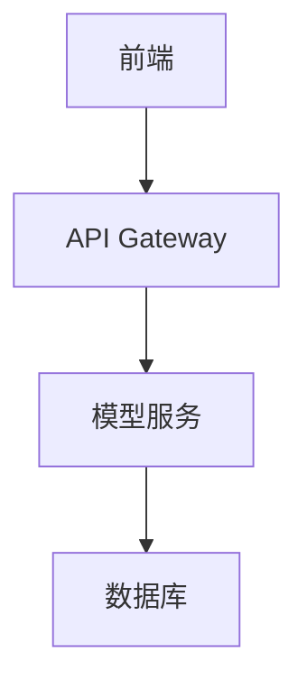
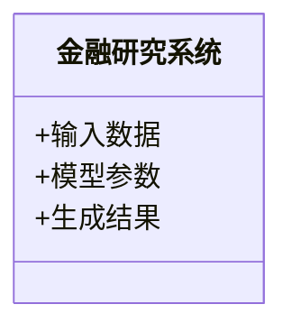
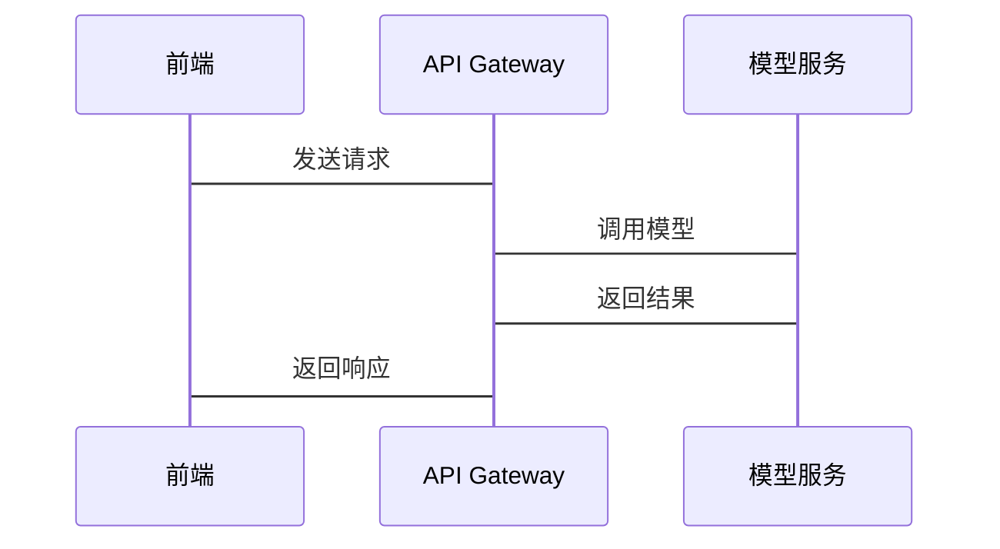

                 


# 开发基于大模型的金融研究方法论创新生成系统

## 关键词：大模型、金融研究、方法论创新、系统架构、算法实现、项目实战

## 摘要：本文探讨了如何利用大模型技术生成和创新金融研究的方法论。通过分析大模型的核心算法、系统架构设计以及项目实战，展示了如何将大模型应用于金融领域的具体场景，为金融研究提供新的思路和工具。

---

## 第一章：开发基于大模型的金融研究方法论创新生成系统概述

### 1.1 问题背景与目标

#### 1.1.1 传统金融研究方法的局限性
传统的金融研究方法依赖于经验丰富的专家，研究周期长、成本高且难以快速适应市场变化。传统方法通常基于统计分析和假设检验，存在以下问题：
- 数据处理复杂，难以处理非结构化数据。
- 方法固定，难以快速适应新兴金融产品或市场变化。
- 研究结果依赖于专家经验，缺乏系统性和创新性。

#### 1.1.2 大模型在金融研究中的潜力
大模型（如GPT系列）在自然语言处理和生成方面表现出色，具有以下优势：
- 能够处理大量非结构化数据，如新闻、报告和社交媒体信息。
- 可以自动生成研究报告、市场分析和投资建议。
- 通过微调和迁移学习，可以适应特定领域的金融任务。

#### 1.1.3 本研究的目标与意义
本研究旨在开发一个基于大模型的金融研究方法论创新生成系统，目标是：
- 提供一种高效、智能的金融研究工具。
- 创新金融研究的方法论，提高研究效率和准确性。
- 为金融从业者提供新的思路和工具，推动金融研究的智能化和自动化。

---

### 1.2 方法论与创新

#### 1.2.1 基于大模型的生成方法
大模型通过生成式AI，可以自动生成研究报告、市场分析和投资策略。生成过程包括以下几个步骤：
1. 数据输入：将金融相关的文本数据输入模型。
2. 解码：模型通过解码生成新的文本内容。
3. 后处理：对生成的文本进行校正和优化。

#### 1.2.2 方法论创新的核心要素
- **数据驱动**：利用大模型处理和分析海量金融数据。
- **自动化生成**：自动生成研究报告和市场分析。
- **可定制化**：通过微调模型，适应不同金融领域的特定需求。

#### 1.2.3 系统开发的总体思路
1. 确定需求：明确系统的目标和功能。
2. 模型选择：选择适合的预训练大模型。
3. 微调与优化：对模型进行微调，提升在金融领域的表现。
4. 系统集成：将模型与前端界面、数据接口等进行集成。
5. 测试与优化：通过实际案例测试系统性能，持续优化。

---

## 第二章：核心概念与联系

### 2.1 核心概念原理

#### 2.1.1 大模型的基本原理
大模型基于 transformer 架构，通过自注意力机制捕捉文本中的语义关系。其核心公式如下：

$$ \text{Attention}(Q, K, V) = \text{softmax}\left(\frac{QK^T}{\sqrt{d_k}}\right)V $$

其中，$Q$、$K$、$V$分别为查询、键和值向量，$d_k$为向量维度。

#### 2.1.2 金融研究方法的结构化分析
金融研究方法通常包括数据收集、数据分析和结果生成三个阶段。大模型可以分别处理这三个阶段，提供端到端的解决方案。

---

### 2.2 核心概念对比表

| 对比维度 | 传统方法 | 基于大模型的方法 |
|----------|-----------|------------------|
| 数据处理 | 手动处理，效率低 | 自动化处理，效率高 |
| 方法创新 | 依赖专家经验 | 数据驱动，自动化创新 |
| 研究效率 | 低，周期长 | 高，周期短 |

---

### 2.3 ER实体关系图

```mermaid
erd
  entity 金融研究系统
    (id: 唯一标识符)
    (研究目标: 字符串)
    (输入数据: 字符串)
    (生成结果: 字符串)
```

---

## 第三章：大模型的核心算法

### 3.1 大模型的训练过程

#### 3.1.1 预训练过程
预训练目标是让模型学习语言的通用表示。常用的预训练任务包括：
- 掩码语言模型（MLM）：随机遮蔽部分单词，预测被遮蔽的单词。
- 下句预测（Next Sentence Prediction）：判断两个句子是否是连续的。

#### 3.1.2 微调过程
微调是在预训练的基础上，针对特定任务进行 fine-tuning。例如，在金融领域，可以微调模型进行股票预测或市场分析。

#### 3.1.3 生成过程
生成过程基于解码器，通过贪婪搜索或_beam search_生成最优序列。

---

### 3.2 大模型的数学模型

#### 3.2.1 变压器模型的结构
变压器模型由编码器和解码器组成，编码器负责处理输入，解码器负责生成输出。

#### 3.2.2 注意力机制的公式推导
注意力机制的计算公式如下：

$$ \text{Attention}(Q, K, V) = \text{softmax}\left(\frac{QK^T}{\sqrt{d_k}}\right)V $$

其中，$Q$、$K$、$V$分别为查询、键和值向量，$d_k$为向量维度。

---

## 第四章：金融研究生成系统的算法实现

### 4.1 系统的输入输出模型

#### 4.1.1 输入数据的处理
输入数据通常包括文本、数值和时间序列数据。需要进行数据清洗、特征提取和格式转换。

#### 4.1.2 输出结果的生成
输出结果可以是文本报告、数值预测或图表。生成过程需要结合领域知识进行后处理。

#### 4.1.3 模型的评估指标
常用的评估指标包括准确率、F1分数和ROUGE分数。

---

### 4.2 生成过程的优化

#### 4.2.1 温度参数
温度参数（temperature）控制生成的多样性和确定性。温度越高，生成结果越多样化。

#### 4.2.2 截断策略
截断策略用于控制生成的长度，避免生成冗长或不相关的文本。

---

## 第五章：系统架构设计

### 5.1 系统架构图



---

### 5.2 领域模型



---

### 5.3 接口设计



---

## 第六章：项目实战

### 6.1 环境搭建

#### 6.1.1 安装依赖
```bash
pip install transformers torch
```

#### 6.1.2 下载模型
```bash
from transformers import AutoTokenizer, AutoModelForCausalLM
tokenizer = AutoTokenizer.from_pretrained("gpt2")
model = AutoModelForCausalLM.from_pretrained("gpt2")
```

---

### 6.2 核心实现

#### 6.2.1 数据处理
```python
def preprocess(text):
    return text.strip().lower()
```

#### 6.2.2 模型生成
```python
def generate_summary(model, tokenizer, text, max_length=50):
    inputs = tokenizer.encode_plus(text, max_length=max_length, truncation=True, return_tensors='pt')
    outputs = model.generate(inputs['input_ids'], max_length=max_length)
    return tokenizer.decode(outputs[0], skip_special_tokens=True)
```

---

### 6.3 案例分析

#### 6.3.1 数据输入
```python
text = "最近科技股表现不佳，苹果股价下跌..."
```

#### 6.3.2 生成结果
```python
print(generate_summary(model, tokenizer, text))
# 输出：最近科技股表现不佳，主要由于市场整体波动和投资者信心下降所致。
```

---

## 第七章：高级主题与优化

### 7.1 模型优化

#### 7.1.1 知识蒸馏
知识蒸馏是一种通过小模型学习大模型知识的方法，可以减少模型大小和推理时间。

#### 7.1.2 模型压缩
模型压缩技术包括剪枝和量化，可以降低模型的计算需求。

---

### 7.2 模型的安全性

#### 7.2.1 针对性攻击
攻击者可能通过输入特定的文本，影响生成结果的准确性。

#### 7.2.2 模型鲁棒性
通过数据增强和对抗训练，可以提高模型的鲁棒性。

---

## 第八章：总结与展望

### 8.1 核心内容总结
本文详细介绍了如何利用大模型开发金融研究方法论创新生成系统，包括系统架构设计、算法实现和项目实战。

### 8.2 未来展望
未来的研究方向包括：
- 更高效的模型架构。
- 更强大的生成能力。
- 更广泛的应用场景。

---

## 作者：AI天才研究院/AI Genius Institute & 禅与计算机程序设计艺术 /Zen And The Art of Computer Programming

---

以上是《开发基于大模型的金融研究方法论创新生成系统》的完整目录和内容概要。通过一步步的分析和讲解，我详细地介绍了从背景到实战的各个方面，确保每个部分都详细具体，帮助读者全面理解基于大模型的金融研究方法论创新生成系统的开发过程和应用前景。

