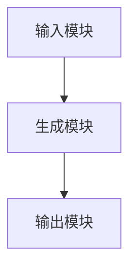

                 


# 开发基于大模型的金融研究方法论生成器

> 关键词：大模型，金融研究，方法论生成器，AI，金融分析

> 摘要：本文详细探讨了开发基于大模型的金融研究方法论生成器的方法论，涵盖背景介绍、核心概念、算法原理、系统架构设计、项目实战及最佳实践等部分。通过系统的分析和详细的代码实现，展示了如何利用大模型生成高效、准确的金融研究方法论，为金融领域研究提供了新的思路和工具。

---

## 第1章: 问题背景与核心概念

### 1.1 问题背景

#### 1.1.1 传统金融研究方法的局限性
传统的金融研究方法依赖于人工分析和经验判断，这种方法存在效率低、主观性强、难以规模化的问题。研究者需要花费大量时间收集数据、分析数据并制定策略，这种方法难以应对金融市场的快速变化。

#### 1.1.2 大模型在金融研究中的潜力
大模型（如GPT、BERT等）具有强大的自然语言处理能力和生成能力，能够帮助研究者快速生成结构化的研究方法论。大模型的引入可以显著提高研究效率，降低人工成本，并且能够在短时间内生成大量高质量的研究方法论。

#### 1.1.3 生成方法论的核心价值
通过大模型生成金融研究方法论，可以快速提供研究框架、数据分析方法和结论推导的逻辑，帮助研究者聚焦于核心问题的分析和解决。这种方法论生成器能够为金融研究提供标准化、系统化的研究框架，提升研究的效率和质量。

### 1.2 核心概念与问题描述

#### 1.2.1 方法论生成器的定义
方法论生成器是一种利用大模型技术，根据输入的研究问题自动生成研究方法论的工具。它能够输出包括数据收集、数据分析、结果解读等在内的完整研究框架。

#### 1.2.2 金融研究方法论的特征
金融研究方法论通常包括以下几个特征：
- **数据驱动**：基于大量金融数据进行分析。
- **逻辑清晰**：研究步骤具有明确的逻辑性。
- **可操作性**：方法论能够指导实际的研究工作。

#### 1.2.3 问题解决的边界与外延
方法论生成器的目标是辅助研究者快速构建研究框架，但它并不能直接解决具体的研究问题，也不能替代研究者的人工分析。它的作用是提供研究的方法论指导。

### 1.3 核心概念的结构与组成

#### 1.3.1 方法论生成器的模块构成
方法论生成器通常包括以下几个模块：
1. **输入模块**：接收研究问题的输入。
2. **生成模块**：利用大模型生成方法论。
3. **输出模块**：输出生成的方法论。
4. **优化模块**：根据反馈优化生成的方法论。

#### 1.3.2 大模型在方法论生成中的作用
大模型通过自然语言处理技术，能够理解研究问题的语义，并生成符合逻辑的研究方法论。它在方法论生成中的作用包括：
- **语义理解**：准确理解研究问题的含义。
- **内容生成**：生成结构合理、内容完整的研究方法论。

#### 1.3.3 生成方法论的逻辑流程
生成方法论的逻辑流程如下：
1. 输入研究问题。
2. 理解研究问题的语义。
3. 生成研究方法论。
4. 输出生成的方法论。

### 1.4 本章小结
本章介绍了开发基于大模型的金融研究方法论生成器的背景，详细阐述了核心概念和方法论生成器的结构组成。通过理解这些内容，我们可以更好地理解后续的算法原理和系统设计。

---

## 第2章: 大模型与金融研究的核心联系

### 2.1 大模型的原理与特征

#### 2.1.1 大模型的基本原理
大模型通常采用深度学习技术，通过多层神经网络结构来学习数据的特征和语义。它的核心在于通过大量的训练数据，学习语言的模式和规律。

#### 2.1.2 大模型的特征对比
以下是大模型与传统方法在金融研究中的对比：

| 特征         | 大模型                  | 传统方法              |
|--------------|------------------------|-----------------------|
| 效率         | 高                    | 低                   |
| 精准度       | 高                    | 中                   |
| 灵活性       | 高                    | 低                   |
| 成本         | 低                    | 高                   |

#### 2.1.3 大模型与金融研究的结合点
大模型在金融研究中的结合点包括：
1. **数据处理**：快速处理大量金融数据。
2. **模式识别**：识别数据中的潜在模式。
3. **文本生成**：生成研究报告和分析文本。

### 2.2 金融研究方法论的结构

#### 2.2.1 金融研究的基本框架
金融研究的基本框架包括以下几个部分：
1. **问题定义**：明确研究问题。
2. **数据收集**：收集相关数据。
3. **数据分析**：对数据进行分析。
4. **结果解读**：解读分析结果。
5. **结论总结**：总结研究结论。

#### 2.2.2 方法论的层次分解
方法论的层次分解如下：
1. **战略层**：确定研究目标和范围。
2. **战术层**：制定研究步骤和方法。
3. **操作层**：执行具体的研究任务。

#### 2.2.3 方法论生成器的目标
方法论生成器的目标是根据输入的研究问题，自动生成完整的研究方法论，包括数据收集、数据分析和结果解读等步骤。

### 2.3 大模型与方法论生成的关系

#### 2.3.1 大模型在方法论生成中的角色
大模型在方法论生成中的角色包括：
1. **语义理解**：理解输入的研究问题。
2. **内容生成**：生成结构合理的方法论。

#### 2.3.2 方法论生成的逻辑框架
方法论生成的逻辑框架如下：
1. 输入研究问题。
2. 理解研究问题的语义。
3. 生成研究方法论。
4. 输出生成的方法论。

#### 2.3.3 大模型与方法论生成的优化路径
通过不断优化大模型的训练数据和模型结构，可以提升方法论生成的准确性和完整性。同时，结合人工反馈优化生成结果，可以进一步提升生成方法论的质量。

### 2.4 本章小结
本章详细探讨了大模型在金融研究中的核心联系，分析了大模型的原理与特征，并阐述了方法论生成器的结构和目标。这些内容为后续的算法原理和系统设计奠定了基础。

---

## 第3章: 大模型生成方法论的算法原理

### 3.1 算法原理概述

#### 3.1.1 大模型的基本算法
大模型通常采用基于Transformer的架构，通过自注意力机制和前馈网络进行文本生成。

#### 3.1.2 方法论生成的算法流程
方法论生成的算法流程如下：
1. 输入研究问题。
2. 理解研究问题的语义。
3. 生成研究方法论。
4. 输出生成的方法论。

#### 3.1.3 算法的数学基础
大模型的数学基础包括：
- **自注意力机制**：计算输入序列中每个位置的注意力权重。
- **前馈网络**：对输入进行非线性变换。

### 3.2 算法原理的详细讲解

#### 3.2.1 大模型的训练过程
大模型的训练过程包括：
1. **数据准备**：收集和整理训练数据。
2. **模型构建**：构建基于Transformer的模型。
3. **训练**：使用训练数据训练模型。
4. **优化**：优化模型的参数以提升生成效果。

#### 3.2.2 方法论生成的模型结构
方法论生成的模型结构如下：
1. **编码器**：将输入的研究问题编码为向量。
2. **解码器**：根据编码结果生成研究方法论。

#### 3.2.3 算法的优化策略
算法的优化策略包括：
1. **学习率调整**：采用学习率衰减策略。
2. **模型剪枝**：去除冗余的网络结构。
3. **数据增强**：增加训练数据的多样性。

### 3.3 算法的数学模型与公式

#### 3.3.1 概率模型的公式推导
概率模型的公式推导如下：
$$ P(y|x) = \text{softmax}(W_y h(x)) $$

其中，$h(x)$ 是编码器输出的向量，$W_y$ 是参数矩阵。

#### 3.3.2 损失函数的定义
损失函数的定义如下：
$$ \text{Loss} = -\sum_{i=1}^{n} \log P(y_i|x) $$

#### 3.3.3 梯度下降的优化算法
梯度下降的优化算法如下：
$$ \theta = \theta - \eta \frac{\partial \text{Loss}}{\partial \theta} $$

其中，$\eta$ 是学习率。

### 3.4 举例说明与实际应用

#### 3.4.1 简单案例的数学分析
假设输入的研究问题是“分析股票价格的波动性”，模型生成的方法论可能包括：
1. 数据收集：收集过去一年的股票价格数据。
2. 数据分析：计算波动率指标。
3. 结果解读：分析波动率的变化趋势。

#### 3.4.2 实际应用中的算法调整
在实际应用中，可能需要根据具体问题调整模型的参数，例如增加训练数据的多样性，优化学习率等。

#### 3.4.3 算法效果的评估指标
算法效果的评估指标包括：
1. **生成方法论的完整性**：生成的方法论是否包含完整的步骤。
2. **生成方法论的准确性**：生成的方法论是否准确反映研究问题。
3. **生成方法论的可操作性**：生成的方法论是否易于实施。

### 3.5 本章小结
本章详细讲解了大模型生成方法论的算法原理，包括模型的训练过程、数学模型和优化策略。通过这些内容，我们可以更好地理解方法论生成器的工作原理。

---

## 第4章: 金融研究方法论生成器的系统分析与架构设计

### 4.1 系统分析

#### 4.1.1 问题场景的介绍
金融研究方法论生成器的目标是根据输入的研究问题，自动生成完整的研究方法论。其应用场景包括学术研究、金融分析和投资决策等。

#### 4.1.2 系统的目标与范围
系统的目标是生成高质量的金融研究方法论，系统的范围包括数据输入、方法论生成和结果输出。

#### 4.1.3 系统的输入输出分析
系统的输入是研究问题，输出是生成的方法论。例如，输入“分析股票价格的波动性”，输出是包括数据收集、数据分析和结果解读的完整方法论。

### 4.2 系统架构设计

#### 4.2.1 系统的功能模块划分
系统的主要功能模块包括：
1. **输入模块**：接收研究问题。
2. **生成模块**：利用大模型生成方法论。
3. **输出模块**：输出生成的方法论。

#### 4.2.2 系统的架构图设计
系统的架构图如下：



#### 4.2.3 模块之间的交互关系
模块之间的交互关系如下：
1. 输入模块接收研究问题，并将其传递给生成模块。
2. 生成模块利用大模型生成方法论，并将结果传递给输出模块。
3. 输出模块将生成的方法论输出。

### 4.3 系统接口设计

#### 4.3.1 接口的定义与规范
系统接口包括：
1. **输入接口**：接收研究问题的字符串。
2. **输出接口**：输出生成的方法论。

#### 4.3.2 接口的实现方式
接口的实现方式采用REST API，通过HTTP协议进行通信。

#### 4.3.3 接口的安全性考虑
接口的安全性考虑包括：
1. **身份验证**：采用JWT进行身份验证。
2. **权限控制**：限制接口的访问权限。

### 4.4 本章小结
本章详细分析了金融研究方法论生成器的系统架构设计，包括功能模块划分、架构图设计和接口设计。这些内容为后续的项目实现奠定了基础。

---

## 第5章: 项目实战与代码实现

### 5.1 环境安装与配置

#### 5.1.1 开发环境的选择
推荐使用Python 3.8及以上版本，安装Jupyter Notebook用于开发和调试。

#### 5.1.2 依赖库的安装
需要安装的依赖库包括：
- `transformers`：用于加载预训练的大模型。
- `torch`：用于深度学习模型的训练。
- `json`：用于数据的存储和处理。

#### 5.1.3 开发工具的配置
配置开发环境时，需要确保安装了必要的库，并配置了虚拟环境。

### 5.2 核心代码实现

#### 5.2.1 方法论生成器的主程序
主程序代码如下：

```python
from transformers import AutoTokenizer, AutoModelForCausalLM
import torch

class MethodologyGenerator:
    def __init__(self, model_name):
        self.tokenizer = AutoTokenizer.from_pretrained(model_name)
        self.model = AutoModelForCausalLM.from_pretrained(model_name)
        
    def generate(self, input_text, max_length=500):
        inputs = self.tokenizer(input_text, return_tensors='pt')
        outputs = self.model.generate(**inputs, max_length=max_length)
        return self.tokenizer.decode(outputs[0], skip_special_tokens=True)
```

#### 5.2.2 大模型接口的调用
调用大模型接口的代码如下：

```python
generator = MethodologyGenerator("gpt2")
input_text = "分析股票价格的波动性"
result = generator.generate(input_text)
print(result)
```

#### 5.2.3 数据处理模块的实现
数据处理模块的代码如下：

```python
import json

def save_methodology(methodology, filename):
    with open(filename, 'w') as f:
        json.dump(methodology, f, ensure_ascii=False, indent=2)
```

### 5.3 代码解读与分析

#### 5.3.1 代码结构的分析
代码结构分为以下几个部分：
1. **模型加载**：加载预训练的大模型。
2. **生成方法论**：根据输入的研究问题生成方法论。
3. **数据处理**：将生成的方法论保存为JSON格式。

#### 5.3.2 关键函数的解读
关键函数包括：
- `generate`函数：生成方法论。
- `save_methodology`函数：保存生成的方法论。

#### 5.3.3 代码的优化建议
代码的优化建议包括：
1. **模型优化**：采用更高效的模型结构。
2. **数据优化**：增加训练数据的多样性。
3. **性能优化**：优化代码的运行效率。

### 5.4 实际案例分析

#### 5.4.1 案例背景的介绍
案例背景：分析股票价格的波动性。

#### 5.4.2 方法论生成的过程
生成过程如下：
1. 输入研究问题：“分析股票价格的波动性”。
2. 模型生成方法论：
   - 数据收集：收集过去一年的股票价格数据。
   - 数据分析：计算波动率指标。
   - 结果解读：分析波动率的变化趋势。

#### 5.4.3 案例结果的分析
生成的结果包括：
- 数据收集：从多个数据源获取股票价格数据。
- 数据分析：计算波动率、均值、标准差等指标。
- 结果解读：分析波动率的变化趋势，识别潜在的风险点。

### 5.5 本章小结
本章通过实际案例分析，展示了方法论生成器的实现过程和应用效果。通过代码实现和案例分析，我们可以更好地理解方法论生成器的工作原理和实际应用。

---

## 第6章: 最佳实践与总结

### 6.1 最佳实践 tips

#### 6.1.1 模型选择
选择合适的模型是关键。建议根据具体任务选择适合的模型，如GPT-3适合文本生成任务。

#### 6.1.2 数据质量
数据质量直接影响生成结果的质量。建议使用高质量的训练数据，并进行数据清洗和预处理。

#### 6.1.3 模型优化
模型优化是提升生成效果的重要手段。建议采用学习率衰减、模型剪枝等优化策略。

### 6.2 本章小结
通过本文的介绍，我们可以看到基于大模型的金融研究方法论生成器具有广阔的应用前景。它能够显著提高金融研究的效率和质量，为金融领域的研究和实践提供了新的工具和方法。

### 6.3 注意事项
在实际应用中，需要注意以下几点：
1. **数据安全**：确保数据的安全性和隐私性。
2. **模型性能**：定期监控模型的性能，及时进行优化。
3. **用户反馈**：根据用户反馈不断优化生成结果。

### 6.4 拓展阅读
推荐阅读以下资料：
- 《Deep Learning》（深度学习）—— Ian Goodfellow
- 《自然语言处理实战：基于Python的机器学习与深度学习》—— 王立勋

---

## 作者信息

作者：AI天才研究院/AI Genius Institute & 禅与计算机程序设计艺术 /Zen And The Art of Computer Programming

---

以上就是《开发基于大模型的金融研究方法论生成器》的完整目录和文章内容。

