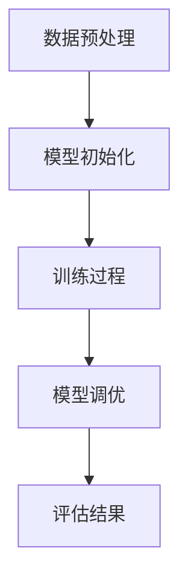
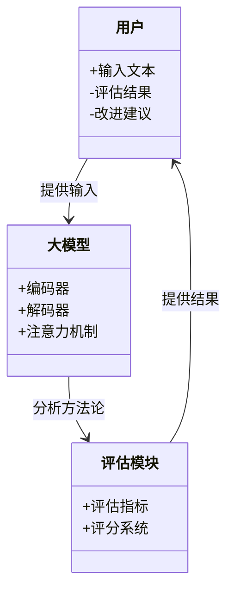
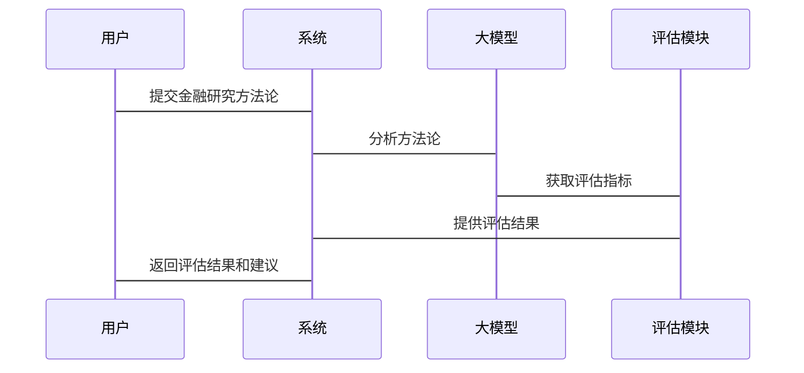

                 


# 开发基于大模型的金融研究方法论评估生成器

## 关键词：大模型、金融研究、方法论评估、生成器、算法原理、系统设计

## 摘要：  
本文详细探讨了开发基于大模型的金融研究方法论评估生成器的各个方面，包括背景与概述、核心概念与联系、算法与模型原理、系统设计与架构、项目实战案例以及最佳实践建议。文章通过清晰的逻辑结构和专业的技术语言，帮助读者理解如何利用大模型技术提升金融研究方法论的评估效率和准确性。

---

# 第一部分: 背景与概述

## 第1章: 开发基于大模型的金融研究方法论评估生成器概述

### 1.1 问题背景与描述
#### 1.1.1 传统金融研究方法的局限性
传统金融研究方法依赖于人工分析和经验判断，存在以下问题：
- 数据处理能力有限，难以应对海量金融数据。
- 方法论的评估过程耗时且主观性较强，难以量化。
- 传统模型的泛化能力较弱，难以应对复杂的金融市场变化。

#### 1.1.2 大模型在金融研究中的潜力
大模型（如GPT、BERT等）具有强大的自然语言处理能力和泛化能力，能够：
- 自动分析大量金融文献，提取关键信息。
- 生成高质量的研究方法论，并对其进行评估。
- 提供个性化的研究建议，辅助金融决策。

#### 1.1.3 方法论评估生成器的目标与意义
方法论评估生成器的目标是通过大模型技术，自动化评估金融研究方法论的合理性、可行性和创新性。其意义在于：
- 提高金融研究的效率和准确性。
- 降低人工评估的主观性和时间成本。
- 为金融研究提供智能化的工具支持。

### 1.2 问题解决与边界
#### 1.2.1 方法论评估生成器的核心问题
- 如何训练大模型，使其能够理解金融研究方法论的结构和内容。
- 如何设计评估指标，量化方法论的质量。
- 如何优化生成器的输出，使其更符合金融研究的实际需求。

#### 1.2.2 解决方案的边界与外延
- 生成器仅用于评估和优化金融研究方法论，不直接参与数据交易或投资决策。
- 支持多种金融领域的分析，如股票分析、风险评估等，但不涉及具体的投资策略制定。

#### 1.2.3 核心要素与组成分析
核心要素包括：
- 大模型的训练与优化。
- 金融研究方法论的结构化表示。
- 评估指标的设计与实现。

---

# 第二部分: 核心概念与联系

## 第2章: 大模型与金融研究方法论的结合

### 2.1 核心概念原理
#### 2.1.1 大模型的基本原理
大模型通过多层神经网络结构，学习大规模数据中的语义信息。其核心原理包括：
- **预训练**：通过大量无标签数据进行自监督学习，提取上下文语义。
- **微调**：在特定任务上进行有监督训练，适应具体应用场景。
- **生成与理解**：利用注意力机制和解码器结构，生成符合上下文的文本。

#### 2.1.2 金融研究方法论的核心要素
金融研究方法论通常包括以下要素：
- **研究目标**：明确研究的核心问题。
- **数据来源**：数据的收集、处理和分析方法。
- **分析框架**：理论模型和分析工具的选择。
- **假设与限制**：研究的假设条件和适用范围。
- **结果解读**：研究发现的解释和实际意义。

### 2.2 概念属性对比
| 概念 | 属性 | 详细描述 |
|------|------|----------|
| 大模型 | 训练数据 | 大规模金融文献和研究论文。 |
|      | 模型结构 | 多层神经网络，支持生成和理解任务。 |
|      | 应用场景 | 自动化评估、研究生成。 |
| 金融研究方法论 | 核心要素 | 研究目标、数据来源、分析框架等。 |
|      | 评估指标 | 合理性、可行性、创新性。 |

### 2.3 ER实体关系图
```mermaid
er
    actor: 用户
    model: 大模型
    research_method: 方法论
    evaluation: 评估结果
    actor --> model: 提供输入
    model --> research_method: 分析方法论
    research_method --> evaluation: 生成评估
```

---

# 第三部分: 算法原理讲解

## 第3章: 大模型算法与训练

### 3.1 算法流程


### 3.2 算法实现
```python
import torch
class Model(torch.nn.Module):
    def __init__(self):
        super().__init__()
        self.encoder = torch.nn.LSTM(input_size=100, hidden_size=50, batch_first=True)
        self.decoder = torch.nn.LSTM(input_size=50, hidden_size=100, batch_first=True)
    
    def forward(self, input_sequence):
        # 编码阶段
        encoded, _ = self.encoder(input_sequence)
        # 解码阶段
        decoded, _ = self.decoder(encoded)
        return decoded
```

### 3.3 数学模型与公式
#### 损失函数
$$L = \frac{1}{N}\sum_{i=1}^{N} (y_i - \hat{y}_i)^2$$
其中，$y_i$ 是真实值，$\hat{y}_i$ 是模型预测值。

#### 注意力机制
$$\text{Attention}(Q, K, V) = \text{softmax}\left(\frac{QK^T}{\sqrt{d_k}}\right)V$$
其中，$Q$ 是查询向量，$K$ 是键向量，$V$ 是值向量，$d_k$ 是键的维度。

---

# 第四部分: 系统设计与架构

## 第4章: 系统设计与架构方案

### 4.1 问题场景介绍
金融研究方法论评估生成器需要支持以下场景：
- 用户输入金融研究方法论文本。
- 生成器自动评估方法论的质量。
- 提供改进建议和优化方向。

### 4.2 系统功能设计


### 4.3 系统架构设计


### 4.4 系统接口设计
主要接口包括：
- 用户输入接口：接收金融研究方法论文本。
- 评估结果接口：返回评估结果和改进建议。
- 系统管理接口：监控系统运行状态。

### 4.5 系统交互流程


---

# 第五部分: 项目实战

## 第5章: 项目实战与分析

### 5.1 环境安装与配置
```bash
pip install torch transformers
```

### 5.2 核心代码实现
```python
import torch
from transformers import AutoTokenizer, AutoModelForCausalLM

tokenizer = AutoTokenizer.from_pretrained("gpt2")
model = AutoModelForCausalLM.from_pretrained("gpt2")

def evaluate_methodology(methodology_text):
    inputs = tokenizer(methodology_text, return_tensors="pt")
    outputs = model.generate(inputs.input_ids, max_length=500)
    return tokenizer.decode(outputs[0], skip_special_tokens=True)
```

### 5.3 案例分析与优化
案例：评估一个股票分析方法论。
- 方法论输入：分析公司财务报表和市场趋势。
- 生成器输出：评估结果为可行，但建议增加市场情绪分析。
- 优化方向：引入更多数据源，如社交媒体数据。

---

# 第六部分: 最佳实践与总结

## 第6章: 最佳实践与总结

### 6.1 小结
开发基于大模型的金融研究方法论评估生成器需要：
- 深入理解大模型的原理和应用。
- 设计合理的评估指标和系统架构。
- 不断优化模型和系统性能。

### 6.2 注意事项
- 数据隐私和安全需严格把控。
- 模型的可解释性需进一步提升。
- 系统的鲁棒性需在多种场景下测试。

### 6.3 拓展阅读
- 《大模型在金融领域的应用》
- 《金融研究方法论的系统化评估》
- 《生成式AI的前沿研究》

---

# 结语

通过本文的详细讲解，读者可以系统地了解如何开发基于大模型的金融研究方法论评估生成器。从理论到实践，从设计到实现，每一步都需要精心设计和优化。未来，随着大模型技术的不断发展，金融研究方法论的评估将更加智能化和高效化。

---

**作者：AI天才研究院/AI Genius Institute & 禅与计算机程序设计艺术 /Zen And The Art of Computer Programming**

