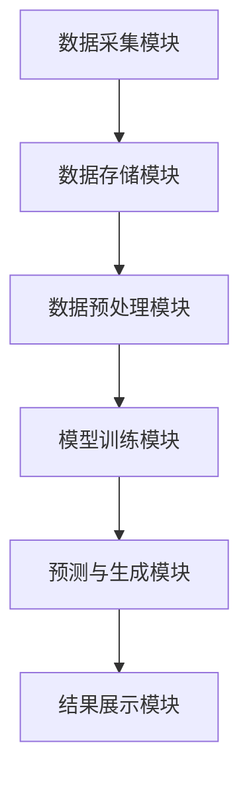
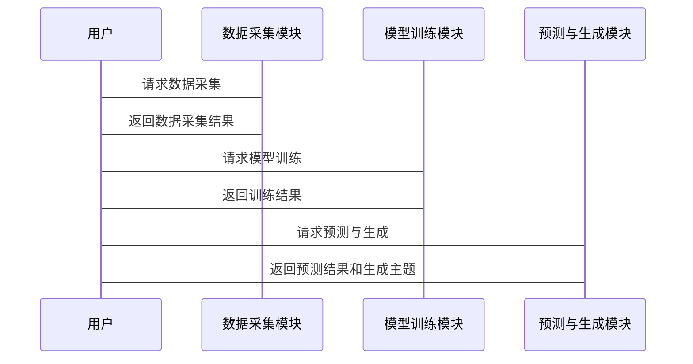

                 


# 开发基于大模型的金融研究趋势预测与主题生成器

> 关键词：大模型，金融趋势预测，主题生成器，自然语言处理，金融研究

> 摘要：本文将详细探讨如何基于大模型开发金融研究趋势预测与主题生成器。通过分析大模型在金融领域的应用，结合趋势预测和主题生成的实现思路，提供系统的架构设计和实际项目案例，帮助读者理解和应用相关技术。

---

## 第一部分: 开发基于大模型的金融研究趋势预测与主题生成器概述

### 第1章: 金融研究趋势预测与主题生成器的背景与目标

#### 1.1 问题背景与目标

##### 1.1.1 金融研究的趋势预测需求
金融市场的复杂性和不确定性使得趋势预测成为一项具有挑战性的任务。投资者和研究机构需要准确预测市场趋势，以便做出明智的决策。传统的基于统计的方法在处理大量非结构化数据时显得力不从心，而大模型的出现为解决这一问题提供了新的可能性。

##### 1.1.2 主题生成器的必要性
金融领域的主题生成器能够从大量文本数据中提取关键主题，帮助研究者快速理解市场动态。通过生成相关主题，主题生成器可以辅助金融研究者更好地把握市场脉搏，从而优化投资策略。

##### 1.1.3 结合大模型的创新点
大模型在自然语言处理领域的突破为金融研究趋势预测和主题生成提供了强大的工具。通过结合大模型的文本分析能力和金融领域的专业知识，我们可以更高效地预测市场趋势并生成相关主题。

#### 1.2 问题描述与解决思路

##### 1.2.1 金融研究中的数据与信息挑战
金融市场数据包括大量的文本、数值和时间序列数据。如何有效地整合这些数据并提取有价值的信息是金融研究中的关键挑战。

##### 1.2.2 大模型在主题生成中的优势
大模型具备强大的文本生成和理解能力，能够从非结构化文本中提取关键信息，生成相关主题，并预测市场趋势。

##### 1.2.3 结合趋势预测与主题生成的系统架构
通过整合大模型的文本分析能力与金融数据，构建一个综合系统，能够同时进行趋势预测和主题生成，为金融研究提供全面支持。

### 第2章: 大模型在金融领域的核心应用

#### 2.1 大模型的核心概念与技术特点

##### 2.1.1 大模型的基本原理
大模型通过深度学习技术，训练大规模的神经网络，具备强大的文本理解和生成能力。

##### 2.1.2 大模型在自然语言处理中的优势
大模型能够处理复杂的语义关系，生成自然流畅的文本，并具备良好的泛化能力。

##### 2.1.3 大模型在金融领域的适用性分析
金融领域的文本数据复杂多样，大模型能够有效处理这些数据，提供准确的预测和生成结果。

#### 2.2 金融研究趋势预测的实现思路

##### 2.2.1 数据驱动的金融趋势预测
通过分析历史数据，结合当前市场动态，预测未来的市场趋势。

##### 2.2.2 基于大模型的文本分析与主题提取
利用大模型对文本数据进行分析，提取关键词和主题，辅助趋势预测。

##### 2.2.3 结合外部数据源的多维度预测方法
整合多种数据源，包括文本、数值和时间序列数据，构建多维度的预测模型。

#### 2.3 主题生成器的设计目标与实现路径

##### 2.3.1 主题生成器的功能定位
主题生成器旨在从大量文本数据中提取关键主题，帮助研究者快速把握市场动态。

##### 2.3.2 基于大模型的主题生成算法
通过训练大模型，使其能够生成与金融市场相关的主题内容。

##### 2.3.3 生成结果的优化与评估
对生成的主题进行优化，确保其准确性和相关性，并通过评估指标进行质量评估。

### 第3章: 大模型与金融研究趋势预测的结合

#### 3.1 大模型在金融文本分析中的应用

##### 3.1.1 文本分类与主题提取
通过文本分类和主题提取技术，识别金融文本中的关键主题。

##### 3.1.2 基于大模型的文本摘要
利用大模型生成文本摘要，提取核心信息，辅助趋势预测。

##### 3.1.3 金融新闻的情感分析
通过情感分析技术，判断市场情绪，辅助预测市场趋势。

---

## 第二部分: 大模型的算法原理与实现

### 第4章: 基于大模型的金融趋势预测算法

#### 4.1 数据预处理

##### 4.1.1 数据清洗与特征提取
对原始数据进行清洗，提取有用的特征，为模型训练做准备。

##### 4.1.2 数据增强
通过数据增强技术，增加数据多样性，提高模型的泛化能力。

##### 4.1.3 数据分组与标注
将数据按时间序列分组，标注趋势标签，为模型提供监督信号。

#### 4.2 模型训练

##### 4.2.1 神经网络结构设计
设计适合金融趋势预测的神经网络结构，如LSTM或Transformer。

##### 4.2.2 损失函数与优化器选择
选择合适的损失函数和优化器，优化模型性能。

##### 4.2.3 训练策略与超参数调优
通过实验确定最佳的训练策略和超参数组合。

#### 4.3 模型调优与部署

##### 4.3.1 模型评估与验证
使用验证集评估模型性能，调整模型结构和参数。

##### 4.3.2 模型部署与接口设计
将训练好的模型部署为API服务，方便其他系统调用。

##### 4.3.3 模型监控与维护
实时监控模型性能，及时进行模型更新和维护。

### 第5章: 大模型主题生成器的实现

#### 5.1 文本生成模型

##### 5.1.1 基于GPT的生成模型
使用GPT模型进行主题生成，生成与金融市场相关的文本内容。

##### 5.1.2 模型微调与定制
根据金融领域的具体需求，对模型进行微调，提升生成质量。

##### 5.1.3 生成结果的多样性控制
通过调整生成参数，控制生成结果的多样性和相关性。

#### 5.2 主题提取与优化

##### 5.2.1 基于TF-IDF的主题提取
使用TF-IDF方法提取文本中的关键词，辅助生成主题。

##### 5.2.2 基于LDA的主题建模
使用LDA主题建模技术，提取主题分布，优化生成效果。

##### 5.2.3 主题优化与评估
对生成的主题进行优化，确保其准确性和相关性，并通过评估指标进行质量评估。

---

## 第三部分: 系统架构与实现细节

### 第6章: 系统架构设计

#### 6.1 系统功能设计

##### 6.1.1 数据采集模块
从多个数据源采集金融数据，包括新闻、报告和交易数据。

##### 6.1.2 模型训练模块
对采集的数据进行预处理，训练金融趋势预测模型和主题生成模型。

##### 6.1.3 预测与生成模块
根据输入的金融数据，生成趋势预测结果和相关主题。

##### 6.1.4 结果展示模块
将预测结果和生成的主题以用户友好的形式展示出来。

#### 6.2 系统架构图



#### 6.3 接口设计与交互流程图



### 第7章: 项目实战与案例分析

#### 7.1 环境安装与配置

##### 7.1.1 安装Python与相关库
安装Python 3.8及以上版本，安装TensorFlow、PyTorch、Hugging Face Transformers等库。

##### 7.1.2 安装依赖与配置环境
安装项目所需的依赖包，配置开发环境，如Jupyter Notebook或VS Code。

#### 7.2 核心代码实现

##### 7.2.1 数据预处理代码

```python
import pandas as pd
import numpy as np

# 加载数据
data = pd.read_csv('financial_data.csv')

# 数据清洗
data.dropna(inplace=True)
data['date'] = pd.to_datetime(data['date'])
data.set_index('date', inplace=True)

# 特征提取
features = data[['open', 'high', 'low', 'close', 'volume']]
```

##### 7.2.2 模型训练代码

```python
import tensorflow as tf
from tensorflow.keras.layers import Dense, LSTM, Dropout
from tensorflow.keras.models import Sequential

model = Sequential()
model.add(LSTM(128, input_shape=(None, 5)))
model.add(Dropout(0.5))
model.add(Dense(1, activation='sigmoid'))
model.compile(loss='binary_crossentropy', optimizer='adam', metrics=['accuracy'])
model.summary()
```

##### 7.2.3 生成主题代码

```python
from transformers import pipeline

# 加载预训练模型
model_name = 'gpt2-large'
pipe = pipeline('text-generation', model_name, max_length=50, num_return_sequences=5)

# 生成主题
prompt = "The main theme of financial research in 2023 is"
output = pipe(prompt)
```

#### 7.3 案例分析与解读

##### 7.3.1 案例分析
分析2023年的金融市场数据，使用模型预测趋势并生成相关主题。

##### 7.3.2 代码实现解读
详细解读上述代码的实现过程，包括数据预处理、模型训练和主题生成。

##### 7.3.3 案例总结
总结案例分析的结果，评估模型的性能和生成主题的质量。

---

## 第四部分: 最佳实践与总结

### 第8章: 最佳实践与小结

#### 8.1 最佳实践

##### 8.1.1 数据质量的重要性
确保数据的准确性和完整性，选择合适的数据预处理方法。

##### 8.1.2 模型选择与调优
根据具体任务选择合适的模型，并通过实验进行参数调优。

##### 8.1.3 生成结果的评估与优化
建立科学的评估指标，持续优化生成结果的质量。

#### 8.2 小结

##### 8.2.1 项目总结
总结整个项目的开发过程，强调大模型在金融研究中的巨大潜力。

##### 8.2.2 注意事项
提醒读者在实际应用中注意数据隐私、模型泛化能力等问题。

##### 8.2.3 拓展阅读
推荐相关领域的书籍和论文，供读者进一步学习和研究。

---

## 作者

作者：AI天才研究院/AI Genius Institute & 禅与计算机程序设计艺术 /Zen And The Art of Computer Programming

---

通过以上内容，我们详细探讨了如何开发基于大模型的金融研究趋势预测与主题生成器，从背景介绍到系统实现，再到项目实战，为读者提供了全面的技术指导和实践案例。

