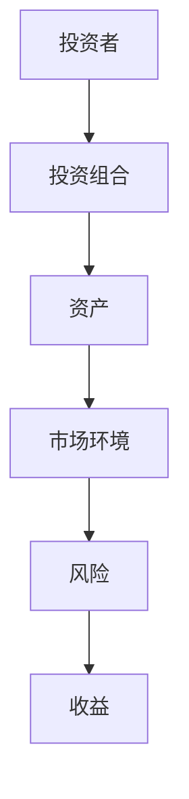
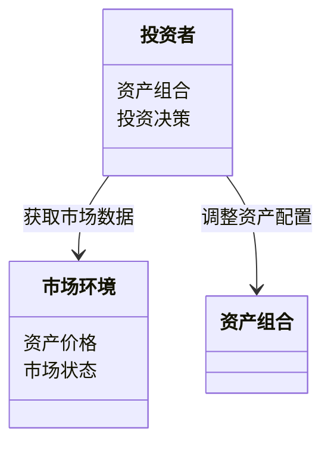
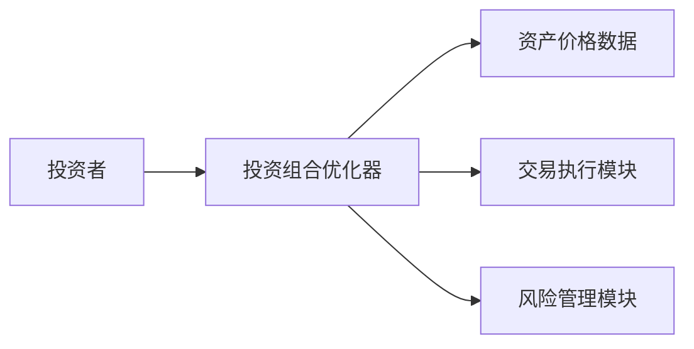
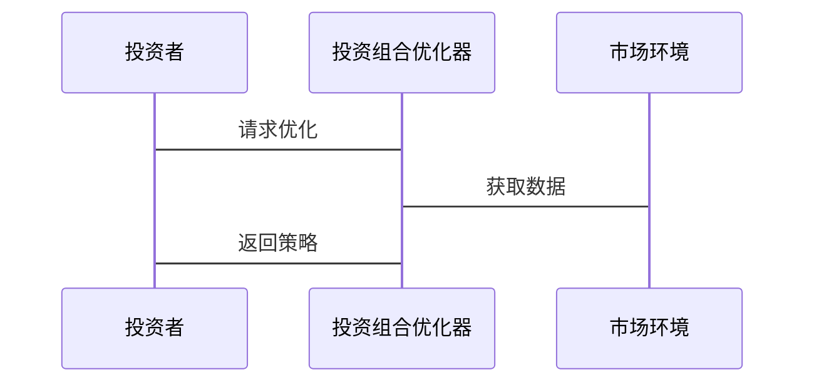

                 


# 《开发基于强化学习的投资组合优化系统》

> 关键词：强化学习，投资组合优化，Q-learning，DQN，系统架构设计

> 摘要：本文系统地探讨了如何利用强化学习技术开发投资组合优化系统。从基础理论到算法实现，从系统架构到项目实战，本文详细分析了强化学习在投资组合优化中的应用，结合Q-learning和DQN算法，通过实际案例展示了如何构建高效的强化学习模型，并提供了系统的架构设计和代码实现。

---

# 第一部分: 强化学习与投资组合优化背景

# 第1章: 强化学习与投资组合优化背景

## 1.1 强化学习的基本概念

### 1.1.1 强化学习的定义与特点

强化学习是一种机器学习范式，通过智能体在环境中采取动作以最大化累积奖励。其核心特点包括：基于经验学习、目标导向、策略优化。

### 1.1.2 强化学习的核心要素

- 状态空间（State Space）
- 动作空间（Action Space）
- 奖励函数（Reward Function）
- 策略（Policy）
- Q-值函数（Q-value Function）

## 1.2 投资组合优化的基本概念

### 1.2.1 投资组合优化的定义与目标

投资组合优化是指在给定风险偏好下，通过调整资产配置以实现收益最大化的过程。

### 1.2.2 马科维茨现代投资组合理论

- 均值-方差模型
- 资产分配与风险控制

## 1.3 强化学习在投资组合优化中的应用背景

### 1.3.1 传统投资组合优化的局限性

- 假设过于简化
- 无法处理非线性问题
- 忽略交易成本和滑点

### 1.3.2 强化学习在投资组合优化中的优势

- 能够处理非线性关系
- 适合动态市场环境
- 可以同时优化多个目标

## 1.4 本章小结

---

# 第二部分: 强化学习与投资组合优化的核心概念

# 第2章: 强化学习与投资组合优化的核心概念与联系

## 2.1 马科维茨现代投资组合理论

### 2.1.1 均值-方差模型

$$\text{目标函数：} \min_w \frac{1}{2}w^T \Sigma w$$
$$\text{约束条件：} \mathbb{E}[r_w] = \mu^T w$$

### 2.1.2 资产分配与风险控制

- 资产分配：$w_i$ 表示第i个资产的权重
- 风险控制：方差最小化

## 2.2 强化学习的基本原理

### 2.2.1 状态空间与动作空间

- 状态空间：市场环境、资产价格等
- 动作空间：买入、卖出、持有等操作

### 2.2.2 奖励函数与策略优化

- 奖励函数：$r(s, a) = \text{投资收益}$
- 策略优化：最大化累积奖励

## 2.3 强化学习与投资组合优化的结合

### 2.3.1 投资组合优化的强化学习框架

- 状态：市场状态
- 动作：投资决策
- 奖励：投资收益

### 2.3.2 强化学习在投资组合优化中的优势

- 处理非线性关系
- 适应动态市场环境
- 多目标优化

## 2.4 核心概念对比分析

### 2.4.1 马科维茨模型与强化学习模型的对比

| 特性 | 马科维茨模型 | 强化学习模型 |
|------|--------------|--------------|
| 输入 | 资产收益率、方差 | 状态、动作、奖励 |
| 输出 | 资产权重 | 投资策略 |
| 优化目标 | 最小化方差 | 最大化奖励 |

### 2.4.2 不同投资策略的特征对比（表格形式）

| 策略类型 | 风险偏好 | 收益目标 |
|----------|----------|----------|
| 股票型 | 高 | 高 |
| 债券型 | 低 | 中 |
| 混合型 | 中 | 中 |

## 2.5 实体关系图



---

# 第三部分: 强化学习算法原理

# 第3章: 强化学习算法在投资组合优化中的应用

## 3.1 Q-learning算法原理

### 3.1.1 Q-learning的基本原理

- Q值更新公式：
$$ Q(s, a) = Q(s, a) + \alpha (r + \gamma \max Q(s', a) - Q(s, a)) $$

### 3.1.2 Q-learning在投资组合优化中的应用

- 状态空间：市场状态
- 动作空间：投资动作
- 奖励函数：投资收益

## 3.2 DQN算法原理

### 3.2.1 DQN的基本原理

- 使用经验回放
- 网络结构：输入层、隐藏层、输出层
- 损失函数：均方误差

### 3.2.2 DQN在投资组合优化中的实现

- 状态编码：市场数据
- 动作选择：epsilon-greedy策略
- 网络训练：使用历史数据

## 3.3 算法流程图

```mermaid
graph TD
    Start --> Initialize
    Initialize --> Choose action
    Choose action --> Get next state
    Get next state --> Update Q-value
    Update Q-value --> Repeat or End
```

## 3.4 算法

### 3.4.1 Q-learning代码示例

```python
import numpy as np

class QLearner:
    def __init__(self, state_space, action_space, learning_rate=0.1, gamma=0.9):
        self.state_space = state_space
        self.action_space = action_space
        self.lr = learning_rate
        self.gamma = gamma
        self.Q = np.zeros((state_space, action_space))

    def choose_action(self, state):
        return np.argmax(self.Q[state])

    def update_Q(self, state, action, reward, next_state):
        self.Q[state, action] += self.lr * (reward + self.gamma * np.max(self.Q[next_state]) - self.Q[state, action])
```

### 3.4.2 DQN代码示例

```python
import torch
import torch.nn as nn

class DQN(nn.Module):
    def __init__(self, input_dim, output_dim):
        super(DQN, self).__init__()
        self.fc1 = nn.Linear(input_dim, 64)
        self.fc2 = nn.Linear(64, output_dim)

    def forward(self, x):
        x = torch.relu(self.fc1(x))
        x = self.fc2(x)
        return x

# 训练过程
def train(dqn, optimizer, criterion, memory, batch_size):
    if len(memory) < batch_size:
        return
    transitions = random.sample(memory, batch_size)
    batch = Transition(*zip(*transitions))
    
    inputs = torch.stack(batch.state).float()
    targets = torch.stack(batch.reward).float()
    
    outputs = dqn(inputs)
    targets = targets.view(-1, 1)
    
    loss = criterion(outputs, targets)
    loss.backward()
    optimizer.step()
```

## 3.5 本章小结

---

# 第四部分: 系统分析与架构设计

# 第4章: 系统分析与架构设计

## 4.1 项目背景介绍

- 项目目标：开发基于强化学习的投资组合优化系统
- 项目范围：支持多种资产类型和市场环境
- 项目约束：交易成本、滑点、市场流动性

## 4.2 系统功能设计

### 4.2.1 领域模型



### 4.2.2 系统架构设计



### 4.2.3 接口设计

- 输入接口：市场数据、投资者偏好
- 输出接口：投资策略、投资组合报告

### 4.2.4 交互流程



## 4.3 本章小结

---

# 第五部分: 项目实战

# 第5章: 项目实战

## 5.1 环境配置

- 安装依赖：Python、TensorFlow、PyTorch、Pandas

## 5.2 核心代码实现

### 5.2.1 数据处理代码

```python
import pandas as pd
import numpy as np

def process_data(df):
    df['return'] = df['price'].pct_change()
    df = df.dropna()
    return df
```

### 5.2.2 强化学习模型代码

```python
class InvestmentAgent:
    def __init__(self, state_size, action_size):
        self.state_size = state_size
        self.action_size = action_size
        self.model = DQN(state_size, action_size)
```

### 5.2.3 训练与测试代码

```python
def train_agent(agent, env, episodes=100):
    for episode in range(episodes):
        state = env.reset()
        while not done:
            action = agent.choose_action(state)
            next_state, reward, done = env.step(action)
            agent.update_Q(state, action, reward, next_state)
```

## 5.3 代码解读与分析

- 数据处理：计算收益率、填充缺失值
- 模型训练：使用经验回放、epsilon-greedy策略
- 策略测试：在真实市场数据上验证收益与风险

## 5.4 案例分析

### 5.4.1 实验结果

- 收益率对比：强化学习策略 vs 均值-方差策略
- 风险对比：最大回撤、VaR

### 5.4.2 结果分析

- 强化学习策略在动态市场中表现更好
- 适合频繁交易和非线性市场环境

## 5.5 本章小结

---

# 第六部分: 最佳实践与总结

# 第6章: 最佳实践与总结

## 6.1 最佳实践

### 6.1.1 系统设计

- 灵活性：支持多种资产类型
- 可扩展性：适应不同市场环境
- 可解释性：便于策略调整

### 6.1.2 算法选择

- Q-learning：适合简单环境
- DQN：适合复杂环境
- A2C/PPO：适合高维状态空间

## 6.2 小结

- 强化学习在投资组合优化中具有巨大潜力
- 通过系统设计和算法优化可以显著提升收益
- 需要注意交易成本和市场滑点的影响

## 6.3 注意事项

- 数据质量：确保市场数据的准确性和及时性
- 策略调整：根据市场变化动态调整
- 风险控制：设置止损点和止盈点

## 6.4 拓展阅读

- 《Reinforcement Learning: Theory and Algorithms》
- 《投资学》
- 《深度强化学习》

---

# 作者：AI天才研究院/AI Genius Institute & 禅与计算机程序设计艺术/Zen And The Art of Computer Programming

