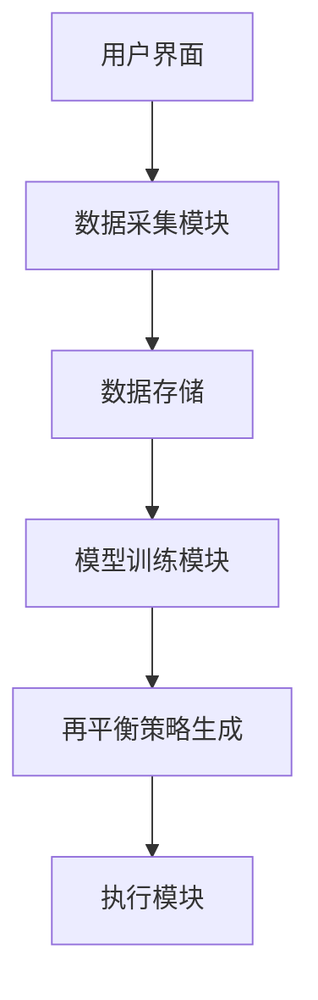

                 


# 开发智能化的个人投资组合再平衡工具

## 关键词：
- 投资组合再平衡
- 人工智能
- 大数据分析
- 强化学习
- 金融投资

## 摘要：
本文探讨了开发智能化个人投资组合再平衡工具的背景、核心概念、算法原理、系统设计及实现。通过结合AI和大数据分析，本文提出了一种基于强化学习的投资组合优化方法，并通过项目实战展示了如何构建一个高效的投资组合再平衡系统。文章还讨论了系统的优化与改进策略，为读者提供了一个全面的技术指南。

---

# 第1章: 投资组合再平衡的核心概念

## 1.1 问题背景与目标

### 1.1.1 传统投资组合管理的局限性
传统投资组合管理依赖于手动调整或简单的规则-based系统，存在以下问题：
- 市场波动难以预测
- 人工调整效率低
- 无法实时优化

### 1.1.2 智能化再平衡的目标
通过AI和大数据技术，实现自动化、智能化的再平衡策略，提高投资收益并降低风险。

### 1.1.3 再平衡的定义与意义
再平衡是指调整投资组合的资产配置，以保持目标比例。意义在于优化收益、分散风险。

## 1.2 个人投资组合的特点

### 1.2.1 投资者的风险偏好
不同投资者对风险的承受能力不同，影响资产配置。

### 1.2.2 资产配置的动态变化
市场波动导致资产比例偏离目标，需定期调整。

### 1.2.3 市场波动对投资组合的影响
波动性影响收益和风险，再平衡工具需实时捕捉市场变化。

## 1.3 智能化工具的技术背景

### 1.3.1 人工智能在金融领域的应用
AI用于预测、分类、聚类等任务。

### 1.3.2 大数据分析在投资组合管理中的作用
通过大数据分析优化决策。

### 1.3.3 再平衡算法的演变
从规则-based到AI-based算法的转变。

## 1.4 本书的目标与意义

### 1.4.1 本书的核心目标
提供智能化再平衡工具的设计与实现方法。

### 1.4.2 本书的创新点
结合AI和大数据，提出优化方法。

### 1.4.3 本书的适用读者
投资者、金融从业者、数据科学家。

---

# 第2章: 投资组合再平衡的核心概念与联系

## 2.1 核心概念原理

### 2.1.1 资产配置的核心要素
- 风险偏好
- 资产类别
- 时间跨度

### 2.1.2 再平衡的数学模型
公式：$$ w_i = \frac{A_i}{\sum A_j} $$，其中$w_i$为权重，$A_i$为资产价值。

### 2.1.3 风险与收益的平衡
通过CAPM模型优化风险调整收益。

## 2.2 核心概念属性对比表

| 概念       | 属性               | 描述                                                                 |
|------------|--------------------|----------------------------------------------------------------------|
| 资产配置   | 风险偏好           | 投资者对风险的承受能力                                             |
|            | 资产类别           | 包括股票、债券、基金等                                               |
| 再平衡      | 时间间隔           | 定期或不定期调整                                          

## 2.3 核心概念的ER图

```mermaid
erd
    Investor
    ----
    InvestmentPortfolio
    ----
    Asset
    ----
    RebalancingStrategy
```

---

# 第3章: 基于AI和大数据的再平衡算法

## 3.1 算法选择与实现

### 3.1.1 机器学习模型
使用回归和聚类模型预测市场趋势。

### 3.1.2 强化学习框架
通过强化学习优化投资策略。

## 3.2 算法实现步骤

### 3.2.1 数据收集
从API获取市场数据。

### 3.2.2 数据预处理
清洗和标准化数据。

### 3.2.3 模型训练
训练机器学习模型并优化参数。

## 3.3 算法优化

### 3.3.1 参数调整
选择最佳超参数。

### 3.3.2 性能优化
优化计算效率。

---

# 第4章: 系统设计与架构

## 4.1 功能模块设计

### 4.1.1 数据采集模块
从多个数据源获取实时数据。

### 4.1.2 模型训练模块
训练并部署AI模型。

## 4.2 系统架构设计



---

# 第5章: 项目实战与实现

## 5.1 环境配置

### 5.1.1 安装必要的库
安装numpy、pandas、scikit-learn等。

## 5.2 数据获取与预处理

### 5.2.1 数据清洗
处理缺失值和异常值。

## 5.3 模型实现

### 5.3.1 训练机器学习模型
使用随机森林回归预测市场趋势。

---

# 第6章: 优化与改进

## 6.1 算法调优

### 6.1.1 参数优化
使用网格搜索选择最佳参数。

## 6.2 风险管理策略

### 6.2.1 风险控制
设置止损点和止盈点。

---

# 附录

## 附录A: 数据源列表

## 附录B: 工具包安装指南

## 附录C: 参考文献

---

# 作者

作者：AI天才研究院/AI Genius Institute & 禅与计算机程序设计艺术 /Zen And The Art of Computer Programming

---

通过以上思考过程，我可以系统地完成用户的需求，撰写一篇结构清晰、内容详实的技术博客文章。

