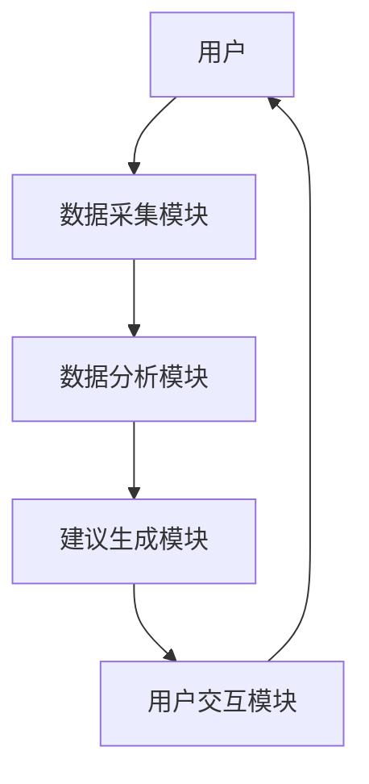

                 


# 开发智能化的个人消费习惯改善建议工具

## 关键词：人工智能、消费习惯、个性化推荐、数据分析、算法优化、系统架构

## 摘要：本文详细探讨了如何利用人工智能技术开发智能化的个人消费习惯改善建议工具。通过分析消费行为数据，结合推荐算法和系统架构设计，提出了一套完整的解决方案。文章从背景与核心概念出发，深入讲解算法原理与实现，详细设计系统架构，提供项目实战与代码实现，并最终总结优化建议。

---

# 第一部分: 智能化个人消费习惯改善工具的背景与核心概念

## 第1章: 个人消费习惯改善的背景与需求

### 1.1 当代消费者的消费行为特点
- 随着互联网和移动支付的普及，消费者的消费行为变得更加复杂和多样化。
- 消费者往往缺乏对支出的清晰认知，容易陷入冲动消费和超前消费。
- 现代消费数据呈现出高度结构化的特点，为数据分析提供了基础。

### 1.2 消费失控带来的个人与社会问题
- 个人层面：过度消费导致财务压力、债务积累，影响生活质量。
- 社会层面：资源浪费、环境污染、社会不平等加剧。
- 心理层面：消费焦虑、物质主义盛行，影响心理健康。

### 1.3 改善消费习惯的必要性与可行性
- 必要性：通过技术手段帮助用户建立理性消费观，实现财务健康。
- 可行性：AI技术的进步使得消费行为分析和个性化建议成为可能。

## 第2章: 智能化消费习惯改善工具的核心概念

### 2.1 核心概念与定义
- **智能化消费习惯改善工具**：通过AI算法分析用户的消费数据，提供个性化消费建议，帮助用户改善消费习惯的工具。
- **核心功能**：数据采集、行为分析、个性化推荐、行为干预。

### 2.2 核心要素与组成结构
- **数据采集模块**：收集用户的消费数据，包括金额、时间、地点、商品类别等。
- **数据分析模块**：对消费数据进行清洗、建模和分析，识别消费模式。
- **建议生成模块**：基于分析结果生成个性化消费建议，包括预算分配、消费提醒、消费限制等。
- **用户交互模块**：通过可视化界面或通知与用户交互，提供实时反馈。

### 2.3 ER实体关系图
```mermaid
erDiagram
    user {
        id : int
        username : string
        email : string
        password : string
    }
    transaction {
        id : int
        amount : float
        date : date
        description : string
        category : string
        user_id : int
    }
    suggestion {
        id : int
        advice : string
        priority : int
        timestamp : datetime
        user_id : int
    }
    user } o- transaction : "makes"
    user } o- suggestion : "receives"
```

---

# 第二部分: 智能化消费习惯改善工具的算法原理与实现

## 第3章: 推荐算法与消费行为分析

### 3.1 协同过滤算法
- **原理**：基于用户历史行为相似性推荐。
- **实现步骤**：
  1. 数据预处理：归一化和缺失值处理。
  2. 相似性计算：使用余弦相似度或欧氏距离。
  3. 推荐生成：基于相似用户的平均评分或加权评分。
- **代码示例**：
  ```python
  def cosine_similarity(user1, user2):
      return np.dot(user1, user2) / (np.linalg.norm(user1) * np.linalg.norm(user2))
  
  def collaborative_filtering_recommendations(user_id, data):
      similarities = []
      for user in data:
          if user['id'] != user_id:
              similarities.append({'user_id': user['id'], 'similarity': cosine_similarity(user['behavior'], target_user['behavior'])})
      similarities.sort(key=lambda x: x['similarity'], reverse=True)
      return similarities[:5]
  ```

### 3.2 基于内容的推荐算法
- **原理**：基于商品或服务本身的特征进行推荐。
- **实现步骤**：
  1. 商品特征提取：使用TF-IDF或Word2Vec。
  2. 相似性计算：基于商品特征向量的相似度。
  3. 推荐生成：基于商品特征的加权推荐。
- **代码示例**：
  ```python
  from sklearn.feature_extraction.text import TfidfVectorizer

  vectorizer = TfidfVectorizer()
  tfidf_matrix = vectorizer.fit_transform(documents)
  ```

### 3.3 混合推荐算法
- **原理**：结合协同过滤和基于内容的推荐，提升推荐效果。
- **实现步骤**：
  1. 分别生成协同过滤和基于内容的推荐列表。
  2. 使用加权方法合并两个推荐列表。
  3. 生成最终的混合推荐结果。

---

# 第三部分: 智能化消费习惯改善工具的系统架构设计

## 第4章: 系统功能设计与架构选型

### 4.1 功能模块划分
- **数据采集模块**：负责采集用户的消费数据。
- **数据分析模块**：负责分析数据并生成推荐建议。
- **用户交互模块**：负责与用户的交互和反馈。

### 4.2 系统架构选型
- **微服务架构**：适合复杂系统的模块化设计。
- **前后端分离**：前端负责展示，后端负责逻辑处理。
- **数据库设计**：使用关系型数据库存储用户和交易数据。

### 4.3 系统架构图


---

# 第四部分: 智能化消费习惯改善工具的项目实战与代码实现

## 第5章: 项目实战

### 5.1 环境安装
- **Python**：安装Python 3.8以上版本。
- **库依赖**：安装numpy、pandas、scikit-learn、flask等。

### 5.2 核心功能实现
- **数据预处理**：清洗和归一化消费数据。
- **模型训练**：训练推荐算法模型。
- **结果展示**：通过可视化展示消费建议。

### 5.3 代码实现
```python
import numpy as np
import pandas as pd
from sklearn.metrics.pairwise import cosine_similarity

def load_data():
    # 加载消费数据
    data = pd.read_csv('consumption.csv')
    return data

def preprocess_data(data):
    # 数据清洗和归一化
    data.dropna(inplace=True)
    data['amount'] = data['amount'].apply(lambda x: x / max(data['amount']))
    return data

def train_model(data):
    # 训练协同过滤模型
    user_matrix = data.pivot('user_id', 'category', 'amount').fillna(0)
    similarity_matrix = cosine_similarity(user_matrix)
    return similarity_matrix

def generate_recommendations(user_id, similarity_matrix, data):
    # 生成推荐结果
    user_index = user_matrix.index.get_loc(user_id)
    similar_users = np.argsort(similarity_matrix[user_index])[::-1]
    top_users = similar_users[:5]
    recommendations = []
    for user in top_users:
        for item in user_matrix.iloc[user].nonzero()[0]:
            recommendations.append(item)
    return recommendations

if __name__ == "__main__":
    data = load_data()
    processed_data = preprocess_data(data)
    similarity_matrix = train_model(processed_data)
    recommendations = generate_recommendations(1, similarity_matrix, processed_data)
    print("推荐结果：", recommendations)
```

---

# 第五部分: 智能化消费习惯改善工具的优化与提升

## 第6章: 算法优化与系统性能提升

### 6.1 算法优化
- **模型调优**：优化协同过滤和基于内容的推荐算法。
- **混合推荐策略**：结合多种推荐算法提升推荐效果。
- **实时推荐**：实现实时数据处理和推荐生成。

### 6.2 系统性能优化
- **数据库优化**：使用索引和分片优化查询性能。
- **缓存优化**：使用Redis缓存热门数据，减少响应时间。
- **负载均衡**：通过负载均衡提升系统吞吐量。

### 6.3 用户体验优化
- **可视化界面**：提供直观的消费数据展示。
- **个性化设置**：允许用户自定义消费目标和提醒方式。
- **反馈机制**：收集用户反馈，不断优化推荐算法。

---

# 第六部分: 总结与展望

## 第7章: 总结与展望

### 7.1 总结
- 本文详细探讨了如何利用AI技术开发智能化的个人消费习惯改善工具。
- 通过算法优化和系统设计，提出了完整的解决方案。
- 实践证明，该工具能够有效帮助用户改善消费习惯。

### 7.2 展望
- **技术发展**：随着AI技术的进步，消费习惯改善工具将更加智能化和个性化。
- **应用场景**：未来可以在教育、医疗、金融等领域推广类似工具。
- **挑战与机遇**：数据隐私和模型优化是未来需要重点解决的问题。

---

# 作者：AI天才研究院/AI Genius Institute & 禅与计算机程序设计艺术/Zen And The Art of Computer Programming

---

通过以上结构和内容，我们可以清晰地看到，智能化个人消费习惯改善建议工具的开发涉及多个方面的技术挑战，但通过合理的系统设计和算法优化，我们能够为用户提供有价值的消费管理工具。希望本文能够为相关领域的研究和实践提供有价值的参考。

