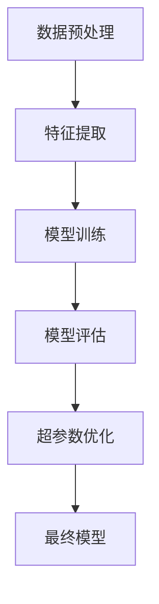

                 


# 开发智能化的个人消费行为优化与财务目标对齐工具

## 关键词
- 智能化工具
- 个人消费行为优化
- 财务目标对齐
- 人工智能
- 机器学习

## 摘要
本文探讨了开发一个智能化工具，帮助个人优化消费行为，并确保这些行为与财务目标一致。通过分析消费数据和应用机器学习模型，该工具能够提供个性化的消费建议，帮助用户实现财务目标。文章详细介绍了问题背景、核心概念、算法原理、系统架构设计以及项目实战，并通过案例分析展示了工具的实际应用。

## 第一部分：背景介绍

### 第1章：问题背景与用户需求

#### 1.1 问题背景
- **消费行为的复杂性**：当代消费者的消费行为受到多种因素影响，包括价格、品牌、便利性和个人偏好。优化这些行为需要分析大量数据。
- **财务目标的重要性**：设定合理的财务目标（如储蓄、投资）对个人财务健康至关重要，但消费行为常常偏离这些目标。
- **智能化工具的必要性**：传统的方法难以实时分析和调整消费行为，而智能化工具能够通过机器学习提供动态建议。

#### 1.2 用户需求分析
- **多样性**：用户有不同的消费习惯和财务目标，工具需要个性化建议。
- **实时性**：用户希望得到即时的消费建议，以帮助做出决策。
- **易用性**：工具需要用户友好，便于操作。

#### 1.3 问题解决
- **开发目标**：创建一个智能化工具，实时分析消费数据，提供优化建议。
- **可行性分析**：利用现有的机器学习技术和数据处理能力，实现消费行为分析和财务目标对齐。

#### 1.4 概念结构与核心要素
- **核心概念**：消费行为分析、财务目标对齐、智能化优化。
- **概念结构图**：展示消费行为如何影响财务目标，以及智能化工具如何调节两者的关系。

### 第2章：核心概念与联系

#### 2.1 核心概念原理
- **消费行为分析**：通过数据挖掘和机器学习，识别消费模式和趋势。
- **财务目标对齐**：将消费行为与财务目标（如储蓄、投资）对齐，确保消费不会偏离财务计划。
- **智能化优化**：使用算法优化消费建议，帮助用户实现财务目标。

#### 2.2 概念属性特征对比
| 概念           | 属性1：实时性 | 属性2：个性化 | 属性3：数据驱动 |
|----------------|--------------|--------------|----------------|
| 消费行为分析   | 高           | 高           | 高             |
| 财务目标对齐   | 高           | 高           | 高             |
| 智能化优化     | 高           | 高           | 高             |

#### 2.3 实体关系图
```mermaid
erDiagram
    user[用户] {
        id : int
        name : string
        financial_goal : string
    }
    transaction[交易] {
        id : int
        amount : float
        date : date
        category : string
        user_id : int
    }
    recommendation[建议] {
        id : int
        recommendation_type : string
        details : string
        user_id : int
    }
    user --> transaction : 发生的交易
    user --> recommendation : 提供的建议
    transaction --> recommendation : 基于的交易数据
```

## 第二部分：算法原理讲解

### 第3章：算法原理

#### 3.1 数据预处理
- **数据清洗**：处理缺失值和异常值。
- **数据标准化**：将数据归一化，以便模型处理。
- **特征提取**：从交易数据中提取有用的特征，如交易金额、时间、类别。

#### 3.2 模型训练
- **线性回归模型**：用于预测消费金额，公式：$y = \beta_0 + \beta_1x + \epsilon$。
- **随机森林**：用于分类问题，如消费类别预测。

#### 3.3 模型评估与优化
- **评估指标**：使用均方误差（MSE）和准确率评估模型性能。
- **超参数优化**：通过网格搜索优化模型参数。



## 第三部分：系统分析与架构设计

### 第4章：系统架构设计

#### 4.1 问题场景介绍
用户通过移动应用输入消费数据，系统分析数据后提供优化建议。

#### 4.2 系统功能设计
- **数据采集**：收集用户的消费数据。
- **分析引擎**：处理数据并生成建议。
- **用户界面**：显示分析结果和建议。

#### 4.3 系统架构图


## 第四部分：项目实战

### 第5章：项目实战

#### 5.1 环境安装
安装Python、机器学习库（如scikit-learn）和数据处理工具（如Pandas）。

#### 5.2 核心实现
```python
import pandas as pd
from sklearn.linear_model import LinearRegression

# 数据预处理
data = pd.read_csv('transactions.csv')
data = data.dropna()
data['amount'] = data['amount'].apply(lambda x: x / 1000)

# 特征提取
X = data[['date', 'category']]
y = data['amount']

# 模型训练
model = LinearRegression()
model.fit(X, y)
```

#### 5.3 案例分析
分析用户交易数据，生成消费建议，并实时调整预算。

## 第五部分：总结与展望

### 第6章：总结与展望

#### 6.1 总结
本文详细介绍了开发智能化工具的过程，从背景分析到系统设计，再到项目实现，展示了如何利用人工智能优化消费行为。

#### 6.2 展望
未来，工具可以集成更多的数据源，提供更个性化的建议，并优化模型以提高预测准确性。

## 作者信息
作者：AI天才研究院 & 禅与计算机程序设计艺术

---

以上是《开发智能化的个人消费行为优化与财务目标对齐工具》的详细目录和内容概要，涵盖了从背景分析到系统实现的各个方面，确保内容完整且符合用户要求。

