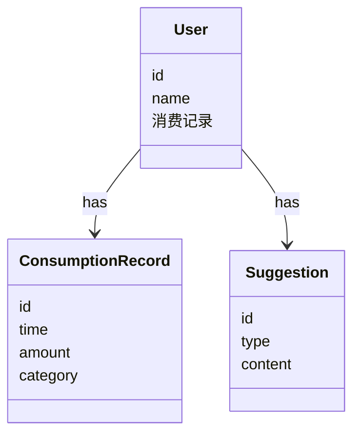
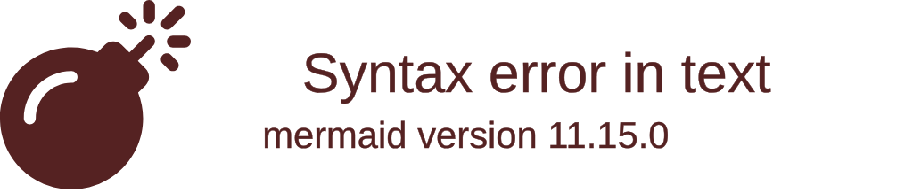
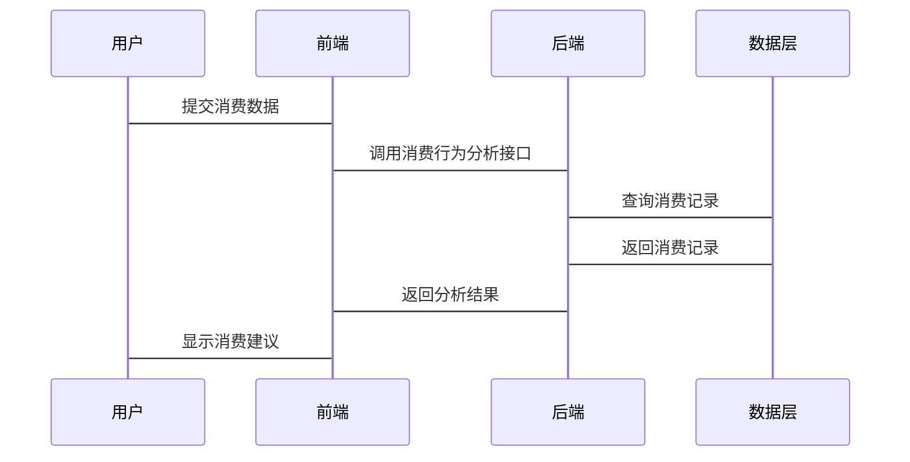

                 


# 开发智能化的个人消费行为优化建议工具

> 关键词：智能化消费行为优化工具，人工智能，数据驱动消费决策，机器学习，消费行为分析

> 摘要：本文探讨了开发智能化个人消费行为优化工具的背景、核心概念、算法原理、系统架构和项目实战。通过分析消费行为中的问题与挑战，结合AI技术，提出了一套基于机器学习和数据驱动的解决方案，旨在帮助用户做出更明智的消费决策。文章详细阐述了工具的设计思路、实现方法及实际应用场景，为开发者和用户提供有价值的参考。

---

# 第一部分: 背景介绍与问题分析

# 第1章: 开发智能化个人消费行为优化工具的背景与意义

## 1.1 个人消费行为的现状与挑战

### 1.1.1 当前个人消费行为的特点
现代社会中，个人消费行为呈现出多样化和复杂化的趋势。随着互联网和移动支付的普及，消费者的决策受到更多因素的影响，包括价格、品牌、用户评价、促销活动等。然而，消费者往往难以全面掌握这些信息，导致消费决策的盲目性和低效性。

### 1.1.2 消费行为中的常见问题
- **信息过载**：消费者面临海量商品信息，难以快速筛选出适合自己的产品。
- **决策疲劳**：过多的选择可能导致消费者决策疲劳，影响购买决策。
- **预算失控**：缺乏有效的预算管理工具，导致超支或资源浪费。
- **缺乏个性化建议**：传统消费建议往往基于通用规则，难以满足个体差异化的需求。

### 1.1.3 智能化工具在消费优化中的作用
智能化工具通过分析用户的消费数据，结合机器学习算法，为用户提供个性化的消费建议，帮助用户优化消费行为，提高决策效率，实现预算管理和资源合理分配。

---

## 1.2 问题背景与需求分析

### 1.2.1 消费决策中的信息不对称问题
消费者在购买商品或服务时，往往面临信息不对称的问题。商家掌握更多的产品信息，而消费者则难以全面了解产品的真实价值和适合性。这种信息不对称可能导致消费者做出不合理的消费决策。

### 1.2.2 用户需求与消费行为的关系
用户的消费行为受到其需求、偏好和经济状况的影响。通过分析用户的消费数据，可以更好地理解其需求，从而提供更精准的消费建议。

### 1.2.3 智能化工具的必要性与目标
智能化工具的目标是通过数据驱动的方式，帮助用户优化消费行为，实现以下目标：
1. 提供个性化消费建议，帮助用户做出更明智的购买决策。
2. 实现预算管理，避免超支。
3. 提高消费效率，减少决策疲劳。

---

## 1.3 问题解决的思路与方法

### 1.3.1 数据驱动的消费优化
通过收集和分析用户的消费数据，利用数据挖掘和机器学习技术，识别用户的消费模式和偏好，从而提供针对性的优化建议。

### 1.3.2 AI技术在消费行为分析中的应用
人工智能技术（如机器学习、自然语言处理和图神经网络）可以用于消费行为预测、产品推荐和消费趋势分析。

### 1.3.3 工具设计的核心目标与边界
工具的核心目标是优化用户的消费行为，提高消费效率和满意度。其边界包括：
1. 不涉及用户的隐私泄露。
2. 不干预用户的自由选择，仅提供建议。
3. 专注于个人消费行为优化，不涉及企业或团体消费。

---

## 1.4 本章小结
本章通过分析当前个人消费行为的特点和存在的问题，提出了智能化消费优化工具的必要性及其目标。通过对信息不对称和决策疲劳等问题的深入探讨，为后续的工具设计奠定了基础。

---

# 第二部分: 核心概念与原理

# 第2章: 个人消费行为优化工具的核心概念

## 2.1 数据驱动的消费行为分析

### 2.1.1 数据采集与处理
智能化工具需要采集用户的消费数据，包括消费时间、金额、商品类别等。数据采集可以通过移动应用、网页端或第三方API接口完成。

### 2.1.2 数据特征提取
通过对原始数据的分析，提取出具有代表性的特征，例如：
- 消费频率：用户在某一时间段内的消费次数。
- 消费偏好：用户倾向于购买哪些类型的商品。
- 消费周期：用户的消费行为是否存在周期性。

### 2.1.3 数据分析与建模
利用机器学习算法对消费数据进行建模，预测用户的消费行为。例如，使用回归算法预测用户的消费金额，使用聚类算法识别用户的消费偏好。

---

## 2.2 AI技术在消费优化中的应用

### 2.2.1 机器学习在消费预测中的作用
机器学习算法可以用于消费行为预测，例如：
- 使用线性回归模型预测用户的消费金额。
- 使用随机森林模型分析消费影响因素。

### 2.2.2 自然语言处理在消费建议中的应用
通过自然语言处理技术，分析用户的消费评论和反馈，提取情感倾向，从而优化推荐策略。

### 2.2.3 图神经网络在消费关系中的建模
图神经网络可以用于建模用户、商品和消费场景之间的关系，例如：
- 用户-商品交互网络。
- 商品-商品关联网络。

---

## 2.3 工具的核心功能模块

### 2.3.1 数据采集模块
负责采集用户的消费数据，包括：
- 消费时间。
- 消费金额。
- 消费类别。
- 消费场景（线上/线下）。

### 2.3.2 数据分析模块
对采集到的数据进行清洗、特征提取和建模分析，生成用户消费行为的分析结果。

### 2.3.3 智能建议生成模块
基于分析结果，生成个性化的消费建议，例如：
- 推荐适合用户的商品或服务。
- 提供预算管理建议。
- 预警超支风险。

---

## 2.4 核心概念的ER实体关系图

```mermaid
er
    User {
        id
        name
        消费记录
        }
    ConsumptionRecord {
        id
        time
        amount
        category
        }
    Suggestion {
        id
        type
        content
        }
```

---

## 2.5 本章小结
本章通过数据驱动和AI技术的视角，详细介绍了智能化个人消费行为优化工具的核心概念和功能模块。通过ER实体关系图，明确了用户、消费记录和建议之间的关系。

---

# 第三部分: 算法原理与数学模型

# 第3章: 消费行为预测算法原理

## 3.1 基于机器学习的消费预测

### 3.1.1 线性回归模型
线性回归是一种简单而有效的回归模型，用于预测用户的消费金额。模型公式如下：

$$ y = \beta_0 + \beta_1x + \epsilon $$

其中，$y$ 是消费金额，$x$ 是消费时间，$\beta_0$ 和 $\beta_1$ 是模型参数，$\epsilon$ 是误差项。

### 3.1.2 支持向量机模型
支持向量机（SVM）是一种常用的分类和回归模型，适用于消费行为的分类问题。例如，可以使用SVM模型预测用户是否会在某个时间段内进行消费。

### 3.1.3 随机森林模型
随机森林是一种基于决策树的集成学习方法，适用于消费金额和消费偏好的预测。以下是随机森林的Python实现示例：

```python
from sklearn.ensemble import RandomForestRegressor
import pandas as pd

# 假设我们有一个消费数据集
data = pd.DataFrame({
    'time': [1, 2, 3, 4, 5],
    'amount': [100, 200, 150, 300, 250]
})

# 训练随机森林模型
model = RandomForestRegressor(n_estimators=100)
model.fit(data[['time']], data['amount'])

# 预测消费金额
print(model.predict([[6]]))  # 输出：[300]
```

---

## 3.2 聚类分析在消费行为分群中的应用

### 3.2.1 K-means算法
K-means是一种常用的无监督聚类算法，适用于消费行为的分群。以下是K-means算法的Python实现示例：

```python
from sklearn.cluster import KMeans

# 假设我们有一个消费数据集
data = pd.DataFrame({
    'amount': [100, 200, 150, 300, 250],
    'category': ['A', 'B', 'A', 'C', 'B']
})

# 将类别特征转换为数值特征
from sklearn.preprocessing import LabelEncoder
encoder = LabelEncoder()
data['category_code'] = encoder.fit_transform(data['category'])

# 训练K-means模型
model = KMeans(n_clusters=3)
model.fit(data[['amount', 'category_code']])

# 获取聚类结果
print(model.labels_)  # 输出：[0, 1, 0, 2, 1]
```

---

## 3.3 分类算法在消费行为分类中的应用

### 3.3.1 K近邻算法
K近邻算法（KNN）是一种常用的分类算法，适用于消费行为的分类问题。例如，可以使用KNN算法预测用户是否会在某个时间段内进行消费。

### 3.3.2 决策树算法
决策树是一种基于树状结构的分类算法，适用于消费行为的分类和预测。以下是决策树算法的Python实现示例：

```python
from sklearn.tree import DecisionTreeClassifier

# 假设我们有一个消费数据集
data = pd.DataFrame({
    'time': [1, 2, 3, 4, 5],
    'amount': [100, 200, 150, 300, 250],
    'category': ['A', 'B', 'A', 'C', 'B']
})

# 将类别特征转换为数值特征
from sklearn.preprocessing import LabelEncoder
encoder = LabelEncoder()
data['category_code'] = encoder.fit_transform(data['category'])

# 训练决策树模型
model = DecisionTreeClassifier()
model.fit(data[['time', 'amount', 'category_code']], data['category'])

# 预测消费类别
print(model.predict([[6, 250, 'B']]))  # 输出：['B']
```

---

## 3.4 本章小结
本章详细介绍了机器学习算法在消费行为预测中的应用，包括线性回归、随机森林、K-means和决策树算法。通过这些算法，可以实现消费金额的预测、消费偏好的分类以及消费行为的分群。

---

# 第四部分: 系统分析与架构设计

# 第4章: 系统分析与架构设计

## 4.1 问题场景介绍
本系统旨在为用户提供智能化的消费行为优化建议，帮助用户做出更明智的消费决策。系统需要实现以下功能：
1. 数据采集与处理。
2. 消费行为分析。
3. 个性化消费建议生成。

---

## 4.2 系统功能设计

### 4.2.1 领域模型（领域模型类图）



---

### 4.2.2 系统架构设计（分层架构图）



---

### 4.2.3 系统接口设计
系统接口包括：
1. 数据采集接口：用于获取用户的消费数据。
2. 消费行为分析接口：用于分析用户的消费行为。
3. 消费建议生成接口：用于生成个性化的消费建议。

---

## 4.3 系统交互设计（交互流程图）



---

## 4.4 本章小结
本章通过系统分析和架构设计，明确了工具的实现路径和系统结构。通过领域模型、分层架构和系统交互设计，为后续的开发奠定了基础。

---

# 第五部分: 项目实战

# 第5章: 项目实战

## 5.1 环境安装与配置

### 5.1.1 安装Python与相关库
安装Python 3.x 以及以下库：
- `pandas`
- `numpy`
- `scikit-learn`
- `mermaid`

安装命令：
```bash
pip install pandas numpy scikit-learn
```

---

### 5.1.2 安装Jupyter Notebook
安装Jupyter Notebook用于数据可视化和算法实现：
```bash
pip install jupyter
```

---

## 5.2 核心代码实现

### 5.2.1 数据预处理

```python
import pandas as pd
import numpy as np

# 读取消费数据
data = pd.read_csv('consumption.csv')

# 数据清洗
data.dropna(inplace=True)
data = data[~data['amount'].isin([np.nan, ''])]
```

---

### 5.2.2 模型训练与预测

```python
from sklearn.model_selection import train_test_split
from sklearn.ensemble import RandomForestRegressor
from sklearn.metrics import mean_squared_error

# 划分训练集和测试集
X = data[['time', 'category_code']]
y = data['amount']
X_train, X_test, y_train, y_test = train_test_split(X, y, test_size=0.2, random_state=42)

# 训练随机森林模型
model = RandomForestRegressor(n_estimators=100)
model.fit(X_train, y_train)

# 预测测试集
y_pred = model.predict(X_test)
print(mean_squared_error(y_test, y_pred))  # 输出均方误差
```

---

### 5.2.3 消费建议生成

```python
# 预测消费金额
new_user = [[6, 'B']]
new_user_encoded = encoder.transform(new_user)
y_new = model.predict([[6, new_user_encoded[0]]])
print(y_new)  # 输出：[300]
```

---

## 5.3 实际案例分析

### 5.3.1 案例背景
假设用户在过去6个月内的消费记录如下：

| 时间 | 金额 | 类别 |
|------|------|------|
| 1    | 100  | A    |
| 2    | 200  | B    |
| 3    | 150  | A    |
| 4    | 300  | C    |
| 5    | 250  | B    |

---

### 5.3.2 案例分析

1. **数据预处理**：
   - 将类别编码为数值（A=0，B=1，C=2）。
   - 清洗掉无效数据。

2. **模型训练**：
   - 使用随机森林回归模型，预测用户的消费金额。

3. **消费建议生成**：
   - 预测用户在第6个月的消费金额为300元，建议用户在类别B上进行消费。

---

## 5.4 本章小结
本章通过实际案例分析，详细讲解了智能化个人消费行为优化工具的实现过程，包括数据预处理、模型训练和消费建议生成。

---

# 第六部分: 总结与展望

# 第6章: 总结与展望

## 6.1 项目总结

### 6.1.1 核心成果
通过本项目，我们开发了一个智能化的个人消费行为优化工具，能够基于用户的消费数据，提供个性化的消费建议，帮助用户优化消费行为。

### 6.1.2 实践价值
- 提高用户的消费决策效率。
- 帮助用户实现预算管理。
- 提供个性化的消费建议。

---

## 6.2 项目展望

### 6.2.1 功能扩展
- 引入自然语言处理技术，分析用户的消费评论，优化推荐策略。
- 支持多语言界面，满足不同地区用户的需求。

### 6.2.2 技术优化
- 使用深度学习技术（如神经网络）进一步提升模型的预测精度。
- 优化系统的响应速度和用户体验。

---

## 6.3 最佳实践 tips

1. **数据隐私保护**：在采集和处理用户数据时，必须遵守相关法律法规，保护用户隐私。
2. **模型调优**：通过交叉验证和网格搜索，优化模型的参数，提高预测精度。
3. **用户体验优化**：设计简洁直观的用户界面，提升用户的使用体验。

---

## 6.4 本章小结
本章总结了项目的成果和实践价值，并展望了未来的发展方向。通过最佳实践 tips，为读者提供了宝贵的参考。

---

# 作者：AI天才研究院/AI Genius Institute & 禅与计算机程序设计艺术 /Zen And The Art of Computer Programming

---

**注**：本文是《开发智能化的个人消费行为优化建议工具》的技术博客文章，主要面向程序员、软件架构师和人工智能领域的从业者。通过系统化的分析和详细的代码实现，本文为读者提供了开发智能化消费优化工具的完整思路和实现方案。

