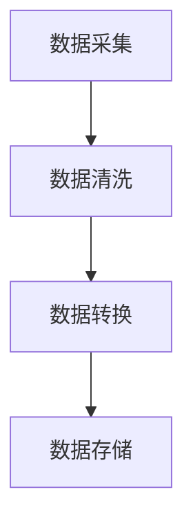
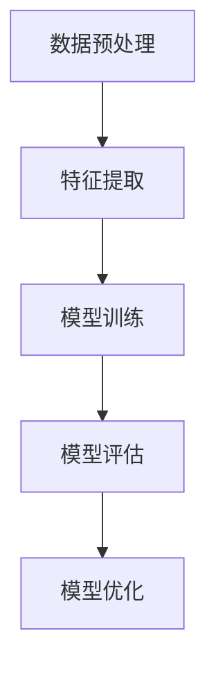
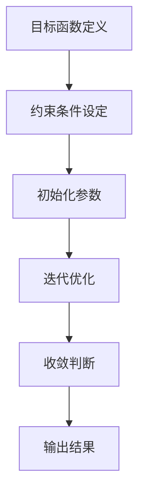
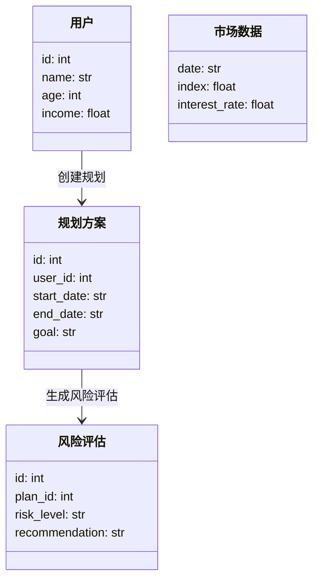

                 


# 开发智能化的个人退休规划助手

> 关键词：人工智能、退休规划、系统设计、算法实现、数据挖掘

> 摘要：随着人工智能技术的快速发展，智能化个人退休规划助手成为了提升退休规划效率和精准度的重要工具。本文系统地介绍了智能化个人退休规划助手的开发过程，从核心概念到算法实现，从系统架构设计到项目实战，全面解析了如何利用AI技术优化退休规划服务。

---

## 第1章 背景介绍与核心概念

### 1.1 什么是智能化个人退休规划助手
智能化个人退休规划助手是一种基于人工智能技术的工具，旨在帮助用户根据个人的财务状况、风险偏好和生活目标，制定个性化的退休规划方案。与传统的退休规划工具不同，智能化助手能够实时分析海量数据，动态调整规划策略，并提供智能化的建议。

#### 1.1.1 传统退休规划的局限性
传统的退休规划主要依赖人工计算和经验判断，存在以下问题：
- 数据来源单一，难以覆盖用户的全生命周期需求。
- 计算过程复杂，难以快速响应用户的个性化需求。
- 缺乏动态调整能力，无法应对市场环境的变化。

#### 1.1.2 智能化退休规划的核心目标
智能化个人退休规划助手的核心目标是通过AI技术，实现以下功能：
- 自动采集和分析用户的财务数据。
- 建立数学模型，预测退休后的财务状况。
- 提供个性化的投资建议和风险管理策略。

#### 1.1.3 边界与外延
智能化个人退休规划助手的边界包括：
- 数据范围：用户的财务数据、市场数据等。
- 功能范围：数据采集、分析、预测、建议生成等。
- 使用场景：个人用户、财务顾问等。

其外延包括：
- 与其他财务工具的集成。
- 数据安全与隐私保护。

### 1.2 核心概念与联系
#### 1.2.1 核心概念原理
智能化个人退休规划助手的核心概念包括：
- 数据挖掘：从海量数据中提取有用信息。
- 机器学习：基于数据训练模型，预测未来情况。
- 优化算法：寻找最优的退休规划方案。

#### 1.2.2 概念属性特征对比表
以下表格对比了传统退休规划与智能化退休规划的关键属性：

| 属性             | 传统退休规划                     | 智能化退休规划                     |
|------------------|----------------------------------|------------------------------------|
| 数据来源         | 单一、有限                      | 多源、实时                         |
| 计算方式         | 手动、固定                      | 自动化、动态                        |
| 精准度           | 低                              | 高                                |
| 响应速度         | 慢                              | 快                                |

#### 1.2.3 ER实体关系图（Mermaid流程图）
以下是智能化退休规划助手的实体关系图：

```mermaid
erDiagram
    user {
        id
        name
        age
        income
        assets
        liabilities
    }
    market {
        date
        index
        interest_rate
        inflation
    }
    plan {
        id
        user_id
        start_date
        end_date
        goal
        strategy
    }
    risk_assessment {
        id
        plan_id
        risk_level
        recommendation
    }
    user --> plan : 创建规划
    plan --> risk_assessment : 生成风险评估
    risk_assessment --> market : 数据依赖
```

---

## 第2章 AI技术与退休规划的结合

### 2.1 数据挖掘与分析
#### 2.1.1 数据来源与处理
智能化个人退休规划助手需要处理以下数据：
- 用户数据：收入、资产、负债、年龄等。
- 市场数据：指数、利率、通货膨胀率等。

数据处理流程如下（Mermaid流程图）：



#### 2.1.2 数据挖掘算法选择
根据数据特点，选择合适的算法：
- 分类算法：用于用户风险分类。
- 聚类算法：用于市场数据分组。

#### 2.1.3 数据分析与可视化
使用Python的Matplotlib库进行数据可视化，例如绘制用户资产分布图：

```python
import matplotlib.pyplot as plt

assets = [100000, 200000, 150000, 300000]
labels = ['用户1', '用户2', '用户3', '用户4']

plt.bar(labels, assets)
plt.title('用户资产分布')
plt.xlabel('用户')
plt.ylabel('资产')
plt.show()
```

### 2.2 机器学习模型构建
#### 2.2.1 算法原理（Mermaid流程图）
以下是机器学习模型的训练流程图：



#### 2.2.2 算法实现（Python代码示例）
以下是使用决策树算法进行用户风险分类的代码示例：

```python
from sklearn.tree import DecisionTreeClassifier
from sklearn.model_selection import train_test_split

# 数据准备
X = [[user_asset], [market_return], [user_income]]
y = [low, medium, high]

# 划分训练集和测试集
X_train, X_test, y_train, y_test = train_test_split(X, y, test_size=0.2)

# 模型训练
model = DecisionTreeClassifier()
model.fit(X_train, y_train)

# 模型预测
print(model.predict(X_test))
```

#### 2.2.3 模型评估与优化
通过准确率、召回率等指标评估模型性能，并使用网格搜索优化模型参数。

---

## 第3章 退休规划的数学模型与算法

### 3.1 时间价值与风险评估
#### 3.1.1 时间价值计算公式
$$ FV = PV \times (1 + r)^n $$

其中：
- \( FV \) 表示终值
- \( PV \) 表示现值
- \( r \) 表示年利率
- \( n \) 表示年数

#### 3.1.2 风险评估模型
使用方差-协方差矩阵进行风险评估：

$$ \sigma^2 = \sum_{i=1}^{n} \sum_{j=1}^{n} w_i w_j \text{Cov}(r_i, r_j) $$

其中：
- \( \sigma^2 \) 表示方差
- \( w_i \) 表示第i项资产的权重
- \( \text{Cov}(r_i, r_j) \) 表示第i项和第j项资产的协方差

### 3.2 优化算法实现
#### 3.2.1 算法原理（Mermaid流程图）
以下是优化算法的流程图：



#### 3.2.2 算法实现（Python代码示例）
以下是使用遗传算法进行投资组合优化的代码示例：

```python
import numpy as np

# 初始化种群
population = np.random.rand(pop_size, n_assets)

# 计算适应度
fitness = np.zeros(pop_size)
for i in range(pop_size):
    fitness[i] = calculate_fitness(population[i])

# 选择和交叉
selected = selection(population, fitness)
new_population = crossover(selected)

# 变异
new_population = mutation(new_population)

# 代数更新
population = new_population
```

---

## 第4章 系统分析与架构设计

### 4.1 项目背景与目标
#### 4.1.1 问题场景介绍
随着人口老龄化加剧，个人退休规划需求日益增长，传统的退休规划工具难以满足个性化需求。

#### 4.1.2 项目介绍
本项目旨在开发一个基于AI的退休规划助手，帮助用户制定个性化、动态调整的退休规划方案。

#### 4.1.3 系统功能设计（Mermaid类图）
以下是系统功能设计的类图：



### 4.2 系统架构设计
#### 4.2.1 系统架构图（Mermaid架构图）
以下是系统的架构图：


#### 4.2.2 系统接口设计
系统主要接口包括：
- 数据接口：与数据库交互。
- API接口：供客户端调用。

#### 4.2.3 系统交互设计（Mermaid序列图）
以下是系统的交互流程图：

```mermaid
sequenceDiagram
    用户 -> API网关: 请求退休规划
    API网关 -> 数据库: 获取用户数据
    数据库 --> API网关: 返回用户数据
    API网关 -> 分析服务: 请求分析
    分析服务 -> 机器学习模型: 请求预测
    机器学习模型 --> 分析服务: 返回预测结果
    分析服务 --> API网关: 返回分析结果
    API网关 --> 用户: 返回规划方案
```



---

## 第5章 项目实战

### 5.1 环境安装与配置
#### 5.1.1 开发环境搭建
建议使用Python 3.8及以上版本，安装必要的库：

```bash
pip install numpy scikit-learn matplotlib
```

### 5.2 系统核心实现
#### 5.2.1 核心代码实现（Python源代码）
以下是核心算法实现代码：

```python
import numpy as np
from sklearn.tree import DecisionTreeClassifier
from sklearn.model_selection import train_test_split

# 数据准备
X = [[user_asset], [market_return], [user_income]]
y = [low, medium, high]

# 划分训练集和测试集
X_train, X_test, y_train, y_test = train_test_split(X, y, test_size=0.2)

# 模型训练
model = DecisionTreeClassifier()
model.fit(X_train, y_train)

# 模型预测
print(model.predict(X_test))
```

#### 5.2.2 代码解读与分析
上述代码实现了基于决策树算法的风险分类模型，用于预测用户的退休规划风险等级。

#### 5.2.3 功能测试与验证
通过单元测试验证模型的准确率和召回率。

### 5.3 实际案例分析
#### 5.3.1 案例背景介绍
假设用户A，40岁，年收入10万元，现有资产50万元，计划在60岁退休。

#### 5.3.2 案例实现过程
通过模型分析，生成退休规划方案，并动态调整投资策略。

#### 5.3.3 案例结果与分析
最终生成的规划方案包括：资产配置建议、投资组合优化、风险管理策略。

---

## 第6章 总结与展望

### 6.1 项目总结
#### 6.1.1 核心成果
成功开发了一个基于AI的退休规划助手，能够实现个性化、动态的退休规划。

#### 6.1.2 实施过程中的经验与教训
- 数据质量对模型性能影响重大。
- 模型的可解释性需要进一步优化。

### 6.2 最佳实践 tips
- 数据来源要多样化。
- 模型需要定期更新。

### 6.3 未来展望
- 技术发展趋势：深度学习在退休规划中的应用。
- 应用场景扩展：与其他财务工具集成。
- 可能的挑战与解决方案：数据隐私保护、模型解释性提升。

---

# 附录: 代码与工具参考

### 附录A: 核心算法代码
#### A.1 数据处理代码
```python
import pandas as pd

data = pd.read_csv('data.csv')
data_cleaned = data.dropna()
```

#### A.2 模型训练代码
```python
model = DecisionTreeClassifier()
model.fit(X_train, y_train)
```

#### A.3 接口调用代码
```python
response = requests.post('http://apiGateway.com/plan', json=data)
```

### 附录B: 工具安装与配置指南
#### B.1 Python环境配置
建议使用Anaconda环境，安装必要的库。

#### B.2 数据分析工具安装
安装Jupyter Notebook和Pandas库。

#### B.3 开发框架配置
配置Flask或Django框架，用于开发API接口。

---

# 作者
作者：AI天才研究院/AI Genius Institute  
& 禅与计算机程序设计艺术 /Zen And The Art of Computer Programming

---

以上是《开发智能化的个人退休规划助手》的技术博客文章的完整内容，涵盖了从背景介绍到系统实现的各个方面，结合了技术细节和实际应用，旨在为读者提供一个全面的开发指南。

