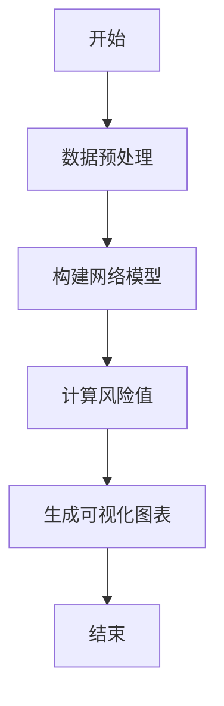
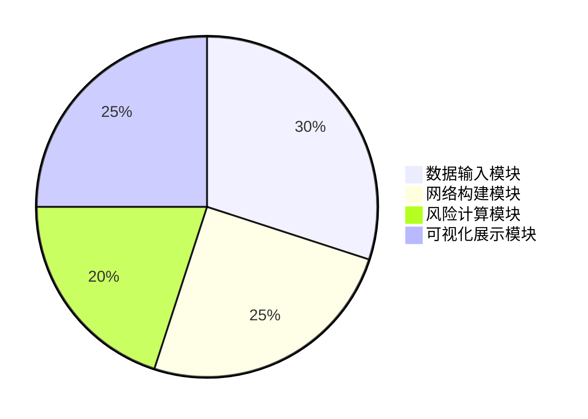

                 


# 开发智能化的企业信用风险传导网络可视化系统

> 关键词：企业信用风险，可视化系统，风险传导网络，人工智能，数据可视化，网络分析

> 摘要：  
本文详细探讨了开发智能化的企业信用风险传导网络可视化系统的各个方面。首先介绍了系统的背景、核心概念和目标，然后深入分析了系统的算法原理、数学模型和实现方法。接着，从系统架构设计、功能模块实现、接口设计等角度详细阐述了系统的构建过程。最后，通过实际案例展示了系统的应用场景和实现效果，并总结了开发经验与最佳实践。本文旨在为企业信用风险管理提供一种智能化、可视化的解决方案，帮助用户更好地理解和应对信用风险。

---

## 第一部分: 企业信用风险传导网络可视化系统概述

### 第1章: 企业信用风险传导网络可视化系统背景介绍

#### 1.1 问题背景
企业信用风险是企业在经营过程中面临的主要风险之一，其复杂性主要体现在以下几个方面：

- **风险来源多样化**：信用风险可能来源于供应链上下游企业、合作伙伴、客户或供应商等多个方面。
- **风险传导的网络化**：企业的信用风险不是孤立事件，而是通过复杂的网络关系相互影响和传导。
- **数据量大且复杂**：企业信用数据通常涉及大量的非结构化数据，如合同文本、财务报表等，以及结构化数据，如交易记录、信用评分等。

#### 1.2 问题描述
信用风险传导网络可视化系统的目标是通过构建一个可视化的网络模型，帮助企业识别和分析信用风险的传导路径和影响程度。具体来说：

- **网络构建**：基于企业的供应链、合作伙伴关系等数据，构建一个反映企业间信用关系的网络模型。
- **风险计算**：通过算法计算每个节点（企业）的风险值，并根据风险值和网络关系确定风险传导路径。
- **可视化展示**：将计算结果以图表形式展示，帮助用户直观理解风险分布和传导过程。

#### 1.3 问题解决
为了实现上述目标，我们提出了以下解决方案：

- **数据预处理**：对原始数据进行清洗、整合和特征提取，为后续分析提供高质量的数据支持。
- **网络构建算法**：基于图论的网络构建算法，如基于共现矩阵的网络构建方法。
- **风险计算算法**：使用概率论和统计学方法计算每个节点的风险值，如贝叶斯网络模型。
- **可视化技术**：结合数据可视化技术（如力导向图、热力图等）将风险网络可视化。

#### 1.4 系统的边界与外延
- **输入**：企业间的交易数据、财务数据、合同文本等。
- **输出**：风险网络图、风险值计算结果、风险传导路径分析结果。
- **适用范围**：适用于企业供应链管理、金融风险分析等领域。

#### 1.5 核心概念与组成
- **网络节点**：代表企业或个体。
- **网络边**：代表企业间的信用关系，边的权重表示关系强度。
- **风险值**：表示每个节点的信用风险程度。
- **风险传导路径**：表示风险从一个节点向其他节点传播的路径。

---

### 第2章: 企业信用风险传导网络可视化系统的核心概念与联系

#### 2.1 核心概念原理
- **信用风险的定义**：信用风险是指由于债务人或交易对手方无法履行其合同义务而给债权人带来的损失风险。
- **风险传导的网络模型构建**：通过图论方法，将企业间的信用关系建模为一个网络，节点表示企业，边表示企业间的信用关联。
- **可视化技术在风险分析中的应用**：通过数据可视化技术，将复杂的网络结构和风险值直观地呈现给用户。

#### 2.2 核心概念的属性特征对比
以下是核心概念的属性特征对比表：

| 属性 | 节点 | 边 |
|------|------|----|
| 代表 | 企业 | 信用关系 |
| 属性 | 风险值、规模、行业 | 权重、方向、类型 |
| 示例 | 企业A、企业B | 供应链关系、借贷关系 |

#### 2.3 ER实体关系图架构
```mermaid
er
actor: 用户
system: 可视化系统
database: 数据库
actor --> system: 用户请求数据可视化
system --> database: 查询数据
database --> system: 返回数据
system --> actor: 显示可视化结果
```

#### 2.4 本章小结
本章从核心概念和组成入手，详细介绍了企业信用风险传导网络的构建原理和可视化技术的应用。通过属性特征对比和ER实体关系图，进一步明确了系统的数据结构和逻辑关系。

---

## 第二部分: 企业信用风险传导网络可视化系统的算法原理讲解

### 第3章: 企业信用风险传导网络可视化系统的算法原理讲解

#### 3.1 算法原理概述
- **风险传导网络的构建方法**：基于图论的网络构建算法，如共现矩阵法、相似性度量法等。
- **可视化算法的选择与优化**：根据网络规模和复杂度选择合适的可视化算法，如力导向布局算法。
- **算法的复杂度分析**：分析算法的时间复杂度和空间复杂度，确保算法在实际应用中的高效性。

#### 3.2 算法流程图


#### 3.3 算法实现代码
- **数据预处理代码**
```python
import pandas as pd
data = pd.read_csv('credit_data.csv')
```

- **网络模型构建代码**
```python
import networkx as nx
G = nx.Graph()
G.add_edges_from(edges)
```

- **风险计算代码**
```python
import numpy as np
risk_values = np.array([...])
```

#### 3.4 算法的数学模型与公式
- **风险值计算公式**
$$ risk = \sum_{i=1}^{n} w_i \cdot node_i $$

- **网络边权重计算公式**
$$ weight = \frac{1}{1 + e^{-x}} $$

#### 3.5 举例说明
- **示例场景**：假设我们有三个企业A、B、C，其中A和B之间存在供应链关系，B和C之间存在借贷关系。
- **示例计算过程**：计算每个企业的风险值，并根据网络结构生成可视化图表。
- **示例结果分析**：通过图表分析风险传导路径和影响程度。

#### 3.6 本章小结
本章详细讲解了企业信用风险传导网络可视化系统的算法原理，包括数据预处理、网络构建、风险计算和可视化生成的全过程。通过代码和数学公式的展示，进一步明确了算法实现的具体步骤。

---

## 第三部分: 企业信用风险传导网络可视化系统的系统架构与设计

### 第4章: 企业信用风险传导网络可视化系统的系统架构与设计

#### 4.1 系统应用场景
- **供应链风险管理**：帮助企业识别供应链中的高风险节点，优化供应链结构。
- **金融风险分析**：帮助金融机构分析客户间的信用风险传导关系，制定风险控制策略。
- **企业信用评估**：基于网络关系和风险值，对企业进行信用评级。

#### 4.2 系统功能设计
- **数据输入模块**：支持多种数据格式的输入，如CSV、Excel等。
- **网络构建模块**：根据输入数据构建信用风险传导网络。
- **风险计算模块**：计算每个节点的风险值和风险传导路径。
- **可视化展示模块**：生成并展示网络图、风险分布图等。

#### 4.3 系统架构设计


#### 4.4 系统接口设计
- **数据接口**：提供API接口，支持与其他系统的数据交互。
- **用户接口**：提供友好的用户界面，方便用户操作和可视化结果查看。

#### 4.5 系统交互流程
```mermaid
sequenceDiagram
    actor 用户
    system 可视化系统
    用户 -> 可视化系统: 请求数据可视化
    可视化系统 -> 数据库: 查询数据
    数据库 --> 可视化系统: 返回数据
    可视化系统 --> 用户: 显示可视化结果
```

#### 4.6 本章小结
本章从系统架构和功能设计的角度，详细介绍了企业信用风险传导网络可视化系统的构建过程。通过系统架构图和交互流程图，进一步明确了系统的模块划分和功能实现。

---

## 第四部分: 企业信用风险传导网络可视化系统的项目实战

### 第5章: 企业信用风险传导网络可视化系统的项目实战

#### 5.1 环境安装与配置
- **Python环境**：安装Python 3.8及以上版本。
- **依赖库安装**：使用pip安装networkx、matplotlib、pandas等库。
  ```bash
  pip install networkx matplotlib pandas
  ```

#### 5.2 核心代码实现
- **数据预处理代码**
```python
import pandas as pd
data = pd.read_csv('credit_data.csv')
```

- **网络构建代码**
```python
import networkx as nx
G = nx.Graph()
for edge in edges:
    G.add_edge(edge[0], edge[1])
```

- **风险计算代码**
```python
import numpy as np
risk_values = np.array([...])
```

- **可视化代码**
```python
import matplotlib.pyplot as plt
nx.draw(G, node_color=risk_values, node_size=500, alpha=0.8)
plt.show()
```

#### 5.3 代码应用解读与分析
- **数据预处理**：对输入数据进行清洗和整合，确保数据质量。
- **网络构建**：基于数据构建信用风险传导网络，边权重表示企业间的信用关系强度。
- **风险计算**：使用概率论方法计算每个节点的风险值。
- **可视化展示**：将网络结构和风险值以图表形式展示，帮助用户直观理解风险分布和传导路径。

#### 5.4 实际案例分析
- **案例背景**：假设我们有五个企业，构建一个简单的信用风险传导网络。
- **案例分析**：计算每个企业的风险值，并分析风险传导路径。
- **案例结果**：生成网络图，标出高风险节点和风险传导路径。

#### 5.5 项目小结
本章通过实际案例展示了企业信用风险传导网络可视化系统的实现过程。从环境安装到代码实现，再到案例分析，详细介绍了系统的实际应用。

---

## 第五部分: 企业信用风险传导网络可视化系统的总结与展望

### 第6章: 企业信用风险传导网络可视化系统的总结与展望

#### 6.1 最佳实践 tips
- **数据质量控制**：确保输入数据的准确性和完整性。
- **算法优化**：根据实际需求优化算法，提高计算效率。
- **用户体验优化**：设计友好的用户界面，提升用户体验。

#### 6.2 小结
本文详细探讨了企业信用风险传导网络可视化系统的开发过程，从背景介绍到算法实现，再到系统架构设计和项目实战，全面覆盖了系统的各个方面。通过本文的讲解，读者可以清晰地理解系统的构建过程和实现方法。

#### 6.3 注意事项
- **数据隐私保护**：在实际应用中，需要注意数据隐私和安全问题。
- **系统稳定性**：确保系统的稳定性和可靠性，避免因数据错误或算法问题导致的误判。

#### 6.4 拓展阅读
- **推荐书籍**：《网络科学导论》、《数据可视化入门与实践》。
- **推荐工具**：NetworkX、Gephi、D3.js。

---

## 作者：AI天才研究院/AI Genius Institute & 禅与计算机程序设计艺术/Zen And The Art of Computer Programming

---

通过以上思考过程，我们可以系统地构建一个企业信用风险传导网络可视化系统，为企业信用风险管理提供一种智能化、可视化的解决方案。

