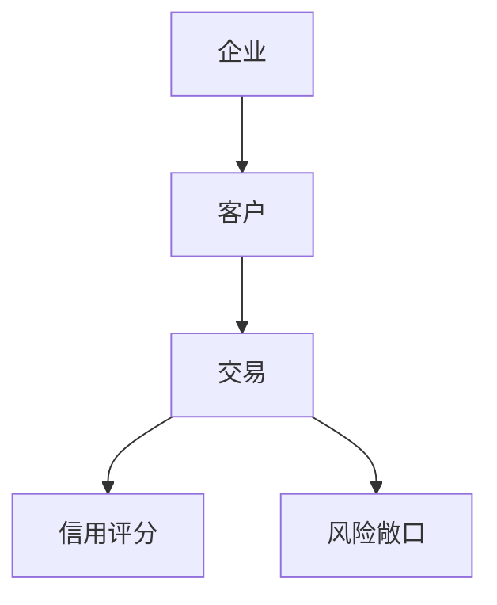
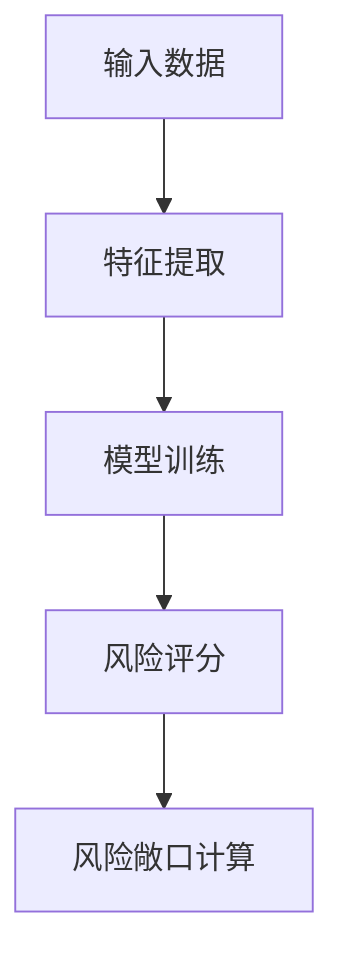
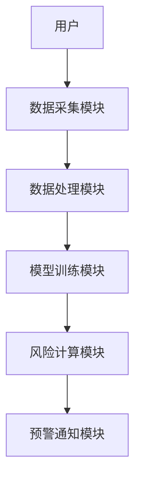

                 


# 开发智能化的企业信用风险敞口动态管理系统

> 关键词：企业信用风险，风险敞口，动态管理，机器学习，系统架构

> 摘要：本文详细探讨了开发智能化的企业信用风险敞口动态管理系统的背景、核心概念、算法原理、系统架构设计、项目实战以及最佳实践。通过结合实际案例和数学模型，文章深入分析了如何利用机器学习技术实现信用风险的动态管理，并提出了系统的整体架构和实现方案。

---

# 第1章: 企业信用风险敞口动态管理系统的背景与目标

## 1.1 信用风险与风险敞口的基本概念

### 1.1.1 信用风险的定义与特征

信用风险是指企业在经营过程中，由于交易对手或客户无法履行其债务义务而可能遭受的损失。其主要特征包括：

- **不确定性**：信用风险的大小取决于多种因素，如市场环境、客户信用状况等。
- **动态性**：信用风险会随着时间和市场变化而变化。
- **可控性**：通过有效的管理和监控，可以降低信用风险的影响。

### 1.1.2 风险敞口的定义与分类

风险敞口是指企业在特定交易或业务中的潜在损失程度。常见的分类包括：

- **单客户敞口**：针对单一客户的信用风险。
- **行业敞口**：针对某一行业的整体信用风险。
- **地域敞口**：针对某一地区的信用风险。

### 1.1.3 动态管理的概念与意义

动态管理是指在实时或定期更新的基础上，根据市场变化和客户信用状况调整信用风险管理策略的过程。其意义在于：

- **及时性**：能够快速响应市场变化。
- **准确性**：通过动态调整，提高风险管理的精准度。
- **有效性**：降低企业信用风险敞口，保护企业资产安全。

## 1.2 企业信用风险管理的重要性

### 1.2.1 企业信用风险管理的核心目标

企业信用风险管理的核心目标包括：

- **防范信用风险**：通过科学的管理方法，降低信用损失的可能性。
- **优化资源配置**：合理分配企业资源，提高资金使用效率。
- **提升企业形象**：通过良好的信用管理，增强企业在市场中的信誉。

### 1.2.2 信用风险对企业经营的影响

信用风险可能对企业经营产生深远影响，包括：

- **直接损失**：客户违约导致的直接经济损失。
- **间接损失**：信用风险可能影响企业的融资能力，进而影响整体经营。
- **声誉损失**：信用风险事件可能损害企业的品牌形象。

### 1.2.3 动态管理在信用风险管理中的作用

动态管理能够帮助企业在信用风险管理中实现：

- **实时监控**：及时发现潜在风险，避免损失扩大。
- **精准决策**：基于实时数据，制定科学的风险应对策略。
- **持续优化**：通过动态调整，不断优化风险管理流程。

## 1.3 本章小结

本章从信用风险的基本概念出发，详细阐述了风险敞口的定义与分类，以及动态管理的概念与意义。同时，分析了企业信用风险管理的重要性及其在企业经营中的具体影响，为后续章节的深入讨论奠定了基础。

---

# 第2章: 企业信用风险敞口动态管理系统的概述

## 2.1 系统的目标与范围

### 2.1.1 系统的主要目标

企业信用风险敞口动态管理系统的开发目标包括：

- **实时监控**：对客户的信用状况进行实时监控，及时发现潜在风险。
- **风险评估**：基于实时数据，评估客户的信用风险敞口。
- **风险预警**：设置预警机制，提前通知企业潜在风险。

### 2.1.2 系统的功能范围

系统的功能范围包括：

- **数据采集**：收集客户的基本信息、交易数据等。
- **信用评分**：基于机器学习模型，计算客户的信用评分。
- **风险计算**：根据信用评分和交易数据，计算风险敞口。
- **预警通知**：当风险敞口超过设定阈值时，触发预警通知。

### 2.1.3 系统的边界与外延

系统的边界包括：

- **输入边界**：客户的基本信息、交易数据、市场数据等。
- **输出边界**：信用评分、风险敞口、预警通知等。
- **外部系统**：与企业的财务系统、业务系统进行数据交互。

## 2.2 系统的核心功能模块

### 2.2.1 风险评估模块

风险评估模块的主要功能包括：

- **数据清洗**：对输入数据进行清洗和预处理。
- **特征提取**：提取影响信用风险的关键特征。
- **模型训练**：基于机器学习算法，训练信用评分模型。

### 2.2.2 风险监控模块

风险监控模块的主要功能包括：

- **实时监控**：对客户的信用状况进行实时监控。
- **风险计算**：根据实时数据，动态计算风险敞口。
- **预警触发**：当风险敞口超过阈值时，触发预警通知。

### 2.2.3 风险预警模块

风险预警模块的主要功能包括：

- **预警规则设置**：根据企业的风险管理策略，设置预警规则。
- **预警触发**：当风险敞口超过阈值时，触发预警。
- **预警通知**：通过邮件、短信等方式通知相关人员。

### 2.2.4 风险应对模块

风险应对模块的主要功能包括：

- **风险应对策略制定**：根据预警信息，制定风险应对策略。
- **策略执行**：执行风险应对策略，降低风险敞口。
- **效果评估**：评估风险应对策略的效果，优化风险管理流程。

## 2.3 系统的实施价值与预期效果

### 2.3.1 提高信用风险管理效率

通过自动化监控和预警机制，提高信用风险管理的效率。

### 2.3.2 降低企业信用风险敞口

通过动态调整风险管理策略，降低企业信用风险敞口。

### 2.3.3 优化企业资源配置

通过科学的信用评分和风险计算，优化企业的资源配置。

## 2.4 本章小结

本章详细介绍了企业信用风险敞口动态管理系统的开发目标、功能范围、核心功能模块以及实施价值与预期效果，为后续章节的系统设计奠定了基础。

---

# 第3章: 核心概念与系统架构设计

## 3.1 核心概念的定义与属性

### 3.1.1 风险敞口的属性特征

风险敞口的属性特征包括：

- **客户信用评分**：反映客户的信用状况。
- **交易金额**：反映交易的规模。
- **交易时间**：反映交易的时间分布。
- **客户行业**：反映客户所处的行业。

### 3.1.2 信用评分的计算方法

信用评分的计算方法包括：

- **逻辑回归模型**：通过统计分析，计算客户的违约概率。
- **决策树模型**：通过树状结构，分类客户的信用状况。
- **随机森林模型**：通过集成学习，提高信用评分的准确性。

### 3.1.3 动态管理的实现机制

动态管理的实现机制包括：

- **实时数据更新**：对客户的信用状况进行实时更新。
- **模型动态调整**：根据实时数据，动态调整信用评分模型。
- **预警机制**：根据动态调整后的信用评分，触发预警通知。

## 3.2 核心概念的对比分析

### 3.2.1 风险敞口与信用评分的对比

| 对比维度 | 风险敞口 | 信用评分 |
|----------|----------|----------|
| 定义     | 风险敞口是企业在特定交易中的潜在损失程度。 | 信用评分是反映客户信用状况的指标。 |
| 计算方式 | 基于信用评分和交易数据进行计算。 | 基于客户信息和交易数据进行计算。 |
| 目的     | 量化信用风险，指导风险管理决策。 | 评估客户的信用状况，指导授信决策。 |

### 3.2.2 动态管理与其他风险管理方法的对比

| 对比维度 | 动态管理 | 静态管理 |
|----------|----------|----------|
| 定义     | 动态管理是指在实时或定期更新的基础上，根据市场变化和客户信用状况调整信用风险管理策略的过程。 | 静态管理是指在固定的时间间隔内，进行信用风险管理的过程。 |
| 特点     | 实时性高，能够快速响应市场变化。 | 实时性较低，无法快速响应市场变化。 |
| 优势     | 提高风险管理的精准度和效率。 | 适合于市场变化较小的环境。 |

## 3.3 系统的ER实体关系图



## 3.4 本章小结

本章详细介绍了系统中的核心概念，包括风险敞口、信用评分和动态管理的定义与属性，并通过对比分析和ER实体关系图，展示了系统中的核心要素及其关系。

---

# 第4章: 系统算法原理与数学模型

## 4.1 算法原理概述

### 4.1.1 基于机器学习的信用评分模型

信用评分模型是系统的核心算法之一，常用的机器学习算法包括：

- **逻辑回归**：通过统计分析，计算客户的违约概率。
- **支持向量机**：通过特征空间中的超平面，分类客户的信用状况。
- **随机森林**：通过集成学习，提高信用评分的准确性。

### 4.1.2 动态风险敞口计算的算法选择

动态风险敞口计算的算法选择需要考虑以下因素：

- **实时性**：算法需要能够在短时间内完成计算。
- **准确性**：算法需要能够准确反映客户的信用状况。
- **可解释性**：算法需要能够提供清晰的解释，以便于后续的风险管理决策。

### 4.1.3 算法的优缺点分析

| 算法名称 | 优点 | 缺点 |
|----------|------|------|
| 逻辑回归 | 计算速度快，易于解释 | 易受异常值影响 |
| 支持向量机 | 分类准确度高 | 计算复杂度高 |
| 随机森林 | 抗过拟合能力强，分类准确度高 | 计算资源消耗大 |

## 4.2 算法流程图



## 4.3 数学模型与公式

### 4.3.1 信用评分模型的数学表达

$$ \text{信用评分} = \beta_0 + \beta_1x_1 + \beta_2x_2 + \ldots + \beta_nx_n $$

其中，$x_i$ 是客户的特征变量，$\beta_i$ 是对应的系数。

### 4.3.2 风险敞口的动态计算公式

$$ \text{风险敞口} = \sum_{i=1}^{n} \text{信用评分}_i \times \text{交易金额}_i $$

---

# 第5章: 系统架构设计与实现

## 5.1 系统架构设计

### 5.1.1 系统功能模块划分

系统功能模块包括：

- **数据采集模块**：负责采集客户的基本信息、交易数据等。
- **数据处理模块**：对采集的数据进行清洗、转换和预处理。
- **模型训练模块**：基于机器学习算法，训练信用评分模型。
- **风险计算模块**：根据实时数据，动态计算风险敞口。
- **预警通知模块**：当风险敞口超过阈值时，触发预警通知。

### 5.1.2 系统架构图



## 5.2 系统接口设计

### 5.2.1 API接口设计

系统需要提供以下API接口：

- **获取客户信息**：根据客户ID，获取客户的详细信息。
- **计算信用评分**：根据客户的特征变量，计算信用评分。
- **计算风险敞口**：根据客户的信用评分和交易金额，计算风险敞口。
- **触发预警通知**：当风险敞口超过阈值时，触发预警通知。

### 5.2.2 接口交互流程图


---

# 第6章: 项目实战与案例分析

## 6.1 环境安装与配置

### 6.1.1 开发环境

- **编程语言**：Python 3.8+
- **机器学习库**：scikit-learn、XGBoost
- **数据处理工具**：Pandas、NumPy
- **可视化工具**：Matplotlib、Seaborn

### 6.1.2 安装依赖

```bash
pip install scikit-learn xgboost pandas numpy matplotlib seaborn
```

## 6.2 核心代码实现

### 6.2.1 数据清洗与预处理

```python
import pandas as pd
import numpy as np

# 读取数据
data = pd.read_csv('customer_data.csv')

# 删除缺失值
data = data.dropna()

# 标准化处理
from sklearn.preprocessing import StandardScaler
scaler = StandardScaler()
data_scaled = scaler.fit_transform(data)
```

### 6.2.2 模型训练与评估

```python
from sklearn.model_selection import train_test_split
from sklearn.linear_model import LogisticRegression
from sklearn.metrics import accuracy_score

# 划分训练集和测试集
X_train, X_test, y_train, y_test = train_test_split(data_scaled, data['target'], test_size=0.2)

# 训练逻辑回归模型
model = LogisticRegression()
model.fit(X_train, y_train)

# 模型评估
y_pred = model.predict(X_test)
print('Accuracy:', accuracy_score(y_test, y_pred))
```

### 6.2.3 风险计算与预警

```python
import warnings
import time

# 定义风险计算函数
def calculateRisk(client_id):
    # 获取客户数据
    client_data = data[data['client_id'] == client_id]
    
    # 计算信用评分
    credit_score = model.predict(client_data[['feature1', 'feature2', ...]])
    
    # 计算风险敞口
    risk_exposure = credit_score * client_data['transaction_amount']
    
    # 判断是否触发预警
    if risk_exposure > threshold:
        sendWarning(client_id)
    
    return risk_exposure

# 定义预警触发函数
def sendWarning(client_id):
    # 发送邮件或短信通知
    print(f"Warning: Client {client_id} has exceeded the risk exposure threshold.")
```

## 6.3 案例分析与效果评估

### 6.3.1 案例分析

假设某企业客户A的信用评分为0.8，交易金额为100万元，风险敞口计算结果为80万元，超过设定的预警阈值70万元，系统会触发预警通知。

### 6.3.2 效果评估

通过实际案例分析，系统的预警机制能够及时发现潜在风险，帮助企业在风险发生前采取应对措施，降低信用风险敞口。

## 6.4 本章小结

本章通过实际项目的开发过程，详细展示了系统的环境配置、核心代码实现以及案例分析，验证了系统的可行性和有效性。

---

# 第7章: 最佳实践与系统优化

## 7.1 最佳实践

### 7.1.1 数据质量管理

- **数据清洗**：确保数据的完整性和准确性。
- **特征工程**：提取有效的特征，提高模型的准确性。
- **数据安全**：确保数据的安全性，防止数据泄露。

### 7.1.2 模型优化

- **模型选择**：根据具体场景选择合适的算法。
- **超参数调优**：通过网格搜索等方法，优化模型参数。
- **模型解释性**：选择具有较高解释性的模型，便于后续分析。

### 7.1.3 系统性能优化

- **分布式计算**：通过分布式计算框架，提高系统的计算效率。
- **缓存优化**：合理使用缓存，减少重复计算。
- **异步处理**：通过异步处理，提高系统的响应速度。

## 7.2 系统优化建议

### 7.2.1 系统架构优化

- **微服务架构**：通过微服务架构，提高系统的可扩展性和可维护性。
- **容器化部署**：通过容器化技术，简化系统的部署和管理。
- **高可用性设计**：通过负载均衡、容灾备份等技术，提高系统的高可用性。

### 7.2.2 风险管理优化

- **动态阈值调整**：根据市场变化，动态调整预警阈值。
- **多模型融合**：通过融合多个模型的结果，提高风险管理的准确性。
- **实时监控与反馈**：通过实时监控，快速响应市场变化。

## 7.3 本章小结

本章从数据质量、模型优化和系统性能优化三个方面，提出了系统的优化建议，并对未来系统的优化方向进行了展望。

---

# 第8章: 总结与展望

## 8.1 研究总结

本文详细探讨了开发智能化的企业信用风险敞口动态管理系统的背景、核心概念、算法原理、系统架构设计、项目实战以及最佳实践。通过结合实际案例和数学模型，文章深入分析了如何利用机器学习技术实现信用风险的动态管理，并提出了系统的整体架构和实现方案。

## 8.2 未来展望

未来，随着人工智能技术的不断发展，企业信用风险敞口动态管理系统将更加智能化和自动化。以下是未来的发展方向：

- **智能化预警**：通过自然语言处理和深度学习技术，实现智能化的预警通知。
- **自适应风险管理**：通过自适应算法，动态调整风险管理策略。
- **多维度数据分析**：通过大数据分析技术，实现多维度的风险管理。

## 8.3 结语

企业信用风险敞口动态管理系统的开发和应用，不仅能够帮助企业降低信用风险敞口，还能够提升企业的风险管理能力，为企业的可持续发展提供有力支持。

---

# 作者：AI天才研究院（AI Genius Institute） & 禅与计算机程序设计艺术（Zen And The Art of Computer Programming）

感谢您的阅读，希望本文能为您提供有价值的见解和启发。如您有任何疑问或建议，请随时与我们联系。

