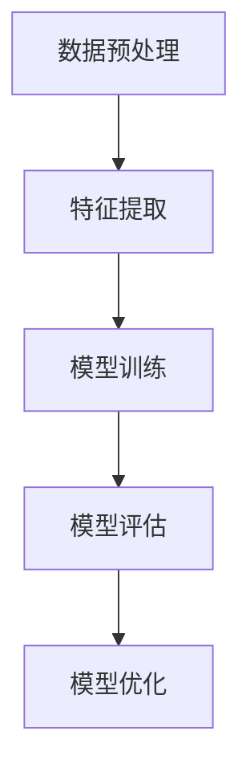
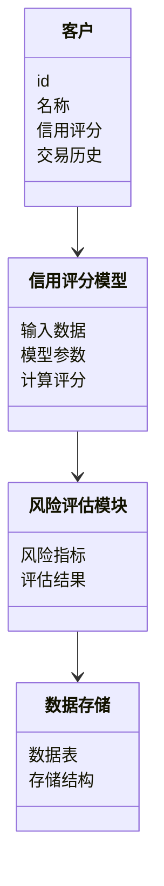
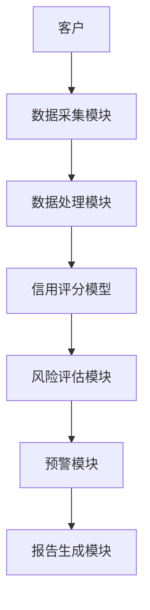
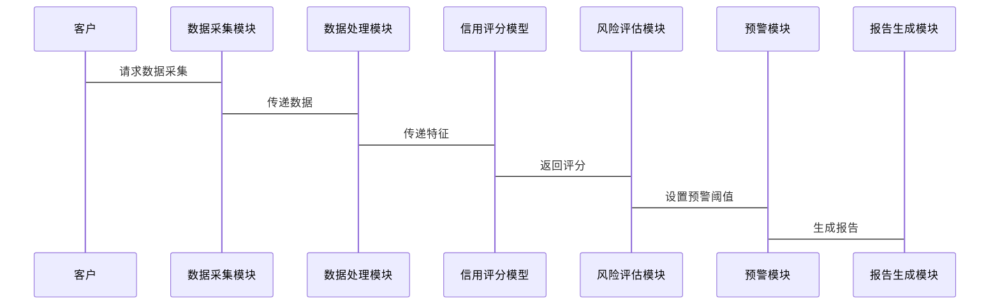

                 


# 开发智能化的企业信用风险敞口管理系统

> 关键词：企业信用风险，风险管理，智能系统开发，算法模型，系统架构，项目实战，技术实现

> 摘要：本文详细探讨了如何利用智能化系统开发方法，结合数据分析和机器学习算法，构建高效的信用风险敞口管理系统。通过系统化的分析和设计，本文从背景、核心概念、算法原理到系统架构和项目实战，全面介绍了该系统的开发过程和实现方法，为企业信用风险管理提供了新的思路和技术支持。

---

# 第一部分：企业信用风险敞口管理系统的背景与核心概念

## 第1章：企业信用风险敞口管理系统的背景介绍

### 1.1 信用风险敞口管理的定义与背景

#### 1.1.1 信用风险的定义与特征
信用风险是指企业在经营过程中，由于客户或交易对手无法履行其财务义务而可能导致的损失。其主要特征包括不确定性、波动性和传染性。

#### 1.1.2 企业信用风险敞口管理的必要性
随着全球经济的复杂化和不确定性增加，企业面临的信用风险日益显著。传统的信用风险管理方法依赖人工经验，效率低下且容易出错。智能化信用风险管理系统的引入，能够提高风险识别和评估的准确性和效率。

#### 1.1.3 数字化与智能化管理的驱动因素
- **技术进步**：大数据、人工智能和机器学习等技术的快速发展，为信用风险管理提供了新的工具和方法。
- **业务需求**：企业对实时、动态的信用风险监控和管理的需求不断增加。
- **合规要求**：日益严格的监管要求推动企业采用更先进的风险管理手段。

### 1.2 问题背景与描述

#### 1.2.1 传统信用风险管理的局限性
- **数据处理能力有限**：传统方法难以处理海量数据，且缺乏对数据的深度分析。
- **风险评估不全面**：传统方法通常只考虑单一维度的因素，无法全面评估风险。
- **实时性不足**：传统方法往往依赖定期报告，无法实现实时监控和预警。

#### 1.2.2 智能化管理的需求与目标
智能化信用风险管理系统的开发需求主要来源于对企业信用风险的实时监控、动态评估和精准预警的需求。其目标是通过智能化手段，提高信用风险的识别和应对能力，降低企业损失。

#### 1.2.3 系统边界与外延
系统边界包括企业内部的信用交易数据、外部的市场数据以及客户的信用历史数据。系统外延则包括与企业外部合作伙伴的信用风险管理协同和数据共享。

### 1.3 核心概念与系统组成

#### 1.3.1 核心概念的定义与属性
- **信用评分模型**：用于评估客户的信用状况，通常基于客户的财务数据和交易历史。
- **风险评估指标**：包括信用评分、违约概率（PD）、风险敞口（EAD）和损失给定违约（LGD）等。
- **数据特征提取方法**：通过数据预处理和特征工程，提取对信用风险评估有用的特征。

#### 1.3.2 系统组成模块与功能
- **数据采集模块**：负责采集客户的信用数据，包括财务数据、交易历史和外部市场数据。
- **风险评估模块**：利用信用评分模型和风险评估指标，对客户的信用风险进行评估。
- **预警模块**：根据评估结果，实时监控风险变化，触发预警机制。
- **报告生成模块**：生成风险评估报告，提供决策支持。

#### 1.3.3 系统核心要素之间的关系
系统的核心要素包括数据、模型和业务逻辑。数据是模型输入的基础，模型通过数据生成评估结果，业务逻辑则将评估结果转化为实际的管理决策。

---

# 第二部分：算法原理与数学模型

## 第2章：算法原理与实现

### 2.1 信用评分模型的算法选择

#### 2.1.1 逻辑回归模型
逻辑回归是一种常用的分类算法，适用于二分类问题。其数学模型如下：

$$ P(y=1|x) = \frac{1}{1 + e^{- (\beta_0 + \beta_1 x_1 + \cdots + \beta_n x_n)}} $$

其中，$\beta_i$ 是模型的参数，$x_i$ 是输入特征。

#### 2.1.2 支持向量机模型
支持向量机（SVM）是一种基于统计学习理论的分类算法，适用于高维数据。其目标是最小化经验风险和结构风险的综合。

#### 2.1.3 随机森林模型
随机森林是一种基于决策树的集成学习算法，具有较强的鲁棒性和抗过拟合能力。其数学模型如下：

$$ y = \text{sign} \left( \sum_{i=1}^n \alpha_i h_i(x) \right) $$

其中，$h_i(x)$ 是基分类器，$\alpha_i$ 是权重系数。

### 2.2 算法流程图



### 2.3 算法实现代码

```python
import numpy as np
from sklearn.metrics import accuracy_score, recall_score
from sklearn.model_selection import train_test_split
from sklearn.linear_model import LogisticRegression

# 数据预处理
def preprocess_data(data):
    # 假设data是一个数据框
    # 删除缺失值
    data = data.dropna()
    # 标准化特征
    features = data[['feature1', 'feature2', ...]]
    target = data['target']
    return features, target

# 特征工程
def feature_engineering(features):
    # 添加新特征
    features['new_feature'] = features['feature1'] * features['feature2']
    return features

# 模型训练与评估
def train_model(features, target):
    # 划分训练集和测试集
    X_train, X_test, y_train, y_test = train_test_split(features, target, test_size=0.2)
    
    # 逻辑回归模型
    model = LogisticRegression()
    model.fit(X_train, y_train)
    
    # 模型评估
    y_pred = model.predict(X_test)
    accuracy = accuracy_score(y_test, y_pred)
    recall = recall_score(y_test, y_pred)
    print(f'Accuracy: {accuracy}, Recall: {recall}')
    return model

# 主程序
def main():
    data = ...  # 加载数据
    features, target = preprocess_data(data)
    features = feature_engineering(features)
    model = train_model(features, target)
    return model

if __name__ == '__main__':
    main()
```

### 2.4 本章小结
本章介绍了信用评分模型的算法选择和实现过程，重点讲解了逻辑回归、支持向量机和随机森林三种算法的原理和优缺点。通过具体的代码实现，展示了如何利用这些算法进行信用评分模型的训练和评估。

---

# 第三部分：系统架构设计与项目实战

## 第3章：系统架构设计与项目实战

### 3.1 问题场景介绍

#### 3.1.1 系统目标
系统的目标是开发一个智能化的企业信用风险敞口管理系统，能够实时监控客户的信用风险，提供精准的评估和预警。

#### 3.1.2 系统需求
- 实时数据采集和处理
- 高效的信用风险评估算法
- 灵活的预警机制
- 可视化的风险报告

### 3.2 系统功能设计

#### 3.2.1 领域模型类图



### 3.3 系统架构设计

#### 3.3.1 系统架构图



### 3.4 系统接口设计

#### 3.4.1 API接口设计



### 3.5 项目实战

#### 3.5.1 环境安装
需要安装Python、Scikit-learn、Pandas、Mermaid等工具。

#### 3.5.2 核心代码实现

```python
import pandas as pd
from sklearn.ensemble import RandomForestClassifier
from sklearn.metrics import classification_report

# 数据加载与预处理
data = pd.read_csv('credit_data.csv')
features, target = preprocess_data(data)

# 模型训练
model = RandomForestClassifier()
model.fit(features, target)

# 模型评估
y_pred = model.predict(features)
print(classification_report(target, y_pred))
```

#### 3.5.3 代码解读与分析
上述代码展示了如何使用随机森林算法进行信用评分模型的训练和评估。首先，数据经过预处理后，提取特征并进行模型训练，最后评估模型的性能。

#### 3.5.4 实际案例分析
通过一个实际的案例，展示系统如何对客户的信用风险进行评估和预警。

#### 3.5.5 项目总结
总结项目开发过程中的经验教训，提出改进建议和未来的研究方向。

### 3.6 注意事项与扩展阅读

#### 3.6.1 注意事项
- 数据隐私和安全问题
- 模型的可解释性和透明度
- 系统的可扩展性和维护性

#### 3.6.2 扩展阅读
推荐阅读相关的技术书籍和论文，深入理解信用风险管理的理论和实践。

---

# 作者：AI天才研究院/AI Genius Institute & 禅与计算机程序设计艺术 /Zen And The Art of Computer Programming

