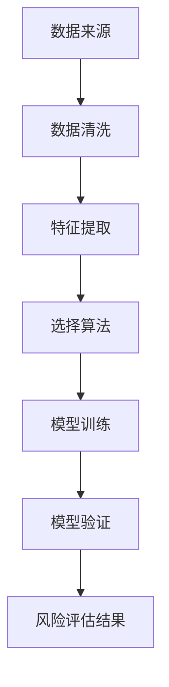
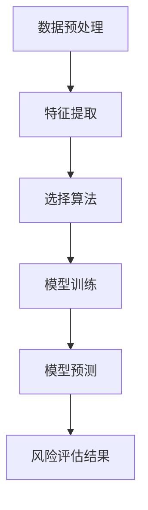
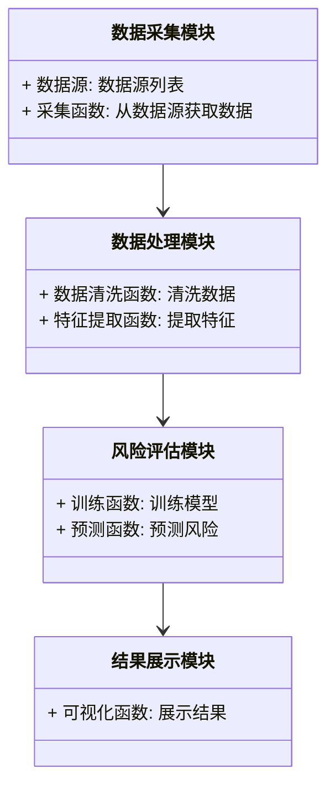
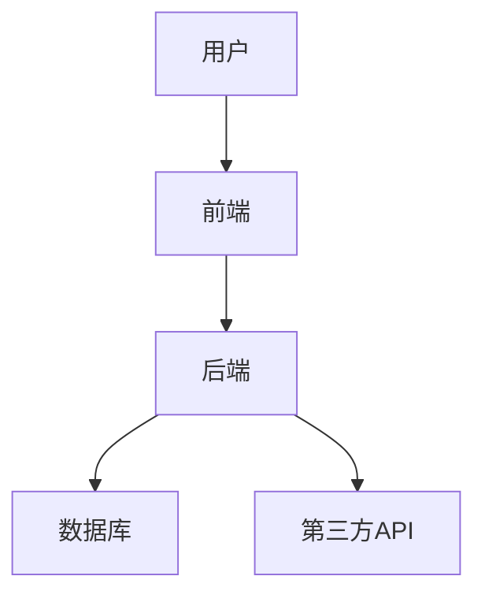
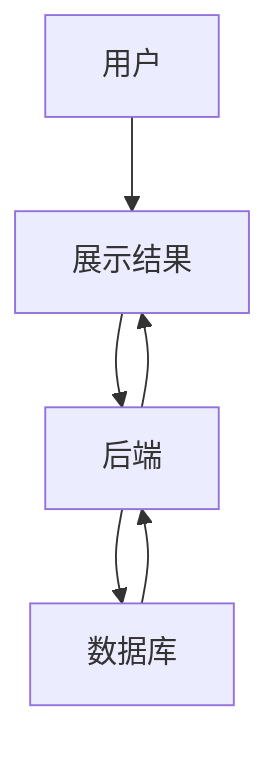

                 


# 开发智能化的企业并购风险评估模型

> **关键词**：企业并购、风险评估、人工智能、机器学习、深度学习、数学建模

> **摘要**：本文详细探讨了开发智能化企业并购风险评估模型的背景、核心概念、算法原理、系统架构设计以及项目实战。通过结合机器学习和深度学习技术，提出了一种基于数据驱动的智能化风险评估方法，旨在帮助企业更准确地识别和预测并购过程中的潜在风险，提升决策的科学性和有效性。

---

## 第1章: 企业并购风险评估模型的背景与问题描述

### 1.1 企业并购风险评估的背景

#### 1.1.1 企业并购的定义与特点
企业并购（Mergers and Acquisitions，简称 M&A）是指两个或多个企业之间的合并或收购行为。并购可以是企业扩张的一种方式，但也伴随着较高的风险。企业的并购活动通常涉及大量的资金投入和复杂的法律、财务、战略决策，因此并购后的整合效果和风险控制显得尤为重要。

**特点**：
1. **高投入**：通常涉及大量资金，可能影响企业的财务健康。
2. **高风险**：包括市场、法律、财务和管理等多方面的风险。
3. **复杂性**：涉及多个利益相关方，需要协调各方需求。

#### 1.1.2 并购风险的定义与分类
并购风险是指企业在并购过程中或并购后可能面临的各种不确定性，这些不确定性可能影响企业的财务状况、市场地位和长期发展。并购风险可以分为以下几类：
- **财务风险**：包括债务负担增加、盈利能力下降等。
- **市场风险**：包括目标企业所在行业的市场波动。
- **法律风险**：包括反垄断法、知识产权纠纷等。
- **整合风险**：包括文化冲突、管理不善等。

#### 1.1.3 并购风险对企业价值的影响
并购失败可能导致企业价值下降，甚至引发更大的财务危机。因此，准确评估并购风险对于企业制定合理的并购战略和风险管理策略至关重要。

### 1.2 传统并购风险评估的局限性

#### 1.2.1 传统评估方法的局限性
传统的并购风险评估方法通常依赖于经验判断和定性分析，缺乏数据支持和量化分析，存在以下问题：
- **主观性**：评估结果依赖评估者的经验和判断，缺乏客观性。
- **数据不足**：传统方法可能无法充分利用大数据和历史数据进行分析。
- **模型简单化**：传统模型可能无法捕捉复杂的市场和行业动态。

#### 1.2.2 数据不足与模型简单化的问题
传统的风险评估模型通常基于少量的历史数据和简单的统计方法，无法充分利用现代技术手段（如机器学习、深度学习）进行更精准的预测和分析。

#### 1.2.3 传统方法的改进方向
为了克服传统方法的局限性，需要引入智能化技术，利用大数据和人工智能算法，构建更准确、更全面的并购风险评估模型。

### 1.3 智能化评估的需求与优势

#### 1.3.1 智能化评估的核心需求
随着企业并购活动的日益复杂化和数据化，智能化评估的核心需求包括：
- **数据驱动的决策**：利用大数据分析和机器学习算法，提高评估的准确性和科学性。
- **实时监控**：能够实时捕捉市场变化和企业动态，及时调整评估策略。
- **个性化分析**：针对不同企业或行业的特点，提供个性化的风险评估和建议。

#### 1.3.2 人工智能在并购风险评估中的优势
人工智能技术（AI）在并购风险评估中的应用优势主要体现在以下几个方面：
- **数据处理能力**：能够处理海量数据，提取关键风险因子。
- **预测能力**：通过机器学习算法，可以预测并购后的潜在风险。
- **动态调整能力**：能够根据市场变化和企业动态，实时更新风险评估结果。

#### 1.3.3 数据驱动的决策优势
数据驱动的决策优势主要体现在以下几点：
- **精准预测**：通过分析历史数据和市场趋势，可以更准确地预测并购后的表现。
- **风险识别**：能够快速识别潜在风险，提前制定应对策略。
- **优化决策**：基于数据的分析，优化企业的并购战略和风险管理策略。

### 1.4 本章小结
本章主要介绍了企业并购的背景、并购风险的定义与分类，以及传统并购风险评估的局限性。同时，还探讨了智能化评估的需求与优势，为后续章节的分析奠定了基础。

---

## 第2章: 企业并购风险评估模型的核心概念与联系

### 2.1 核心概念的定义与原理

#### 2.1.1 数据来源与特征提取
在构建智能化企业并购风险评估模型时，数据来源和特征提取是关键步骤。数据来源可以包括以下几个方面：
- **企业财务数据**：包括收入、利润、资产负债表等。
- **市场数据**：包括行业趋势、市场增长率等。
- **法律与合规数据**：包括并购相关的法律文件、合规性评估等。
- **管理数据**：包括企业管理层的稳定性、决策效率等。

特征提取则是从上述数据中提取出对并购风险有显著影响的特征，例如：
- **财务健康状况**：如净利润率、资产负债率等。
- **市场竞争力**：如市场份额、品牌价值等。
- **管理能力**：如管理层的稳定性、决策效率等。

#### 2.1.2 风险因子的识别与权重分配
风险因子的识别是模型构建的重要步骤。通过分析历史并购案例，可以识别出影响并购风险的关键因素，并为每个因素分配权重，反映其对并购风险的影响程度。

例如：
- **财务风险**：权重较高，因为财务状况直接影响企业的偿债能力和盈利能力。
- **整合风险**：权重中等，因为整合效果受多种因素影响，难以量化。
- **市场风险**：权重较低，因为市场波动通常是短期的，但对并购的影响可能较为直接。

#### 2.1.3 模型的构建与验证
模型的构建与验证是智能化并购风险评估的核心环节。模型构建需要选择合适的算法（如逻辑回归、随机森林等），并利用训练数据进行模型训练。验证过程包括交叉验证、测试集验证等，确保模型的准确性和稳定性。

### 2.2 核心概念的属性特征对比

#### 2.2.1 不同风险因子的特征对比
以下是不同风险因子的特征对比表：

| 风险因子       | 特征描述                                   | 权重（示例） |
|----------------|------------------------------------------|------------|
| 财务风险       | 影响企业的财务健康，包括负债率、利润率等 | 高         |
| 市场风险       | 影响目标企业的市场环境，包括行业竞争等   | 中         |
| 整合风险       | 影响并购后的整合效果，包括文化差异等     | 中         |
| 法律风险       | 影响并购的法律合规性，包括反垄断法等     | 高         |

#### 2.2.2 数据特征与风险评估的关系
数据特征与风险评估的关系可以通过散点图或相关性矩阵来展示。例如，企业的净利润率与并购风险呈负相关关系，即净利润率越高，并购风险越低。

#### 2.2.3 模型性能的评估指标
模型性能的评估指标包括准确率、召回率、F1分数等。以下是常见的评估指标对比：

| 评估指标       | 定义                                   | 示例值范围 |
|----------------|--------------------------------------|------------|
| 准确率         | 正确预测的比例                       | 0-1        |
| 召回率         | 真正风险被正确识别的比例             | 0-1        |
| F1分数         | 准确率和召回率的调和平均值           | 0-1        |

### 2.3 实体关系图与流程图

#### 2.3.1 实体关系图（ER图）
以下是企业并购风险评估模型的实体关系图：

```mermaid
erd
  title 实体关系图
  actor 企业A
  actor 企业B
  actor 评估机构
  database 并购风险评估数据库
  entity 并购案例
  entity 风险因子
  entity 风险评估结果
  企业A --> 并购案例
  企业B --> 并购案例
  评估机构 --> 风险因子
  风险因子 --> 风险评估结果
```

#### 2.3.2 数据流与模型构建流程图（Mermaid）
以下是模型构建的流程图：



### 2.4 本章小结
本章详细介绍了企业并购风险评估模型的核心概念，包括数据来源与特征提取、风险因子的识别与权重分配，以及模型的构建与验证。同时，通过对比不同风险因子的特征，绘制了实体关系图和数据流流程图，为后续章节的模型实现奠定了基础。

---

## 第3章: 企业并购风险评估模型的算法原理

### 3.1 算法原理概述

#### 3.1.1 机器学习在风险评估中的应用
机器学习（Machine Learning）是一种通过数据训练模型，使其能够自动识别模式和预测结果的技术。在企业并购风险评估中，机器学习可以用于分类、回归和聚类等任务。

#### 3.1.2 深度学习与自然语言处理的结合
深度学习（Deep Learning）是一种基于人工神经网络的机器学习方法，能够处理复杂的非结构化数据，如文本、图像等。自然语言处理（NLP）则是深度学习的一个重要应用，可以用于分析企业公告、新闻报道等文本数据，提取情感倾向和市场动态。

### 3.2 算法流程图

#### 3.2.1 算法整体流程图（Mermaid）
以下是算法的整体流程图：



### 3.3 算法实现代码

#### 3.3.1 数据预处理代码
以下是数据预处理的Python代码示例：

```python
import pandas as pd
import numpy as np

# 读取数据
data = pd.read_csv('并购案例.csv')

# 处理缺失值
data = data.dropna()

# 标准化处理
from sklearn.preprocessing import StandardScaler
scaler = StandardScaler()
data_scaled = scaler.fit_transform(data)
```

#### 3.3.2 模型训练代码
以下是模型训练的Python代码示例：

```python
from sklearn.ensemble import RandomForestClassifier
from sklearn.metrics import accuracy_score

# 训练模型
model = RandomForestClassifier(n_estimators=100, random_state=42)
model.fit(X_train, y_train)

# 预测结果
y_pred = model.predict(X_test)

# 计算准确率
print('准确率:', accuracy_score(y_test, y_pred))
```

#### 3.3.3 模型预测与评估代码
以下是模型预测与评估的Python代码示例：

```python
# 绘制混淆矩阵
from sklearn.metrics import confusion_matrix, ConfusionMatrixDisplay
import matplotlib.pyplot as plt

cm = confusion_matrix(y_test, y_pred)
disp = ConfusionMatrixDisplay(confusion_matrix=cm, display_labels=model.classes_)
disp.plot(cmap='Blues')
plt.show()
```

### 3.4 数学模型与公式

#### 3.4.1 风险评估的数学表达式
以下是基于逻辑回归的风险评估模型：

$$ P(y=1|x) = \frac{1}{1 + e^{-(\beta_0 + \beta_1 x_1 + \beta_2 x_2 + \cdots + \beta_n x_n)}} $$

其中，$y$ 是目标变量（0表示无风险，1表示有风险），$x_i$ 是特征变量，$\beta_i$ 是模型参数。

### 3.5 本章小结
本章详细介绍了机器学习和深度学习在企业并购风险评估中的应用，通过流程图和代码示例展示了模型的实现过程，并给出了数学模型的表达式。这些内容为后续章节的系统架构设计和项目实战奠定了基础。

---

## 第4章: 数学模型与公式详解

### 4.1 数学模型的构建

#### 4.1.1 风险评估的数学表达式
以下是基于随机森林的风险评估模型：

$$ P(y=1|x) = \sum_{i=1}^{n} \frac{1}{n} \cdot I(\text{树}i \text{预测} y=1|x) $$

其中，$n$ 是随机森林中树的数量，$I(\cdot)$ 是指示函数，表示树$i$是否预测$y=1$。

#### 4.1.2 深度学习模型的数学表达式
以下是基于神经网络的风险评估模型：

$$ y = \sigma(w_2 \cdot \text{ReLU}(w_1 x + b_1) + b_2) $$

其中，$\sigma$ 是sigmoid函数，$\text{ReLU}$ 是激活函数，$w_1$ 和 $w_2$ 是权重，$b_1$ 和 $b_2$ 是偏置。

### 4.2 本章小结
本章详细推导了基于机器学习和深度学习的企业并购风险评估模型的数学表达式，为后续章节的系统实现提供了理论基础。

---

## 第5章: 系统分析与架构设计

### 5.1 问题场景介绍
企业并购风险评估系统需要处理大量数据，包括企业财务数据、市场数据、法律数据等。系统的目标是通过智能化算法，帮助用户快速、准确地评估并购风险。

### 5.2 系统功能设计

#### 5.2.1 数据采集模块
数据采集模块负责从多种数据源（如数据库、API接口等）获取相关数据，并进行初步清洗和预处理。

#### 5.2.2 风险评估模块
风险评估模块基于机器学习算法，对并购风险进行评估，并生成风险报告。

#### 5.2.3 结果展示模块
结果展示模块以可视化的方式呈现风险评估结果，帮助用户更好地理解和决策。

### 5.3 系统架构设计

#### 5.3.1 领域模型（Mermaid类图）
以下是领域模型的类图：



#### 5.3.2 系统架构图（Mermaid）
以下是系统架构图：



### 5.4 系统接口设计
系统接口设计包括数据接口和用户接口。数据接口用于与外部数据源对接，用户接口用于与前端交互。

### 5.5 系统交互流程图（Mermaid）
以下是系统交互流程图：



### 5.6 本章小结
本章详细描述了企业并购风险评估系统的功能设计和架构设计，包括数据采集、风险评估和结果展示模块的设计，以及系统架构图和交互流程图的绘制。

---

## 第6章: 项目实战

### 6.1 环境安装与配置

#### 6.1.1 安装Python与相关库
需要安装Python 3.8及以上版本，并安装以下库：
- `pandas`：用于数据处理
- `numpy`：用于数值计算
- `scikit-learn`：用于机器学习
- `matplotlib`：用于可视化
- `mermaid`：用于绘制图表

安装命令：
```bash
pip install pandas numpy scikit-learn matplotlib mermaid
```

#### 6.1.2 安装Jupyter Notebook
安装Jupyter Notebook用于代码编写和运行：
```bash
pip install jupyter
jupyter notebook
```

### 6.2 系统核心实现源代码

#### 6.2.1 数据预处理代码
以下是数据预处理的Python代码：

```python
import pandas as pd
import numpy as np

# 读取数据
data = pd.read_csv('并购案例.csv')

# 处理缺失值
data = data.dropna()

# 标准化处理
from sklearn.preprocessing import StandardScaler
scaler = StandardScaler()
data_scaled = scaler.fit_transform(data)
```

#### 6.2.2 模型训练代码
以下是模型训练的Python代码：

```python
from sklearn.ensemble import RandomForestClassifier
from sklearn.metrics import accuracy_score

# 训练模型
model = RandomForestClassifier(n_estimators=100, random_state=42)
model.fit(X_train, y_train)

# 预测结果
y_pred = model.predict(X_test)

# 计算准确率
print('准确率:', accuracy_score(y_test, y_pred))
```

#### 6.2.3 模型预测与评估代码
以下是模型预测与评估的Python代码：

```python
# 绘制混淆矩阵
from sklearn.metrics import confusion_matrix, ConfusionMatrixDisplay
import matplotlib.pyplot as plt

cm = confusion_matrix(y_test, y_pred)
disp = ConfusionMatrixDisplay(confusion_matrix=cm, display_labels=model.classes_)
disp.plot(cmap='Blues')
plt.show()
```

### 6.3 实际案例分析与详细解读
以下是一个实际案例分析的示例：

**案例背景**：某企业计划收购另一家公司，需要评估并购后的风险。

**步骤**：
1. **数据收集**：收集目标企业的财务数据、市场数据和法律数据。
2. **数据处理**：清洗数据并提取关键特征。
3. **模型训练**：训练随机森林模型。
4. **风险评估**：模型预测并购风险。

**结果**：模型预测并购风险为高，建议企业谨慎决策。

### 6.4 本章小结
本章通过实际案例分析，展示了企业并购风险评估模型的实现过程，包括数据预处理、模型训练和结果评估。案例分析帮助读者更好地理解模型的应用和实际效果。

---

## 第7章: 最佳实践与总结

### 7.1 本章小结
本章总结了企业并购风险评估模型的开发过程，包括背景介绍、核心概念、算法原理、系统架构设计和项目实战。

### 7.2 最佳实践 tips
- **数据质量**：确保数据的准确性和完整性。
- **模型选择**：根据具体场景选择合适的算法。
- **结果解读**：结合业务背景解读模型结果。

### 7.3 注意事项
- **数据隐私**：注意保护数据隐私，遵守相关法律法规。
- **模型更新**：定期更新模型，确保其准确性和适应性。

### 7.4 未来展望
未来，随着人工智能和大数据技术的不断发展，企业并购风险评估模型将更加智能化和精准化。可以考虑引入强化学习和自适应算法，进一步提升模型的预测能力和应对复杂场景的能力。

### 7.5 拓展阅读
以下是一些推荐阅读资料：
- 《机器学习实战》
- 《深度学习》
- 《Python机器学习》
- 《企业并购风险管理》

### 7.6 本章小结
本章通过总结和展望，为读者提供了企业并购风险评估模型开发的完整视角，并指出了未来的发展方向和注意事项。

---

## 作者：AI天才研究院/AI Genius Institute & 禅与计算机程序设计艺术 /Zen And The Art of Computer Programming

---

**结束语**：通过本文的详细阐述，读者可以全面了解企业并购风险评估模型的开发过程，掌握智能化评估的核心技术和方法。希望本文能够为企业并购决策提供有价值的参考，帮助企业在复杂的市场环境中做出更明智的决策。

