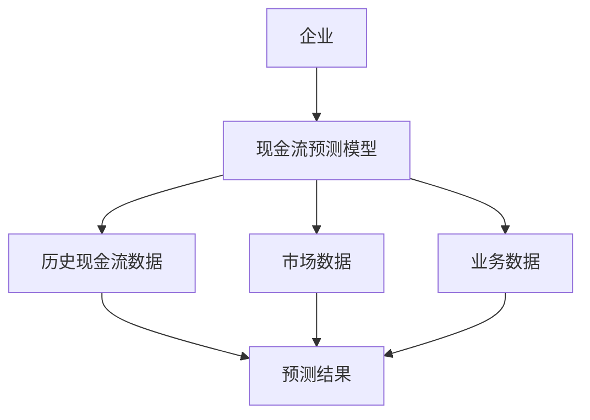
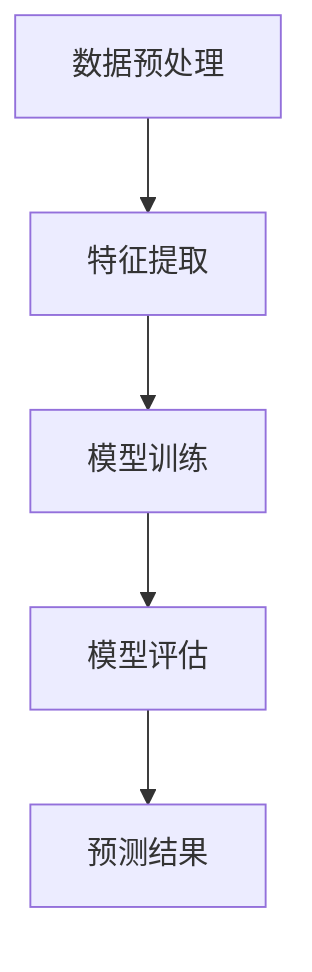
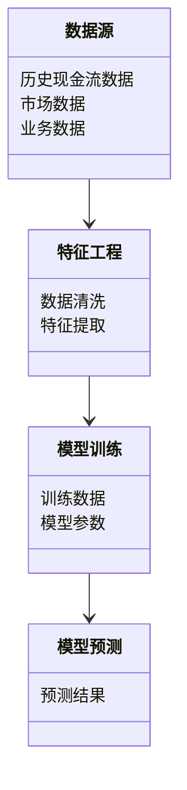
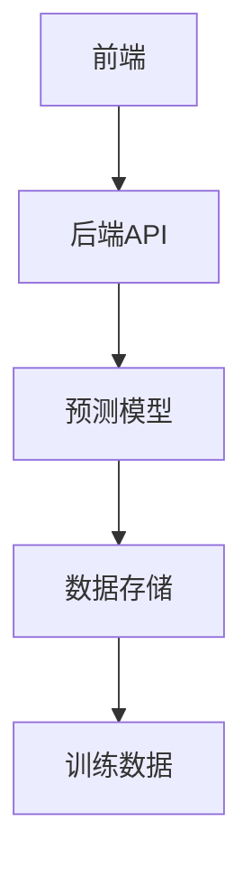
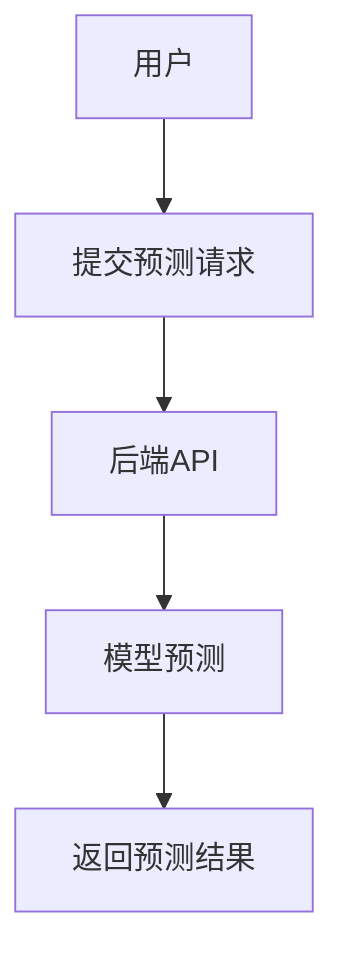

                 


# 开发智能化的企业现金流预测模型

> 关键词：现金流预测模型，智能化预测，企业财务管理，人工智能，大数据分析，机器学习

> 摘要：现金流是企业生存和发展的生命线，准确预测现金流对于企业的经营决策至关重要。本文将详细介绍如何开发一个智能化的企业现金流预测模型，从背景介绍、核心概念、算法原理到系统架构设计和项目实战，帮助读者全面掌握现金流预测模型的开发过程。文章结合实际案例，深入分析模型的实现细节，并提供完整的代码示例和系统设计，帮助读者从理论到实践，掌握现金流预测模型的开发方法。

---

# 第一部分: 企业现金流预测模型的背景与核心概念

# 第1章: 企业现金流预测模型的背景介绍

## 1.1 企业现金流预测的定义与重要性

### 1.1.1 企业现金流预测的定义

现金流预测是指通过对企业历史财务数据、市场趋势、业务模式等多方面因素的分析，利用数学模型和算法预测企业未来一段时间内的现金流情况。现金流预测的核心目标是帮助企业更好地规划资金使用、优化资源配置、降低财务风险。

### 1.1.2 现金流预测在企业财务管理中的作用

现金流预测在企业财务管理中具有以下重要作用：

1. **资金规划**：通过预测未来的现金流，企业可以合理安排资金的使用，确保资金链的稳定性。
2. **风险控制**：现金流预测能够帮助企业识别潜在的财务风险，提前采取应对措施。
3. **决策支持**：现金流预测为企业的投资决策、融资决策提供数据支持，帮助企业在复杂多变的市场环境中做出更明智的选择。

### 1.1.3 智能化现金流预测的必要性

随着企业规模的扩大和市场环境的复杂化，传统的现金流预测方法往往依赖人工经验，存在主观性强、效率低、精度不足等问题。而通过智能化技术（如机器学习、大数据分析等），企业可以更高效、更准确地预测现金流，提升财务管理的科学性和决策的精准性。

---

## 1.2 现金流预测的核心问题与边界

### 1.2.1 现金流预测的核心问题

现金流预测的核心问题包括：

1. **数据的准确性与完整性**：预测结果依赖于数据的质量，数据的缺失或错误会影响预测的准确性。
2. **模型的适用性与可解释性**：选择合适的模型不仅需要考虑预测精度，还需要模型具有一定的可解释性，以便企业理解和调整预测结果。
3. **预测的时效性与动态调整**：市场环境不断变化，现金流预测模型需要能够动态调整以适应新的数据和市场情况。

### 1.2.2 现金流预测的边界与外延

现金流预测的边界包括：

1. **时间范围**：预测的时间跨度（如短期、中期、长期）会影响数据的选取和模型的选择。
2. **预测的粒度**：现金流预测可以按日、周、月、季度等不同粒度进行预测。
3. **业务场景**：不同的业务场景（如制造业、服务业）可能需要不同的预测方法和模型。

### 1.2.3 现金流预测的业务场景与数据来源

现金流预测的业务场景可以包括：

1. **日常运营预测**：预测日常经营活动中的现金流。
2. **投资决策预测**：预测投资项目对现金流的影响。
3. **融资决策预测**：预测融资活动对现金流的影响。

数据来源主要包括：

1. **财务数据**：如历史现金流数据、收入数据、支出数据等。
2. **市场数据**：如行业趋势、经济指标等。
3. **业务数据**：如销售数据、采购数据等。

---

## 1.3 本章小结

通过本章的介绍，我们了解了现金流预测的定义、重要性以及核心问题。智能化现金流预测能够显著提升企业财务管理的效率和精度，帮助企业更好地应对复杂的市场环境。接下来，我们将深入分析现金流预测模型的核心概念与联系。

---

# 第2章: 现金流预测模型的核心概念与联系

## 2.1 现金流预测模型的组成要素

### 2.1.1 数据来源与特征

现金流预测模型的数据来源包括：

1. **历史财务数据**：如历史现金流、收入、支出等。
2. **市场数据**：如行业指数、经济指标等。
3. **业务数据**：如销售数据、采购数据等。

数据特征包括：

1. **时间序列性**：现金流数据通常具有时间序列特性。
2. **多维性**：现金流受多种因素影响，如市场环境、企业内部政策等。
3. **波动性**：现金流可能受到季节性或突发事件的影响。

### 2.1.2 模型输入与输出

模型输入包括：

1. **特征变量**：如历史现金流、收入增长率、市场趋势等。
2. **时间变量**：如预测的时间跨度。

模型输出包括：

1. **预测现金流值**：如预测的未来某一时点的现金流。
2. **预测区间**：如预测的高估值和低估值。

### 2.1.3 模型评估指标

模型评估指标包括：

1. **均方误差（MSE）**：衡量预测值与实际值的差异。
2. **R平方值（R²）**：衡量模型的拟合优度。
3. **平均绝对误差（MAE）**：衡量预测值与实际值的平均绝对差异。

---

## 2.2 核心概念的属性特征对比

### 2.2.1 数据特征对比表

| 数据特征 | 描述 |
|----------|------|
| 时间序列性 | 数据具有时间顺序，通常具有趋势和周期性 |
| 多维性 | 数据受多个因素影响，如市场、政策等 |
| 波动性 | 数据可能受到突发事件或季节性影响 |

### 2.2.2 模型特征对比表

| 模型特征 | 描述 |
|----------|------|
| 线性回归 | 假设变量之间存在线性关系，适用于简单场景 |
| 随机森林 | 基于决策树的集成方法，适用于复杂场景 |
| LSTM网络 | 适用于时间序列数据，能够捕捉长期依赖关系 |

---

## 2.3 现金流预测模型的ER实体关系图

以下是一个简单的现金流预测模型的ER实体关系图：



---

## 2.4 本章小结

通过本章的分析，我们了解了现金流预测模型的组成要素及其特征，并通过对比表和ER图进一步明确了各部分之间的关系。接下来，我们将深入探讨现金流预测模型的算法原理。

---

# 第三部分: 现金流预测模型的算法原理

# 第3章: 常见的现金流预测算法

## 3.1 线性回归模型

### 3.1.1 线性回归的原理与数学模型

线性回归是一种简单且常用的预测模型，其基本假设是变量之间存在线性关系。线性回归的数学模型如下：

$$ y = \beta_0 + \beta_1x + \epsilon $$

其中，$y$ 是目标变量（现金流），$x$ 是特征变量，$\beta_0$ 和 $\beta_1$ 是回归系数，$\epsilon$ 是误差项。

### 3.1.2 线性回归的优缺点

优点：
- 简单易懂，计算效率高。
- 适用于线性关系较强的场景。

缺点：
- 无法捕捉非线性关系。
- 对异常值敏感。

---

## 3.2 随机森林模型

### 3.2.1 随机森林的原理与数学模型

随机森林是一种基于决策树的集成学习方法，通过构建多棵决策树并进行投票或平均，能够有效提高预测精度。随机森林的数学模型如下：

$$ y = \frac{1}{n} \sum_{i=1}^{n} \text{Tree}_i(x) $$

其中，$n$ 是决策树的数量，$\text{Tree}_i(x)$ 是第 $i$ 棵决策树的预测结果。

### 3.2.2 随机森林的优缺点

优点：
- 能够捕捉复杂关系，适用于非线性预测。
- 对异常值鲁棒性较强。

缺点：
- 可解释性较差。
- 对特征工程要求较高。

---

## 3.3 算法流程图

以下是一个常见的现金流预测算法的流程图：



---

## 3.4 算法实现代码

### 3.4.1 线性回归代码示例

```python
import numpy as np
from sklearn.linear_model import LinearRegression

# 生成数据
X = np.array([[1], [2], [3], [4], [5]])
y = np.array([2, 4, 5, 4, 6])

# 训练模型
model = LinearRegression()
model.fit(X, y)

# 预测结果
print(model.predict([[6]]))
```

---

## 3.5 本章小结

通过本章的介绍，我们了解了线性回归和随机森林两种常见的现金流预测算法，并通过流程图和代码示例进一步明确了算法的实现过程。接下来，我们将从系统架构设计的角度，详细介绍现金流预测模型的实现方案。

---

# 第四部分: 现金流预测模型的系统架构设计

# 第4章: 现金流预测系统的架构设计

## 4.1 项目介绍

现金流预测系统是一个基于人工智能的预测平台，旨在帮助企业通过历史数据和市场信息，预测未来的现金流情况，辅助企业做出更明智的财务决策。

---

## 4.2 问题场景介绍

### 4.2.1 问题场景分析

现金流预测系统的常见问题场景包括：

1. **日常现金流预测**：帮助企业预测日常经营中的现金流情况。
2. **投资决策支持**：为企业投资决策提供现金流预测支持。
3. **融资规划支持**：帮助企业预测融资活动对现金流的影响。

---

## 4.3 系统功能设计

### 4.3.1 领域模型设计

以下是现金流预测系统的领域模型类图：



---

### 4.3.2 系统架构设计

以下是现金流预测系统的架构设计图：



---

## 4.4 系统接口设计

### 4.4.1 RESTful API 设计

以下是现金流预测系统的RESTful API接口设计：

1. **数据接口**：
   - GET /data：获取历史现金流数据。
   - POST /data：上传新的数据。

2. **预测接口**：
   - POST /predict：提交预测请求，返回预测结果。

---

## 4.5 系统交互设计

以下是现金流预测系统的交互流程图：



---

## 4.6 本章小结

通过本章的系统架构设计，我们明确了现金流预测系统的实现方案，包括领域模型设计、系统架构设计、接口设计和交互设计。接下来，我们将通过项目实战，详细介绍现金流预测模型的实现过程。

---

# 第五部分: 现金流预测模型的项目实战

# 第5章: 项目实战

## 5.1 环境安装

### 5.1.1 安装Python和相关库

以下是安装Python和相关库的命令：

```bash
python -m pip install numpy scikit-learn pandas
```

---

## 5.2 系统核心实现

### 5.2.1 数据预处理

以下是数据预处理的代码示例：

```python
import pandas as pd
import numpy as np

# 读取数据
data = pd.read_csv('cash_flow.csv')

# 数据清洗
data = data.dropna()
data = data.drop_duplicates()

# 数据标准化
from sklearn.preprocessing import StandardScaler

scaler = StandardScaler()
scaled_data = scaler.fit_transform(data)
```

---

### 5.2.2 特征工程

以下是特征工程的代码示例：

```python
from sklearn.feature_selection import SelectKBest
from sklearn.feature_selection import chi2

selector = SelectKBest(score_func=chi2, k=2)
selected_data = selector.fit_transform(scaled_data)
```

---

### 5.2.3 模型训练

以下是模型训练的代码示例：

```python
from sklearn.linear_model import LinearRegression
from sklearn.ensemble import RandomForestRegressor

# 线性回归模型
lr_model = LinearRegression()
lr_model.fit(selected_data, target)

# 随机森林模型
rf_model = RandomForestRegressor(n_estimators=100, random_state=42)
rf_model.fit(selected_data, target)
```

---

### 5.2.4 模型评估

以下是模型评估的代码示例：

```python
from sklearn.metrics import mean_squared_error

# 线性回归模型评估
lr预测 = lr_model.predict(selected_data)
lr_mse = mean_squared_error(target, lr预测)

# 随机森林模型评估
rf预测 = rf_model.predict(selected_data)
rf_mse = mean_squared_error(target, rf预测)

print(f'线性回归MSE: {lr_mse}\n随机森林MSE: {rf_mse}')
```

---

## 5.3 项目小结

通过本章的项目实战，我们详细介绍了现金流预测模型的实现过程，包括环境安装、数据预处理、特征工程、模型训练和模型评估。接下来，我们将总结本章的内容，并展望未来的发展方向。

---

# 第六部分: 总结与展望

# 第6章: 总结与展望

## 6.1 本章总结

通过本文的详细介绍，我们系统地探讨了现金流预测模型的开发过程，从背景介绍、核心概念、算法原理到系统架构设计和项目实战，帮助读者全面掌握现金流预测模型的开发方法。我们通过具体的代码示例和系统设计，展示了如何将理论知识应用于实际项目中。

---

## 6.2 未来展望

随着人工智能技术的不断发展，现金流预测模型将变得更加智能化和精准化。未来的研究方向包括：

1. **深度学习模型的应用**：如LSTM、Transformer等模型在时间序列预测中的应用。
2. **多模态数据的融合**：结合文本、图像等多种数据源进行现金流预测。
3. **实时预测与动态调整**：通过实时数据更新和模型微调，提升预测的时效性和准确性。

---

# 作者

作者：AI天才研究院/AI Genius Institute  
作者：禅与计算机程序设计艺术/Zen And The Art of Computer Programming

