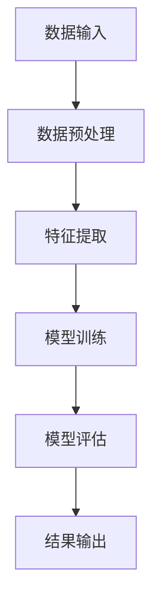

                 


# 开发智能化的供应链金融信用网络分析模型

> 关键词：供应链金融、信用网络分析、图神经网络、机器学习、风险管理

> 摘要：本文详细介绍了如何开发智能化的供应链金融信用网络分析模型，结合实际案例和代码实现，深入分析了模型的算法原理和系统架构。文章从供应链金融的背景出发，探讨了信用网络分析的重要性，详细讲解了基于图神经网络的信用评估算法，以及如何将模型应用于实际场景中。通过本文的学习，读者可以掌握供应链金融信用网络分析的核心技术，并能够独立开发类似的智能化模型。

---

# 第一部分: 供应链金融与信用网络分析模型的背景与意义

## 第1章: 供应链金融与信用网络分析模型的背景与意义

### 1.1 供应链金融的定义与特点
供应链金融是指通过整合供应链上的企业，提供资金支持，优化企业间的资金流动和资源配置。其特点包括：
- **协同性**：供应链上的各企业协同运作，资金流动与业务流程紧密结合。
- **风险分担**：通过多主体的协作，降低单一企业的风险敞口。
- **数据驱动**：依赖于供应链上的交易数据和信用数据进行决策。

### 1.2 信用网络分析的定义与特点
信用网络分析是通过图结构表示企业间的信用关系，分析信用风险和传播路径。其特点包括：
- **网络化**：企业间的信用关系形成复杂的网络结构。
- **动态性**：信用关系会随着供应链上的交易变化而动态调整。
- **复杂性**：涉及多主体、多层次的信用关系，需要复杂的算法进行分析。

### 1.3 智能化供应链金融信用网络分析模型的背景
随着供应链金融的快速发展，传统的信用评估方法逐渐暴露出以下问题：
- 数据孤岛：各企业间数据分散，难以形成全局视角。
- 风险评估不准确：传统方法难以捕捉复杂的信用关系和风险传播路径。
- 人工干预过多：信用评估依赖人工经验，效率低且易出错。

基于上述问题，智能化供应链金融信用网络分析模型应运而生。该模型通过整合供应链上的多源数据，利用机器学习和图神经网络技术，构建动态、精准的信用评估体系。

---

# 第二部分: 供应链金融信用网络分析模型的核心概念与联系

## 第2章: 供应链金融信用网络分析模型的核心概念

### 2.1 供应链金融中的信用网络分析
#### 2.1.1 供应链金融中的信用关系
供应链上的企业通过赊销、质押等方式形成信用关系。例如，供应商向下游企业提供的赊销额度反映了两者的信用关系强度。

#### 2.1.2 信用网络的构成要素
信用网络由以下要素构成：
- **节点**：代表供应链中的企业。
- **边**：代表企业间的信用关系，边的权重表示信用关系的强度。
- **属性**：包括企业的信用评分、历史交易数据等。

#### 2.1.3 信用网络的特征分析
信用网络具有以下特征：
- **网络密度**：反映企业间信用关系的紧密程度。
- **中心性**：反映某个企业在网络中的影响力。
- **社区结构**：反映企业间的聚类特征。

### 2.2 信用网络分析模型的原理
#### 2.2.1 模型的输入与输出
- **输入**：供应链上的交易数据、企业信用评分、历史违约数据等。
- **输出**：企业的信用评分、信用风险评估结果、风险传播路径等。

#### 2.2.2 模型的核心算法
信用网络分析模型的核心算法包括：
- **协同过滤**：基于相似企业的信用行为进行推荐。
- **聚类分析**：识别信用风险较高的企业集群。
- **图神经网络**：通过图结构数据建模信用关系，预测信用风险。

#### 2.2.3 模型的评估标准
模型的评估标准包括：
- **准确率**：模型预测的准确性。
- **召回率**：模型发现信用风险的能力。
- **F1分数**：综合准确率和召回率的指标。

### 2.3 实体关系图与流程图
#### 2.3.1 供应链金融信用网络的ER实体关系图
```mermaid
er
    actor 供应链金融参与者
    actor 企业
    actor 金融机构
    actor 供应商
    actor 客户
    entity 供应链金融合同
    entity 信用评估报告
    entity 交易数据
    entity 风险评估模型
    rel 实体关系
```

#### 2.3.2 信用网络分析模型的流程图


---

# 第三部分: 供应链金融信用网络分析模型的算法原理

## 第3章: 基于图神经网络的信用网络分析

### 3.1 图神经网络的定义与特点
图神经网络（Graph Neural Network, GNN）是一种处理图结构数据的深度学习模型。其特点包括：
- **局部聚合**：每个节点的信息通过聚合其邻居节点的信息进行更新。
- **全局传播**：信息通过多轮传播在图中扩散，反映节点间的依赖关系。

### 3.2 图神经网络在信用网络分析中的应用
#### 3.2.1 图神经网络在信用评估中的作用
图神经网络可以捕捉企业间的信用关系，通过图结构数据建模信用风险。例如，使用图卷积网络（Graph Convolutional Network, GCN）对信用网络进行建模，预测企业的信用评分。

#### 3.2.2 图神经网络的具体实现
图神经网络的核心算法包括：
- **图卷积网络（GCN）**：通过聚合邻居节点的信息，更新当前节点的表示。
- **图注意力网络（GAT）**：通过注意力机制，动态调整邻居节点的重要性。
- **图嵌入（GraphSAGE）**：通过归纳式学习，生成节点的低维表示。

#### 3.2.3 图神经网络的数学模型
图卷积网络的数学模型如下：
$$
h_i^{(l+1)} = \sigma\left(\sum_{j \in N(i)} \frac{1}{|N(i)|} W h_j^{(l)}\right)
$$
其中，$h_i^{(l+1)}$ 表示节点 $i$ 在第 $l+1$ 层的表示，$N(i)$ 表示节点 $i$ 的邻居节点集合，$W$ 是参数矩阵，$\sigma$ 是激活函数。

---

## 第4章: 供应链金融信用网络分析模型的系统架构与实现

### 4.1 系统架构设计
系统架构设计包括：
- **数据采集模块**：负责采集供应链上的交易数据、信用评分等。
- **数据预处理模块**：对数据进行清洗、归一化处理。
- **模型训练模块**：基于图神经网络模型进行训练，生成信用评分。
- **结果输出模块**：输出企业的信用评分和风险评估结果。

### 4.2 系统实现
#### 4.2.1 环境安装
需要安装以下工具和库：
- Python 3.8+
- TensorFlow 2.0+
- PyTorch 1.9+
- NetworkX 2.6+

#### 4.2.2 核心代码实现
以下是一个基于图卷积网络的信用评分模型的代码示例：
```python
import tensorflow as tf
from tensorflow.keras import layers

class GCN(tf.keras.Model):
    def __init__(self, input_dim, hidden_dim, output_dim):
        super(GCN, self).__init__()
        self.gcn_layer = layers.Dense(hidden_dim, input_dim=input_dim)
        self.dropout = layers.Dropout(0.5)
        self.prediction = layers.Dense(output_dim, input_dim=hidden_dim)

    def call(self, inputs, training=None):
        x = self.gcn_layer(inputs)
        x = self.dropout(x, training=training)
        x = self.prediction(x)
        return x

# 创建模型实例
model = GCN(input_dim=128, hidden_dim=64, output_dim=1)
# 编译模型
model.compile(optimizer=tf.keras.optimizers.Adam(learning_rate=0.01),
              loss=tf.keras.losses.MeanSquaredError(),
              metrics=['accuracy'])
```

---

### 4.3 案例分析
以某供应链金融项目为例，假设我们有以下数据：
- 供应链上的企业数量：100家。
- 企业的信用评分：基于交易数据和历史违约记录。

通过图卷积网络模型，我们可以生成每个企业的信用评分，并识别信用风险较高的企业集群。

---

## 第5章: 总结与展望

### 5.1 总结
本文详细介绍了开发智能化供应链金融信用网络分析模型的核心技术，包括模型的背景、核心概念、算法原理和系统架构。通过图神经网络技术，我们能够更精准地评估企业的信用风险，优化供应链金融的运作效率。

### 5.2 展望
未来，随着人工智能和大数据技术的不断发展，供应链金融信用网络分析模型将朝着以下几个方向发展：
- **实时性**：基于实时交易数据进行信用评估。
- **可解释性**：提高模型的可解释性，便于业务决策。
- **多模态数据融合**：结合文本、图像等多种数据源进行信用评估。

---

# 作者：AI天才研究院 & 禅与计算机程序设计艺术

