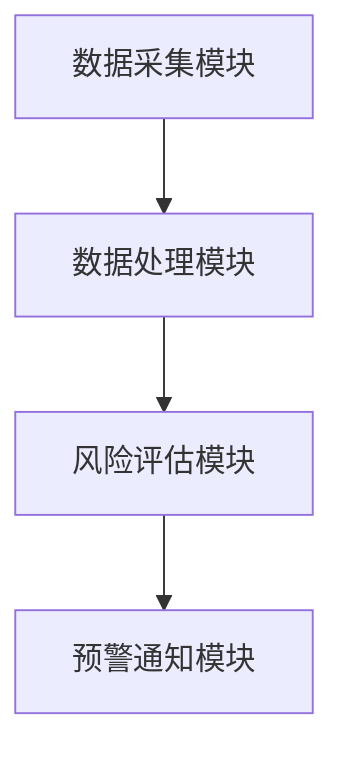

                 


# 开发智能化的供应链金融风险预警模型

> 关键词：供应链金融、风险预警、人工智能、机器学习、系统架构设计、大数据分析

> 摘要：本文详细探讨了如何开发智能化的供应链金融风险预警模型，从背景分析、核心概念、算法原理到系统架构设计，再到项目实战，全面解析了模型开发的全过程。通过结合大数据分析和人工智能技术，本文提出了一套高效的供应链金融风险预警解决方案，为企业的风险管理提供了重要的参考价值。

---

# 第一部分: 供应链金融风险预警模型背景与核心概念

## 第1章: 供应链金融与风险预警概述

### 1.1 供应链金融的定义与特点

#### 1.1.1 供应链金融的定义
供应链金融是指通过整合供应链上下游资源，为核心企业及其供应商、经销商提供融资支持的一种金融模式。其核心在于利用供应链中的信息流、资金流和物流，降低金融交易中的不确定性。

#### 1.1.2 供应链金融的核心特点
- **数据驱动**：依赖于供应链中的交易数据、物流数据和资金流动数据。
- **多方参与**：涉及核心企业、供应商、经销商、金融机构等多方主体。
- **风险可控**：通过整合供应链信息，降低金融风险。

#### 1.1.3 供应链金融在企业中的作用
- 提供融资支持，优化企业现金流。
- 降低供应链中的信用风险。
- 提高供应链整体运作效率。

---

### 1.2 供应链金融风险的类型

#### 1.2.1 信用风险
由于供应链中的交易涉及多方主体，信用风险是供应链金融中最主要的风险之一。供应商可能因为资金链断裂而无法履行合同，导致核心企业面临损失。

#### 1.2.2 操作风险
由于供应链金融涉及多个环节，操作风险主要来源于人为错误、系统故障或流程设计不合理。

#### 1.2.3 市场风险
市场波动可能导致供应链中的资产价值下降，从而影响融资方的偿债能力。

---

### 1.3 供应链金融风险预警的重要性

#### 1.3.1 风险预警的定义
风险预警是指通过分析相关数据，提前识别潜在风险，并采取相应的措施来降低风险的影响。

#### 1.3.2 风险预警在供应链金融中的作用
- 提前发现潜在风险，避免损失。
- 优化风险管理流程，提高效率。
- 为决策提供数据支持。

#### 1.3.3 智能化预警的优势
- 通过人工智能技术，实现对风险的实时监测和预测。
- 提供个性化的风险预警方案。
- 大幅降低人工干预的成本。

---

### 1.4 本章小结
供应链金融是现代企业优化现金流、降低风险的重要手段。然而，供应链金融中的风险种类繁多，且相互交织，需要通过智能化的预警模型来实现有效的风险管理。

---

## 第2章: 供应链金融风险预警模型的核心概念

### 2.1 供应链金融风险预警模型的定义

#### 2.1.1 模型的定义
供应链金融风险预警模型是一种基于大数据和人工智能技术，用于预测和预警供应链金融风险的数学模型。

#### 2.1.2 模型的核心要素
- 数据来源：供应链中的交易数据、物流数据、资金流动数据等。
- 风险指标：信用评分、违约概率等。
- 预警机制：通过设定阈值，触发预警信号。

---

### 2.2 供应链金融风险预警模型的构建逻辑

#### 2.2.1 数据来源与处理
- 数据来源：供应链交易数据、市场数据、企业信用数据等。
- 数据处理：数据清洗、特征提取、数据标准化。

#### 2.2.2 风险评估与预警机制
- 风险评估：通过机器学习算法对风险进行分类。
- 预警机制：根据风险评分触发预警信号。

#### 2.2.3 模型的输出与反馈
- 输出结果：风险等级、预警信息。
- 反馈机制：根据实际风险事件调整模型参数。

---

### 2.3 核心概念对比分析

#### 2.3.1 供应链金融与传统金融的对比
| 特性 | 供应链金融 | 传统金融 |
|------|------------|----------|
| 数据来源 | 供应链交易数据 | 企业财务数据 |
| 参与方 | 核心企业、供应商 | 企业、银行 |
| 风险控制 | 依赖供应链信息 | 依赖企业信用评级 |

#### 2.3.2 风险预警与传统风险控制的对比
| 特性 | 风险预警 | 传统风险控制 |
|------|----------|------------|
| 方法 | 数据驱动、实时监测 | 依赖历史数据、定期审查 |
| 效率 | 实时预警 | 周期性检查 |

#### 2.3.3 智能化模型与传统模型的对比
| 特性 | 智能化模型 | 传统模型 |
|------|------------|----------|
| 数据处理能力 | 高 | 低 |
| 预测精度 | 高 | 中 |
| 适用场景 | 复杂场景 | 简单场景 |

---

### 2.4 本章小结
供应链金融风险预警模型的核心在于通过整合供应链数据，利用人工智能技术实现对风险的实时监测和预警。与传统方法相比，智能化模型具有更高的效率和精度。

---

## 第3章: 供应链金融风险预警模型的数学模型与算法原理

### 3.1 风险评估的数学模型

#### 3.1.1 线性回归模型
线性回归模型是一种常用的回归分析方法，适用于预测连续型变量。其数学表达式为：
$$ y = \beta_0 + \beta_1x_1 + \beta_2x_2 + \ldots + \beta_nx_n + \epsilon $$
其中，$y$ 是目标变量，$x_i$ 是自变量，$\beta_i$ 是回归系数，$\epsilon$ 是误差项。

---

#### 3.1.2 支持向量机模型
支持向量机（SVM）是一种监督学习算法，适用于分类和回归问题。其核心思想是通过构建一个超平面，将数据点分到不同的类别中。数学表达式为：
$$ y = \text{sign}(w \cdot x + b) $$
其中，$w$ 是权重向量，$x$ 是输入向量，$b$ 是偏置项。

---

#### 3.1.3 神经网络模型
神经网络是一种模拟人脑神经网络的计算模型，适用于复杂的非线性分类和回归问题。其数学表达式为：
$$ y = f(Wx + b) $$
其中，$W$ 是权重矩阵，$x$ 是输入向量，$b$ 是偏置向量，$f$ 是激活函数。

---

### 3.2 算法原理与流程

#### 3.2.1 数据预处理
- 数据清洗：去除缺失值、异常值。
- 数据标准化：将数据归一化，消除量纲的影响。

#### 3.2.2 特征提取
- 从供应链数据中提取关键特征，例如交易金额、交易频率、供应商信用评分等。

#### 3.2.3 模型训练与优化
- 使用训练数据对模型进行训练，调整模型参数以最小化预测误差。
- 采用交叉验证方法评估模型性能。

#### 3.2.4 模型评估与调优
- 使用测试数据评估模型的准确率、召回率、F1分数等指标。
- 根据评估结果优化模型参数。

---

### 3.3 算法实现的代码示例

#### 3.3.1 数据加载与处理
```python
import pandas as pd
import numpy as np

# 加载数据
data = pd.read_csv('supply_chain_data.csv')

# 数据清洗
data.dropna()
data = data[~data.duplicated()]
```

#### 3.3.2 模型训练
```python
from sklearn.linear_model import LinearRegression
from sklearn.model_selection import train_test_split

# 划分训练集和测试集
X = data.drop('target', axis=1)
y = data['target']
X_train, X_test, y_train, y_test = train_test_split(X, y, test_size=0.2, random_state=42)

# 训练模型
model = LinearRegression()
model.fit(X_train, y_train)
```

#### 3.3.3 模型预测与评估
```python
# 预测
y_pred = model.predict(X_test)

# 评估
from sklearn.metrics import mean_squared_error
print(mean_squared_error(y_test, y_pred))
```

---

### 3.4 本章小结
本章详细介绍了供应链金融风险预警模型的数学模型与算法原理，包括线性回归、支持向量机和神经网络等算法的实现方法。通过对数据的预处理和特征提取，可以有效提高模型的预测精度。

---

## 第4章: 供应链金融风险预警模型的系统架构设计

### 4.1 系统架构概述

#### 4.1.1 系统组成模块
- 数据采集模块：负责采集供应链中的交易数据、物流数据等。
- 数据处理模块：对数据进行清洗、标准化和特征提取。
- 风险评估模块：利用机器学习算法对风险进行评估和预测。
- 预警通知模块：根据风险评分触发预警通知。

#### 4.1.2 模块之间的关系
- 数据采集模块将数据传递给数据处理模块。
- 数据处理模块将处理后的数据传递给风险评估模块。
- 风险评估模块将评估结果传递给预警通知模块。

---

### 4.2 系统功能设计

#### 4.2.1 数据采集模块
- 数据来源：供应链交易数据、市场数据、企业信用数据。
- 数据格式：结构化数据、非结构化数据。

#### 4.2.2 数据处理模块
- 数据清洗：去除缺失值、异常值。
- 数据标准化：将数据归一化，消除量纲的影响。

#### 4.2.3 风险评估模块
- 风险评估：利用机器学习算法对风险进行分类。
- 预警机制：根据风险评分触发预警信号。

#### 4.2.4 预警通知模块
- 预警通知：通过邮件、短信等方式通知相关人员。
- 通知内容：风险等级、预警原因、应对措施。

---

### 4.3 系统架构图


---

### 4.4 本章小结
本章详细介绍了供应链金融风险预警模型的系统架构设计，包括各模块的功能设计和模块之间的关系。通过合理的架构设计，可以实现对供应链金融风险的实时监测和预警。

---

## 第5章: 供应链金融风险预警模型的项目实战

### 5.1 环境安装与配置

#### 5.1.1 安装Python环境
```bash
python --version
pip install --upgrade pip
```

#### 5.1.2 安装依赖库
```bash
pip install pandas numpy scikit-learn
```

---

### 5.2 系统核心实现源代码

#### 5.2.1 数据加载与处理
```python
import pandas as pd
import numpy as np

# 加载数据
data = pd.read_csv('supply_chain_data.csv')

# 数据清洗
data.dropna()
data = data[~data.duplicated()]
```

#### 5.2.2 模型训练
```python
from sklearn.linear_model import LinearRegression
from sklearn.model_selection import train_test_split

# 划分训练集和测试集
X = data.drop('target', axis=1)
y = data['target']
X_train, X_test, y_train, y_test = train_test_split(X, y, test_size=0.2, random_state=42)

# 训练模型
model = LinearRegression()
model.fit(X_train, y_train)
```

#### 5.2.3 模型预测与评估
```python
# 预测
y_pred = model.predict(X_test)

# 评估
from sklearn.metrics import mean_squared_error
print(mean_squared_error(y_test, y_pred))
```

---

### 5.3 实际案例分析与详细讲解

#### 5.3.1 案例背景
假设某企业供应链中有多个供应商，我们需要通过模型预测哪些供应商可能存在违约风险。

#### 5.3.2 数据分析
- 数据特征：交易金额、交易频率、供应商信用评分。
- 数据预处理：去除缺失值、标准化数据。

#### 5.3.3 模型训练与预测
- 使用线性回归模型进行训练。
- 对测试数据进行预测，评估模型的准确率。

---

### 5.4 本章小结
本章通过实际案例分析，详细介绍了供应链金融风险预警模型的开发过程，包括环境配置、数据处理、模型训练和结果评估等步骤。

---

## 第6章: 供应链金融风险预警模型的最佳实践与注意事项

### 6.1 最佳实践 tips

#### 6.1.1 数据质量管理
- 确保数据的完整性和准确性。
- 定期更新数据，保持数据的时效性。

#### 6.1.2 模型优化
- 根据实际需求调整模型参数。
- 定期评估模型性能，优化模型结构。

#### 6.1.3 系统安全
- 加强系统安全性，防止数据泄露。
- 定期备份数据，确保系统稳定运行。

---

### 6.2 小结
供应链金融风险预警模型的开发需要结合实际业务需求，不断优化模型结构和算法，确保模型的准确性和稳定性。

---

### 6.3 注意事项

#### 6.3.1 数据隐私问题
- 遵守相关法律法规，保护数据隐私。
- 加强数据访问权限管理。

#### 6.3.2 模型的可解释性
- 确保模型的可解释性，便于后续优化和调整。

#### 6.3.3 系统的可扩展性
- 设计系统时充分考虑可扩展性，便于后续功能的增加和升级。

---

## 第7章: 拓展阅读与未来展望

### 7.1 拓展阅读
- 《供应链金融：理论与实践》
- 《机器学习实战》
- 《大数据分析与挖掘》

### 7.2 未来展望
随着人工智能和大数据技术的不断发展，供应链金融风险预警模型将更加智能化和精准化。未来的研究方向包括：
- 更加复杂的模型结构，如深度学习模型。
- 多模态数据的融合，提升模型的预测精度。
- 实时风险预警系统的开发与应用。

---

## 作者信息

作者：AI天才研究院/AI Genius Institute & 禅与计算机程序设计艺术 /Zen And The Art of Computer Programming

---

通过本文的详细讲解，读者可以全面了解供应链金融风险预警模型的开发过程，从理论到实践，从算法到系统架构设计，为企业的风险管理提供了重要的参考价值。

