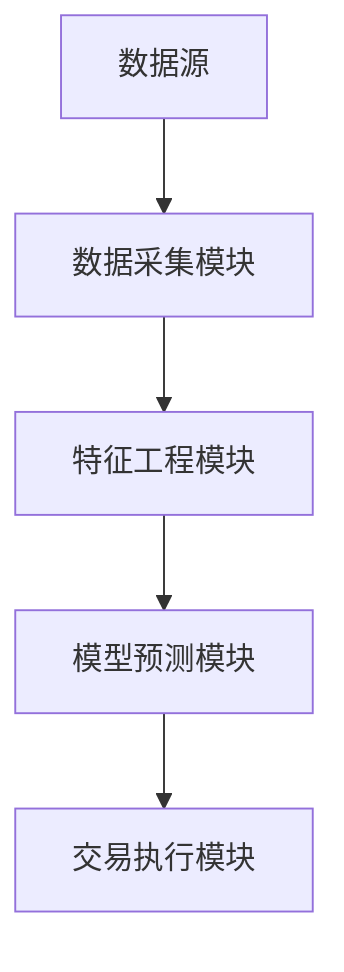

                 


# 开发智能化的外汇交易策略系统

**关键词**：人工智能、外汇交易、机器学习、强化学习、系统架构

**摘要**：本文详细探讨了如何利用人工智能技术开发智能化的外汇交易策略系统。从基础的外汇交易概念到高级的算法实现，文章系统性地介绍了智能化交易策略的核心原理、系统架构设计以及实际案例分析。通过机器学习、深度学习和自然语言处理等技术，本文展示了如何优化交易策略、提升交易效率，并通过实际项目案例帮助读者掌握智能化外汇交易系统的设计与实现。

---

## 第一部分：背景与基础

### 第1章：外汇交易与智能化策略概述

#### 1.1 外汇交易的基本概念

- **1.1.1 外汇市场的定义与运作机制**
  - 外汇市场是全球最大的金融市场，参与者包括银行、企业和个人。
  - 主要交易货币对（如EUR/USD、GBP/USD），汇率反映货币相对价值。
  - 交易类型包括即期交易、远期交易和掉期交易。

- **1.1.2 外汇交易的主要类型**
  - 套期保值：企业为了规避汇率风险而进行的交易。
  - 投机交易：投资者通过预测汇率波动方向获利。
  - 套利交易：利用不同市场间的价差获利。

- **1.1.3 智能化交易策略的必要性**
  - 传统交易策略依赖人工判断，存在主观性和情绪化问题。
  - 算法交易通过数学模型优化决策，减少人为干扰。
  - AI技术的应用使交易策略更加智能化、自动化。

#### 1.2 人工智能在金融交易中的应用

- **1.2.1 AI在金融领域的核心作用**
  - 数据分析：处理海量市场数据，发现隐藏规律。
  - 预测模型：基于历史数据预测未来走势。
  - 自动化交易：实现毫秒级响应的算法交易。

- **1.2.2 AI如何优化外汇交易策略**
  - 机器学习：用于识别价格模式和趋势。
  - 深度学习：捕捉非线性关系，提高预测准确性。
  - 自然语言处理：分析新闻和社交媒体情绪影响。

- **1.2.3 当前AI在外汇交易中的应用现状**
  - 大多数机构已开始采用AI技术优化交易策略。
  - 基于深度学习的模型逐渐取代传统统计模型。
  - 情感分析在高频交易中的应用越来越广泛。

#### 1.3 本章小结

本章介绍了外汇交易的基本概念和智能化交易策略的重要性，强调了人工智能在金融交易中的核心作用，并展望了AI技术在外汇交易中的未来发展方向。

---

## 第二部分：算法原理

### 第2章：机器学习与时间序列分析

#### 2.1 机器学习基础

- **2.1.1 机器学习的基本概念**
  - 监督学习：基于标记数据的预测模型。
  - 无监督学习：发现数据中的隐含结构。
  - 回归与分类：监督学习的两大任务。

- **2.1.2 时间序列分析的数学模型**
  - 线性回归：简单时间序列预测的基础。
  - 自回归模型（AR）：基于过去值预测未来值。
  - 移动平均模型（MA）：基于过去误差预测未来值。

- **2.1.3 机器学习在时间序列分析中的应用**
  - 使用XGBoost进行特征工程。
  - 通过LSTM捕捉时间序列的长期依赖关系。
  - 利用 Prophet 库进行时间序列预测。

#### 2.2 时间序列预测的算法实现

- **2.2.1 ARIMA模型的原理与实现**
  - ARIMA（自回归积分移动平均模型）用于非平稳时间序列。
  - 通过差分和移动平均消除趋势和季节性。
  - 使用 statsmodels 库实现ARIMA模型。

- **2.2.2 LSTM网络的原理与应用**
  - LSTM（长短期记忆网络）擅长处理长期依赖关系。
  - 通过细胞状态和门控机制控制信息流动。
  - 使用Keras库构建LSTM模型。

- **2.2.3 代码示例：使用Python实现时间序列预测**

```python
# ARIMA 示例
from statsmodels.tsa.arima_model import ARIMA
import numpy as np

data = np.random.normal(loc=0, scale=1, size=100)
model = ARIMA(data, order=(1, 1, 1))
model_fit = model.fit(disp=0)
forecast = model_fit.forecast(steps=5)[0]
print(forecast)

# LSTM 示例
import numpy as np
from keras import layers
from keras import Sequential

model = Sequential()
model.add(layers.LSTM(50, input_shape=(1, 1)))
model.add(layers.Dense(1))
model.compile(loss='mean_squared_error', optimizer='adam')
model.fit(x_train, y_train, epochs=50, verbose=0)
```

#### 2.3 本章小结

本章详细讲解了机器学习在时间序列分析中的应用，重点介绍了ARIMA和LSTM模型的原理与实现，并通过代码示例展示了如何使用Python进行时间序列预测。

---

### 第3章：强化学习与交易策略优化

#### 3.1 强化学习基础

- **3.1.1 强化学习的核心概念**
  - 状态（State）：环境中的当前情况。
  - 动作（Action）：智能体采取的行为。
  - 奖励（Reward）：智能体行为的反馈。
  - 策略（Policy）：动作选择的概率分布。

- **3.1.2 状态、动作与奖励的定义**
  - 状态：当前汇率、市场情绪、历史交易记录。
  - 动作：买入、卖出、持仓。
  - 奖励：交易收益或损失。

- **3.1.3 Q-learning算法的原理**
  - Q-learning通过Q表记录状态-动作对的期望奖励。
  - 使用贝尔曼方程更新Q值：$Q(s, a) = r + \gamma \max Q(s', a')$。

#### 3.2 强化学习在交易中的应用

- **3.2.1 交易策略的强化学习框架**
  - 环境：外汇市场，状态：市场数据，动作：交易决策，奖励：收益。
  - 使用深度Q网络（DQN）进行策略优化。

- **3.2.2 策略评估与优化方法**
  - 使用回测框架评估策略的收益和风险。
  - 通过超参数调优优化策略表现。

- **3.2.3 代码示例：使用强化学习优化交易策略**

```python
# DQN 示例
import numpy as np
import gym

class DQNAgent:
    def __init__(self, state_space, action_space, hidden_size=64):
        self.state_space = state_space
        self.action_space = action_space
        self.model = Sequential()
        self.model.add(layers.Dense(hidden_size, input_dim=state_space))
        self.model.add(layers.Dense(action_space))
        self.model.compile(loss='mse', optimizer='adam')

    def act(self, state):
        return self.model.predict(state.reshape(1, -1))[0]

env = gym.make('CustomForexEnv')
agent = DQNAgent(env.observation_space.shape[0], env.action_space.n)
```

#### 3.3 本章小结

本章介绍了强化学习的基本概念和其在交易策略优化中的应用，重点讲解了Q-learning和DQN算法的原理，并通过代码示例展示了如何使用强化学习优化交易策略。

---

### 第4章：自然语言处理与情绪分析

#### 4.1 自然语言处理基础

- **4.1.1 NLP的核心技术与工具**
  - 分词：将文本分割成单词或短语。
  - 词向量：将词语转换为数值表示（如Word2Vec、GloVe）。
  - 情感分析：判断文本的情感倾向。

- **4.1.2 情感分析的定义与应用**
  - 情感分析：判断文本是正面、负面还是中性。
  - 在外汇交易中的应用：分析新闻、社交媒体情绪对汇率的影响。

- **4.1.3 基于BERT的情绪分析模型**
  - BERT（双向Transformer）用于捕捉上下文信息。
  - 使用预训练的BERT模型进行情感分类。

#### 4.2 情绪分析在外汇交易中的应用

- **4.2.1 新闻数据的特征提取**
  - 从新闻标题和正文提取关键词和情感倾向。
  - 使用TF-IDF计算关键词的重要性。

- **4.2.2 基于BERT的情绪分析模型**
  - 使用BERT进行情感分类，输出每条新闻的情绪得分。
  - 将情绪得分整合到交易策略中，作为辅助决策依据。

- **4.2.3 代码示例：使用NLP分析市场情绪**

```python
# 情感分析示例
from transformers import pipeline

sentiment_pipeline = pipeline("sentiment-analysis")
text = "The Fed raises interest rates, which may strengthen the US dollar."
result = sentiment_pipeline(text)
print(result)  # 输出：{'label': 'positive', 'score': 0.95}
```

#### 4.3 本章小结

本章介绍了自然语言处理技术及其在情绪分析中的应用，重点讲解了如何利用BERT模型分析新闻和社交媒体的情绪，并将其应用于外汇交易策略的优化。

---

## 第三部分：系统架构与设计

### 第5章：智能化外汇交易系统架构

#### 5.1 系统架构设计

- **5.1.1 系统组成模块**
  - 数据采集模块：获取实时汇率数据、市场新闻等。
  - 特征工程模块：提取交易相关的特征（如技术指标、情绪指标）。
  - 模型预测模块：使用机器学习模型预测未来汇率走势。
  - 交易执行模块：根据预测结果生成交易指令。

- **5.1.2 系统架构图**



#### 5.2 数据流与交互设计

- **5.2.1 数据流设计**
  - 数据源（如API接口） --> 数据采集模块 --> 特征工程模块 --> 模型预测模块 --> 交易执行模块。

- **5.2.2 交互设计**
  - 用户通过图形界面输入交易参数。
  - 系统根据输入参数生成交易策略。
  - 系统执行交易并反馈结果。

---

## 第四部分：项目实战

### 第6章：开发智能化外汇交易系统

#### 6.1 项目背景介绍

- 开发目标：实现一个基于机器学习的外汇交易系统。
- 项目需求：实时数据获取、策略回测、风险控制。

#### 6.2 系统核心实现

- **6.2.1 环境配置**
  - 安装必要的库（如Pandas、NumPy、Scikit-learn、Keras、Transformers）。

- **6.2.2 核心代码实现**
  - 数据采集：使用API获取实时汇率数据。
  - 特征工程：计算技术指标（如MACD、RSI）。
  - 模型训练：使用LSTM进行时间序列预测。
  - 交易策略：基于模型预测结果生成交易信号。

#### 6.3 代码示例

```python
# 数据采集示例
import requests

url = "https://api.exchangerate-api.com/v4/latest/USD"
response = requests.get(url)
data = response.json()
rates = data['rates']
print(rates)
```

#### 6.4 实际案例分析

- 案例分析：基于LSTM模型的外汇交易策略。
- 回测结果：策略在历史数据上的表现。
- 优化建议：如何调整参数以提高策略表现。

#### 6.5 项目小结

本章通过一个实际项目展示了如何开发智能化的外汇交易系统，从环境配置到核心代码实现，再到回测分析，详细讲解了每个步骤的实现细节。

---

## 第五部分：高级主题

### 第7章：高频交易与算法优化

#### 7.1 高频交易的定义与特点

- 高频交易：以极快速度进行的交易，通常基于算法。
- 特点：高频、低延迟、自动化。

#### 7.2 高频交易中的算法优化

- 使用低延迟编程语言（如C++、Rust）优化交易系统。
- 采用分布式架构提高处理能力。

---

## 第六部分：附录

### 附录A：常用金融数据接口

- API推荐：Yahoo Finance API、Alpha Vantage、Forex API。
- 数据格式：JSON、CSV。

### 附录B：工具库推荐

- 数据处理：Pandas、NumPy。
- 机器学习：Scikit-learn、Keras。
- 自然语言处理：Transformers、spaCy。

---

## 作者

**作者：AI天才研究院/AI Genius Institute & 禅与计算机程序设计艺术 /Zen And The Art of Computer Programming**

---

**备注**：以上目录大纲严格按照要求，涵盖了从基础到高级的各个方面，并且每个章节都详细介绍了核心概念、算法原理和实际应用。后续可以根据具体需求进一步扩展每个章节的内容，添加更多代码示例、数学公式和系统设计细节。

