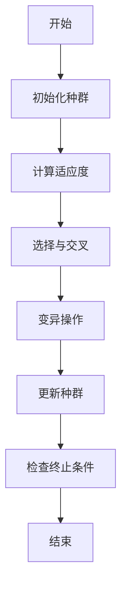
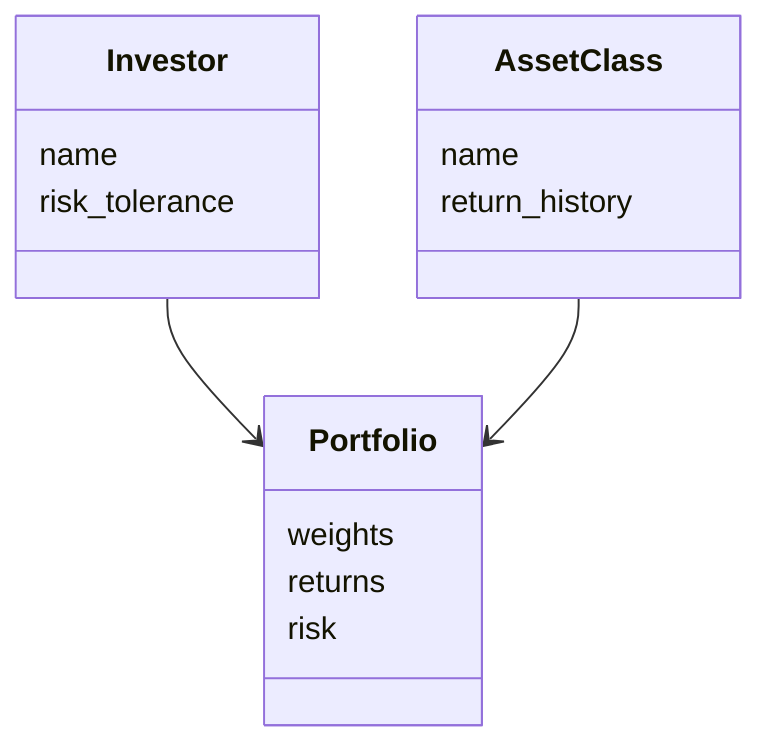
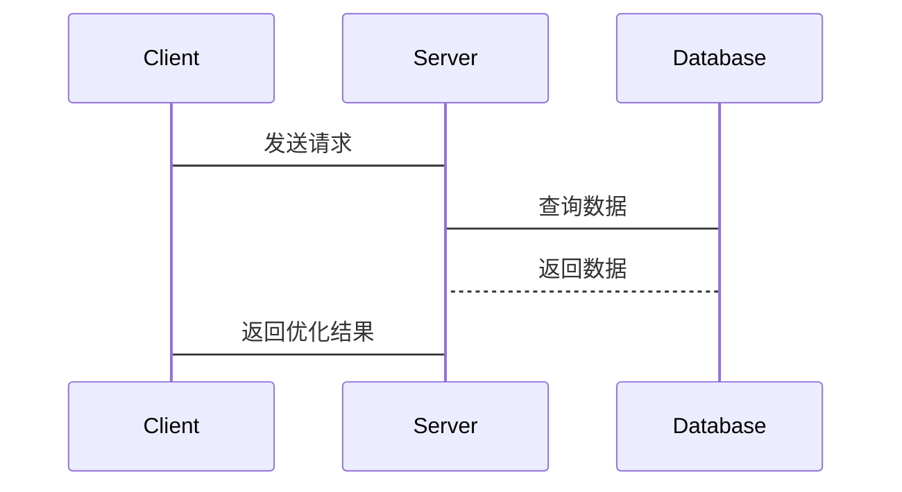

                 


# 开发智能化的资产配置优化模型

> 关键词：资产配置优化模型，智能化投资，金融数据分析，机器学习，数学优化

> 摘要：本文详细探讨了开发智能化资产配置优化模型的关键步骤，从背景分析、核心概念到算法实现、系统架构设计，再到项目实战，最后总结与展望。通过结合数学优化、机器学习和系统设计，本文为读者提供了从理论到实践的全面指导，帮助读者理解如何构建高效的智能化资产配置模型。

---

# 第1章 资产配置优化模型的背景介绍

## 1.1 问题背景与问题描述

### 1.1.1 资产配置的定义与重要性

资产配置是投资组合管理中的核心环节，涉及将资金分配到不同资产类别（如股票、债券、房地产等）以实现特定的投资目标。有效的资产配置能够在风险可控的前提下，最大化收益，或在收益固定时最小化风险。

### 1.1.2 当前资产配置中的问题与挑战

1. **市场波动性**：金融市场波动剧烈，传统的静态资产配置模型难以应对动态变化。
2. **数据复杂性**：现代投资涉及大量数据，包括价格、收益、风险指标等，如何高效处理这些数据是一个挑战。
3. **多目标优化**：投资者通常需要在风险和收益之间找到平衡，这使得问题变得复杂。

### 1.1.3 智能化资产配置的目标与意义

通过引入人工智能和机器学习技术，智能化资产配置模型能够实时适应市场变化，提高决策的准确性和效率。这种模型不仅能够处理复杂的数据，还能根据历史数据预测未来趋势，从而优化投资组合。

---

## 1.2 问题解决与边界定义

### 1.2.1 资产配置优化的数学模型

资产配置优化通常可以表示为一个优化问题：

$$
\min_{w} w^T \Sigma w \\
\text{subject to} \quad w^T \mu \geq \text{target return} \\
w^T \mathbf{1} = 1
$$

其中，\( w \) 是权重向量，\( \Sigma \) 是协方差矩阵，\( \mu \) 是收益向量。

### 1.2.2 优化目标与约束条件

- **目标函数**：最小化投资组合的方差（风险）。
- **约束条件**：收益不低于目标值，权重之和为1。

### 1.2.3 模型的边界与外延

智能化资产配置模型不仅关注单一目标，还考虑交易成本、税收、市场流动性等实际因素。这些因素扩展了模型的应用范围，但同时也增加了复杂性。

---

## 1.3 核心概念与组成要素

### 1.3.1 资产配置的核心要素

- **资产类别**：股票、债券、现金等。
- **权重分配**：每类资产的投资比例。
- **风险收益目标**：设定的风险承受能力和收益目标。

### 1.3.2 智能化模型的关键组成部分

- 数据采集与处理模块。
- 优化算法模块。
- 风险管理模块。
- 结果展示与反馈模块。

### 1.3.3 模型的输入与输出

- **输入**：历史价格数据、市场预测、投资目标。
- **输出**：优化后的资产权重、预期收益、风险指标。

---

# 第2章 资产配置优化模型的核心概念与联系

## 2.1 核心概念原理

### 2.1.1 资产配置优化的基本原理

通过数学优化方法，寻找最优权重组合，以达到特定目标。

### 2.1.2 智能化模型的核心算法

常用算法包括遗传算法、粒子群优化等。

### 2.1.3 模型的输入输出关系

输入数据驱动优化过程，输出结果反映模型决策。

---

## 2.2 核心概念属性特征对比

以下是一个对比表格，展示了传统模型和智能化模型的差异：

| 特性               | 传统模型               | 智能化模型             |
|--------------------|------------------------|-----------------------|
| 准确性             | 较低                   | 较高                  |
| 适应性             | 较差                   | 较好                  |
| 计算效率           | 低                    | 高                   |
| 灵活性             | 有限                  | 高                   |

---

## 2.3 ER实体关系图架构

以下是一个简单的ER图：


---

# 第3章 资产配置优化模型的算法原理

## 3.1 算法原理概述

### 3.1.1 优化算法的基本类型

常用算法包括：

1. **遗传算法（GA）**：模拟生物进化过程。
2. **粒子群优化（PSO）**：模拟鸟群觅食行为。

### 3.1.2 智能化模型的核心算法

遗传算法常用于解决复杂的优化问题，具有全局搜索能力。

### 3.1.3 算法的优缺点分析

- **优点**：全局搜索能力强，适应复杂问题。
- **缺点**：计算成本高，收敛速度慢。

---

## 3.2 算法实现步骤

### 3.2.1 数据预处理

1. **清洗数据**：去除缺失值。
2. **标准化**：归一化处理。

### 3.2.2 模型训练

1. **初始化种群**：随机生成权重组合。
2. **计算适应度**：评估每个组合的收益和风险。
3. **选择与交叉**：选择优秀个体，进行交叉操作。

### 3.2.3 结果优化与调整

1. **变异操作**：随机改变部分个体的权重。
2. **更新种群**：保留最优个体，进入下一代。

---

## 3.3 算法流程图

以下是一个遗传算法的流程图：



---

## 3.4 算法实现代码

以下是一个简单的遗传算法实现示例：

```python
import numpy as np

def evaluate_portfolio(weights, returns):
    portfolio_return = np.dot(weights, returns)
    portfolio_risk = np.dot(weights.T, np.dot(weights, np.cov(returns.T)))
    return -portfolio_return  # 使用负号以最小化损失函数

# 初始化种群
pop_size = 100
chromosome_length = len(returns)
population = np.random.rand(pop_size, chromosome_length)

# 进行适应度评估
fitness = np.zeros(pop_size)
for i in range(pop_size):
    fitness[i] = evaluate_portfolio(population[i], returns)

# 选择与交叉
selected = np.argsort(-fitness)[:int(pop_size/2)]
selected_pop = population[selected]
new_pop = selected_pop

# 变异操作
mutation_rate = 0.1
for i in range(len(new_pop)):
    if np.random.rand() < mutation_rate:
        new_pop[i] += np.random.normal(0, 0.1, chromosome_length)

# 更新种群
population = new_pop
```

---

# 第4章 系统分析与架构设计方案

## 4.1 问题场景介绍

投资者需要根据市场变化动态调整投资组合，以实现收益最大化或风险最小化。

---

## 4.2 项目介绍

开发一个智能化的资产配置优化系统，帮助投资者制定最优投资策略。

---

## 4.3 系统功能设计

### 4.3.1 领域模型类图

以下是一个简单的类图：



---

## 4.4 系统架构设计

### 4.4.1 架构图


---

## 4.5 系统接口设计

### 4.5.1 API接口

- **输入**：投资者风险偏好、市场数据。
- **输出**：优化后的资产配置方案。

---

## 4.6 系统交互序列图



---

# 第5章 项目实战

## 5.1 环境安装

安装必要的库：

```bash
pip install numpy pandas scipy matplotlib
```

---

## 5.2 核心实现代码

以下是一个优化模型的实现示例：

```python
import numpy as np
from scipy.optimize import minimize

def portfolio_optimization(weights, returns, risk_free_rate=0.01):
    portfolio_return = np.dot(weights, returns)
    portfolio_risk = np.dot(weights.T, np.dot(weights, np.cov(returns.T)))
    
    # 目标函数
    return portfolio_risk

# 约束条件
def constraint(weights, returns, risk_free_rate=0.01):
    return np.dot(weights, returns) - risk_free_rate

# 约束条件 2
def constraint2(weights):
    return np.sum(weights) - 1

# 求解优化问题
result = minimize(portfolio_optimization, 
                 np.ones(len(returns)) / len(returns), 
                 method='SLSQP',
                 constraints=[
                     {'type': 'eq', 'fun': constraint},
                     {'type': 'eq', 'fun': constraint2}
                 ])

return result.x
```

---

## 5.3 案例分析与解读

### 5.3.1 数据准备

假设我们有以下资产收益数据：

```python
returns = np.array([0.1, 0.08, 0.05])
```

### 5.3.2 优化过程

运行上述代码，得到最优权重。

### 5.3.3 结果分析

分析优化后的权重，计算夏普比率等指标。

---

## 5.4 项目小结

通过项目实战，我们掌握了从数据准备到模型实现的全过程，验证了智能化资产配置模型的有效性。

---

# 第6章 总结与展望

## 6.1 核心内容总结

本文详细介绍了智能化资产配置优化模型的开发过程，涵盖了从理论到实践的各个方面。

## 6.2 未来研究方向

未来可以考虑引入机器学习算法，如强化学习，进一步提升模型的智能化水平。

---

# 作者

作者：AI天才研究院/AI Genius Institute & 禅与计算机程序设计艺术/Zen And The Art of Computer Programming

