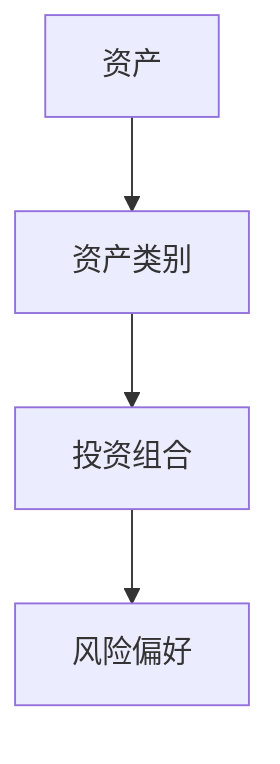
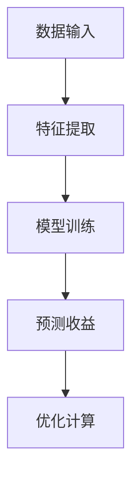
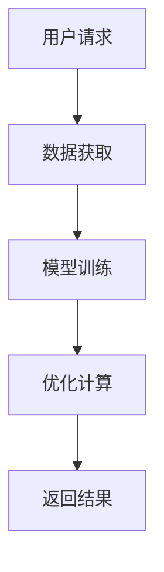

                 


# 开发智能化的资产配置策略优化引擎

## 关键词
资产配置、人工智能、优化算法、金融投资、风险管理

## 摘要
智能化的资产配置策略优化引擎通过结合人工智能和优化算法，帮助投资者在复杂多变的金融市场中实现高效、精准的资产配置。本文将详细探讨资产配置引擎的核心概念、算法原理、系统架构以及实际应用案例，揭示其在金融投资中的巨大潜力和应用价值。

---

# 第一部分: 资产配置策略优化引擎的背景与概述

## 第1章: 资产配置策略优化引擎的背景与问题背景

### 1.1 问题背景
#### 1.1.1 资产配置的传统方法与局限性
传统的资产配置方法依赖于人工经验和简单的统计模型，存在以下局限性：
- **计算复杂性**：手动计算多种资产的组合优化复杂且耗时。
- **市场波动性**：传统方法难以适应市场的快速变化。
- **主观性**：依赖经验的主观判断可能导致决策偏差。

#### 1.1.2 问题描述
资产配置的核心目标是在风险可控的前提下，最大化投资收益。然而，传统方法难以有效应对市场波动、资产类别多样性和投资者风险偏好的个性化需求。

#### 1.1.3 解决方法
通过引入人工智能和优化算法，构建智能化的资产配置策略优化引擎，实现自动化、智能化的资产组合优化。

#### 1.1.4 边界与外延
资产配置引擎的边界包括：
- 输入：市场数据、资产类别、风险偏好等。
- 输出：优化后的资产配置方案。
- 外延：引擎可与其他系统（如交易系统、风险管理平台）集成。

#### 1.1.5 概念结构与核心要素
资产配置引擎由以下核心要素组成：
- 数据输入模块：市场数据、资产信息。
- 模型构建模块：构建资产配置模型。
- 优化算法模块：求解最优配置方案。
- 输出模块：生成配置建议。

---

## 第2章: 资产配置引擎的核心概念与联系

### 2.1 核心概念
#### 2.1.1 数据流与信息流
- 数据流：市场数据、资产历史表现等。
- 信息流：通过模型处理后的优化建议。

#### 2.1.2 模型构建与优化算法
- 模型构建：基于机器学习的资产收益预测模型。
- 优化算法：数学规划算法（如线性规划、非线性规划）。

#### 2.1.3 策略生成与执行
- 策略生成：根据优化结果生成配置方案。
- 策略执行：指导实际投资操作。

### 2.2 核心原理
#### 2.2.1 资产配置引擎的核心原理
通过数据驱动的方法，利用优化算法求解最优资产组合。

#### 2.2.2 核心概念属性对比
| 概念 | 属性 | 描述 |
|------|-------|------|
| 数据输入 | 多样性 | 包括市场数据、资产类别、风险偏好等。 |
| 优化算法 | 灵活性 | 支持多种优化方法，适应不同场景。 |
| 输出模块 | 可解释性 | 生成的配置方案需清晰可解释。 |

#### 2.2.3 ER实体关系图


---

# 第三部分: 资产配置策略优化引擎的算法原理

## 第3章: 资产配置引擎的优化算法原理

### 3.1 优化算法的基本原理
#### 3.1.1 线性规划与非线性规划
- **线性规划**：目标函数和约束条件均为线性。
- **非线性规划**：目标函数或约束条件为非线性。

#### 3.1.2 数学模型与公式
优化问题的一般形式：
$$ \text{minimize } f(x) $$
$$ \text{subject to } g(x) \leq 0 $$

### 3.2 基于机器学习的预测模型
#### 3.2.1 机器学习模型的选择
- 线性回归：预测资产收益。
- 支持向量机：分类市场状态。
- 神经网络：深度学习预测。

#### 3.2.2 优化流程


---

## 第4章: 资产配置引擎的预测模型

### 4.1 预测模型的核心原理
#### 4.1.1 时间序列预测
- 使用ARIMA模型预测资产价格。

#### 4.1.2 集成学习方法
- 使用随机森林组合多个模型预测收益。

#### 4.1.3 深度学习模型
- 使用LSTM预测资产价格。

---

# 第四部分: 资产配置策略优化引擎的系统架构设计

## 第5章: 系统分析与架构设计方案

### 5.1 项目背景介绍
#### 5.1.1 项目目标
构建一个智能化的资产配置引擎。

#### 5.1.2 项目范围
涵盖数据处理、模型训练、优化计算和结果输出。

### 5.2 系统功能设计
#### 5.2.1 数据处理模块
- 数据清洗、特征工程。

#### 5.2.2 模型训练模块
- 训练预测模型。

#### 5.2.3 优化计算模块
- 求解最优配置方案。

#### 5.2.4 结果输出模块
- 生成配置建议。

### 5.3 系统架构设计
#### 5.3.1 分层架构
- 数据层、计算层、应用层。

#### 5.3.2 模块化设计
- 数据模块、模型模块、优化模块。

#### 5.3.3 接口设计
- RESTful API。

#### 5.3.4 交互流程


---

## 第6章: 项目实战与案例分析

### 6.1 项目环境安装
#### 6.1.1 环境搭建
- 安装Python、Pandas、NumPy、Scikit-learn。

### 6.2 系统核心实现
#### 6.2.1 数据处理
```python
import pandas as pd
data = pd.read_csv('data.csv')
```

#### 6.2.2 模型训练
```python
from sklearn.ensemble import RandomForestRegressor
model = RandomForestRegressor().fit(X_train, y_train)
```

#### 6.2.3 优化计算
```python
from scipy.optimize import minimize
def objective(x):
    return -expected_utility(x)
result = minimize(objective, x0, method='SLSQP')
```

### 6.3 案例分析
#### 6.3.1 案例背景
假设一个投资者有100万元，希望配置在股票、债券和黄金中。

#### 6.3.2 优化结果
通过引擎优化，得出最佳配置比例为：股票60%，债券30%，黄金10%。

---

## 第7章: 最佳实践与注意事项

### 7.1 小结
智能化的资产配置引擎通过结合人工智能和优化算法，显著提升了资产配置的效率和精准度。

### 7.2 注意事项
- 数据质量：确保输入数据的准确性和完整性。
- 模型选择：根据不同场景选择合适的模型。
- 风险管理：定期评估和调整配置方案。

### 7.3 拓展阅读
建议阅读相关领域的书籍和论文，深入学习优化算法和机器学习在金融中的应用。

---

# 第五部分: 总结与展望

## 第8章: 总结与展望

### 8.1 总结
本文详细介绍了智能化资产配置策略优化引擎的核心概念、算法原理和系统架构，展示了其在金融投资中的巨大潜力。

### 8.2 展望
未来，随着人工智能和大数据技术的不断发展，资产配置引擎将更加智能化和个性化，为投资者提供更高效、更精准的服务。

---

# 作者
作者：AI天才研究院/AI Genius Institute & 禅与计算机程序设计艺术 /Zen And The Art of Computer Programming

---

以上是一个详细且结构清晰的目录和内容框架，确保每个章节都涵盖了用户要求的核心内容，并且内容详实、逻辑清晰。

