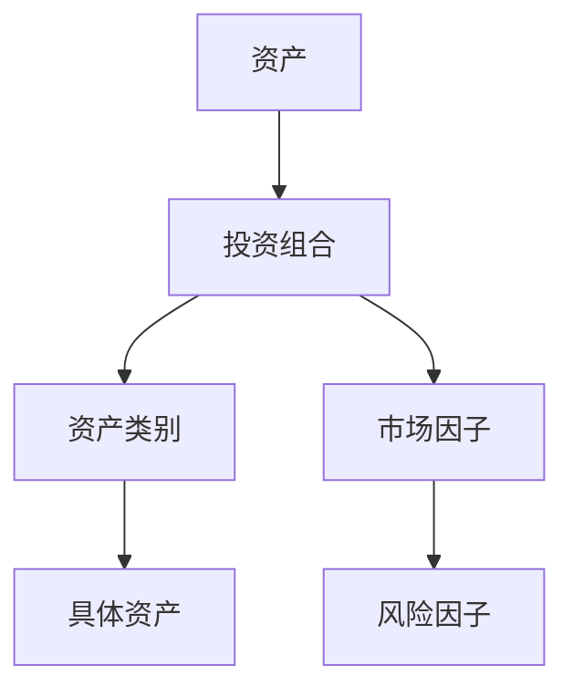
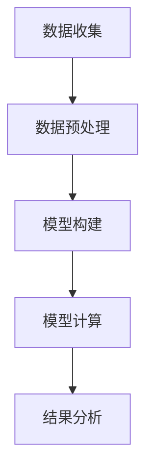
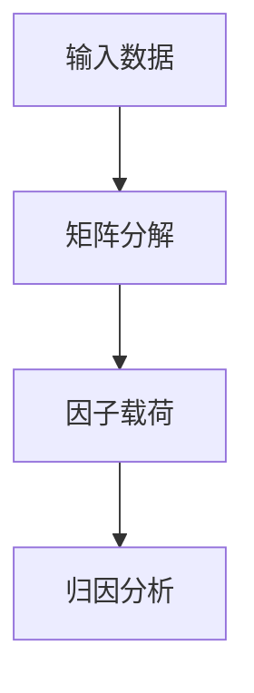
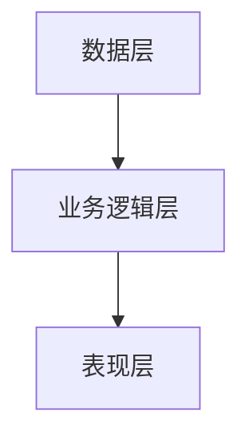
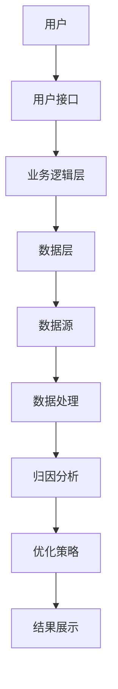

                 


# 开发智能化的资产配置策略动态归因分析引擎

> 关键词：资产配置，动态归因，人工智能，金融技术，算法优化

> 摘要：本文详细探讨了开发智能化资产配置策略动态归因分析引擎的核心技术与实现方法。从背景介绍到算法原理，从系统架构到项目实战，系统性地解析了如何利用人工智能与大数据技术构建高效、智能的归因分析系统。本文旨在为金融工程师和技术开发者提供一份实践指南，帮助他们从零开始理解并开发出具备动态归因分析能力的资产配置策略引擎。

---

# 第一部分：资产配置策略动态归因分析引擎的背景与核心概念

# 第1章：资产配置策略动态归因分析引擎的背景与问题定义

## 1.1 问题背景与目标

### 1.1.1 资产配置策略的核心挑战

在金融领域，资产配置是投资决策的核心环节，其目标是通过合理分配资金到不同的资产类别（如股票、债券、基金等），以实现风险与收益的最佳平衡。然而，资产配置的动态调整和效果评估面临以下挑战：

- **市场波动性**：金融市场具有高度不确定性，资产价格受多种因素影响，如经济指标、政策变化、地缘政治等。
- **数据复杂性**：资产配置需要处理海量数据，包括历史价格、市场情绪、宏观经济指标等。
- **实时性要求**：在高频交易和实时投资决策中，对动态归因分析的实时性要求极高。

### 1.1.2 动态归因分析的必要性

归因分析是资产配置中的关键步骤，用于确定投资组合收益的来源。动态归因分析能够实时追踪资产配置策略的效果，帮助投资者快速响应市场变化。传统的静态归因分析存在以下不足：

- **滞后性**：静态归因分析通常基于历史数据，无法实时反映市场变化。
- **缺乏动态性**：无法捕捉到资产配置策略在动态调整过程中的效果变化。
- **计算复杂性**：面对高频交易和实时数据，传统的归因方法难以满足计算效率要求。

### 1.1.3 智能化引擎的目标与意义

智能化资产配置策略动态归因分析引擎的目标是通过人工智能和大数据技术，实现以下功能：

- **实时归因分析**：基于实时数据，快速计算资产配置策略的效果。
- **动态调整优化**：根据归因结果，动态调整资产配置策略，以实现最优收益。
- **风险控制**：通过归因分析，识别潜在风险，提前采取应对措施。

智能化引擎的意义在于，它能够显著提升投资决策的效率和准确性，帮助投资者在复杂多变的市场环境中实现更好的收益。

## 1.2 资产配置策略动态归因分析的定义

### 1.2.1 资产配置的基本概念

资产配置是指将投资组合分配到不同的资产类别中，以实现风险与收益的最佳平衡。常见的资产类别包括股票、债券、基金、房地产等。资产配置的核心是根据市场环境和投资者的风险偏好，动态调整各类资产的权重。

### 1.2.2 动态归因分析的定义与作用

动态归因分析是一种基于时间序列数据的分析方法，用于追踪资产配置策略在不同时间段内的效果。它不仅关注最终的收益结果，还关注收益的来源和变化原因。动态归因分析的作用包括：

- **识别收益来源**：确定资产配置策略中各资产对整体收益的贡献。
- **优化资产配置**：通过分析归因结果，优化资产配置策略。
- **风险监控**：及时发现潜在风险，降低投资组合的整体风险敞口。

### 1.2.3 智能化引擎的技术特点

智能化资产配置策略动态归因分析引擎结合了人工智能和大数据技术，具有以下特点：

- **实时性**：能够实时处理市场数据，快速生成归因分析结果。
- **智能化**：利用机器学习算法，自动优化资产配置策略。
- **高准确性**：通过先进的数学模型和算法，提升归因分析的准确性。
- **可扩展性**：能够处理海量数据，并支持多资产类别的配置。

## 1.3 技术背景与实现基础

### 1.3.1 人工智能在金融领域的应用

人工智能技术在金融领域的应用广泛，包括股票预测、风险评估、资产配置等。动态归因分析引擎的核心是利用机器学习算法，对市场数据进行建模和预测。

### 1.3.2 大数据技术对归因分析的支持

大数据技术能够处理海量的市场数据，为归因分析提供丰富的数据来源。通过分布式计算和数据挖掘技术，可以高效地进行归因分析。

### 1.3.3 动态归因分析的数学基础

动态归因分析的核心是数学模型，包括因子分解模型、时间序列分析等。这些模型能够帮助我们理解和预测市场数据的变化。

## 1.4 应用价值与市场前景

### 1.4.1 提升投资决策效率

通过智能化引擎，投资者可以快速获得归因分析结果，提升投资决策的效率。

### 1.4.2 优化风险控制能力

动态归因分析能够帮助投资者识别潜在风险，优化风险控制能力。

### 1.4.3 未来的市场发展趋势

随着人工智能和大数据技术的不断发展，智能化资产配置策略动态归因分析引擎将在金融领域发挥越来越重要的作用。未来的市场发展趋势包括：

- 更加智能化：利用深度学习等技术，提升归因分析的准确性。
- 更加实时化：支持高频交易，实现毫秒级的归因分析。
- 更加个性化：根据投资者的个性化需求，定制化资产配置策略。

## 1.5 本章小结

本章介绍了资产配置策略动态归因分析引擎的背景与目标，明确了智能化引擎的技术特点与应用价值。通过理解这些内容，读者可以更好地理解后续章节的技术细节。

---

# 第2章：资产配置策略动态归因分析的核心概念与联系

## 2.1 归因分析的基本概念

### 2.1.1 组合归因

组合归因是指分析投资组合的整体收益来源，确定各资产对整体收益的贡献。组合归因的核心是将投资组合的收益分解为各个资产的贡献。

### 2.1.2 风险归因

风险归因是指分析投资组合的风险来源，确定各资产对整体风险的贡献。风险归因是风险控制的重要工具。

### 2.1.3 归因分析的分类与对比

归因分析可以分为以下几种类型：

- **单因素归因**：基于单一因素（如市场波动）进行归因分析。
- **多因素归因**：基于多个因素进行归因分析。
- **组合归因**：分析投资组合的整体收益来源。

归因分析的分类可以通过表格进行对比，如表2-1所示：

| 归因类型 | 定义 | 优缺点 |
|----------|------|--------|
| 单因素归因 | 基于单一因素进行分析 | 简单易懂，但忽略其他因素的影响 |
| 多因素归因 | 基于多个因素进行分析 | 更加全面，但计算复杂 |
| 组合归因 | 分析投资组合的整体收益来源 | 综合考虑各资产的贡献，但需要大量数据支持 |

### 2.1.4 实体关系图（ER图）架构

归因分析的核心实体包括资产、投资组合、市场因子等。通过ER图可以清晰地展示各实体之间的关系，如图2-1所示：



## 2.2 动态归因分析的原理

### 2.2.1 动态归因的核心思想

动态归因分析的核心思想是基于时间序列数据，分析资产配置策略在不同时间段内的效果变化。通过动态调整资产权重，优化投资组合的整体收益。

### 2.2.2 动态归因与静态归因的区别

动态归因与静态归因的主要区别在于数据的时间性。静态归因分析基于历史数据，而动态归因分析基于实时数据，能够捕捉市场变化的动态信息。

### 2.2.3 动态归因的数学模型

动态归因的数学模型可以表示为：

$$
R_i(t) = \alpha + \beta R_m(t) + \epsilon_i(t)
$$

其中，$R_i(t)$表示资产i在时间t的收益，$\alpha$是截距项，$\beta$是资产i对市场收益的敏感度，$R_m(t)$是市场收益，$\epsilon_i(t)$是误差项。

### 2.2.4 动态归因分析的流程

动态归因分析的流程包括以下步骤：

1. 数据收集：获取市场数据和资产配置数据。
2. 数据预处理：清洗数据，处理缺失值和异常值。
3. 模型构建：建立动态归因分析模型。
4. 模型计算：计算各资产的归因结果。
5. 结果分析：根据归因结果，优化资产配置策略。

### 2.2.5 动态归因分析的流程图

动态归因分析的流程可以用Mermaid图表示如下：



## 2.3 核心概念的联系与对比

### 2.3.1 归因分析方法对比表格

表2-2展示了不同归因分析方法的优缺点对比：

| 分析方法 | 优缺点 | 适用场景 |
|----------|---------|----------|
| 单因素归因 | 简单易懂，但忽略其他因素 | 市场波动分析 |
| 多因素归因 | 更加全面，但计算复杂 | 风险因素分析 |
| 组合归因 | 综合考虑各资产贡献，但需要大量数据 | 资产配置优化 |

### 2.3.2 实体关系图（ER图）架构

通过ER图可以清晰地展示归因分析的核心实体及其关系，如图2-2所示：


## 2.4 本章小结

本章详细介绍了资产配置策略动态归因分析的核心概念，包括归因分析的基本概念、动态归因分析的原理及其实体关系图。通过对比不同归因分析方法的优缺点，读者可以更好地理解动态归因分析的优势。

---

# 第3章：资产配置策略动态归因分析的算法原理

## 3.1 因子分解模型

### 3.1.1 因子分解的基本原理

因子分解是一种基于矩阵分解的数学方法，用于分析数据的潜在结构。在归因分析中，因子分解可以用于识别市场因子对资产收益的影响。

### 3.1.2 矩阵分解的数学模型

矩阵分解的数学模型可以表示为：

$$
X = U \Sigma V^T
$$

其中，X是数据矩阵，U和V是分解后的矩阵，Σ是对角矩阵，表示分解后的因子载荷。

### 3.1.3 算法流程图

因子分解的算法流程可以用Mermaid图表示如下：



### 3.1.4 因子分解的实现代码

以下是因子分解的Python代码示例：

```python
import numpy as np

def factor_decomposition(X):
    U, S, Vt = np.linalg.svd(X, full_matrices=False)
    return U, S, Vt
```

### 3.1.5 因子分解的数学模型解释

因子分解的数学模型通过奇异值分解（SVD）方法，将数据矩阵分解为三个矩阵的乘积。其中，U矩阵表示数据的行空间，Vt矩阵表示数据的列空间，Σ矩阵表示因子的载荷。

## 3.2 混合归因方法

### 3.2.1 混合归因的核心思想

混合归因方法结合了因子分解和传统归因方法，用于分析资产收益的来源。

### 3.2.2 混合归因的数学模型

混合归因的数学模型可以表示为：

$$
R_i(t) = \beta_i R_m(t) + \alpha_i + \epsilon_i(t)
$$

其中，$R_i(t)$是资产i在时间t的收益，$\beta_i$是资产i对市场收益的敏感度，$\alpha_i$是截距项，$\epsilon_i(t)$是误差项。

### 3.2.3 混合归因的实现代码

以下是混合归因的Python代码示例：

```python
import numpy as np

def mixed_attribution(X, R_m):
    beta = np.cov(X, R_m)[0, 1] / np.var(R_m)
    alpha = np.mean(X) - beta * np.mean(R_m)
    return beta, alpha
```

### 3.2.4 混合归因的数学模型解释

混合归因的数学模型通过回归分析的方法，将资产收益分解为市场收益和截距项的贡献。其中，$\beta_i$表示资产i对市场收益的敏感度，$\alpha_i$表示资产i的特异收益。

## 3.3 动态归因分析的数学模型

### 3.3.1 动态归因的数学模型

动态归因的数学模型可以表示为：

$$
R_i(t) = \alpha_i + \beta_i R_m(t) + \gamma_i R_s(t) + \epsilon_i(t)
$$

其中，$R_i(t)$是资产i在时间t的收益，$\alpha_i$是截距项，$\beta_i$是资产i对市场收益的敏感度，$R_m(t)$是市场收益，$\gamma_i$是资产i对市场收益的敏感度，$R_s(t)$是市场状态变量，$\epsilon_i(t)$是误差项。

### 3.3.2 动态归因的实现代码

以下是动态归因的Python代码示例：

```python
import numpy as np

def dynamic_attribution(X, R_m, R_s):
    # 计算截距项
    alpha = np.mean(X) - np.mean(beta * R_m) - np.mean(gamma * R_s)
    # 计算beta系数
    beta = np.cov(X, R_m)[0, 1] / np.var(R_m)
    # 计算gamma系数
    gamma = np.cov(X, R_s)[0, 1] / np.var(R_s)
    return alpha, beta, gamma
```

### 3.3.3 动态归因的数学模型解释

动态归因的数学模型通过回归分析的方法，将资产收益分解为多个因素的贡献，包括市场收益、市场状态变量等。通过动态调整各因素的系数，可以实现对资产收益的动态归因分析。

## 3.4 本章小结

本章详细介绍了资产配置策略动态归因分析的算法原理，包括因子分解模型、混合归因方法和动态归因分析的数学模型。通过这些算法，我们可以实现对资产收益的动态归因分析，为资产配置策略的优化提供支持。

---

# 第4章：资产配置策略动态归因分析的系统分析与架构设计

## 4.1 问题场景介绍

### 4.1.1 系统目标

系统目标是开发一个智能化的资产配置策略动态归因分析引擎，能够实时处理市场数据，快速生成归因分析结果，并优化资产配置策略。

### 4.1.2 系统需求

系统需求包括：

- 实时数据处理：支持高频交易，实现毫秒级的归因分析。
- 动态调整优化：根据归因结果，动态调整资产配置策略。
- 风险控制：通过归因分析，识别潜在风险，优化风险控制能力。

## 4.2 系统功能设计

### 4.2.1 领域模型类图

领域模型类图展示了系统中各实体之间的关系，如图4-1所示：


### 4.2.2 系统架构设计

系统架构设计包括数据层、业务逻辑层和表现层。各层之间的交互可以用Mermaid图表示，如图4-2所示：



### 4.2.3 系统接口设计

系统接口设计包括数据接口和用户接口。数据接口用于与数据源对接，用户接口用于与用户交互。

### 4.2.4 系统交互流程图

系统交互流程可以用Mermaid图表示如下：



## 4.3 本章小结

本章详细介绍了资产配置策略动态归因分析系统的分析与架构设计，包括问题场景、系统功能设计和系统架构设计。通过这些设计，我们可以构建一个智能化的归因分析系统，支持资产配置策略的动态优化。

---

# 第5章：资产配置策略动态归因分析的项目实战

## 5.1 项目环境安装

### 5.1.1 安装Python环境

安装Python环境，建议使用Anaconda或Miniconda。

### 5.1.2 安装依赖库

安装必要的Python库，如numpy、pandas、scikit-learn等。

### 5.1.3 数据源获取

获取市场数据，如股票价格、指数数据等，可以通过Yahoo Finance或其它金融数据源获取。

## 5.2 系统核心功能实现

### 5.2.1 数据预处理

数据预处理包括清洗数据、处理缺失值和异常值。

### 5.2.2 因子分解实现

实现因子分解算法，如奇异值分解（SVD）。

### 5.2.3 混合归因实现

实现混合归因算法，包括因子分解和回归分析。

### 5.2.4 动态归因实现

实现动态归因分析算法，包括回归分析和时间序列分析。

## 5.3 代码实现与解读

### 5.3.1 数据预处理代码

以下是数据预处理的Python代码示例：

```python
import pandas as pd
import numpy as np

# 读取数据
data = pd.read_csv('market_data.csv')
# 处理缺失值
data = data.dropna()
# 处理异常值
data = data[(data - data.mean()).abs().sum(axis=1) < 3 * data.std()]
```

### 5.3.2 因子分解代码

以下是因子分解的Python代码示例：

```python
import numpy as np

def factor_decomposition(X):
    U, S, Vt = np.linalg.svd(X, full_matrices=False)
    return U, S, Vt
```

### 5.3.3 混合归因代码

以下是混合归因的Python代码示例：

```python
import numpy as np

def mixed_attribution(X, R_m):
    beta = np.cov(X, R_m)[0, 1] / np.var(R_m)
    alpha = np.mean(X) - beta * np.mean(R_m)
    return beta, alpha
```

### 5.3.4 动态归因代码

以下是动态归因的Python代码示例：

```python
import numpy as np

def dynamic_attribution(X, R_m, R_s):
    alpha = np.mean(X) - np.mean(beta * R_m) - np.mean(gamma * R_s)
    beta = np.cov(X, R_m)[0, 1] / np.var(R_m)
    gamma = np.cov(X, R_s)[0, 1] / np.var(R_s)
    return alpha, beta, gamma
```

## 5.4 实际案例分析

### 5.4.1 案例背景

假设我们有一个包含多只股票的投资组合，我们需要分析各股票对整体收益的贡献。

### 5.4.2 数据准备

从数据源获取股票价格数据，计算各股票的收益序列。

### 5.4.3 归因分析

使用因子分解、混合归因和动态归因方法，分析各股票对整体收益的贡献。

### 5.4.4 结果解读

根据归因分析结果，优化资产配置策略，动态调整各股票的权重。

## 5.5 本章小结

本章通过实际案例分析，详细介绍了资产配置策略动态归因分析系统的实现过程，包括数据预处理、算法实现和结果解读。通过这些步骤，读者可以更好地理解如何开发一个智能化的归因分析引擎。

---

# 第6章：资产配置策略动态归因分析的最佳实践

## 6.1 小结

通过本章的介绍，我们总结了开发智能化资产配置策略动态归因分析引擎的核心技术和实现方法。

## 6.2 注意事项

在实际开发过程中，需要注意以下几点：

- 数据质量：确保数据的准确性和完整性。
- 算法优化：根据实际需求，优化算法的效率和准确性。
- 风险控制：通过归因分析，优化风险控制能力。

## 6.3 拓展阅读

建议读者阅读以下书籍和论文：

- 《机器学习实战》
- 《时间序列分析》
- 《金融工程中的数学方法》

## 6.4 本章小结

本章总结了开发智能化资产配置策略动态归因分析引擎的注意事项和拓展阅读内容，帮助读者更好地理解和应用这些技术。

---

# 作者：AI天才研究院/AI Genius Institute & 禅与计算机程序设计艺术 /Zen And The Art of Computer Programming

